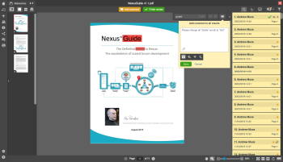

# Workfront R1 リリース

## 誰もが関与し、効率的な状態を維持

Workfrontは、すべての製品行に対して、1 年に 3 回（リリース 1、リリース 2、リリース 3）新しい製品機能をリリースしています。 2017 年の最初のリリース (R1、) では、Workfront、ProofHQ、Workfront DAM のコア機能がいくつか強化され、ナレッジワーカーの生産性が向上し、作業管理に費やす時間が短縮され、作業の実行に時間がかかるようになりました。

## 最新リリースの新機能

* [WORKFRONT ENHANCEMENTS](#workfront-enhancements)
* [配達確認の強化](#proofhq-enhancements)
* [WORKFRONT DAM の強化](#workfront-dam-enhancements)

## WORKFRONT ENHANCEMENTS {#workfront-enhancements}

\
**メールから直接作業を管理**
Outlook 365 に直接統合すると、Outlook 365 から直接Workfrontを更新する際の重複作業を排除できます。 メールをタスクに変換し、メールの会話や添付ファイルを更新として送信し、コメントに返信します。Outlook を終了することはありません。

詳しくは、以下を参照してください。  [2016 年のプレビューで使用可能になった機能](../../../../product-announcements/product-releases/quarterly-release-archive/r1-release-activity/available-in-preview-in-2016.md)

\
**プロジェクトの追跡と予算の維持**
新しい「稼働状況レポート」を使用して、リソースとその使用率を管理し、プロジェクトの進捗状況と予算を管理します。 プロジェクトおよび役割ごとの計画時間と実際時間を表示し、リソースと部門を定期的に比較します。

詳しくは、以下を参照してください。  [R1 プレビュー 3](../../../../product-announcements/product-releases/quarterly-release-archive/r1-release-activity/r1-preview-3.md)

\
**用語と通知のカスタマイズ**
カスタムの用語機能を活用して、Workfrontをより関連性の高いものにします。業界に関係なく、「Portfolio」や「プロジェクト」などの用語を好みの言葉に合わせて変更できます。 さらに、各ユーザーはダイジェストの頻度を調整することで、受信する通知の種類をカスタマイズできるようになりました。

詳しくは、以下を参照してください。  [R1 プレビュー 3](../../../../product-announcements/product-releases/quarterly-release-archive/r1-release-activity/r1-preview-3.md)

**マイルストーン表示**
新しい進捗状況ステータスアイコンにより、マイルストーンレポートをより多くの情報に活用できます。 また、マイルストーン表示から直接完了率を編集できるようになりました。

詳しくは、以下を参照してください。  [R1 プレビュー 5](../../../../product-announcements/product-releases/quarterly-release-archive/r1-release-activity/r1-preview-5.md)

**Workfrontごみ箱**
新しいWorkfrontのごみ箱を使用すると、削除後 30 日以内に、プロジェクト、タスク、問題、およびすべての関連ドキュメント、フォーム、更新を復元できます。

詳しくは、以下を参照してください。  [R1 プレビュー 1 および 2](../../../../product-announcements/product-releases/quarterly-release-archive/r1-release-activity/r1-peview-1-and-2.md)

### 配達確認の強化 {#proofhq-enhancements}

\
**配達確認の検索と検索**
ProofHQ の新しい検索機能を使用すると、すばやく簡単に検索でき、レビュー時に配達確認内で直接単語やフレーズのすべてのインスタンスを検索できます。 これは、PDFやMicrosoft Word ファイルを含む、すべてのテキストベースのドキュメントに適用されます。

詳しくは、以下を参照してください。  [R1 最終](../../../../product-announcements/product-releases/quarterly-release-archive/r1-release-activity/r1-final.md)

\
**Visual Reporting と拡張カスタムビュー**
ProofHQ の新しいレポート指標により、ターンラウンド時間、遅延割合、コメント数および最初のアクティビティまでの時間を追跡できます。 新しいカスタムビューでは、高度なフィルターロジックが作成され、必要に応じて適切なデータを取得できます。

詳しくは、以下を参照してください。  [R1 最終](../../../../product-announcements/product-releases/quarterly-release-archive/r1-release-activity/r1-final.md)

**ProofHQ プレビュー**
ProofHQ では、すべてのユーザーにリリースする前に、プレビュー環境で新しい機能をテストできるようになりました。

## WORKFRONT DAM の強化 {#workfront-dam-enhancements}

\
**DAM 埋め込みリンク**
外部プラットフォームへのデジタルアセットの管理、公開、使用状況の追跡をより効率的におこなう必要があるマーケティングチーム向けに、埋め込みリンク機能を使用すると、適切なコンテンツを適切なタイミングで共有するプロセスを管理できます。

**DAM 必須メタデータフィールド**
必要なメタデータフィールドによるデジタルアセットの分類が改善され、アセット共有の制御が向上しました。

**誰もがWorkfrontと関わり合い、効率的にやり取りできるようにします。**
Workfrontは、最新のナレッジワーカーやエグゼクティブが以下を実現するエンタープライズワークマネジメントソリューションです。

* 個々のおよび組織の好みに合わせて作業を調整し、採用を促進
* どこからでもより効率的に働く
* 予算と担当者の両方で、リソースをより適切かつ有意義に可視化
* 適切な作業を以前よりも迅速に提供

**詳細を見る**

* R1 データシートを次の場所からダウンロードします。  [https://resources.workfront.com/data-sheets/r1-release-datasheet](https://resources.workfront.com/data-sheets/r1-release-datasheet)
* R1 リリースに関する FAQ をこちらからダウンロードします。 [https://resources.workfront.com/data-sheets/r1-faq-for-customers](https://resources.workfront.com/data-sheets/r1-faq-for-customers)
* R1 で使用できる改善点の完全なリストについては、以下を参照してください。 [R1 リリースアクティビティの概要](../../../../product-announcements/product-releases/quarterly-release-archive/r1-release-activity/r1-release-activity-overview.md)

Workfront。 仕事が重要だからです
