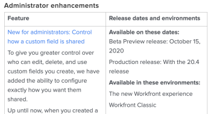

# Adobe Workfrontのリリーススケジュールとプロセス

## プレビューのスケジュールを更新

プレビュー環境は週に 1 回更新され、新機能が追加されます。 これらの機能は、今後の四半期のリリースのリリースノートに記載されています。

## 実稼動用のスケジュールを更新

### 製品の機能

通常、プレビューの機能は、次の四半期のリリースで実稼動環境で使用できます。 ただし、四半期リリース以外で、機能が実稼動環境で使用できるようになる場合もあります。 これらの変更は、変更を十分に把握できるよう、少なくとも 2 週間プレビューに残ります。 これらの変更は、プレビューに追加された時点で、アナウンスセンターからも伝えられます。

### メンテナンスの更新

Adobe Workfront製品に対する問題の修正は、毎週実稼動環境でおこなわれます。 詳しくは、 [Workfrontメンテナンスのアップデート](https://experienceleague.adobe.com/docs/workfront-known-issues/releases/current-updates.html) ページを開いて、最近修正された問題を確認します。

## 四半期リリースから削除された機能

特定の四半期リリースに関連するすべての機能を、実稼動環境への最終リリースの 2～4 週間前にプレビューでテストできます。 四半期リリースから今回までに機能が削除された場合は、お客様に次の操作をおこないます。

* 四半期リリースのリリースノート ( [製品リリース](../../product-announcements/product-releases/product-releases.md) ページ ) が更新され、機能が削除されたことが示されます。

すべての機能をプレビューでテストできた後で四半期リリースから機能が削除された場合は、次の操作を実行して顧客に通知します。

* 四半期リリースのリリースノート ( [製品リリース](../../product-announcements/product-releases/product-releases.md) ページ ) が更新され、機能が削除されたことが示されます。
* 機能が削除されたことを示す投稿がWorkfrontコミュニティに追加されます。
* お知らせセンターを通じて、この機能が削除されたことを示すメッセージがすべてのお客様に送信されます。 ( アナウンスセンターは、Workfrontのアプリ内通知センターです。 詳しくは、 [お知らせの送信](../../administration-and-setup/get-started-wf-administration/view-send-announcements.md).)

## ベータリリース

Workfrontは、ベータ版プログラムの一環として新機能をリリースすることがあります。
各ベータ版に関する具体的な情報（参加方法、各ベータ版プログラムの起動時のリリース、すべてのベータ版プログラムが異なる場合のリリースなど）。

Workfrontで利用可能なベータプログラムの種類を次に示します。

* **非公開または非公開のベータ版**:次に、非公開または非公開のベータ版リリースの特徴を示します。

   * 機能は、Workfrontが慎重に選択した少数の顧客グループが使用できます。
   * 参加者は通常、製品マネージャと連携し、定期的にフィードバックを提供します。
   * ベータ版に含まれる新機能は、プレビューまたは実稼動、またはベータ版プログラムで使用可能になった個別の環境にリリースできます。 クローズ済みベータ版機能は、ランダムな間隔でリリースされ、警告は発生しません。
   * 製品リリースページには、クローズ済みベットのリリース情報はありません。

* **オープンまたはパブリックベータ**:オープンまたはパブリックベータリリースの特徴を次に示します。

   * これらの機能は、すべてのWorkfrontユーザーが利用できますが、ベータ状態です。 常に完全に機能しているとは限らず、フィードバックは常に歓迎されます。
   * パブリックベータ版への参加は任意で、お客様は、ベータ版機能を自ら有効にするかどうかを決定できます。
   * ベータ版に含まれる新機能は、プレビューまたは実稼動環境でリリースできます。
   * 機能は、Workfrontの通常のリリースパターンよりも頻繁にリリースされる可能性があります。
   * 機能がパブリックベータ版にリリースされたタイミングに関する情報が、製品リリースページに含まれています。

製品リリースノートについて詳しくは、 [製品リリース](../../product-announcements/product-releases/product-releases.md).

## リリースノート

今後の四半期リリースのリリースノートを使用して、プレビューで使用できる新機能と、実稼動環境にリリースされるタイミングを確認します。

次の四半期リリースのリリースノートについては、 [製品リリース](../../product-announcements/product-releases/product-releases.md)をクリックし、今後のリリースのリリースの概要ページに移動します。

リリースノートでは、左側の列に機能の一覧と各機能の簡単な説明が表示されます。 機能リンクをクリックすると、この新機能のデモビデオや、新機能に関するドキュメントにアクセスできます。 右側の列には、各機能に関する次の情報が表示されます。

* リリース日のプレビュー
* 実稼動リリース日
* 新しいAdobe Workfront Experience またはAdobe Workfront Classic での可用性

例：

