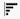
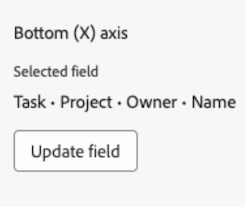

# キャンバスダッシュボードでのグラフレポートの作成

>[!IMPORTANT]
>
>Canvas ダッシュボード機能は現在、ベータ版ステージに参加しているユーザーのみが利用できます。 機能の一部が完了していないか、この段階で意図したとおりに動作しない可能性があります。 ご利用のエクスペリエンスに関するフィードバックは、Canvas ダッシュボードのベータ版の概要の記事の「[ フィードバックを提供](/help/quicksilver/product-announcements/betas/canvas-dashboards-beta/canvas-dashboards-beta-information.md#provide-feedback)」セクションの指示に従って送信してください。 
>バグや技術的な問題についてフィードバックがある場合は、Workfront サポートにチケットを送信してください。 詳しくは、[ カスタマーサポートにお問い合わせください](/help/quicksilver/workfront-basics/tips-tricks-and-troubleshooting/contact-customer-support.md). を参照してください
>このベータ版は、次のクラウドプロバイダーでは利用できないことに注意してください。
>
>* Amazon Web Services用に独自のキーを持ち込む
>* Azure
>* Google Cloud Platform

グラフレポートを作成してCanvas ダッシュボードに追加すると、データを棒グラフ、列グラフ、折れ線グラフ、円グラフとして視覚化できます。

## アクセス要件

+++ 展開すると、この記事の機能のアクセス要件が表示されます。 

<table style="table-layout:auto"> 
<col> 
</col> 
<col> 
</col> 
<tbody> 
<tr> 
   <td role="rowheader">
Adobe Workfront パッケージ
</td> 
   <td> 

任意 
 
   </td> 
<tr> 
 <tr> 
   <td role="rowheader">
Adobe Workfront プラン
</td> 
   <td> 

標準
 

プラン
 
   </td> 
   </tr> 
  </tr> 
  <tr> 
   <td role="rowheader">
アクセスレベル設定
</td> 
   <td>
レポート、ダッシュボードおよびカレンダーへのアクセスを編集する

  </td> 
  </tr>  
</tbody> 
</table>

この表の情報について詳しくは、[Workfront ドキュメントのアクセス要件](/help/quicksilver/administration-and-setup/add-users/access-levels-and-object-permissions/access-level-requirements-in-documentation.md)を参照してください。
+++

## 前提条件

グラフ レポートを作成する前に、ダッシュボードを作成する必要があります。

## キャンバスダッシュボードでのグラフレポートの作成

チャートレポートの作成には、多くの設定オプションがあります。 このセクションでは、のものを作成する一般的なプロセスについて説明します。

{{step1-to-dashboards}}

1. 左側のパネルで、「**キャンバスダッシュボード**」をクリックします。

1. 右上隅の「**新しいダッシュボード**」をクリックします。

1. 「**ダッシュボードを作成**」ボックスに、ダッシュボードの&#x200B;**名前**&#x200B;と&#x200B;**説明**&#x200B;を入力します。

1. 「**作成**」をクリックします。

1. 「**レポートを追加**」ボックスで、「**レポートを作成**」を選択します。

1. 左側で、**グラフ**&#x200B;を選択します。

1. 右上隅の「**レポートを作成**」をクリックします。

1. （オプション）次の手順に従って、**詳細** セクションを設定します。

   1. レポート **の名前**&#x200B;を入力してください。

   1. レポート **説明**&#x200B;を入力します。

   1. 必要に応じて、「**追加シリーズを「その他」**&#x200B;として表示」ボックスのチェックを外します。

      >[!NOTE]
      >
      >グラフに表示できるシリーズの数は最大60個です。 このチェックボックスをオンにすると、制限を超える系列は、グラフ内の&#x200B;**その他**&#x200B;のグループに統合されます。

   1. （オプション）「**アクセス権**」フィールドでこのレポートを実行し、レポートを使用する権限を持つユーザーの名前を入力し始め、リストに表示されるユーザーを選択します。 レポートを別のユーザーとして実行するように設定すると、ダッシュボードのすべてのビューアに、自分のアクセスレベルに関係なく、同じデータが表示されます。 ユーザーを選択しない場合、各ビューアには自分の権限に基づくデータが表示されます。

      >[!IMPORTANT]
      >
      >選択したユーザーが非アクティブ化されるか、関連するワークスペースまたはレコードタイプへのアクセス権を失った場合、レポートに不完全なデータが表示されるか、レンダリングに失敗する可能性があります。

1. 作成するグラフの種類を選択：
   * [棒グラフ、棒グラフ、折れ線グラフ](#bar-column-or-line-chart)
   * [円グラフ](#pie-chart)

### 棒グラフ、棒グラフ、折れ線グラフ

>[!NOTE]
>
>選択したフィールドタイプに応じて、追加のフィールドが追加される場合があります。 以下に示すオプションは、すべてのフィールドタイプに対して標準です。

1. 左側のパネルで、**グラフを作成**  アイコンをクリックします。

1. **グラフの種類** ドロップダウンで、**棒**、**列**、または&#x200B;**行**&#x200B;を選択します。
1. 2番目のドロップダウンメニューで、バー、列、または行タイプを選択します。
   * **シンプル**
   * **マルチシリーズ**
   * **積み重ね**

1. **下軸（X）軸** セクションで、**更新フィールド**&#x200B;を選択し、グラフで要約されるデータを含むフィールドを見つけて選択します。
1. 「**集計タイプ**」ドロップダウンで、データのロールアップ方法を選択してチャート出力を生成します。
1. （オプション）指定したスペースに軸ラベルを追加します。
1. （オプション）「**軸を非表示**」をオンに切り替えます。
1. （オプション） **参照行の値**&#x200B;を入力して、グラフの目標またはしきい値を設定します。
1. ドロップダウンメニューから&#x200B;**行タイプ**&#x200B;を選択します。
1. 2番目のセクションの下にある「**フィールドを更新**」ボタンを選択し、グラフに表示する2番目のフィールドを見つけて選択します。

### 円グラフ

>[!NOTE]
>
>選択したフィールドタイプに応じて、追加のフィールドが追加される場合があります。 以下に示すオプションは、すべてのフィールドタイプに対して標準です。

1. 左側のパネルで、**グラフを作成**  アイコンをクリックします。

1. **グラフの種類** ドロップダウンで、**棒**&#x200B;を選択します。
1. **指標** セクションで、**更新フィールド**&#x200B;を選択し、グラフで要約されるデータを含むフィールドを見つけて選択します。
1. 「**集計タイプ**」ドロップダウンで、データのロールアップ方法を選択してチャート出力を生成します。
1. **セグメント** セクションで、**更新フィールド**&#x200B;を選択し、円グラフに表示するセグメントを含むフィールドを見つけて選択します。
1. （オプション）「**円**」セクションで、「**セグメントラベルを表示**」をオンに切り替えて、セグメントラベルを表示します。
1. （オプション）「**合計を表示**」を切り替えて、グラフの中央に合計を表示します。 有効にすると、中央ラベルを表示し、値の形式を選択するための追加のオプションがあります。

>[!NOTE]
>
>集計タイプは次のように表示されます。
>
>* 集計タイプの数：表示される中央値は、グラフのすべてのセグメントの数です。
>* 合計集計タイプ：表示される中央値は、数値または通貨値の集計合計です。
>* 平均、最大、最小の集計タイプ：中央値には、それに応じて平均、最大、または最小値が表示されます。

1. （オプション）凡例セクションで、**凡例を表示**&#x200B;に切り替えて、グラフの凡例を表示します。

1. （オプション）ドロップダウンメニューから&#x200B;**凡例の位置**&#x200B;を選択します。

## その他のグラフ レポート設定

### フィルター

次の手順に従って、**Filter** セクションを設定します。

1. 左側のパネルで、**フィルター** アイコンをクリックします。
1. **フィルターを編集**&#x200B;を選択します。
1. 「**条件を追加**」をクリックし、フィルタリングするフィールドと、フィールドが満たす必要がある条件を定義する修飾子を指定します。
1. （オプション）「**フィルターグループを追加**」をクリックして、別のフィルター条件を追加します。 セット間のデフォルトの演算子は AND です。演算子をクリックして OR に変更します。

### ドリルダウン設定

「**ドリルダウン列設定**」セクションを設定するには、次の手順に従います。

1. 左側のパネルで、**ドリルダウン列**  アイコンをクリックします。 グラフのフィールドは、右側のプレビューセクションに列として自動的に表示されます。

1. （オプション）既存の列設定のいずれかを更新するには、**現在の列** セクションで更新する列を選択し、目的の情報（ラベル、リンクされたステータス、条件など）を更新します。

1. **列を追加**&#x200B;をクリックし、テーブルに列として表示するフィールドを選択します。 追加する各列について、このプロセスを繰り返します。

### ドリルダウングループの設定

「**ドリルダウングループ設定**」セクションを設定するには、次の手順に従います。

1. 左側のパネルで、**グループ設定**  アイコンをクリックします。

1. 「**グループ化を追加**」ボタンをクリックし、グループ化として作成するフィールドを選択します。

1. **保存**&#x200B;をクリックしてレポートを作成し、ダッシュボードに追加します。

## チャートレポートの例を作成

このセクションでは、期限を過ぎているタスクをプロジェクト所有者ごとに表示する棒グラフを作成する手順について説明します。

{{step1-to-dashboards}}

1. 左側のパネルで、「**キャンバスダッシュボード**」をクリックします。

1. 右上隅の「**新しいダッシュボード**」をクリックします。

1. 「**ダッシュボードを作成**」ボックスに、ダッシュボードの&#x200B;**名前**&#x200B;と&#x200B;**説明**&#x200B;を入力します。

1. 「**作成**」をクリックします。

1. 「**レポートを追加**」ボックスで、「**レポートを作成**」を選択します。

1. 左側で、**グラフ**&#x200B;を選択します。

1. 右上隅の「**レポートを作成**」をクリックします。

1. 次の手順に従って、**Details** セクションを設定します。

   1. レポート **の名前**&#x200B;を入力します（例：*プロジェクト所有者による期限切れタスク*）。

   1. レポート **説明**&#x200B;を入力します。

1. **ビルド チャート** セクションを設定するには、次の手順に従います。

   1. 左側のパネルで、**グラフを作成** アイコンをクリックします。

   1. **グラフの種類** ドロップダウンで、**列**&#x200B;を選択します。

   1. **列タイプ** ドロップダウンで、**シンプル**&#x200B;を選択します。

   1. 「**下軸（X）軸**」セクションの下にある「**フィールドを更新**」ボタンを選択し、「**タスク** > **プロジェクト** > **所有者** > **名前**」フィールドを見つけて選択します。

      

   1. 「**左（Y）軸**」セクションの下にある「**フィールドを選択**」ボタンをクリックし、**タスク** > **名前**」フィールドを見つけて選択します。

   1. 「**集計タイプ**」ドロップダウンで、「**カウント**」を選択します。

      

1. 次の手順に従って、**Filter** セクションを設定します。

   1. 左側のパネルで、**フィルター** アイコンをクリックします。

   1. **フィルターを編集**&#x200B;を選択します。

   1. 「**条件を追加**」をクリックします。

   1. 空の条件領域をクリックし、**フィールドを選択**&#x200B;します。

   1. 「**完了率**」フィールドを選択します。

   1. 「**演算子**」ドロップダウンで、「**未満**」を選択し、「評価者」フィールドに「*100*」と入力します。

   1. 「**条件を追加**」をクリックし、**フィールドを選択**&#x200B;します。

   1. 「**完了予定日**」フィールドを選択します。

   1. **演算子** ドロップダウンで、**未満**&#x200B;を選択します。

   1. **相対日付**&#x200B;を&#x200B;**ON**&#x200B;に設定します。

   1. エバリュエーターのフィールドに&#x200B;*$$TODAY*&#x200B;と入力します。

      ワイルドカードについて詳しくは、「[ キャンバスダッシュボードでのレポートフィルターの編集](/help/quicksilver/reports-and-dashboards/canvas-dashboards/manage-reports/edit-report-filters.md)」の記事の「日付ベースのワイルドカードフィルター変数」の節を参照してください。

      

1. 「**ドリルダウン列設定**」セクションを設定するには、次の手順に従います。

   1. 左側のパネルで、**ドリルダウン列**  アイコンをクリックします。 グラフのフィールドは、右側のプレビューセクションに列として自動的に表示されます。

   1. 「**列を追加**」をクリックし、**割り当て先** > **名前** フィールドを選択します。

   1. 「**列を追加**」をクリックし、「**予定開始日**」フィールドを選択します。

   1. 「**列を追加**」をクリックし、「**完了予定日**」フィールドを選択します。

   1. 「**列を追加**」をクリックし、「**最終更新日**」フィールドを選択します。

   1. （オプション）更新時間を表示するには、**現在の列** フィールドで&#x200B;**最終更新日** オプションを選択し、**日付形式** ドロップダウンで時間値オプションを選択します。

1. 「**ドリルダウングループ設定**」セクションを設定するには、次の手順に従います。

   1. 左側のパネルで、**グループ設定**  アイコンをクリックします。

   1. 「**グループ化を追加**」ボタンをクリックし、「**プロジェクト** > **名前**」フィールドを選択します。

1. **保存**&#x200B;をクリックしてレポートを作成し、ダッシュボードに追加します。

## チャートレポートを作成する際の考慮事項

### 財務データを使用したレポート

アクセスレベルで財務データへの表示または編集アクセス権を持つユーザーは、タスクまたはプロジェクトレベルで「財務を表示」権限が削除された場合でも、Canvas ダッシュボードのビジュアライゼーションに財務データが表示されます。

* アクセスレベルでの財務データへの権限を持っていないユーザーの場合、レポートに財務データは表示されません。
* 財務データを表示できるユーザーの場合、既に表示権限を持っているレコード（プロジェクト、タスク、イシューなど）のみが表示されます。 アクセスできないレコードの財務数値は表示されません。
* レポート作成者は、ダッシュボードに財務データを含める際には注意を払い、ダッシュボードを誰と共有するかを慎重に検討し、意図しないアクセスを防ぐ必要があります。

これは既知の制限であり、できるだけ早く対処する予定です。

### フィールドセレクターの活用

「**グラフを作成**」セクションの「**セクション**」ドロップダウンは、フィールドセレクターの選択肢を絞り込んで、テーブルレポートの作成時にオブジェクトを見つけやすくするように設計されています。 まず、基本エンティティオブジェクトを選択します。

* **すべてのセクション**: Workfront ワークフローとWorkfront計画のすべてのオブジェクトタイプ。
* **Workfront オブジェクト**：ネイティブ Workfront ワークフローオブジェクト。
* **プランニングレコードタイプ**: Workfront Planningで定義されたカスタムレコードタイプ。

基本エンティティオブジェクトを選択すると、**セクション** ドロップダウンが更新され、選択できるフィールドタイプオプションが表示されます。

* **すべてのセクション**：ネイティブフィールド、カスタムフィールド、関連オブジェクト。
* **すべてのフィールド**：ネイティブフィールドとカスタムフィールドの両方（関係は除く）。
* **カスタムフィールド**：カスタムフォームまたはプランニングレコードの顧客定義フィールド。
* **Workfront フィールド**：ネイティブフィールドのみ。
* **関係**：接続レコード。

### 子オブジェクトの参照

その他の列、フィルターオプション、グループ化属性に対して使用できるリレーションシップは、通常、Workfront オブジェクト階層内の上位のオブジェクトに限定されるか、レポートの基本エンティティオブジェクトに対して1つの選択範囲が設定されます。 これには、次のような例外があります。

* プロジェクト/タスク
* ドキュメント承認/ドキュメント承認ステージ
* ドキュメント承認ステージ/ドキュメント承認ステージ参加者

上記の親子関係のいずれかを使用すると、親オブジェクトに接続されている各子レコードのテーブルに行が表示されます。