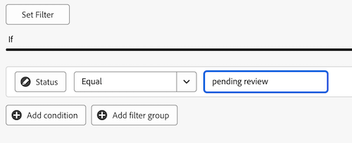

# キャンバスダッシュボードでの KPI レポートの作成

>[!IMPORTANT]
>
>キャンバスダッシュボード機能は現在、ベータ版のステージに参加しているユーザーのみが利用できます。 この段階では、フィーチャの一部が完全でない、または意図したとおりに動作しない可能性があります。 キャンバスダッシュボードベータ版の概要記事の [&#x200B; フィードバックの提供 &#x200B;](/help/quicksilver/product-announcements/betas/canvas-dashboards-beta/canvas-dashboards-beta-information.md#provide-feedback) の節の手順に従って、エクスペリエンスに関するフィードバックをお送りください。 
>&#x200B;>バグまたは技術的な問題の可能性に関するご意見がある場合は、Workfront サポートにチケットを送信してください。 詳しくは、[&#x200B; カスタマーサポートへのお問い合わせ &#x200B;](/help/quicksilver/workfront-basics/tips-tricks-and-troubleshooting/contact-customer-support.md) を参照してください。 
>&#x200B;>このベータ版は、次のクラウドプロバイダーでは利用できません。
>
>* Amazon Web Services用に独自のキーを持参
>* Azure
>* Google Cloud Platform

主要業績評価指標データを数値で視覚的に表す KPI レポートを作成してキャンバスダッシュボードに追加し、その数値を使用して、プロジェクトやチームのパフォーマンスを確認できます。

## アクセス要件

+++ 展開すると、アクセス要件が表示されます。 

<table style="table-layout:auto"> 
<col> 
</col> 
<col> 
</col> 
<tbody> 
<tr> 
   <td role="rowheader">
Adobe Workfront プラン
</td> 
   <td> 

任意 
 
   </td> 
<tr> 
 <tr> 
   <td role="rowheader">
Adobe Workfront プラン
</td> 
   <td> 

現在：プラン 
 

新規：標準
 
   </td> 
   </tr> 
  </tr> 
  <tr> 
   <td role="rowheader">
アクセスレベル設定
</td> 
   <td>
レポート、ダッシュボードおよびカレンダーへのアクセスを編集する

  </td> 
  </tr>  
</tbody> 
</table>

この表の情報について詳しくは、[Workfront ドキュメントのアクセス要件](/help/quicksilver/administration-and-setup/add-users/access-levels-and-object-permissions/access-level-requirements-in-documentation.md)を参照してください。
+++

## 前提条件

KPI レポートを作成するには、ダッシュボードを作成する必要があります。

## キャンバスダッシュボードでの KPI レポートの作成

KPI レポートの作成に使用できる設定オプションは多数あります。 この節では、タグを作成するための一般的なプロセスを説明します。

{{step1-to-dashboards}}

1. 左側のパネルで、「**キャンバスダッシュボード**」をクリックします。

1. 右上隅の **新規ダッシュボード** をクリックします。

1. **ダッシュボードを作成** ボックスに、ダッシュボードの **名前** と **説明** を入力します。

1. 「**作成**」をクリックします。

1. **レポートを追加** ボックスで、「**レポートを作成**」を選択します。

1. 左側で、「**KPI**」を選択します。

1. 右上隅の「**レポートを作成**」をクリックします。

1. 「**詳細** セクションを設定するには、次の手順に従います。

   1. レポート **名前** を入力します。
   1. レポート **説明** を入力します。

      >[!NOTE]
      >
      >説明は、KPI 値の下のキャプションとして使用されます。 説明を入力しない場合、次の手順で選択するアグリゲータおよび集計タイプに基づいて、キャプションが生成されます。

1. **ビルド KPI** セクションを設定するには、次の手順に従います。

   1. 左側のパネルで「**KPI を構築** アイコンをクリックします。

   1. **フィールドを選択** をクリックして、レポートに追加するフィールドを指定します。

   1. **集計タイプ** ドロップダウンで、データをロールアップして KPI 出力を生成する方法を選択します。 このフィールドのオプションは、前の手順で選択したフィールドのタイプによって異なります。

1. **フィルター** セクションを設定するには、次の手順に従います。

   1. 左側のパネルで、「**フィルター**  アイコンをクリックします。

   1. **フィルターを編集** を選択します。

   1. 「**条件を追加**」をクリックして、フィルターに使用するフィールドと、フィールドが満たす必要がある条件の種類を定義する修飾子を指定します。

   1. （任意）「**フィルターグループを追加**」をクリックして、別のフィルター条件セットを追加します。 セット間のデフォルトの演算子は AND です。演算子をクリックして OR に変更します。

      フィルターについて詳しくは、[&#x200B; キャンバスダッシュボードでのレポートフィルターの編集 &#x200B;](/help/quicksilver/reports-and-dashboards/canvas-dashboards/manage-reports/edit-report-filters.md) を参照してください。

1. **ドリルダウン列設定** セクションを設定するには、次の手順に従います。

   1. 左側のパネルで、「**ドリルダウン列** アイコンをクリックします。 グラフのフィールドは、右側のプレビューセクションに列として自動的に表示されます。

   1. （オプション）既存の列の設定を更新するには、更新する列を「**現在の列**」セクションで選択してから、必要な情報（ラベル、リンクされたステータス、書式設定ルールなど）を更新します。

   1. **列を追加** をクリックし、テーブルの列として表示するフィールドを選択します。 追加する各列に対して、このプロセスを繰り返します。

1. 次の手順に従って、「ドリルダウン・グループ設定 **セクションを構成し** す。

   1. 左側のパネルで、「**グループ設定** アイコンをクリックします。

   1. **グループ化を追加** ボタンをクリックし、グループ化として作成するフィールドを選択します。

1. 「**保存**」をクリックしてレポートを作成し、ダッシュボードに追加します。

## KPI レポートの例の作成

この節では、保留中のドキュメント承認を表示する KPI レポートを作成する手順を説明します。

KPI レポートの例について詳しくは、「[&#x200B; レビューおよび承認用のレポートダッシュボードの作成 &#x200B;](/help/quicksilver/review-and-approve-work/document-reviews-and-approvals/create-review-and-approval-dashboard.md) を参照してください。

{{step1-to-dashboards}}

1. 左側のパネルで、「**キャンバスダッシュボード**」をクリックします。

1. 右上隅の **新規ダッシュボード** をクリックします。

1. **ダッシュボードを作成** ボックスに、ダッシュボードの **名前** と **説明** を入力します。

1. 「**作成**」をクリックします。

1. **レポートを追加** ボックスで、「**レポートを作成**」を選択します。

1. 左側で、「**KPI**」を選択します。

1. 右上隅の「**レポートを作成**」をクリックします。

1. 「**詳細** セクションを設定するには、次の手順に従います。

   1. *名前* フィールドに **保留中** と入力します。
   1. *説明* フィールドに **承認待ち** と入力します。 これは、KPI 値の下にキャプションとして表示されます。

1. **ビルド KPI** セクションを設定するには、次の手順に従います。

   1. 左側のパネルで、「**KPI を作成** をクリックします。

   1. **フィールドを選択** をクリックします。

   1. **ドキュメントの承認** フォルダーを見つけて選択します。

   1. **ステータス** を選択します。

   1. **集計タイプ** ドロップダウンで「**カウント**」を選択します。

1. **フィルター** セクションを設定するには、次の手順に従います。

   1. 左側のパネルで、「**フィルター**  アイコンをクリックします。

   1. **フィルターを編集** を選択します。

   1. 「**条件を追加**」をクリックします。

   1. 空の条件フィルターをクリックし、「**フィールドを選択**」をクリックして、「**ステータス**」を選択します。
   1. 演算子を **次と等しい** のままにして、テキストボックスに _レビュー保留中_ と入力します。
      
1. 画面の右上隅にある「**保存**」をクリックします。

## KPI レポートを作成する際の考慮事項

### フィールドセレクターの利用

**ビルド KPI** セクションの **セクション** ドロップダウンは、テーブルレポートを作成するときにオブジェクトを見つけやすくするために、フィールドセレクターの選択肢を絞り込むように設計されています。 まず、基本図形オブジェクトを選択します。

* **すべてのセクション**:Workfront Workflow およびWorkfront Planning のすべてのオブジェクトタイプ。
* **Workfront オブジェクト**: ネイティブのWorkfront ワークフローオブジェクト。
* **Planning レコード・タイプ**: Workfront Planning で定義されたカスタム・レコード・タイプ。

基本エンティティオブジェクトを選択すると、「**セクション**」ドロップダウンが、選択可能な該当するフィールドタイプオプションで更新されます。

* **すべてのセクション**：ネイティブフィールド、カスタムフィールドおよび関連オブジェクト。
* **すべてのフィールド**：ネイティブフィールドとカスタムフィールドの両方（関係を除外）。
* **カスタムフィールド**：カスタムフォームまたは計画レコードのいずれかの顧客定義フィールド。
* **Workfront フィールド** : ネイティブフィールドのみ。
* **関係**：接続されたレコード。

### 子オブジェクトの参照

追加の列、フィルターオプション、グループ属性で使用できるリレーションシップは、通常、Workfront オブジェクト階層の上位にあるオブジェクト、またはレポートの基本エンティティオブジェクトで選択範囲が 1 つしかないオブジェクトに限定されます。 これには、次のような例外があります。

* プロジェクト/タスク
* ドキュメントの承認/ ドキュメントの承認ステージ
* ドキュメント承認ステージ / ドキュメント承認ステージの参加者

上記の親子関係のいずれかを利用する場合、親オブジェクトに接続された各子レコードのテーブルに行が表示されます。

