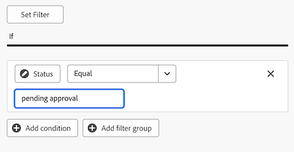

# キャンバスダッシュボードでのテーブルレポートの作成

>[!IMPORTANT]
>
>キャンバスダッシュボード機能は現在、ベータ版のステージに参加しているユーザーのみが利用できます。 この段階では、フィーチャの一部が完全でない、または意図したとおりに動作しない可能性があります。 キャンバスダッシュボードベータ版の概要記事の [ フィードバックの提供 ](/help/quicksilver/product-announcements/betas/canvas-dashboards-beta/canvas-dashboards-beta-information.md#provide-feedback) の節の手順に従って、エクスペリエンスに関するフィードバックをお送りください。 
>バグまたは技術的な問題の可能性に関するご意見がある場合は、Workfront サポートにチケットを送信してください。 詳しくは、[ カスタマーサポートへのお問い合わせ ](/help/quicksilver/workfront-basics/tips-tricks-and-troubleshooting/contact-customer-support.md) を参照してください。 
>このベータ版は、次のクラウドプロバイダーでは利用できません。
>
>* Amazon Web Services用に独自のキーを持参
>* Azure
>* Google Cloud Platform

キャンバスダッシュボードにテーブルレポートを追加すると、データをテーブル形式で視覚化できます。

## アクセス要件

+++ 展開すると、この記事の機能のアクセス要件が表示されます。

<table style="table-layout:auto"> 
<col> 
</col> 
<col> 
</col> 
<tbody> 
<tr> 
   <td role="rowheader">
Adobe Workfront パッケージ
</td> 
   <td> 

任意 
 
   </td> 
<tr> 
 <tr> 
   <td role="rowheader">
Adobe Workfront プラン
</td> 
   <td> 

標準 
 

プラン
 
   </td> 
   </tr> 
  </tr> 
  <tr> 
   <td role="rowheader">
アクセスレベル設定
</td> 
   <td>
レポート、ダッシュボードおよびカレンダーへのアクセスを編集する

  </td> 
  </tr>  
</tbody> 
</table>

この表の情報について詳しくは、[Workfront ドキュメントのアクセス要件](/help/quicksilver/administration-and-setup/add-users/access-levels-and-object-permissions/access-level-requirements-in-documentation.md)を参照してください。
+++

## 前提条件

テーブル・レポートを作成する前に、ダッシュボードを作成する必要があります。

## キャンバスダッシュボードでのテーブルレポートの作成

テーブルレポートの作成には、多くの設定オプションを使用できます。 このセクションでは、一般的な作成手順について説明します。

{{step1-to-dashboards}}

1. 左側のパネルで、「**キャンバスダッシュボード**」をクリックします。

1. 右上隅の&#x200B;**新しいダッシュボード**&#x200B;をクリックします。

1. [**ダッシュボードの作成**]ボックスに、ダッシュボードの&#x200B;**名前**&#x200B;と&#x200B;**説明**&#x200B;を入力します。

1. 「**作成**」をクリックします。

1. [**レポートの追加**]ボックスで、[**レポートの作成**]を選択します。

1. 左側で「**テーブル**」を選択します。

1. 右上隅の「**レポートを作成**」をクリックします。

1. （オプション）次の手順に従って、「**詳細**」セクションを設定します。

   1. レポート **名前** を入力します。

   1. レポート **説明** を入力します。

1. **テーブルを作成** セクションを設定するには、次の手順に従います。

   1. 左側のパネルで、**テーブル列** をクリックします。

   1. **列を追加** をクリックし、テーブルの列として表示するフィールドを選択します。 この列は、右側のプレビューセクションに表示されます。

   1. 追加する各列に対して上記の手順を繰り返します。

1. **フィルター**&#x200B;セクションを構成するには、次の手順を実行します：

   1. 左側のパネルで、「**フィルター**  アイコンをクリックします。

   1. **フィルターを編集** を選択します。

   1. 「**条件を追加**」をクリックして、フィルターに使用するフィールドと、フィールドが満たす必要がある条件の種類を定義する修飾子を指定します。 この列は、右側のプレビューセクションに表示されます。

1. （任意）「**フィルターグループを追加**」をクリックして、別のフィルター条件セットを追加します。 セット間のデフォルトの演算子は AND です。演算子をクリックして OR に変更します。

1. 次の手順に従って、「ドリルダウン・グループ設定 **セクションを構成し** す。

   1. 左側のパネルで、「**グループ設定** アイコンをクリックします。

   1. **グループ化を追加** ボタンをクリックし、グループ化として作成するフィールドを選択します。 グループ化の列は、右側のプレビューセクションに表示されます。

1. 「**保存**」をクリックしてレポートを作成し、ダッシュボードに追加します。

## テーブルレポートの作成例

この節では、保留中のドキュメント承認を表示するテーブルレポートを作成する手順を説明します。

テーブルレポートの例について詳しくは、[ レビューおよび承認用のレポートダッシュボードの作成 ](/help/quicksilver/review-and-approve-work/document-reviews-and-approvals/create-review-and-approval-dashboard.md) を参照してください。

{{step1-to-dashboards}}

1. 左側のパネルで、「**キャンバスダッシュボード**」をクリックします。

1. 右上隅の&#x200B;**新しいダッシュボード**&#x200B;をクリックします。

1. [**ダッシュボードの作成**]ボックスに、ダッシュボードの&#x200B;**名前**&#x200B;と&#x200B;**説明**&#x200B;を入力します。

1. 「**作成**」をクリックします。

1. **レポートを追加** ボックスで、「**レポートを作成**」を選択します。

1. 左側で「**テーブル**」を選択します。

1. 右上隅の「**レポートを作成**」をクリックします。

1. 「**詳細** セクションを設定するには、次の手順に従います。

   1. _名前_ フィールドに **承認待ち** と入力します。
   1. 「**説明**」フィールドに説明を入力します。 このテキストは、グラフ名の横にツールヒントとして表示されます。

1. **テーブルを作成** セクションを設定するには、次の手順に従います。

   1. 左側のパネルで、「**テーブル列** アイコンをクリックします。
   1. **列を追加** をクリックします。
   1. 下にスクロールして、**ドキュメント承認**/**ステータス** を選択します。
   1. 次の列を追加します。

   <table>
    <tr>
    <td><strong>プロジェクト名</strong></td>
    <td>文書バージョン/文書/プロジェクト/名前</td>
    </tr>
    <tr>
    <td><strong>ドキュメント名</strong></td>
    <td>ドキュメントバージョン / ドキュメント /検索ボックスに <em> 名前 </em> と入力します。</td>
    </tr>
    <tr>
    <td><strong>ドキュメント バージョン</strong></td>
    <td>ドキュメントのバージョン/ドキュメント/バージョン</td>
    </tr>
    <tr>
    <td><strong>期限</strong></td>
    <td>ドキュメントの承認/承認ステージ/期限</td>
    </tr>
    <tr>
    <td><strong>要求者</strong></td>
    <td>ドキュメントの承認/承認ステージ /承認ステージ参加者* /依頼者/検索ボックスに <em> 名前 </em> と入力します。</td>
    </tr>
    <tr>
    <td><strong>リクエスト日</strong></td>
    <td>文書の承認&gt;承認ステージ&gt;承認ステージ参加者*&gt;作成日</td>
    </tr>
    <tr>
    <td><strong>承認者</strong></td>
    <td>ドキュメントの承認/承認ステージ/承認ステージの参加者*/参加者ユーザー/<em>名前</em>を検索ボックスに入力します。</td>
    </tr>
    </table>

   *承認ステージの参加者は、_承認ステージのPa..._&#x200B;に切り詰められます

1. **フィルター**&#x200B;セクションを構成するには、次の手順を実行します：
   1. 左側のパネルで、**フィルター** をクリックします。
   1. **[フィルターの編集]**&#x200B;をクリックし、**条件の追加**&#x200B;をクリックします。
   1. 空の条件フィルターをクリックして、[**フィールドの選択**]をクリックします。
   1. 「**ステータス**」を選択します。
   1. 演算子を&#x200B;**Equal**&#x200B;に変更し、テキストボックスに「_承認待ち_」と入力します。
      
   1. （オプション）以下の「**オプションフィルター** の節で説明するように、フィルターを追加します。
1. 画面の右上隅にある「**保存**」をクリックします。

## テーブルレポートを作成する際の考慮事項

### 財務データを含むレポート

アクセスレベルで財務データへの表示または編集アクセス権を持つユーザーには、財務の表示権限がタスクレベルまたはプロジェクトレベルで削除されている場合でも、キャンバスダッシュボードのビジュアライゼーションに財務データが表示されます。

* アクセスレベルでの財務データへの権限を持っていないユーザーの場合、レポートに財務データは表示されません。
* 財務データを表示できるユーザーの場合、既に表示権限を持っているレコード（プロジェクト、タスク、イシューなど）のみが表示されます。 アクセスできないレコードの財務数値は表示されません。
* レポート作成者は、ダッシュボードに財務データを含める際には注意を払い、ダッシュボードを誰と共有するかを慎重に検討し、意図しないアクセスを防ぐ必要があります。

これは既知の制限であり、できる限り迅速に対処する予定です。

### フィールドセレクターの使用

**テーブルの作成**&#x200B;セクションの&#x200B;**セクション**&#x200B;のドロップダウンは、テーブルレポートを作成するときにオブジェクトが見つけやすくなるように、フィールドセレクターの選択肢を絞り込むことを目的としています。 まず、基本エンティティオブジェクトを選択します。

* **すべてのセクション** : Workfront WorkflowおよびWorkfront Planningのすべてのオブジェクト型。
* **Workfrontオブジェクト**:ネイティブのWorkfrontワークフローオブジェクト。
* **Planningレコードの種類**: Workfront Planningで定義されているカスタムレコードの種類。

基本エンティティオブジェクトを選択すると、「**セクション**」ドロップダウンが、選択可能な該当するフィールドタイプオプションで更新されます。

* **すべてのセクション**：ネイティブフィールド、カスタムフィールドおよび関連オブジェクト。
* **すべてのフィールド**：ネイティブフィールドとカスタムフィールドの両方（関係を除外）。
* **カスタムフィールド**：カスタムフォームまたは計画レコードのいずれかの顧客定義フィールド。
* **Workfront フィールド** : ネイティブフィールドのみ。
* **関係**：接続されたレコード。

### 子オブジェクトの参照

その他の列、フィルタオプション、グループ属性で使用できるリレーションシップは、通常、Workfrontオブジェクト階層の上位にあるオブジェクトに制限されるか、またはレポートの基本エンティティオブジェクトが1つ選択されているオブジェクトに制限されます。 これには、次のような例外があります。

* プロジェクト/タスク
* 「文書承認」 > 「文書承認ステージ」
* ドキュメント承認ステージ / ドキュメント承認ステージの参加者

上記の親子関係のいずれかを利用する場合、親オブジェクトに接続された各子レコードのテーブルに行が表示されます。
