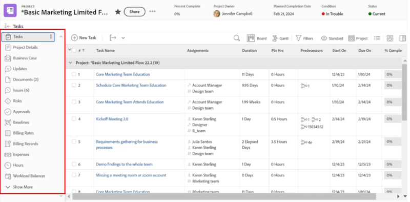
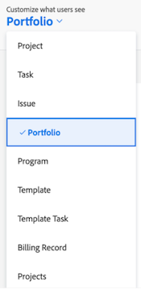

# レイアウトテンプレートへのキャンバスダッシュボードの追加

>[!IMPORTANT]
>
>Canvas ダッシュボード機能は現在、ベータ版ステージに参加しているユーザーのみが利用できます。 機能の一部が完了していないか、この段階で意図したとおりに動作しない可能性があります。 ご利用のエクスペリエンスに関するフィードバックは、Canvas ダッシュボードのベータ版の概要の記事の「[ フィードバックを提供](/help/quicksilver/product-announcements/betas/canvas-dashboards-beta/canvas-dashboards-beta-information.md#provide-feedback)」セクションの指示に従って送信してください。 
>バグや技術的な問題についてフィードバックがある場合は、Workfront サポートにチケットを送信してください。 詳しくは、[ カスタマーサポートにお問い合わせください](/help/quicksilver/workfront-basics/tips-tricks-and-troubleshooting/contact-customer-support.md). を参照してください
>このベータ版は、次のクラウドプロバイダーでは利用できないことに注意してください。
>
>* Amazon Web Services用に独自のキーを持ち込む
>* Azure
>* Google Cloud Platform

レイアウトテンプレートにカンバスダッシュボードを追加して、ホームランディングページに置き換えたり、オブジェクトの左側のパネルに表示したり、Adobe Workfront全体でトップバーにピン留めしたりできます。

## アクセス要件

+++ 展開すると、この記事の機能のアクセス要件が表示されます。

<table style="table-layout:auto"> 
<col> 
</col> 
<col> 
</col> 
<tbody> 
<tr> 
   <td role="rowheader">
Adobe Workfront パッケージ
</td> 
   <td> 

任意 
 
   </td> 
<tr> 
 <tr> 
   <td role="rowheader">
Adobe Workfront プラン
</td> 
   <td> 

標準
 

プラン
 
   </td> 
   </tr> 
  </tr> 
  <tr> 
   <td role="rowheader">
アクセスレベル設定
</td> 
   <td>
レポート、ダッシュボードおよびカレンダーへのアクセスを編集する

  </td> 
  </tr> 
    </tr>  
        <tr> 
   <td role="rowheader">
オブジェクト権限
</td> 
   <td>
ダッシュボードの権限の管理

  </td> 
  </tr> 
</tbody> 
</table>

この表の情報について詳しくは、[Workfront ドキュメントのアクセス要件](/help/quicksilver/administration-and-setup/add-users/access-levels-and-object-permissions/access-level-requirements-in-documentation.md)を参照してください。
+++

## 左側のパネルへのカンバスダッシュボードの追加

{{step-1-to-setup}}

1. 左側のパネルで、「**インターフェイス**」、「**レイアウトテンプレート**」の順に選択します。

1. **レイアウトテンプレート** ページで、テンプレートを選択します。

1. テンプレートの詳細ページで、**ユーザーに表示される内容をカスタマイズ** ドロップダウンで、ダッシュボードを追加するオブジェクトを選択します。

   

1. **左パネル** セクションの一番下までスクロールし、**ダッシュボードを追加**&#x200B;をクリックします。

1. **カスタムダッシュボードを追加** ボックスに、**クイックリンク**&#x200B;の名前を入力します。

1. **ダッシュボードを選択** ドロップダウンで、**キャンバスダッシュボード**&#x200B;を選択します。

1. **ダッシュボードを選択**&#x200B;の右側にあるドロップダウンで、左側のパネルに追加するキャンバスダッシュボードを選択します。

1. 「**追加**」をクリックします。 ダッシュボードが左側のパネルセクションに表示されます。

1. 「**保存**」をクリックします。

   >[!NOTE]
   >
   >プロジェクト、タスク、イシュー、Portfolio、プログラムなどの作業オブジェクトに配置すると、各レポートに表示される結果は、そのオブジェクト内で使用可能なレコードに制限されます。

## 上部バーへのカンバスダッシュボードの追加

{{step-1-to-setup}}

1. 左側のパネルで、「**インターフェイス**」、「**レイアウトテンプレート**」の順に選択します。

1. **レイアウトテンプレート** ページで、テンプレートを選択します。

1. **上部ナビゲーション領域** セクションで、**新しいピンを追加**&#x200B;をクリックし、ドロップダウンで「**ダッシュボードを追加**」を選択します。

1. **ページをピン留めする** ボックスに、**クイックリンク名**&#x200B;を入力します。

1. **ダッシュボードを選択** ドロップダウンで、**キャンバスダッシュボード**&#x200B;を選択します。

1. **ダッシュボードを選択**&#x200B;の右側にあるドロップダウンで、トップバーに追加するキャンバスダッシュボードを選択します。

1. 「**追加**」をクリックします。 ダッシュボードが上部バーに表示されます。

1. 「**保存**」をクリックします。

## カンバスダッシュボードをホームランディングページとして追加

{{step-1-to-setup}}

1. 左側のパネルで、「**インターフェイス**」、「**レイアウトテンプレート**」の順に選択します。

1. **レイアウトテンプレート** ページで、テンプレートを選択します。

1. **トップナビゲーション領域** セクションで、**ランディングページを選択**&#x200B;をクリックし、ドロップダウンで&#x200B;**ダッシュボードを追加**&#x200B;を選択します。

1. **カスタムダッシュボードを追加** ボックスに、**クイックリンク名**&#x200B;を入力します。

1. **ダッシュボードを選択** ドロップダウンで、**キャンバスダッシュボード**&#x200B;を選択します。

1. **ダッシュボードを選択**&#x200B;の右側にあるドロップダウンで、ホームランディングページとして追加するキャンバスダッシュボードを選択します。

1. 「**追加**」をクリックします。

1. 「**保存**」をクリックします。
