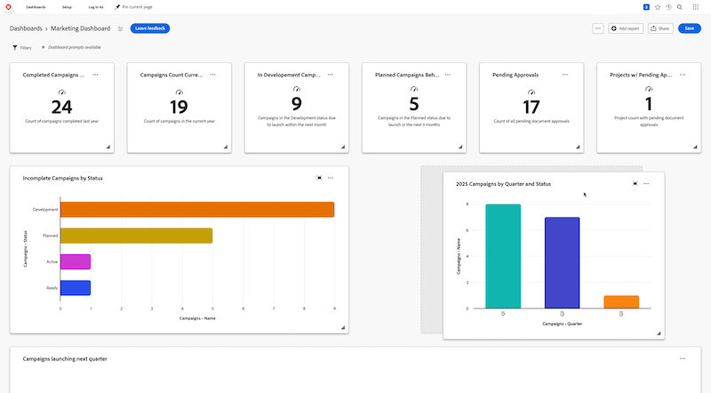

# キャンバスダッシュボードでのレポートの配置

>[!IMPORTANT]
>
>Canvas ダッシュボード機能は現在、ベータ版ステージに参加しているユーザーのみが利用できます。 機能の一部が完了していないか、この段階で意図したとおりに動作しない可能性があります。 ご利用のエクスペリエンスに関するフィードバックは、Canvas ダッシュボードのベータ版の概要記事の「[&#x200B; フィードバックを提供](/help/quicksilver/product-announcements/betas/canvas-dashboards-beta/canvas-dashboards-beta-information.md#provide-feedback)」セクションの手順に従って送信してください。 
>バグや技術的な問題についてフィードバックがある場合は、Workfront サポートにチケットを送信してください。 詳しくは、[カスタマーサポートに連絡](/help/quicksilver/workfront-basics/tips-tricks-and-troubleshooting/contact-customer-support.md)を参照してください。 
>このベータ版は、次のクラウドプロバイダーでは利用できないことに注意してください。
>
>* Amazon Web Services用に独自のキーを持ち込む
>* Azure
>* Google Cloud Platform

カンバスダッシュボードにレポートを追加すると、ダッシュボードにレポートウィジェットとして表示されるので、そのデータを一目ですぐに視覚化できます。 複数のレポートを追加したら、各ウィジェットのサイズを、ダッシュボード内のレポートの内容に最適に設定し、各ウィジェットの位置を調整して、データをより効果的に表示できます。

## アクセス要件

+++ 展開すると、この記事の機能のアクセス要件が表示されます。 

<table style="table-layout:auto"> 
<col> 
</col> 
<col> 
</col> 
<tbody> 
<tr> 
   <td role="rowheader">
Adobe Workfront パッケージ
</td> 
   <td> 

任意 
 
   </td> 
<tr> 
 <tr> 
   <td role="rowheader">
Adobe Workfront プラン
</td> 
   <td> 

標準 
 

プラン
 
   </td> 
   </tr> 
  </tr> 
  <tr> 
   <td role="rowheader">
アクセスレベル設定
</td> 
   <td>
レポート、ダッシュボードおよびカレンダーへのアクセスを編集する

  </td> 
  </tr>  
        <tr> 
   <td role="rowheader">
オブジェクト権限
</td> 
   <td>
ダッシュボードの権限の管理

  </td> 
  </tr>
</tbody> 
</table>

この表の情報について詳しくは、[Workfront ドキュメントのアクセス要件](/help/quicksilver/administration-and-setup/add-users/access-levels-and-object-permissions/access-level-requirements-in-documentation.md)を参照してください。
+++

## 前提条件

レポートを再配置する前に、ダッシュボードにレポートを追加する必要があります。

## ダッシュボードでのレポートの整理

{{step1-to-dashboards}}

1. 左側のパネルで、「**キャンバスダッシュボード**」をクリックします。

1. **Canvas ダッシュボード** ページで、右上隅の「**レイアウトを編集**」を選択します。 レポートウィジェットが編集可能になります。

1. レポートウィジェットをクリックして、ページ上の新しい位置にドラッグします。

   

1. （オプション）レポートウィジェットの長さと幅を調整するには、ウィジェットの右下隅にある「**サイズ変更** 」アイコンをクリックして長押しし、必要に応じてサイズを調整します。

1. 並べ替えるウィジェットごとに手順4 ～ 5を繰り返します。

1. 右上隅の「**保存**」をクリックします。
