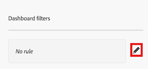

# キャンバスダッシュボードのフィルタリング

>[!IMPORTANT]
>
>キャンバスダッシュボード機能は現在、ベータ版のステージに参加しているユーザーのみが利用できます。 この段階では、フィーチャの一部が完全でない、または意図したとおりに動作しない可能性があります。 キャンバスダッシュボードベータ版の概要記事の [&#x200B; フィードバックの提供 &#x200B;](/help/quicksilver/product-announcements/betas/canvas-dashboards-beta/canvas-dashboards-beta-information.md#provide-feedback) の節の手順に従って、エクスペリエンスに関するフィードバックをお送りください。 
>バグまたは技術的な問題の可能性に関するご意見がある場合は、Workfront サポートにチケットを送信してください。 詳しくは、[&#x200B; カスタマーサポートへのお問い合わせ &#x200B;](/help/quicksilver/workfront-basics/tips-tricks-and-troubleshooting/contact-customer-support.md) を参照してください。 
>このベータ版は、次のクラウドプロバイダーでは利用できません。
>
>* Amazon Web Services用に独自のキーを持参
>* Azure
>* Google Cloud Platform

プロンプトを含むキャンバスダッシュボードにフィルターを適用できます。 プロンプトは、追加のフィルター条件を適用するフィルター修飾子として機能するので、結果をさらに絞り込むことができます。 これらのプロンプトは、フィルターを適用するたびに変更できるので、ダッシュボードのメインフィルター条件や個々のレポートを編集しなくても、表示される結果を調整できます。

## アクセス要件

+++ 展開すると、この記事の機能のアクセス要件が表示されます。 

<table style="table-layout:auto"> 
<col> 
</col> 
<col> 
</col> 
<tbody> 
<tr> 
   <td role="rowheader">
Adobe Workfront パッケージ
</td> 
   <td> 

任意 
 
   </td> 
<tr> 
 <tr> 
   <td role="rowheader">
Adobe Workfront プラン
</td> 
   <td> 

標準
 

プラン
 
   </td> 
   </tr> 
  </tr> 
  <tr> 
   <td role="rowheader">
アクセスレベル設定
</td> 
   <td>
レポート、ダッシュボードおよびカレンダーへのアクセスを編集する

  </td> 
  </tr> 
    </tr>  
        <tr> 
   <td role="rowheader">
オブジェクト権限
</td> 
   <td>
ダッシュボードの権限管理

  </td> 
  </tr> 
</tbody> 
</table>

この表の情報について詳しくは、[Workfront ドキュメントのアクセス要件](/help/quicksilver/administration-and-setup/add-users/access-levels-and-object-permissions/access-level-requirements-in-documentation.md)を参照してください。
+++

## 前提条件

ダッシュボードをフィルタリングするには、ダッシュボードを作成する必要があります。

詳しくは、[&#x200B; キャンバスダッシュボードの作成 &#x200B;](/help/quicksilver/reports-and-dashboards/canvas-dashboards/create-dashboards/create-dashboards.md) を参照してください。

## ダッシュボードのフィルタリング

ダッシュボードをフィルタリングするには、リストに表示された順序で次の手順を実行してください。

* [パート 1：ダッシュボードフィルターの作成](#part-1-create-a-dashboard-filter)
* [パート 2：ダッシュボードプロンプトの作成](#part-2-define-a-dashboard-prompt)
* [パート 3：ダッシュボードプロンプトの適用](#step-3-apply-a-dashboard-prompt)

>[!NOTE]
>
>ダッシュボードフィルターは、ダッシュボードレベルのフィルターが無効ではないすべてのレポートに適用されます。  各レポートのアクションメニューを展開して「**フィルターを無効にする**」オプションを選択すると、個々のレポートにダッシュボードレベルのフィルターを適用しないようにできます。

### パート 1：ダッシュボードフィルターの作成

ダッシュボードフィルターを使用すると、ダッシュボードで使用可能なすべてのレポートに共通のフィルターを適用できます。個々のレポートのフィルターを変更する必要はありません。

>[!NOTE]
>
>これらのフィルターは、ダッシュボードへの管理アクセス権を持つユーザーのみが設定できます。

{{step1-to-dashboards}}

1. 左側のパネルで、「**キャンバスダッシュボード**」をクリックします。

1. **キャンバスダッシュボード** ページで、フィルターを適用するダッシュボードを選択します。

1. ダッシュボードの詳細ページの左上隅にある「**フィルター**」をクリックします。 フィルターのサイドパネルが開きます。

1. **フィルターを編集** を選択します。 **ダッシュボードフィルター** ダイアログボックスが開きます。

1. （オプション）ルールを追加するには、次の手順に従います。

   1. ルールボックスの右側にある **編集** アイコンを選択します。

      

   1. 「**条件を追加**」をクリックして、次の情報を追加します。
      * フィルターの基準にするフィールドを選択します。
      * オプション（またはフィルター修飾子）を選択して、フィールドが満たす必要がある条件の種類を定義します。

   1. （任意）「**フィルターグループを追加**」をクリックして、別のフィルター条件セットを追加します。 セット間のデフォルトの演算子は AND です。演算子をクリックして OR に変更します。

1. [&#x200B; パート 2：ダッシュボードプロンプトの作成 &#x200B;](#part-2-define-a-dashboard-prompt) に進みます。

### パート 2：ダッシュボードプロンプトの定義

ダッシュボードプロンプトが表示され、ダッシュボードで使用可能なレポートにカスタマイズしたフィルターを追加で適用できます。

>[!NOTE]
>
>ダッシュボードプロンプトオプションは、ダッシュボードに管理アクセス権を持つユーザーのみが設定できます。

1. プロンプトを追加するには、次の手順に従います。

   1. **プロンプトの追加** を選択します。 新しいフィールドが画面の右側に表示されます。

   1. **ラベルをカスタマイズ** フィールドにラベルを入力します。

   1. フィールド名を入力し、リストに表示されたら選択することで、プロンプトの基にするフィールドを選択します。 

1. カスタムプロンプトを追加するには、次の手順に従います。

   1. **カスタムプロンプトを追加** を選択します。 新しいフィールドが画面の右側に表示されます。

   1. （オプション）「**ラベルをカスタマイズ**」フィールドに新しいラベルを入力します。 デフォルトでは、ラベル *新規カスタムプロンプト* が割り当てられます。

   1. **新しいオプションを追加** をクリックします。

   1. **オプション値** フィールドにプロンプト名を入力します。

   1. 「**条件を追加**」をクリックして、フィルターに使用するフィールドと、フィールドが満たす必要がある条件の種類を定義する修飾子を指定します。

      >[!NOTE]
      >
      >カスタムプロンプトの条件は、テキストモードでのみ編集できます。 これにより、複数の条件を 1 つのフィールドに適用できます。

   1. （任意）「**フィルターグループを追加**」をクリックして、別のフィルター条件セットを追加します。 セット間のデフォルトの演算子は AND です。演算子をクリックして OR に変更します。

1. 「**保存**」をクリックして、フィルターをダッシュボードに適用します。

1. [&#x200B; パート 3：ダッシュボードプロンプトの適用 &#x200B;](#step-3-apply-a-dashboard-prompt) に進みます。

### 手順 3：ダッシュボードプロンプトの適用

ダッシュボードへのアクセス権を持つすべてのユーザーは、フィルターとプロンプトを作成したら、キャンバスダッシュボードにダッシュボードプロンプトを適用できます。

{{step1-to-dashboards}}

1. 左側のパネルで、「**キャンバスダッシュボード**」をクリックします。

1. **キャンバスダッシュボード** ページで、プロンプトを適用するダッシュボードを選択します。

1. ダッシュボードの詳細ページの左上隅にある「**フィルター**」をクリックします。 フィルターのサイドパネルが開きます。

1. **次の条件でレコードを表示…** セクションで、表示される 1 つまたはすべてのプロンプトの条件を選択します。 プロンプトが適用され、**ダッシュボードフィルターが適用されました** タグがレポートウィジェットの隅に表示されます。
   

1. 右上隅の **閉じる** アイコン  をクリックして、パネルを非表示にします。

## 通貨タイプでダッシュボードをフィルタリング

ダッシュボードレベルで様々な通貨タイプを切り替えることができます。 通貨フィールドを含む報告書は、選択した通貨タイプを反映するように更新されます。

>[!NOTE]
>
>通貨フィールドは、レポートレベルでロックできます。 通貨フィールドがロックされている場合、ダッシュボードの通貨タイプを変更しても、そのレポートの通貨タイプは変更されません。

ダッシュボードの通貨タイプを変更するには、

1. ダッシュボードの詳細ページの右上隅にある「通貨」ドロップダウンメニューをクリックします。
1. リストから目的の通貨タイプを選択します。

   
