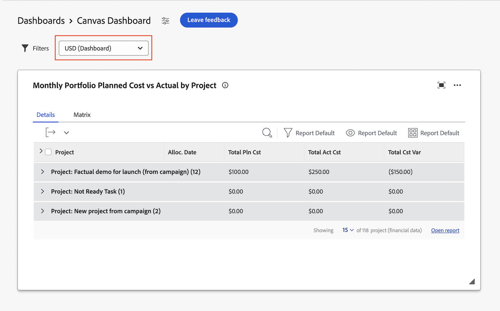

# Canvas ダッシュボードでの通貨フィールドの使用

>[!IMPORTANT]
>
>Canvas ダッシュボード機能は現在、ベータ版ステージに参加しているユーザーのみが利用できます。機能の一部が完了していないか、この段階で意図したとおりに動作しない可能性があります。ご利用のエクスペリエンスに関するフィードバックは、Canvas ダッシュボードのベータ版の概要の記事の「[ フィードバックを提供](/help/quicksilver/product-announcements/betas/canvas-dashboards-beta/canvas-dashboards-beta-information.md#provide-feedback)」セクションの指示に従って送信してください。 
>発生する可能性のあるバグや技術的な問題についてフィードバックがある場合は、Workfront サポートにチケットを送信してください。詳しくは、[ カスタマーサポートへのお問い合わせ](/help/quicksilver/workfront-basics/tips-tricks-and-troubleshooting/contact-customer-support.md). を参照してください
>このベータ版は、次のクラウドプロバイダーでは利用できないことに注意してください。
>
>* Amazon Web Services用に独自のキーを持ち込む
>* Azure
>* Google Cloud Platform

<!--
The highlighted information on this page refers to functionality not yet generally available. It is available only in the Preview environment for all customers. After the release to Preview, the same features are also available monthly in the Production environment for customers who enabled fast releases.    

For information about fast releases, see [Enable or disable fast releases for your organization](/help/quicksilver/administration-and-setup/set-up-workfront/configure-system-defaults/enable-fast-release-process.md). 
-->

## アクセス要件

+++ 展開すると、この記事の機能のアクセス要件が表示されます。 

<table style="table-layout:auto"> 
<col> 
</col> 
<col> 
</col> 
<tbody> 
<tr> 
   <td role="rowheader">
Adobe Workfront パッケージ
</td> 
   <td> 

任意 
 
   </td> 
<tr> 
 <tr> 
   <td role="rowheader">
Adobe Workfront プラン
</td> 
   <td> 

標準
 

プラン
 
   </td> 
   </tr> 
  </tr> 
  <tr> 
   <td role="rowheader">
アクセスレベル設定
</td> 
   <td>
レポート、ダッシュボードおよびカレンダーへのアクセスを編集する

   
財務データへのアクセス

  </td> 
  </tr> 
    </tr>  
        <tr> 
   <td role="rowheader">
オブジェクト権限
</td> 
   <td>
ダッシュボードの権限の管理

  </td> 
  </tr> 
</tbody> 
</table>

この表の情報について詳しくは、[Workfront ドキュメントのアクセス要件](/help/quicksilver/administration-and-setup/add-users/access-levels-and-object-permissions/access-level-requirements-in-documentation.md)を参照してください。
+++

## 前提条件

1. この記事で説明する機能を使用するには、Workfront インスタンスで複数の通貨タイプを設定する必要があります。 詳しくは、[為替レートの設定](/help/quicksilver/administration-and-setup/manage-workfront/exchange-rates/set-up-exchange-rates.md)を参照してください。

   >[!IMPORTANT]
   >
   >この記事で説明する機能は、ネイティブ通貨フィールドにのみ適用されます。 カスタム通貨フィールドのサポートは近日リリース予定です。

## Canvas ダッシュボードのデフォルト通貨の設定

Canvas ダッシュボードを作成する際に、ダッシュボードのデフォルト通貨を設定できます。 この通貨は、通貨フィールドがレポートレベルでロックされていない限り、ダッシュボード上のレポートのすべてのネイティブ通貨フィールドを表示するために使用されます。

1. 左側のパネルで、「**キャンバスダッシュボード**」をクリックします。

1. 右上隅の「**新しいダッシュボード**」をクリックします。

1. **ダッシュボードを作成** ボックスで，

1. 以下を指定します。

   <table style="table-layout:auto">
    <col>
    <col>
    <tbody>
     <tr>
      <td role="rowheader"><strong>名前</strong></td>
      <td>
ダッシュボードの名前を入力します。 互換性の問題を回避するために、UTF-8文字のみを使用することをお勧めします。
</td>
     </tr>
     <tr>
      <td role="rowheader"><strong>説明（オプション）</strong></td>
      <td>ダッシュボードの説明を入力します。</td>
     </tr>
      <tr>
      <td role="rowheader"><strong>通貨</strong></td>
      <td>ダッシュボードのデフォルトの通貨タイプを選択します。  
        ユーザーは、ダッシュボードをフィルタリングする際に、異なる通貨タイプを切り替えることができます。</td>
     </tr>
    </tbody>
   </table>

## Canvas ダッシュボードでの通貨の切り替え

ダッシュボードレベルで異なる通貨タイプを切り替えることができます。 通貨フィールドを含むレポートは、選択した通貨タイプを反映するように更新されます。

通貨フィールドは、レポートレベルでロックできます。 通貨フィールドがロックされている場合、ダッシュボードの通貨タイプを変更しても、そのレポートの通貨タイプは変更されません。

ダッシュボードの通貨タイプを変更するには，

1. ダッシュボードの詳細ページの右上隅にある通貨ドロップダウンメニューをクリックします。
1. リストから目的の通貨タイプを選択します。

   

## 制限事項

次の表に、設定の「為替レート」領域で通貨を定義する場合の制限の概要を示します。

<table> 
<tr>
<td></td>
<td>ユーザーは</td>
<td>ユーザーは</td>
</tr>
<tr> 
<td>単一通貨が定義されています</td>
<td>
<ul>
<li>カンバスチャート、KPI、表レポートでのネイティブ通貨フィールドの使用</li>
<li>カンバスチャート、KPI、およびチャートレポートでのカスタム通貨フィールドの使用</li>
</ul>
</td>
<td>
<ul>
<li>ダッシュボードにデフォルト通貨を割り当てる（作成時またはダッシュボードの編集時）</li>
<li>ダッシュボードレベルの通貨切り替えを表示して使用します</li>
<li>カンバスチャート、KPIまたは表レポートで表示する特定の通貨をロックします</li>
<li>カンバスチャート、KPIおよび表レポートでの計画通貨フィールドの使用 <!-- in the Production environment. This is available in the Preview environment.--></li>
</ul>
</td> 
</tr>
</td> 
</tr> 
<tr>
<td>複数の通貨が定義されています</td>
<td>
<ul>
  <li>カンバスチャート、KPI、表レポートでのネイティブ通貨フィールドの使用</li>
  <li>ダッシュボードのデフォルト通貨の設定（作成時またはダッシュボードの編集時）</li>
  <li>ダッシュボードレベルの通貨切り替えを表示して使用します</li>
  <li>カンバスチャート、KPIまたは表レポートで表示する特定の通貨をロックして、ダッシュボードの通貨の切り替え設定を無視します</li>
</ul>
</td>
<td><ul>
  <li>カンバスチャート、KPI、表レポートでのカスタムデータ通貨フィールドの使用</li>
  <li>カンバスチャート、KPIおよび表レポートでの計画通貨フィールドの使用 <!-- in the Production environment. This is available in the Preview environment.--></li>
</ul>
</td>
</tr></table>
