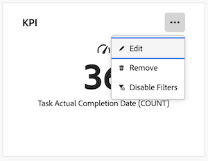

# キャンバスダッシュボードでのレポートの編集

>[!IMPORTANT]
>
>キャンバスダッシュボード機能は現在、ベータ版のステージに参加しているユーザーのみが利用できます。 この段階では、フィーチャの一部が完全でない、または意図したとおりに動作しない可能性があります。 キャンバスダッシュボードベータ版の概要記事の [ フィードバックの提供 ](/help/quicksilver/product-announcements/betas/canvas-dashboards-beta/canvas-dashboards-beta-information.md#provide-feedback) の節の手順に従って、エクスペリエンスに関するフィードバックをお送りください。 
>&#x200B;>このベータ版は、次のクラウドプロバイダーでは利用できません。
>
>* Amazon Web Services用に独自のキーを持参
>* Azure
>* Google Cloud Platform

キャンバスダッシュボードにレポートを追加した後、レポートの情報を編集して、ダッシュボードに表示されるデータを変更できます。

レポートに加えられた変更は、そのレポートを含むダッシュボードにアクセスできるすべてのユーザーに影響を与えます。

+++ 展開すると、アクセス要件が表示されます。 

<table style="table-layout:auto"> 
<col> 
</col> 
<col> 
</col> 
<tbody> 
<tr> 
   <td role="rowheader">
Adobe Workfront プラン
</td> 
   <td> 

任意 
 
   </td> 
<tr> 
 <tr> 
   <td role="rowheader">
Adobe Workfront プラン
</td> 
   <td> 

現在：プラン 
 

新規：標準
 
   </td> 
   </tr> 
  </tr> 
  <tr> 
   <td role="rowheader">
アクセスレベル設定
</td> 
   <td>
レポート、ダッシュボードおよびカレンダーへのアクセスを編集する

  </td> 
  </tr>  
        <tr> 
   <td role="rowheader">
オブジェクト権限
</td> 
   <td>
ダッシュボードの権限管理

  </td> 
  </tr>
</tbody> 
</table>

この表の情報について詳しくは、[Workfront ドキュメントのアクセス要件](/help/quicksilver/administration-and-setup/add-users/access-levels-and-object-permissions/access-level-requirements-in-documentation.md)を参照してください。
+++

## 前提条件

レポートを編集するには、ダッシュボードに追加する必要があります。

詳しくは、[ キャンバスダッシュボードの作成 ](/help/quicksilver/reports-and-dashboards/canvas-dashboards/create-dashboards/create-dashboards.md) を参照してください。

## レポートの編集

{{step1-to-dashboards}}

1. 左側のパネルで、「**キャンバスダッシュボード**」をクリックします。

1. **キャンバスダッシュボード** ページで、編集するレポートの右上隅にある **詳細** アイコンをクリックし、「**編集**」を選択します。

   

1. **設定** ダイアログボックスで、左側にリストされているセクションの情報を編集します。 これらのセクションは、編集しているレポートタイプによって異なります。

1. （オプション） KPI レポートを編集する場合は、次のセクションで必要に応じて情報を編集します。

   * **詳細**
   * **ビルド KPI**
   * **フィルター**
   * **ドリルダウン列設定**
   * **ドリルダウン グループの設定**

   これらの節について詳しくは、[KPI レポートの作成 ](/help/quicksilver/reports-and-dashboards/canvas-dashboards/add-reports/build-kpi-report.md) を参照してください。

1. （オプション）チャート・レポートを編集する場合は、必要に応じて、次の項の情報を編集します。

   * **詳細**
   * **グラフの作成**
   * **フィルター**
   * **ドリルダウン列設定**
   * **ドリルダウン グループの設定**

   これらのセクションの詳細については、「[ グラフ レポートを作成する ](/help/quicksilver/reports-and-dashboards/canvas-dashboards/add-reports/build-chart-report.md)」を参照してください。

1. （オプション）テーブルレポートを編集する場合、必要に応じて、以下の節の情報を編集します。

   * **詳細**
   * **テーブルの作成**
   * **フィルター**
   * **グループ設定**

   これらのセクションについて詳しくは、「[ テーブルレポートの作成 ](/help/quicksilver/reports-and-dashboards/canvas-dashboards/add-reports/build-table-report.md) を参照してください。

1. 「**保存**」をクリックしてレポートを更新します。

## 既存のレポートの編集

既存のレポートを編集すると、選択したレポートデータがウィジェットに現在表示されているデータを上書きします。 既存のレポートを置き換えるのではなく、追加で追加する場合は、別のレポートウィジェットを作成することをお勧めします。

詳しくは、[ キャンバスダッシュボードへの既存のレポートの追加 ](/help/quicksilver/reports-and-dashboards/canvas-dashboards/add-reports/add-existing-report.md) を参照してください

{{step1-to-dashboards}}

1. 左側のパネルで、「**キャンバスダッシュボード**」をクリックします。

1. **キャンバスダッシュボード** ページで、編集するレポートの右上隅にある **詳細** アイコンをクリックし、「**編集**」を選択します。

1. **レポートの選択** ボックスで **追加** をクリックし、既存のレポートウィジェットのデータを置き換えるレポートをインラインで選択します。
