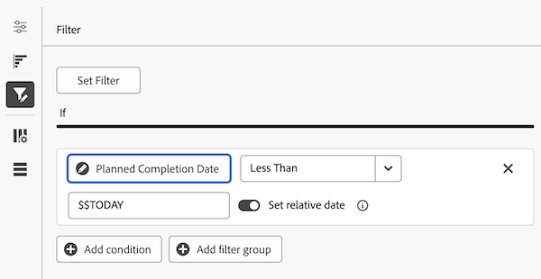
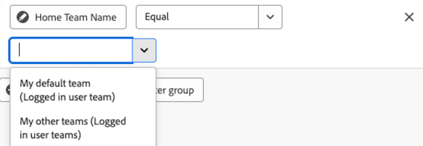

# キャンバスダッシュボードでのレポートフィルターの編集

>[!IMPORTANT]
>
>カンバスダッシュボード機能は現在、ベータ版ステージに参加しているユーザーのみが使用できます。 この段階では、機能の一部が完全でない場合や、意図したとおりに機能しない場合があります。 Canvas Dashboardsベータ版の概要記事の[フィードバックの提供](/help/quicksilver/product-announcements/betas/canvas-dashboards-beta/canvas-dashboards-beta-information.md#provide-feedback)セクションの手順に従って、エクスペリエンスに関するフィードバックを送信してください。 
>バグまたは技術的な問題に関するフィードバックがある場合は、Workfrontサポートにチケットを送信してください。 詳細については、[カスタマーサポートにお問い合わせください](/help/quicksilver/workfront-basics/tips-tricks-and-troubleshooting/contact-customer-support.md)。 
>このベータ版は、次のクラウドプロバイダーでは利用できません。
>
>* Amazon Web Services用に自分の鍵を持ち込む
>* Azure
>* Google Cloud Platform

レポートフィルターをCanvasダッシュボードに適用したら、それを編集して、プロジェクトの進行状況に応じて表示されるデータを更新できます。

## アクセス要件

+++ 展開すると、この記事の機能のアクセス要件が表示されます。

<table style="table-layout:auto"> 
<col> 
</col> 
<col> 
</col> 
<tbody> 
<tr> 
   <td role="rowheader">
Adobe Workfront パッケージ
</td> 
   <td> 

任意 
 
   </td> 
<tr> 
 <tr> 
   <td role="rowheader">
Adobe Workfront プラン
</td> 
   <td> 

標準
 

プラン
 
   </td> 
   </tr> 
  </tr> 
  <tr> 
   <td role="rowheader">
アクセスレベル設定
</td> 
   <td>
レポート、ダッシュボードおよびカレンダーへのアクセスを編集する

  </td> 
  </tr>  
        <tr> 
   <td role="rowheader">
オブジェクト権限
</td> 
   <td>
ダッシュボードの権限の管理

  </td> 
  </tr>
</tbody> 
</table>

この表の情報について詳しくは、[Workfront ドキュメントのアクセス要件](/help/quicksilver/administration-and-setup/add-users/access-levels-and-object-permissions/access-level-requirements-in-documentation.md)を参照してください。
+++

## 前提条件

レポートを編集するには、フィルターをレポートに追加する必要があります。

## レポートフィルターの編集

>[!NOTE]
>
>レポートフィルターを作成および編集するために使用可能な設定ツールは数多くあります。 これらのツールの詳細については、この記事の次のセクションを参照してください： [レポートフィルターを編集する場合の考慮事項](#considerations-when-editing-a-report-filter)。

{{step1-to-dashboards}}

1. 左側のパネルで、「**キャンバスダッシュボード**」をクリックします。

1. **カンバスダッシュボード**&#x200B;ページで、編集するフィルターが含まれているレポートの右上隅にある&#x200B;**その他** アイコンをクリックし、**編集**&#x200B;を選択します。

   

1. **設定**&#x200B;ダイアログボックスの左側で、**フィルター**&#x200B;パネルを選択します。

1. **[フィルターの編集]**&#x200B;をクリックします。

1. 編集するフィールドまたはモディファイヤを選択し、必要に応じて現在の選択内容を調整します。

   

1. （オプション） **[フィルターグループの追加]**&#x200B;をクリックして、別のフィルター条件を追加します。 セット間のデフォルトの演算子は AND です。演算子をクリックして OR に変更します。

1. 「**保存**」をクリックします。

## レポートフィルターを編集する際の考慮事項

### 日付ベースのワイルドカードのフィルター変数

日付ベースのワイルドカードオプションは、任意の日付フィルター属性と組み合わせて使用できます。レポートに日付ベースのワイルドカードを追加する方法について詳しくは、[日付ベースのワイルドカードを使用したレポートの一般化](../../../reports-and-dashboards/reports/reporting-elements/use-date-based-wildcards-generalize-reports.md)を参照してください。

>[!NOTE]
>
>時間部分を含まない日付と時間の計算を作成した場合または $$TODAY や $$NOW の日付ワイルドカードを使用する場合、ローカルタイムゾーンではなく協定世界時（UTC）ゾーンに従って日付が使用されます。これは予期しない日付の結果を引き起こす可能性があります。

次の日付ベースのワイルドカードから選択できます。

<table style="table-layout:auto"> 
 <col> 
 <col> 
 <tbody> 
  <tr valign="top"> 
   <td width="100" role="rowheader"> 
<strong>$$TODAY</strong> 
 </td> 
   <td> 
明日、来週または来月に再度フィルターを作成することを避けるために、このワイルドカードを使用して日付指定のフィルターを作成することをお勧めします。
 
例えば、今日までに期限を迎えるすべてのタスクを表示したい場合、タスクフィルターで <em>$$TODAY 以前の予定開始日</em>のルールを使用できます。
 
$$TODAY は、常に現在の日付の午前 0時と等しいものとします。
 </td> 
  </tr> 
  <tr valign="top"> 
   <td width="100" role="rowheader"> 
<strong>$$NOW</strong> 
 </td> 
   <td> 
これは $$TODAY ワイルドカードに似ていますが、現在の日付と時間が含まれます。$$NOW は現在の日付と時間に等しいものとします。
 
例えば、現在の時刻までに入力されたすべての時間エントリを表示する場合は、時間フィルターで <em>$$NOW 以前の予定開始日</em>のルールを使用します。
 
メモ：このワイルドカードは、リソースプランナーではサポートされていません。
 </td> 
  </tr> 
 </tbody> 
</table>

様々な期間と様々な時点（将来または過去）を指定するには、上記のワイルドカードと以下を組み合わせます。

| 属性 |   |
|---|---|
| **q** | 四半期 |
| **時間** | 時間 |
| **d** | 日 |
| **w** | 週 |
| **m** | 月 |
| **y** | 年 |

{style="table-layout:auto"}

| **修飾子** | |
|---|---|
| **b** | 期間の初め（属性を指定しない場合、デフォルトでは週の初め：日曜日） |
| **e** | 期間の終わり（属性を指定しない場合、デフォルトでは週の終わり：土曜日） |

{style="table-layout:auto"}

| **演算子** | |
|---|---|
| **+** | ワイルドカード値に値を追加 |
| **-** | ワイルドカード値から値を減算 |

{style="table-layout:auto"}

例えば、ワイルドカード `$$TODAYb+2w` は、「今週の初めから 2 週間」を意味します。ワイルドカード *`$$NOW+2h` は、「今から 2 時間後」を意味します。

### ログインユーザーワイルドカードフィルター変数

* ユーザー`name`属性をフィルター処理すると、**自分（ログインしているユーザー）**&#x200B;オプションが表示されます。

  

* グループ`name`属性をフィルター処理する場合、フィルター条件で使用する&#x200B;**自分のホームグループ（ログインしているユーザーグループ）**&#x200B;および&#x200B;**自分の他のグループ（ログインしているユーザーグループ）**&#x200B;のオプションが表示されます。

  

* チーム`name`属性をフィルター処理する場合、フィルター条件で選択できる&#x200B;**既定のチーム（ログインしているユーザーチーム）**&#x200B;と&#x200B;**他のチーム（ログインしているユーザーチーム）**&#x200B;オプションが表示されます。

  

### 子オブジェクトの参照

その他の列、フィルタオプション、グループ属性で使用できるリレーションシップは、通常、Workfrontオブジェクト階層の上位にあるオブジェクトに制限されるか、またはレポートの基本エンティティオブジェクトが1つ選択されているオブジェクトに制限されます。 これには、次のような例外があります。

* プロジェクト/タスク
* 「文書承認」 > 「文書承認ステージ」
* 「文書承認ステージ」 > 「文書承認ステージ参加者」

前述の親子関係のいずれかを使用する場合は、親オブジェクトに接続された各子レコードの行が表に表示されます。

### フィールドタイプ別のフィールド演算子

+++ 展開すると、フィールドの種類別にフィールド演算子の一覧が表示されます。 

<table>
    <tr>
        <td><b>フィールドタイプ</b></td>
        <td><b>例</b></td>
       <td><b>演算子</b></td>
        <td><b>ワイルドカード</b></td>
    </tr>
    <tr>
        <td>オブジェクト/参照名</td>
        <td>任意のネイティブ名属性またはカスタム検索</td>
              <td><ul>
        <li>が次に等しい</li>
        <li>が次と等しくない</li>
        <li>が次を含む</li>
          <li>が次を含まない</li>
            <li>が NULL である</li>
              <li>が null ではない</li>
        </ul></td>
        <td>ユーザー：名前
        <ul>
        <li>自分 (ログインユーザー)</li>
        </ul>
        グループ：名前
        <ul>
          <li>ホームグループ (ログインユーザーグループ)</li>
            <li>その他のグループ (ログインユーザーグループ)</li>
          </ul>
          グループ版：名称
                  <ul>
          <li>デフォルトのチーム (ログインユーザーチーム)</li>
            <li>その他のチーム (ログインユーザチーム)</li>
          </ul>
        </td>
    </tr>
    <tr>
        <td>文字列/テキスト入力 </td>
                <td>プロジェクト：説明</td>
                      <td><ul>
             <li>が次に等しい</li>
        <li>が次と等しくない</li>
        <li>が次を含む</li>
          <li>が次を含まない</li>
            <li>が NULL である</li>
              <li>が null ではない</li>
        </ul></td>
        <td></td>
    </tr>
    <tr>
        <td>整数/倍精度浮動小数点型</td>
             <td>プロジェクト：計画時間
         タスク：達成率</td>
              <td><ul>
        <li>が次に等しい</li>
        <li>が次と等しくない</li>
        <li>より大きい</li>
          <li>次よりも大きいか等しい</li>
          <li>より小さい</li>
          <li>次よりも小さいか等しい</li>
            <li>が NULL である</li>
              <li>が null ではない</li>
        </ul></td>
        <td></td>
    </tr>
       <tr>
        <td> 日付/日時 </td>
                    <td>プロジェクト：計画開始日
         時間：入力日</td>
              <td><ul>
        <li>が次に等しい</li>
        <li>が次と等しくない</li>
        </ul></td>
        <td><b>相対日付の設定</b>オプションを切り替えることによって、相対日付のワイルドカードを適用して、一般的な日付の期間に基づいてレポートをより動的に自動調整することができます。 
         <ul><li>$$TODAY</li>
         <li>$$NOW</li>
         </ul>
        </td>
    </tr>
       <tr>
        <td>ブール値 </td>
                  <td>プロジェクト：文書あり
         タスク：クリティカルです
         ユーザー：アクティブです</td>
        <td><ul>
        <li>が次に等しい</li>
        <li>が次と等しくない</li>
        </ul></td>
        <td> </td>
    </tr>
   </table>

+++
