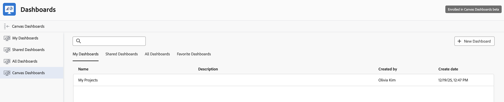

# キャンバスダッシュボードの使用

>[!IMPORTANT]
>
>Canvas ダッシュボード機能は現在、ベータ版ステージに参加しているユーザーのみが利用できます。 機能の一部が完了していないか、この段階で意図したとおりに動作しない可能性があります。 ご利用のエクスペリエンスに関するフィードバックは、Canvas ダッシュボードのベータ版の概要記事の「[ フィードバックを提供](/help/quicksilver/product-announcements/betas/canvas-dashboards-beta/canvas-dashboards-beta-information.md#provide-feedback)」セクションの手順に従って送信してください。
>
>バグや技術的な問題についてフィードバックがある場合は、Workfront サポートにチケットを送信してください。 詳しくは、[カスタマーサポートに連絡](/help/quicksilver/workfront-basics/tips-tricks-and-troubleshooting/contact-customer-support.md)を参照してください。
>
>このベータ版は、次のクラウドプロバイダーでは利用できないことに注意してください。
>
>* Amazon Web Services用に独自のキーを持ち込む
>* Azure
>* Google Cloud Platform

カンバスダッシュボードを使用すると、柔軟なカンバスレイアウトにさまざまなレポートタイプを追加することで、Adobe Workfront データを視覚化できます。 この記事では、Canvas ダッシュボードを効果的に使用する方法の概要を説明します。

## Canvas ダッシュボードへのアクセス

Canvas ダッシュボードにアクセスするには、Adobe Workfrontの「ダッシュボード」セクションに移動します。 必要な権限があれば、そこから既存のダッシュボードを表示したり、新しいダッシュボードを作成したりできます。

{{step1-to-dashboards}}

1. 左側のパネルで、「**キャンバスダッシュボード**」をクリックします。
1. 既存のダッシュボードの名前をクリックして開きます。
   

<!--
## Navigating the Dashboard

Once you open a Canvas Dashboard, you can interact with the reports displayed on the dashboard. You can resize, drag, and drop reports to customize the layout according to your preferences.

## Add dashboard to favorites

-->

## Reportsの操作

ダッシュボードで個々のレポートを操作できます。

### テーブルレポートを一時的にカスタマイズする

ダッシュボードのテーブルレポートを一時的にカスタマイズできます。 これらの変更は、現在のセッションにのみ適用され、元のレポート設定には影響しません。

1. 左側のパネルで、「**キャンバスダッシュボード**」をクリックします。
1. 既存のダッシュボードの名前をクリックして開きます。
   
1. カスタマイズする表レポートを探します。
1. レポートをカスタマイズするには、次のいずれかのオプションを選択します。

   | オプション | 説明 |
   |--------|-------------|
   | **列を追加** | 「**列を追加**」をクリックして、レポートに列を追加します。 |
   | **列の設定** | レポートの特定の列の表示と非表示を選択します。 |
   | **行の高さ** | レポートの行の高さを調整します。 |
   | **スクロールをスナップ** | レポート内で簡単に移動できるように、スナップ スクロールを有効または無効にします。 |

   >[!IMPORTANT]
   >
   >これらの変更は、現在のセッションにのみ適用され、元のレポート設定には影響しません。 これらの変更を永続的に行うには、レポートを編集する必要があります。

<!--

### Quick Search 

### Filter
### Use drilldowns

You can use drilldowns in Canvas Dashboards to sort and group data within reports.

1. In the left panel, click **Canvas Dashboards**.
1. Click the name of an existing dashboard to open it.
    
1. Locate the report that you want to look at.
1. Click on a data point within the report to drill down into more detailed information.
1. Click the Show build table icon to open the drilldown settings. 
1. Click Add Column to add additional columns to the drilldown table.

 >[!IMPORTANT]
>
>These changes only apply to your current session and do not affect the original report configuration. To make permanent these changes, you need to edit the report.

### Add additional columns to table reports

## View reports with grouped data

Report creators can configure reports to display grouped data. When viewing these reports on a Canvas Dashboard, you can expand or collapse the grouped data to see more or less detail.

Data within groups is sorted alphabetically or chronologically by default, depending on the data type. You can click the column headers to sort the data within each group based on different attributes. When you sort by a different attribute, the order of the groups remains unchanged.

When you sort by the same field that your report is grouped by, the group order can flip. For example, a text-based grouping that normally runs A–Z can switch to Z–A. This only happens when the sort column and the grouping attribute are the same.

## Saving and Sharing Dashboards

After customizing your Canvas Dashboard, you can save your changes. Additionally, you can share the dashboard with other users in your organization, provided you have the appropriate sharing permissions.

For more detailed instructions on creating, managing, and customizing Canvas Dashboards, refer to the related articles in the [Canvas Dashboards overview](/help/quicksilver/reports-and-dashboards/canvas-dashboards/canvas-dashboards-overview.md) section.
-->

## グループ化されたデータを使用したレポートの表示

レポート作成者は、グループ化されたデータを表示するようにレポートを設定できます。 レポートにグループ化がある場合は、グループ化されたデータを展開または折りたたんで、詳細を表示できます。

デフォルトでは、フィールドタイプに応じて、グループ化自体がアルファベット順または時系列で並べ替えられます。 各グループ内のデータは、グループ化の並べ替え順序とは独立して並べ替えられます。

列ヘッダーをクリックして、各グループ内のデータを並べ替えることができます。 グループ化フィールドとは異なるフィールドで並べ替えると、グループの順序は変更されません。

ただし、レポートをグループ化したフィールドと同じフィールドで並べ替えると、グループの順序が変更される場合があります。 例えば、通常A～Zを実行するテキストベースのグループ化では、Z～Aに切り替えることができます。
