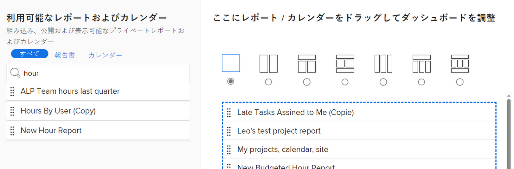

# ダッシュボードの作成

<!--Audited: 01/2024-->

ダッシュボードを作成して、Adobe Workfrontの情報にすばやくアクセスできます。 レポート、カレンダー、外部ページをダッシュボードに追加して、他のユーザーと共有し、最適なコラボレーションを実現できます。

ダッシュボードについて詳しくは、 [ダッシュボードの概要](../../../reports-and-dashboards/dashboards/understanding-dashboards/get-started-dashboards.md).

## アクセス要件

以下が必要です。

<table style="table-layout:auto">
 <col> 
 </col> 
 <col> 
 </col> 
 <tbody> 
  <tr> 
   <td> 
<strong>Adobe Workfrontプラン</strong>
 </td> 
   <td>任意</td> 
  </tr> 
  <tr> 
   <td> 
<strong>Adobe Workfront license*</strong>
 </td> 
   <td> 
現在：プラン 

   または
   
新規：標準 
 </td> 
  </tr> 
  <tr> 
   <td><strong>アクセスレベル設定</strong> </td> 
   <td> 
レポート、ダッシュボード、カレンダーへのアクセスを編集
 </td> 
  </tr> 
  <tr> 
   <td> 
<strong>オブジェクトの権限</strong> 
 </td> 
   <td> 
作成したダッシュボードに対する管理権限が取得されます
 </td> 
  </tr> 
 </tbody> 
</table>

*保有するプラン、ライセンスの種類、アクセス権を確認するには、Workfront管理者にお問い合わせください。 詳しくは、 [Workfrontドキュメントのアクセス要件](/help/quicksilver/administration-and-setup/add-users/access-levels-and-object-permissions/access-level-requirements-in-documentation.md).

## 前提条件

ダッシュボードに追加する前に、次のオブジェクトのいずれかを作成する必要があります。

* **レポート**：レポートの作成について詳しくは、 [カスタムレポートの作成](../../../reports-and-dashboards/reports/creating-and-managing-reports/create-custom-report.md).

* **カレンダー**：カレンダーの作成について詳しくは、 [カレンダーレポートの概要](../../../reports-and-dashboards/reports/calendars/calendar-reports-overview.md).

既存の外部ページをダッシュボードに追加することも、新しいダッシュボードから外部ページを作成することもできます。 外部ページの作成について詳しくは、 [外部 Web ページをダッシュボードに埋め込む](../../../reports-and-dashboards/dashboards/creating-and-managing-dashboards/embed-external-web-page-dashboard.md).

## ダッシュボードの作成

{{step1-to-dashboards}}

1. クリック **新しいダッシュボード**.\
   [ 新しいダッシュボード ] ダイアログボックスが表示されます。

1. 以下を指定します。

   <table style="table-layout:auto">
    <col>
    <col>
    <tbody>
     <tr>
      <td role="rowheader"><strong>名前</strong></td>
      <td>
これは、ダッシュボードの名前です。

名前を指定しない場合、デフォルトでは、ダッシュボード上の最初のレポートの名前がダッシュボードの名前になります。
</td>
     </tr>
     <tr>
      <td role="rowheader"><strong>説明（オプション）</strong></td>
      <td>これは、ダッシュボードの説明です。</td>
     </tr>
    </tbody>
   </table>

1. レイアウトを選択するには、レイアウトの上部にある、レイアウトの横にあるラジオボタンをクリックします。 **レイアウト/レポートを追加/カレンダーを追加を選択します。** 」セクションに入力します。 これは、レポート、カレンダーまたは外部ページがダッシュボードに表示されるレイアウトです。

   1 列のレイアウトがデフォルトです。

   ダッシュボードのレポートレイアウトについて詳しくは、 [ダッシュボードでのレポートの表示について](../../../reports-and-dashboards/dashboards/understanding-dashboards/understand-how-reports-display-dashboard.md).

   <!--
   Consider adding the information from this article above here, at some point, instead of linking to it.)
   -->

1. でのレポート、カレンダーまたは外部ページの検索 **名前またはタイプで検索…** フィールドをドラッグし、リストに表示されたら、レイアウトウィンドウにドラッグします。

   >[!NOTE]
   >
   >項目を検索すると、最近作成された 2,000 個のレポートのいずれかが返されます。 Unicode 文字を含むレポート名は、検索結果に返されません。 ベストプラクティスとして、別のソースから名前をコピー&amp;ペーストするのではなく、名前を入力して、Workfrontでオブジェクトに名前を付ける際に Unicode 文字を含めないでください。

   

1. （オプション）「 **外部ページを追加** をクリックして、新しい外部ページをダッシュボードに追加します。

   外部ページの作成とダッシュボードへの埋め込みについて詳しくは、 [外部 Web ページをダッシュボードに埋め込む](../../../reports-and-dashboards/dashboards/creating-and-managing-dashboards/embed-external-web-page-dashboard.md).

1. 「**保存して閉じる**」をクリックします。

   ダッシュボードの右上隅にタイムスタンプが表示されます。 タイムスタンプには、ダッシュボードが最後に更新された日付、時間、タイムゾーンが含まれます。
