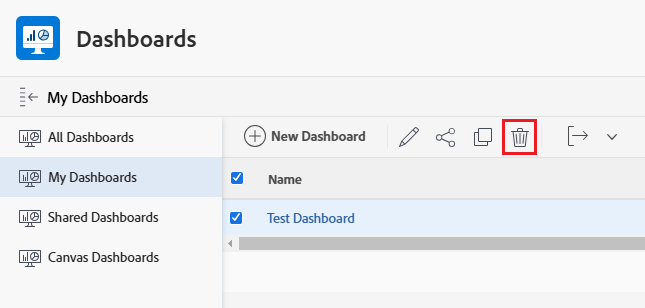

# ダッシュボードの削除

<!-- Audited: 1/2025 -->

ダッシュボードを使用しなくなった場合は、Adobe Workfront から削除できます。

## アクセス要件

+++ 展開すると、この記事の機能のアクセス要件が表示されます。 

<table style="table-layout:auto"> 
 <col> 
 <col> 
 <tbody> 
  <tr> 
   <td role="rowheader">Adobe Workfront パッケージ</td> 
   <td> 
任意
 </td> 
  </tr> 
  <tr> 
   <td role="rowheader">Adobe Workfront プラン</td> 
   <td> 
      
標準

      
プラン

   </td> 
  </tr> 
  <tr> 
   <td role="rowheader">アクセスレベル設定</td> 
   <td> 
レポート、ダッシュボードおよびカレンダーへのアクセスを編集する
</td> 
  </tr>  
  <tr> 
   <td role="rowheader">オブジェクト権限</td> 
   <td> 
ダッシュボードに対する権限の管理
</td> 
  </tr> 
 </tbody> 
</table>

この表の情報について詳しくは、[Workfront ドキュメントのアクセス要件](/help/quicksilver/administration-and-setup/add-users/access-levels-and-object-permissions/access-level-requirements-in-documentation.md)を参照してください。

+++

## アクションメニューからのダッシュボードの削除

ダッシュボードを削除する場合は、アクションメニューを使用して削除できます。

外部ページが埋め込まれたダッシュボードの削除について詳しくは、[ダッシュボードエリアからのダッシュボードの削除](#delete-a-dashboard-from-the-dashboards-area)を参照してください。

ダッシュボードを削除するには、次の操作を実行します。

1. 編集するダッシュボードに移動します。
1. 「**ダッシュボードのアクション**」をクリックして、「**削除**」をクリックします。

   

1. ダッシュボードの削除を確定するには、「**はい、削除します**」をクリックします。
ダッシュボードが Workfront から削除されます。

## ダッシュボードエリアからのダッシュボードの削除 {#delete-a-dashboard-from-the-dashboards-area}

複数のダッシュボードを削除する場合は、ダッシュボードエリアからダッシュボードを削除できます。これは、外部ページを含むダッシュボードを削除する唯一の方法でもあります。

複数のダッシュボードを削除するには、次の操作を実行します。

1. Adobe Workfront の右上隅にある&#x200B;**[!UICONTROL メインメニュー]**&#x200B;アイコン 、または左上隅の&#x200B;**[!UICONTROL メインメニュー]**&#x200B;アイコン  （利用可能な場合）をクリックし、「**[!UICONTROL ダッシュボード]**」を選択します。
1. 削除するリストの各ダッシュボードを選択し、**削除** をクリックします。

   

1. ダッシュボードの削除を確定するには、「**はい、削除します**」をクリックします。
ダッシュボードが Workfront から削除されます。
