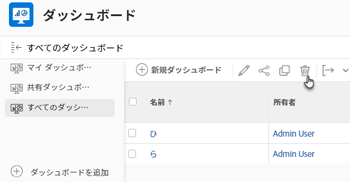

# ダッシュボードの削除

ダッシュボードを使用しなくなった場合は、Adobe Workfront から削除できます。

## アクセス要件

以下が必要です。

<table style="table-layout:auto"> 
 <col> 
 <col> 
 <tbody> 
  <tr> 
   <td role="rowheader"><strong>Adobe Workfront プラン*</strong></td> 
   <td> 
任意
 </td> 
  </tr> 
  <tr> 
   <td role="rowheader"><strong>Adobe Workfront ライセンス*</strong></td> 
   <td> 
プラン 
 </td> 
  </tr> 
  <tr> 
   <td role="rowheader"><strong>アクセスレベル設定*</strong></td> 
   <td> 
レポート、ダッシュボードおよびカレンダーへのアクセスを編集する
 
メモ：まだアクセス権がない場合は、アクセスレベルに追加の制限が設定されていないかどうか Workfront 管理者にお問い合わせください。Workfront 管理者がアクセスレベルを変更する方法について詳しくは、<a href="../../../administration-and-setup/add-users/configure-and-grant-access/create-modify-access-levels.md" class="MCXref xref">カスタムアクセスレベルの作成または変更</a>を参照してください。
 </td> 
  </tr> 
  <tr> 
   <td role="rowheader"><strong>オブジェクト権限</strong></td> 
   <td> 
ダッシュボードに対する権限の管理
 
追加のアクセス権のリクエストについて詳しくは、<a href="../../../workfront-basics/grant-and-request-access-to-objects/request-access.md" class="MCXref xref">オブジェクトへのアクセス権のリクエスト</a>を参照してください。
 </td> 
  </tr> 
 </tbody> 
</table>

&#42;保有するプラン、ライセンスタイプ、アクセス権を確認するには、Workfront 管理者に問い合わせてください。

## アクションメニューからのダッシュボードの削除

ダッシュボードを削除する場合は、アクションメニューを使用して削除できます。

外部ページが埋め込まれたダッシュボードの削除について詳しくは、[ダッシュボードエリアからのダッシュボードの削除](#delete-a-dashboard-from-the-dashboards-area)を参照してください。

ダッシュボードを削除するには、次の操作を実行します。

1. 編集するダッシュボードに移動します。
1. 「**ダッシュボードのアクション**」をクリックして、「**削除**」をクリックします。

   

1. ダッシュボードの削除を確定するには、「**はい、削除します**」をクリックします。
ダッシュボードが Workfront から削除されます。

## ダッシュボードエリアからのダッシュボードの削除 {#delete-a-dashboard-from-the-dashboards-area}

複数のダッシュボードを削除する場合は、ダッシュボードエリアからダッシュボードを削除できます。これは、外部ページを含むダッシュボードを削除する唯一の方法でもあります。

複数のダッシュボードを削除するには、次の操作を実行します。

1. Workfront の右上隅にある&#x200B;**メインメニュー**&#x200B;アイコン  をクリックして、「**ダッシュボード**」をクリックします。
1. 削除するリスト内の各ダッシュボードを選択し、**削除**  をクリックします。

   

1. ダッシュボードの削除を確定するには、「**はい、削除します**」をクリックします。
ダッシュボードが Workfront から削除されます。
