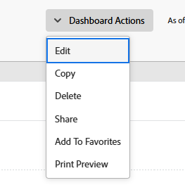

# ダッシュボードの編集

<!-- Audited: 1/2025 -->

ダッシュボードの目的は、情報にすばやくアクセスできるようにすることです。Adobe Workfront では、次の項目をダッシュボードに入力できます。

* レポート

  レポートの作成について詳しくは、[カスタムレポートの作成](../../../reports-and-dashboards/reports/creating-and-managing-reports/create-custom-report.md)を参照してください。

* 外部ページ

  外部ページの作成について詳しくは、[ダッシュボードへの外部 web ページの埋め込み](../../../reports-and-dashboards/dashboards/creating-and-managing-dashboards/embed-external-web-page-dashboard.md)を参照してください。

これらのアイテムを作成してダッシュボードに追加した後は、ダッシュボードを編集して、さらにアイテムを追加したり、既存のアイテムを削除したり、ダッシュボードの情報を編集したりできます。

ダッシュボードに変更を加えると、そのダッシュボードにアクセスできるすべてのユーザーに影響が及びます。

ダッシュボードをユーザーと共有すると、すべてのレポートと外部ページも同じユーザーと共有されます。

## アクセス要件

+++ 展開すると、この記事の機能のアクセス要件が表示されます。

以下が必要です。

<table style="table-layout:auto"> 
 <col> 
 <col> 
 <tbody> 
  <tr> 
   <td role="rowheader"><strong>Adobe Workfront プラン</strong></td> 
   <td> 
任意
 </td> 
  </tr> 
  <tr> 
   <td role="rowheader"><strong>Adobe Workfront プラン</strong></td> 
   <td> 
      
新規：

         <ul>
         <li>
標準
</li>
         </ul>
      
現在：

         <ul>
         <li>
プラン
</li>
         </ul>
   </td> 
  </tr> 
  <tr> 
   <td role="rowheader"><strong>アクセスレベル設定</strong></td> 
   <td> 
レポート、ダッシュボードおよびカレンダーへのアクセスを編集する
</td> 
  </tr> 
  <tr> 
   <td role="rowheader"><strong>オブジェクト権限</strong></td> 
   <td> 
ダッシュボードに対する権限の管理
</td> 
  </tr> 
 </tbody> 
</table>

詳しくは、[Workfront ドキュメントのアクセス要件](/help/quicksilver/administration-and-setup/add-users/access-levels-and-object-permissions/access-level-requirements-in-documentation.md)を参照してください。

+++

## 前提条件

ダッシュボードを編集するには、まずダッシュボードを作成する必要があります。

ダッシュボードの作成について詳しくは、[ダッシュボードの作成](../../../reports-and-dashboards/dashboards/creating-and-managing-dashboards/create-dashboard.md)を参照してください。

## ダッシュボードの編集

1. 編集するダッシュボードに移動します。
1. 「**ダッシュボードの操作**」をクリックしたあと、「**編集**」をクリックします。

   

   >[!TIP]
   >
   >ダッシュボードを削除する方法については、[ダッシュボードの削除](../../../reports-and-dashboards/dashboards/creating-and-managing-dashboards/delete-dashboard.md)を参照してください。

1. 次のフィールドの編集を検討してください。

   * **名前**：ダッシュボードの名前を編集します。
   * **説明**：ダッシュボードの説明を指定します。

1. [**利用可能な報告書とカレンダー**] セクションで、検索バーに報告書、カレンダー、または外部ページの名前を入力し始め、レイアウト ウィンドウで、右側に報告書、カレンダー、または外部ページをドラッグ アンド ドロップします。

   >[!NOTE]
   >
   >項目を検索すると、最近作成された 2,000 個のレポートから検索結果が返されます。Unicode 文字を含んだレポート名は、検索結果には含まれません。ベストプラクティスとしては、Workfront でオブジェクトに名前を付ける際に、名前を別のソースからコピー＆ペーストするのではなく手入力することで、Unicode 文字が含まれないようにします。

1. （オプション）目的のレイアウトに対応するラジオボタンをクリックして、ダッシュボードの新しいレイアウトを選択します。
1. （オプション）既存のレポートの名前にポインタを合わせ、ごみ箱アイコンをクリックして、レポートをダッシュボードから削除します。
1. （オプション）レポートの名前をクリックし、ドラッグして、レイアウトパネルの目的の場所にドロップすることで、ダッシュボード上のレポートの順序を変更します。
1. （オプション）「**外部ページを追加**」をクリックして、ダッシュボードに外部ページを追加します。\
   または\
   ダッシュボードで既存の外部ページを見つけ、その上にポインタを合わせ、**編集**&#x200B;アイコンをクリックして、外部ページを編集します。\
   ダッシュボードでの外部ページの追加または編集について詳しくは、[ダッシュボードへの外部 web ページの埋め込み](../../../reports-and-dashboards/dashboards/creating-and-managing-dashboards/embed-external-web-page-dashboard.md)を参照してください。

1. 「**保存して閉じる**」をクリックします。
