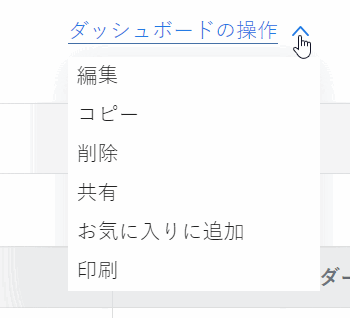

# ダッシュボードの編集

ダッシュボードの目的は、情報にすばやくアクセスできるようにすることです。Adobe Workfront では、次の項目をダッシュボードに入力できます。

* レポート

  レポートの作成について詳しくは、[カスタムレポートの作成](../../../reports-and-dashboards/reports/creating-and-managing-reports/create-custom-report.md)を参照してください。

* カレンダー

  カレンダーの作成について詳しくは、 [カレンダー：記事のインデックス](../../../reports-and-dashboards/reports/calendars/calendars.md).

* 外部ページ

  外部ページの作成について詳しくは、[ダッシュボードへの外部 web ページの埋め込み](../../../reports-and-dashboards/dashboards/creating-and-managing-dashboards/embed-external-web-page-dashboard.md)を参照してください。

これらのアイテムを作成してダッシュボードに追加した後は、ダッシュボードを編集して、さらにアイテムを追加したり、既存のアイテムを削除したり、ダッシュボードの情報を編集したりできます。

ダッシュボードに変更を加えると、そのダッシュボードにアクセスできるすべてのユーザーに影響が及びます。

ダッシュボードをユーザーと共有すると、すべてのレポート、カレンダーおよび外部ページも同じユーザーと共有されます。

## アクセス要件

以下が必要です。

<table style="table-layout:auto"> 
 <col> 
 <col> 
 <tbody> 
  <tr> 
   <td role="rowheader"><strong>Adobe Workfront プラン*</strong></td> 
   <td> 
任意
 </td> 
  </tr> 
  <tr> 
   <td role="rowheader"><strong>Adobe Workfront ライセンス*</strong></td> 
   <td> 
プラン 
 </td> 
  </tr> 
  <tr> 
   <td role="rowheader"><strong>アクセスレベル設定*</strong></td> 
   <td> 
レポート、ダッシュボードおよびカレンダーへのアクセスを編集する
 
メモ：まだアクセス権がない場合は、アクセスレベルに追加の制限が設定されていないかどうか Workfront 管理者にお問い合わせください。Workfront 管理者がアクセスレベルを変更する方法について詳しくは、<a href="../../../administration-and-setup/add-users/configure-and-grant-access/create-modify-access-levels.md" class="MCXref xref">カスタムアクセスレベルの作成または変更</a>を参照してください。
 </td> 
  </tr> 
  <tr> 
   <td role="rowheader"><strong>オブジェクト権限</strong></td> 
   <td> 
ダッシュボードに対する権限の管理
 
追加のアクセス権のリクエストについて詳しくは、<a href="../../../workfront-basics/grant-and-request-access-to-objects/request-access.md" class="MCXref xref">オブジェクトへのアクセス権のリクエスト</a>を参照してください。
 </td> 
  </tr> 
 </tbody> 
</table>

&#42;保有するプラン、ライセンスタイプ、アクセス権を確認するには、Workfront 管理者に問い合わせてください。

## 前提条件

ダッシュボードを編集するには、まずダッシュボードを作成する必要があります。

ダッシュボードの作成について詳しくは、[ダッシュボードの作成](../../../reports-and-dashboards/dashboards/creating-and-managing-dashboards/create-dashboard.md)を参照してください。

## ダッシュボードの編集

1. 編集するダッシュボードに移動します。
1. 「**ダッシュボードの操作**」をクリックしたあと、「**編集**」をクリックします。

   

   >[!TIP]
   >
   >ダッシュボードを削除する方法については、[ダッシュボードの削除](../../../reports-and-dashboards/dashboards/creating-and-managing-dashboards/delete-dashboard.md)を参照してください。

1. 次のフィールドの編集を検討してください。

   * **名前**：ダッシュボードの名前を編集します。
   * **説明**：ダッシュボードの説明を指定します。

1. 「**利用可能なレポートおよびカレンダー**」セクションで、「**名前またはタイプで検索...**」フィールドにレポート、カレンダーまたは外部ページの名前を入力していきます。そのあと、目的のレポートまたはカレンダーを右側のレイアウトパネルにドラッグ＆ドロップします。

   >[!NOTE]
   >
   >項目を検索すると、最近作成された 2,000 個のレポートから検索結果が返されます。Unicode 文字を含んだレポート名は、検索結果には含まれません。ベストプラクティスとしては、Workfront でオブジェクトに名前を付ける際に、名前を別のソースからコピー＆ペーストするのではなく手入力することで、Unicode 文字が含まれないようにします。

1. （オプション）目的のレイアウトに対応するラジオボタンをクリックして、ダッシュボードの新しいレイアウトを選択します。
1. （オプション）既存のレポートの名前にポインタを合わせ、ごみ箱アイコンをクリックして、レポートをダッシュボードから削除します。
1. （オプション）レポートの名前をクリックし、ドラッグして、レイアウトパネルの目的の場所にドロップすることで、ダッシュボード上のレポートの順序を変更します。
1. （オプション）「**外部ページを追加**」をクリックして、ダッシュボードに外部ページを追加します。\
   または\
   ダッシュボードで既存の外部ページを見つけ、その上にポインタを合わせ、**編集**&#x200B;アイコンをクリックして、外部ページを編集します。\
   ダッシュボードでの外部ページの追加または編集について詳しくは、[ダッシュボードへの外部 web ページの埋め込み](../../../reports-and-dashboards/dashboards/creating-and-managing-dashboards/embed-external-web-page-dashboard.md)を参照してください。

1. 「**保存して閉じる**」をクリックします。
