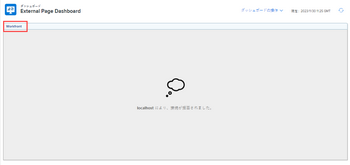
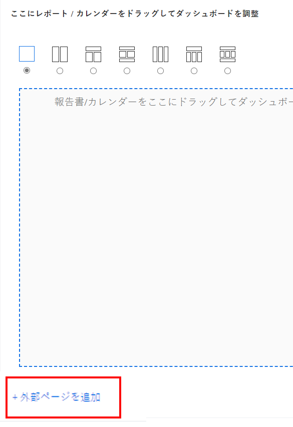
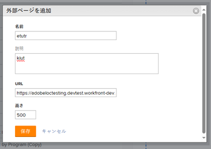
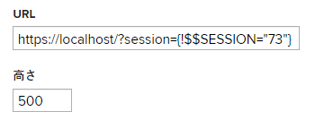
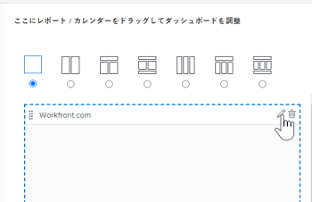
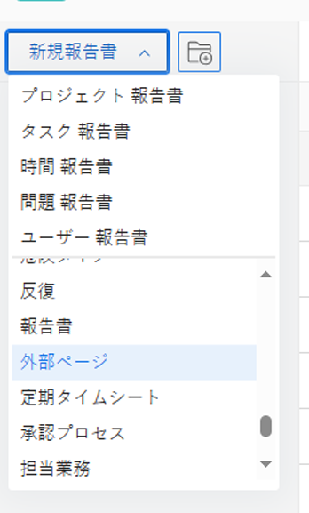
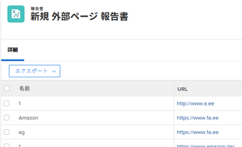

# 外部 Web ページをダッシュボードに埋め込む

外部 Web ページをダッシュボードに埋め込んで、Adobe Workfront内の他のシステムや他のWorkfrontページから関連情報にアクセスできるようにします。

例えば、URL を通じて定期的にアクセスされるプロジェクト情報を含む Web ベースのドキュメントリポジトリ、Wiki、その他のコンテンツ管理システムが組織にある場合、ダッシュボードに外部ページを作成することで、その情報をWorkfrontに表示できます。

>[!IMPORTANT]
>
>セキュリティ上の理由から、一部の Web サイトでは Web ページを iframe として埋め込むことができません。 ダッシュボードに埋め込む Web ページで許可されていない場合、そのページはダッシュボードに表示されません。 ただし、ダッシュボードの名前をクリックして、外部ページにアクセスすることはできます。\
>\
>所有している Web サイトに埋め込みを許可するには、Web 管理者に問い合わせて、 **X-Frame-Options** 設定。 詳しくは、 [X-Frame-Options](https://developer.mozilla.org/en-US/docs/Web/HTTP/Headers/X-Frame-Options).

>[!IMPORTANT]
>
>ダッシュボードの埋め込み外部ページは、サポートされなくなりました。 特に、次のWorkfront.com サブドメインはサポートされなくなりました。
>
>* /dashboards&#x200B;
>* /dashboard/:&#x200B;ID
>* /portfolio/:ID/content-dashboard__:dashboardID &#x200B;
>* /program/:ID/content-dashboard__:dashboardID &#x200B;
>* /project/:ID/content-dashboard__:dashboardID &#x200B;
>* /task/:ID/content-dashboard__:dashboardID &#x200B;
>* /template/:ID/content-dashboard__:dashboardID &#x200B;
>* /templatetask/:ID/content-dashboard__:dashboardID &#x200B;
>* /resourcemanagement/:ID/content-dashboard__:dashboardID &#x200B;
>* /team/:ID/content-dashboard__:dashboardID &#x200B;
>* /iteration/:ID/content-dashboard__:dashboardID &#x200B;
>* /requests/:ID/content-dashboard__:dashboardID &#x200B;
>* /group/:ID/content-dashboard__:dashboardID &#x200B;
>* /billingrecord/:ID/content-dashboard__:dashboardID

## アクセス要件

以下が必要です。

<table style="table-layout:auto"> 
 <col> 
 <col> 
 <tbody> 
  <tr> 
   <td role="rowheader"><strong>Adobe Workfront plan*</strong></td> 
   <td> 
任意
 </td> 
  </tr> 
  <tr> 
   <td role="rowheader"><strong>Adobe Workfront license*</strong></td> 
   <td> 
計画 
 </td> 
  </tr> 
  <tr> 
   <td role="rowheader"><strong>アクセスレベル設定*</strong></td> 
   <td> 
レポート、ダッシュボード、カレンダーへのアクセスを編集
 
注意：まだアクセス権がない場合は、Workfront管理者に、アクセスレベルに追加の制限を設定しているかどうかを問い合わせてください。 Workfront管理者がアクセスレベルを変更する方法について詳しくは、 <a href="../../../administration-and-setup/add-users/configure-and-grant-access/create-modify-access-levels.md" class="MCXref xref">カスタムアクセスレベルの作成または変更</a>.
 </td> 
  </tr> 
  <tr> 
   <td role="rowheader"><strong>オブジェクト権限</strong></td> 
   <td> 
ダッシュボードに対する権限の管理
 
追加のアクセス権のリクエストについて詳しくは、 <a href="../../../workfront-basics/grant-and-request-access-to-objects/request-access.md" class="MCXref xref">オブジェクトへのアクセスのリクエスト </a>.
 </td> 
  </tr> 
 </tbody> 
</table>

&#42;保有しているプラン、ライセンスの種類、アクセス権を確認するには、Workfront管理者に問い合わせてください。

## 前提条件

外部ページを埋め込む前に、ダッシュボードを作成する必要があります。

ダッシュボードの作成について詳しくは、 [ダッシュボードの作成](../../../reports-and-dashboards/dashboards/creating-and-managing-dashboards/create-dashboard.md).

## ダッシュボードに外部ページを埋め込む

>[!IMPORTANT]
>
>不要になった外部ページは、ダッシュボードから削除できます。 ただし、外部ページをWorkfrontで作成した後に削除することはできません。 API を使用してのみ、外部ページを削除できます。 詳しくは、 [ダッシュボードからの外部ページの削除](../../../reports-and-dashboards/dashboards/creating-and-managing-dashboards/remove-external-page-from-dashboard.md).

1. Workfrontに表示するページの URL を探し、アドレスバーにある URL をコピーします。

   >[!NOTE]
   >
   >URL をWorkfrontオブジェクトに共有している場合、一部の URL は時間の経過と共に期限切れになることに注意してください。 例えば、ドキュメント URL は、開封後に期限切れになります。 これはセキュリティ対策として設定され、設計上、静的でない URL と見なされ、共有しないでください。

1. 次をクリック： **メインメニュー** アイコン を選択し、「 **ダッシュボード**.

1. 既存のダッシュボードを編集するには、Web サイトページを埋め込むダッシュボードを選択し、 **ダッシュボードのアクション**&#x200B;を選択し、 **編集** を選択します。\
   または\
   新しいダッシュボードを作成するには、 **新しいダッシュボード**.\
   ダッシュボードの作成について詳しくは、 [ダッシュボードの作成](../../../reports-and-dashboards/dashboards/creating-and-managing-dashboards/create-dashboard.md).

1. クリック **外部ページを追加**.

   

1. を指定します。 **名前** 外部ページ用。
1. を指定します。 **説明**.
1. 前にコピーした URL を、 **URL** フィールドに入力します。\
   次のタイプの URL を指定できます。

   * Web ページへの https（暗号化）URL です。\
      URL を含む https（暗号化）ページのみが読み込まれます。\
      

   * 特定の Web サイトのセッション情報を含むテンプレート URL。\
      例： *https://localhost/?session={!$$SESSION}*
外部ページを表示するには、指定した Web サイトにログインする必要があります。\
      Workfrontから SessionID を取得する方法について詳しくは、 [API の基本](../../../wf-api/general/api-basics.md).\
      セキュリティ上の理由から、Workfront管理者は、外部ページでのセッション情報の使用を許可しない方法で、システム環境設定を設定できます。 この場合、外部ページはダッシュボードに読み込まれません。\
      システムのセキュリティ設定の詳細については、 [システムセキュリティの環境設定の構成](../../../administration-and-setup/manage-workfront/security/configure-security-preferences.md).\
      

1. 「**保存**」をクリックします。\
   ページがダッシュボードに自動的に追加されます。 将来のダッシュボードが作成される場合は、外部ページを追加できます。 外部ページは、使用可能なレポート内で見つかります。

   <!--
   <MadCap:conditionalText data-mc-conditions="QuicksilverOrClassic.Draft mode">
   (NOTE: Alina: *** This is linked to: Creating Dashboards, and Editing Dashboards.)
   </MadCap:conditionalText>
   -->

## ダッシュボードでの外部ページの更新

ダッシュボードで使用する外部ページの情報を更新するには：

1. 次をクリック： **メインメニュー** アイコン を選択し、「 **ダッシュボード**.
1. 更新するダッシュボードを選択し、「 」をクリックします。 **編集** .

   

1. 画面の右側で、更新する外部ページを探し、 **編集** アイコン\
   

1. 内 **外部ページを編集** ダイアログで、変更するフィールドを更新し、 **保存**.
1. （オプション） **削除** アイコン  をクリックして、ダッシュボードから外部ページを削除します。 詳しくは、 [ダッシュボードからの外部ページの削除](../../../reports-and-dashboards/dashboards/creating-and-managing-dashboards/remove-external-page-from-dashboard.md).
1. 左下隅で、 **保存して閉じる**.

## レポートでの外部ページの表示

外部ページレポートのWorkfrontで、すべての外部ページを表示できます。

1. 次に移動： **メインメニュー** アイコン  > **レポート**.
1. クリック **新しいレポート** > 選択 **外部ページ**.

   

1. （オプション）レポートの「表示」タブ、「フィルター」タブまたは「グループ化」タブを更新します。

   詳しくは、 [カスタムレポートの作成](../../../reports-and-dashboards/reports/creating-and-managing-reports/create-custom-report.md).

1. クリック **保存して閉じる**.

   新しいレポートで、システム内の外部ページに関連付けられている名前と URL を表示できます。

   
