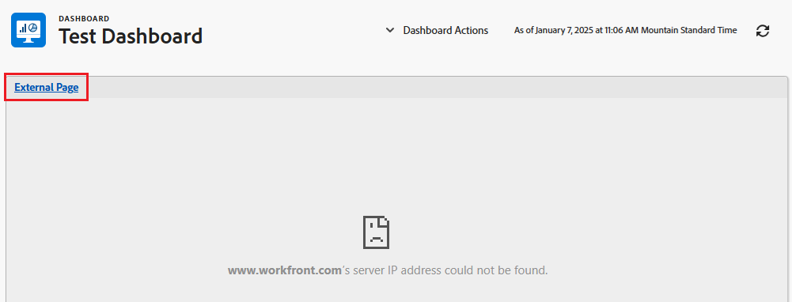

# 外部 Web ページをダッシュボードに埋め込む

<!--Audited: 01/2024-->

外部 Web ページをダッシュボードに埋め込んで、他のシステムやAdobe Workfront内から関連情報にアクセスできます。

例えば、URL を通じて定期的にアクセスされるプロジェクト情報を含む Web ベースのドキュメントリポジトリ、Wiki、その他のコンテンツ管理システムが組織にある場合、ダッシュボードに外部ページを作成することで、その情報をWorkfrontに表示できます。

>[!IMPORTANT]
>
>* セキュリティ上の理由から、一部の Web サイトでは Web ページを iframe として埋め込むことができません。 ダッシュボードに埋め込む Web ページで許可されていない場合、そのページはダッシュボードに表示されません。 ただし、ダッシュボードの名前をクリックして、外部ページにアクセスすることはできます。\
>\
>所有している Web サイトに埋め込みを許可するには、Web 管理者に問い合わせて、 **X-Frame-Options** 設定。 詳しくは、 [X-Frame-Options](https://developer.mozilla.org/en-US/docs/Web/HTTP/Headers/X-Frame-Options).
>
>
>* ダッシュボードの埋め込み外部ページは、サポートされなくなりました。 既存のダッシュボードは自動的に変更されてこれらの外部ページが削除されることはありませんが、そのような参照を含むダッシュボードに対する変更は、参照が削除または変更されるまで保存できません。
> 特に、次のWorkfront.comサブドメインはサポートされなくなりました。
>
>     * /dashboards&#x200B;
>     * /dashboard/:&#x200B;ID
>     * /portfolio/:ID/content-dashboard__:dashboardID &#x200B;
>     * /program/:ID/content-dashboard__:dashboardID &#x200B;
>     * /project/:ID/content-dashboard__:dashboardID &#x200B;
>     * /task/:ID/content-dashboard__:dashboardID &#x200B;
>     * /template/:ID/content-dashboard__:dashboardID &#x200B;
>     * /templatetask/:ID/content-dashboard__:dashboardID &#x200B;
>     * /resourcemanagement/:ID/
>     * content-dashboard__:dashboardID &#x200B;
>     * /team/:ID/content-dashboard__:dashboardID &#x200B;
>     * /iteration/:ID/content-dashboard__:dashboardID &#x200B;
>     * /requests/:ID/content-dashboard__:dashboardID &#x200B;
>     * /group/:ID/content-dashboard__:dashboardID &#x200B;
>     * /billingrecord/:ID/content-dashboard__:dashboardID
>
>別の解決策として、ダッシュボードにリストレポートを含めることを検討します。詳しくは、 [ダッシュボードへのレポートの追加](/help/quicksilver/reports-and-dashboards/dashboards/creating-and-managing-dashboards/add-report-dashboard.md)

## アクセス要件

以下が必要です。

<table style="table-layout:auto"> 
 <col> 
 <col> 
 <tbody> 
  <tr> 
   <td role="rowheader"><strong>Adobe Workfrontプラン</strong></td> 
   <td> 
任意
 </td> 
  </tr> 
  <tr> 
   <td role="rowheader"><strong>Adobe Workfront license*</strong></td> 
   <td> 
現在：プラン 

   または
   
新規：標準 
 </td> 
  </tr> 
  <tr> 
   <td role="rowheader"><strong>アクセスレベル設定</strong></td> 
   <td> 
レポート、ダッシュボード、カレンダーへのアクセスを編集
 </td> 
  </tr> 
  <tr> 
   <td role="rowheader"><strong>オブジェクトの権限</strong></td> 
   <td> </td> 
  </tr> 
 </tbody> 
</table>

*保有するプラン、ライセンスの種類、アクセス権を確認するには、Workfront管理者にお問い合わせください。 詳しくは、 [Workfrontドキュメントのアクセス要件](/help/quicksilver/administration-and-setup/add-users/access-levels-and-object-permissions/access-level-requirements-in-documentation.md).

## 前提条件

外部ページを埋め込む前に、ダッシュボードを作成する必要があります。

ダッシュボードの作成について詳しくは、 [ダッシュボードの作成](../../../reports-and-dashboards/dashboards/creating-and-managing-dashboards/create-dashboard.md).

## ダッシュボードに外部ページを埋め込む

>[!IMPORTANT]
>
>不要になった外部ページは、ダッシュボードから削除できます。 ただし、外部ページをWorkfrontで作成した後に削除することはできません。 API を使用してのみ、外部ページを削除できます。 詳しくは、 [ダッシュボードからの外部ページの削除](../../../reports-and-dashboards/dashboards/creating-and-managing-dashboards/remove-external-page-from-dashboard.md).

1. Workfrontに表示するページの URL を探し、アドレスバーにある URL をコピーします。

   >[!NOTE]
   >
   >URL をWorkfrontオブジェクトに共有している場合、一部の URL は時間の経過と共に期限切れになることに注意してください。 例えば、ドキュメント URL は、開封後に期限切れになります。 これはセキュリティ対策として設定され、設計上、静的でない URL と見なされ、共有しないでください。

{{step1-to-dashboards}}

1. 既存のダッシュボードを編集するには、Web サイトページを埋め込むダッシュボードを選択し、 **ダッシュボードのアクション**&#x200B;を選択し、次に **編集**
または\
   新しいダッシュボードを作成するには、 **新しいダッシュボード**.\
   ダッシュボードの作成について詳しくは、 [ダッシュボードの作成](../../../reports-and-dashboards/dashboards/creating-and-managing-dashboards/create-dashboard.md).

1. クリック **外部ページを追加** の下に **レイアウト/レポートを追加/カレンダーを追加を選択します。** 領域。

   

   The **外部ページを追加** ボックスが表示されます。

1. 外部ページに関する次の情報を指定します。

   * **名前**：ダッシュボードに名前を追加します。
   * **説明**：ダッシュボードに関する詳細情報を追加して、そこに含まれる情報を識別します。 説明は、保存後に、表示するアクセス権を持つすべてのユーザーに対してダッシュボードに表示されます。
   * **URL**：コピーした URL をこのフィールドに貼り付けます。

     次のタイプの URL を指定できます。

      * Web ページへの https（暗号化）URL です。\
        URL を含む https（暗号化）ページのみが読み込まれます。\
        

      * 特定の Web サイトのセッション情報を含むテンプレート URL。\
        例： *https://localhost/?session={!$$SESSION}*
外部ページを表示するには、指定した Web サイトにログインする必要があります。\
        Workfrontから SessionID を取得する方法について詳しくは、 [API の基本](../../../wf-api/general/api-basics.md).\
        セキュリティ上の理由から、Workfront管理者は、外部ページでのセッション情報の使用を許可しない方法で、システム環境設定を設定できます。 この場合、外部ページはダッシュボードに読み込まれません。\
        システムのセキュリティ設定の詳細については、 [システムセキュリティの環境設定の構成](../../../administration-and-setup/manage-workfront/security/configure-security-preferences.md).\
        

   * **高さ**:0 より大きい数値を入力して、ダッシュボードで外部ページが占有するスペースを定義します。 デフォルトの高さは 500 です。

1. 「**保存**」をクリックします。

   ページがダッシュボードに自動的に追加されます。

   追加のダッシュボードを作成する場合、この外部ページを見つけて他のダッシュボードに追加できます。 ダッシュボードの作成または編集時に、使用可能なレポートとカレンダーのリストに既存のすべての外部ページが表示されます。

   <!--
    *** This is linked to: Creating Dashboards, and Editing Dashboards.
   -->

## ダッシュボードでの外部ページの更新

ダッシュボードで使用する外部ページの情報を更新するには：

{{step1-to-dashboards}}

1. 更新するダッシュボードの名前をクリックして開き、「 」をクリックします。 **ダッシュボードのアクション**&#x200B;を、 **編集**.

   The **ダッシュボードの詳細** ボックスが開きます。

1. Adobe Analytics の **レイアウト/レポートを追加/カレンダーを追加を選択します。** 領域 **ダッシュボードの詳細** 」ボックスで、更新する外部ページを探し、その上にマウスポインターを置いて、 **編集** アイコン。\
   

1. Adobe Analytics の **外部ページを編集** ボックスで、変更するフィールドを更新し、 **保存**.
1. （オプション） **削除** アイコン  をクリックして、ダッシュボードから外部ページを削除します。 詳しくは、 [ダッシュボードからの外部ページの削除](../../../reports-and-dashboards/dashboards/creating-and-managing-dashboards/remove-external-page-from-dashboard.md).
1. 「**保存して閉じる**」をクリックします。

## レポートでの外部ページの表示

外部ページレポートのWorkfrontで、すべての外部ページを表示できます。

{{step1-to-reports}}

1. クリック **新しいレポート** > 選択 **外部ページ**.

   

1. （オプション）レポートの「表示」タブ、「フィルター」タブまたは「グループ化」タブを更新します。

   詳しくは、 [カスタムレポートの作成](../../../reports-and-dashboards/reports/creating-and-managing-reports/create-custom-report.md).

1. クリック **保存して閉じる**.

   新しいレポートで、システム内の外部ページに関連付けられている名前と URL を表示できます。

   
