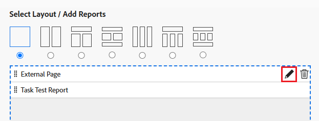

# ダッシュボードへの外部 web ページの埋め込み

<!--Audited: 01/2025-->

外部 we ページをダッシュボードに埋め込んで、他のシステムまたは Adobe Workfront 内から関連情報にアクセスできるようにします。

例えば、URL を通じて定期的にアクセスされるプロジェクト情報を含む web ベースのドキュメントリポジトリ、wiki、その他のコンテンツ管理システムが組織にある場合、ダッシュボードに外部ページを作成することで、その情報を Workfront に表示できます。

>[!IMPORTANT]
>
>* セキュリティ上の理由から、一部の web サイトでは web ページを iframe として埋め込むことができません。ダッシュボードに埋め込む web ページでこれが許可されていない場合、そのページはダッシュボードに表示されません。ただし、ダッシュボードの名前をクリックして、外部ページにアクセスすることはできます。\
>\
>所有している web サイトに埋め込みを許可するには、web 管理者と協力して、**X-Frame-Options** 設定を調整します。詳しくは、[X-Frame-Options](https://developer.mozilla.org/en-US/docs/Web/HTTP/Headers/X-Frame-Options) を参照してください。
>
>
>* ダッシュボードページは、ダッシュボードの埋め込み外部ページとしてサポートされなくなりました。既存のダッシュボードは、これらの外部ページを削除するために自動的に変更されることはありませんが、そのような参照を含むダッシュボードに対する変更は、参照が削除または変更されるまで保存できません。
>  &#x200B;> 特に、次の workfront.com サブドメインはサポートされなくなりました。
>
>     * /ダッシュボード
>     * /dashboard/:ID&#x200B;
>     * /portfolio/:ID/content-dashboard__:dashboardID&#x200B;
>     * /program/:ID/content-dashboard__:dashboardID&#x200B;
>     * /project/:ID/content-dashboard__:dashboardID&#x200B;
>     * /task/:ID/content-dashboard__:dashboardID&#x200B;
>     * /template/:ID/content-dashboard__:dashboardID&#x200B;
>     * /templatetask/:ID/content-dashboard__:dashboardID&#x200B;
>     * /resourcemanagement/:ID/
>     * content-dashboard__:dashboardID&#x200B;
>     * /team/:ID/content-dashboard__:dashboardID&#x200B;
>     * /iteration/:ID/content-dashboard__:dashboardID&#x200B;
>     * /requests/:ID/content-dashboard__:dashboardID&#x200B;
>     * /group/:ID/content-dashboard__:dashboardID&#x200B;
>     * /billingrecord/:ID/content-dashboard__:dashboardID
>
>[ダッシュボードへのレポートの追加](/help/quicksilver/reports-and-dashboards/dashboards/creating-and-managing-dashboards/add-report-dashboard.md)で説明されているように、別の解決策として、ダッシュボードにリストレポートを含めることを検討します。

## アクセス要件

+++ 展開すると、この記事の機能のアクセス要件が表示されます。

<table style="table-layout:auto"> 
 <col> 
 <col> 
 <tbody> 
  <tr> 
   <td role="rowheader">Adobe Workfront パッケージ</td> 
   <td> 
任意
 </td> 
  </tr> 
  <tr> 
   <td role="rowheader">Adobe Workfront プラン</td> 
   <td> 
      
標準

      
プラン

   </td> 
  </tr> 
  <tr> 
   <td role="rowheader">アクセスレベル設定</td> 
   <td> 
レポート、ダッシュボードおよびカレンダーへのアクセスを編集する
</td> 
  </tr>  
  <tr> 
   <td role="rowheader">オブジェクト権限</td> 
   <td> 
ダッシュボードへのアクセスの編集
 </td> 
  </tr> 
 </tbody> 
</table>

この表の情報について詳しくは、[Workfront ドキュメントのアクセス要件](/help/quicksilver/administration-and-setup/add-users/access-levels-and-object-permissions/access-level-requirements-in-documentation.md)を参照してください。

+++

## 前提条件

外部ページを埋め込む前に、ダッシュボードを作成する必要があります。

ダッシュボードの作成について詳しくは、[ダッシュボードの作成](../../../reports-and-dashboards/dashboards/creating-and-managing-dashboards/create-dashboard.md)を参照してください。

## ダッシュボードに外部ページを埋め込む

>[!IMPORTANT]
>
>不要になった外部ページは、ダッシュボードから削除できます。ただし、外部ページを Workfront で作成した後に削除することはできません。外部ページの削除は、API を使用してのみ可能です。詳しくは、[ダッシュボードからの外部ページを削除](../../../reports-and-dashboards/dashboards/creating-and-managing-dashboards/remove-external-page-from-dashboard.md)を参照してください。

1. Workfront に表示するページの URL を探し、アドレスバーにある URL をコピーします。

   >[!NOTE]
   >
   >URL を Workfront オブジェクトに共有している場合、一部の URL は時間の経過とともに期限切れになることに注意してください。例えば、ドキュメント URL は、開封後に期限切れになります。これはセキュリティ対策として設定され、設計上、静的でない URL と見なされ、共有すべきではありません。

{{step1-to-dashboards}}

1. 既存のダッシュボードを編集するには、web サイトページを埋め込むダッシュボードを選択して、「**ダッシュボードの操作**」をクリックし、メニューから「**編集**」を選択するか、
\
   新しいダッシュボードを作成するには、「**新規ダッシュボード**」をクリックします。\
   ダッシュボードの作成について詳しくは、[ダッシュボードを作成](../../../reports-and-dashboards/dashboards/creating-and-managing-dashboards/create-dashboard.md)を参照してください。

1. **レイアウト／レポートを追加／カレンダーを追加**&#x200B;のエリアの下にある&#x200B;**外部ページを追加**&#x200B;をクリックします。

   

   **外部ページを追加**&#x200B;ボックスが表示されます。

1. 外部ページに関する次の情報を指定します。

   * **名前**：ダッシュボードに名前を追加します。
   * **説明**：ダッシュボードに関する詳細情報を追加して、含まれる情報を識別します。説明は、保存後に、表示するアクセス権を持つすべてのユーザーに対してダッシュボードに表示されます。
   * **URL**：このフィールドにコピーした URL を貼り付けます。

     次のタイプの URL を指定できます。

      * Web ページへの https（暗号化）URL。\
        https（暗号化）ページのみが URL により読み込まれます。\
        

      * 特定の web サイトのセッション情報を含むテンプレート URL。\
        例：*https://localhost/?session={!$$SESSION}*
外部ページを表示するには、指定した web サイトにログインする必要があります。\
        Workfront から SessionID を取得する方法について詳しくは、[API の基本](../../../wf-api/general/api-basics.md)を参照してください。\
        セキュリティ上の理由から、Workfront 管理者は、外部ページでのセッション情報の使用を許可しない方法で、システム環境設定を指定できます。この場合、外部ページはダッシュボードに読み込まれません。\
        システムのセキュリティ環境設定について詳しくは、[システムのセキュリティ環境設定を指定](../../../administration-and-setup/manage-workfront/security/configure-security-preferences.md)を参照してください。\
        

     >[!WARNING]
     >
     >SessionID の使用は安全ではないので、お勧めしません。
     >

   * **高さ**：0 より大きい数値を入力して、外部ページがダッシュボードで占有するスペースを定義します。デフォルトの高さは 500 です。

1. 「**保存**」をクリックします。

   ページがダッシュボードに自動的に追加されます。

   追加のダッシュボードを作成する場合、この外部ページを見つけて他のダッシュボードに追加できます。ダッシュボードの作成または編集時に、利用可能なレポートとカレンダーのリストに既存のすべての外部ページが表示されます。

   <!--
    *** This is linked to: Creating Dashboards, and Editing Dashboards.
   -->

## ダッシュボードで外部ページを更新する

ダッシュボードで使用する外部ページの情報を更新するには、以下の手順を実行します。

{{step1-to-dashboards}}

1. 更新するダッシュボードの名前をクリックして開き、「**ダッシュボードの操作**」をクリックして、「**編集**」を選択します。

   「**ダッシュボード詳細**」ボックスが開きます。

1. **ダッシュボードの詳細** ボックスの **レイアウトを選択/レポートを追加** 領域で、更新する外部ページを見つけて、その上にカーソルを置いて **編集** アイコンをクリックします。\
   

1. 「**外部ページの編集**」ボックスで、変更するフィールドを更新し、「**保存**」をクリックします。
1. （任意） **削除** アイコン  をクリックして、ダッシュボードから外部ページを削除します。 詳しくは、[ダッシュボードからの外部ページを削除](../../../reports-and-dashboards/dashboards/creating-and-managing-dashboards/remove-external-page-from-dashboard.md)を参照してください。
1. 「**保存して閉じる**」をクリックします。

## レポートで外部ページを表示する

外部ページレポートの Workfront で、すべての外部ページを表示できます。

{{step1-to-reports}}

1. **新規レポート** をクリックし、**外部セクション** を選択します。

   

1. （オプション）レポートの「表示」タブ、「フィルター」タブ、または「グループ化」タブを更新します。

   詳しくは、[カスタムレポートを作成](../../../reports-and-dashboards/reports/creating-and-managing-reports/create-custom-report.md)を参照してください。

1. 「**保存して閉じる**」をクリックします。

   新しいレポートには、システム内の外部ページに関連付けられた名前と URL を表示できます。

