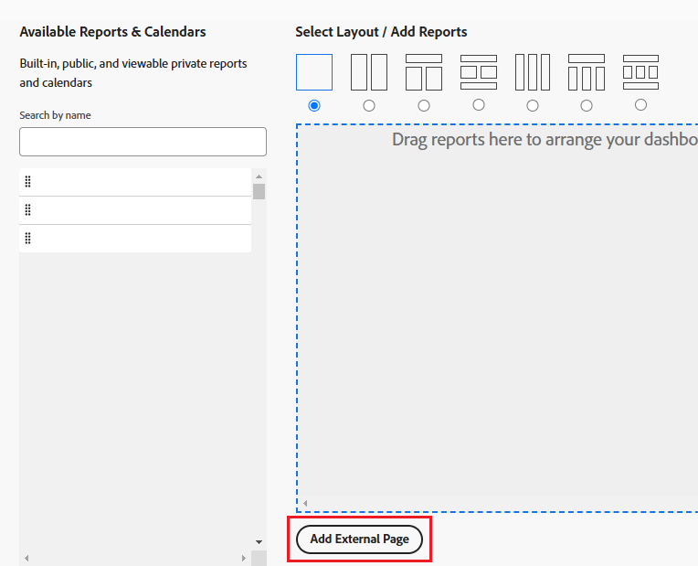

# リクエストキューをダッシュボードに埋め込む

新しいリクエストキューをダッシュボードに埋め込むと、リクエスト領域に移動することなく、リクエストキューに直接アクセスして、ユーザーに直接アクセスできます。 

例えば、ヘルプデスクキューや PTO リクエストキューなど、組織全体で定期的にアクセスする必要があるリクエストキューがある場合は、ダッシュボードに直接リクエストキューを挿入すると便利です。 この設定手順は、ダッシュボードで外部ページを作成する手順と似ています。

まず、リクエストキューへの URL を取得する必要があります。 次に、外部ページを追加して、URL をダッシュボードに埋め込むことができます。

## アクセス要件

この記事の手順を実行するには、次のアクセス権が必要です。

<table style="table-layout:auto"> 
 <col> 
 <col> 
 <tbody> 
  <tr> 
   <td role="rowheader"><strong>Adobe Workfront plan*</strong></td> 
   <td> 
任意
 </td> 
  </tr> 
  <tr> 
   <td role="rowheader"><strong>Adobe Workfront license*</strong></td> 
   <td> 
計画 
 </td> 
  </tr> 
  <tr> 
   <td role="rowheader"><strong>アクセスレベル設定*</strong></td> 
   <td> 
レポート、ダッシュボード、カレンダーへのアクセスを編集
 
注意：まだアクセス権がない場合は、Workfront管理者に、アクセスレベルに追加の制限を設定しているかどうかを問い合わせてください。 Workfront管理者がアクセスレベルを変更する方法について詳しくは、 <a href="../../../administration-and-setup/add-users/configure-and-grant-access/create-modify-access-levels.md" class="MCXref xref">カスタムアクセスレベルの作成または変更</a>.
 </td> 
  </tr> 
  <tr> 
   <td role="rowheader"><strong>オブジェクト権限</strong></td> 
   <td> 
ダッシュボードに対する権限の管理
 
追加のアクセス権のリクエストについて詳しくは、 <a href="../../../workfront-basics/grant-and-request-access-to-objects/request-access.md" class="MCXref xref">オブジェクトへのアクセスのリクエスト </a>.
 </td> 
  </tr> 
 </tbody> 
</table>

&#42;保有しているプラン、ライセンスの種類、アクセス権を確認するには、Workfront管理者に問い合わせてください。

## 前提条件

ダッシュボードにリクエストキューを埋め込むには、次の両方を作成する必要があります。

* **ダッシュボード**:ダッシュボードの作成について詳しくは、 [ダッシュボードの作成](../../../reports-and-dashboards/dashboards/creating-and-managing-dashboards/create-dashboard.md).
* **リクエストキュー**:リクエストキューの作成について詳しくは、 [リクエストキューの作成](../../../manage-work/requests/create-and-manage-request-queues/create-request-queue.md)

## リクエストキューの URL を取得する {#obtain-the-url-of-the-request-queue}

リクエストキューの URL は、ダッシュボードからユーザーにアクセスしたときにユーザーに表示するリクエストキューの部分に応じて、複数の方法で取得できます。

* [リクエストタイプを変更できる特定のキュートピックへのリンクを取得します](#obtain-a-link-to-a-specific-queue-topic-with-ability-to-change-the-request-type)
* [リクエストキューへのリンクの取得とリクエストタイプの変更機能](#obtain-a-link-to-a-request-queue-and-ability-to-change-the-request-type)
* [リクエストタイプを変更できないリクエストキューへのリンクを取得する](#obtain-a-link-to-a-request-queue-with-no-ability-to-change-the-request-type)

### リクエストタイプを変更できる特定のキュートピックへのリンクを取得します {#obtain-a-link-to-a-specific-queue-topic-with-ability-to-change-the-request-type}

特定のキュートピックへのリンクを他のユーザーと共有すると、リクエストフォームが、リクエストの送信に使用する必要のある正確なキュートピックで開きます。 これは、特定のリクエストキューのリクエストをログに記録する際に、どのキュートピックを選択するかが不明な場合に役立ちます。

ユーザーは、リクエストのタイプを変更したり、必要に応じて別のトピックを選択したりできます。 リクエスト領域のナビゲーションも表示されます。

1. 次をクリック： **メインメニュー** > **リクエスト** > **新しいリクエスト**.
1. 特定のキューを共有する場合は、ダッシュボードで共有するキューに到達するまで、トピックグループとキュートピックの選択を続けます。 リクエストの送信について詳しくは、 [Adobe Workfront要求の作成と送信](../../../manage-work/requests/create-requests/create-submit-requests.md).

   >[!TIP]
   >
   >トピックグループとキュートピックの選択はオプションです。

1. クリック **共有パス** をクリックします。

   これにより、リクエストキューまたはキュートピックへのリンクが、画面に表示された状態でコピーされます。 ユーザーは、「リクエストの種類」、または使用可能な任意のトピックグループやキュートピックを更新できます。

   

### リクエストキューへのリンクの取得とリクエストタイプの変更機能 {#obtain-a-link-to-a-request-queue-and-ability-to-change-the-request-type}

リクエストタイプへのリンクを共有する場合、そのユーザーに対してリクエストタイプが選択されます。 これは、ユーザーが同じリクエストタイプに対して複数のトピックグループまたはキュートピックから選択する必要がある場合に役立ちます。 ユーザーはリクエストのタイプを変更し、別のリクエストのタイプを選択できます。 リクエスト領域のナビゲーションも表示されます。

1. リクエストキューとして指定されたプロジェクトに移動します。

   プロジェクトからのリクエストキューの作成について詳しくは、 [リクエストキューの作成](../../../manage-work/requests/create-and-manage-request-queues/create-request-queue.md).

1. に移動します。 **キューの詳細**.
1. 検索したコードを **直接アクセス URL** フィールドに入力します。

   コードは次のようになります。

   `https://<yourdomain>.my.workfront.com/requests/new?activeTab=tab-new-helpRequest&projectID=50062d6f000849c95ab3513c0e84a51e&path=`

   これは、選択したプロジェクトに関連付けられたリクエストキューへのリンクです。 「リクエストタイプ」が事前に選択されています。

   ユーザーは、必要なトピックグループやキュートピックを選択したり、別のリクエストタイプを選択したりできます。

   

### リクエストタイプを変更できないリクエストキューへのリンクを取得する {#obtain-a-link-to-a-request-queue-with-no-ability-to-change-the-request-type}

事前に選択されたリクエストタイプへのリンクを共有した場合、そのリクエストタイプはユーザーに対して選択され、変更できません（淡色表示になります）。 ユーザーは、必要なトピックグループまたはトピックをキューで選択できます。 これは、ユーザーが他のリクエストタイプを表示および選択しないようにする場合に役立ちます。 「リクエスト」領域のナビゲーションは表示されません。

1. リクエストキューとして指定されたプロジェクトに移動します。

   プロジェクトからのリクエストキューの作成について詳しくは、 [リクエストキューの作成](../../../manage-work/requests/create-and-manage-request-queues/create-request-queue.md).

1. に移動します。 **キューの詳細**.
1. 検索したコードを **埋め込みコード** フィールドに入力します。

   コードは次のようになります。

   `<iframe src="https://<yourdomain>my.workfront.com/requests/newRequestEmbedded?projectID=612518c7000404462d3bc9a0bc09fa71" frameborder="0" width="500" height="600"></iframe>`

1. コードを編集して、以下の情報のみを保持します。

   `https://<yourdomain>.my.workfront.com/requests/newRequestEmbedded?projectID=612518c7000404462d3bc9a0bc09fa71`

   >[!TIP]
   >
   >次の項目を追加できます： `<samp>iframe </samp>` タグを使用して、Workfront以外のアプリケーションにコードを埋め込むこともできます。

   これは、選択したプロジェクトに関連付けられたリクエストキューへのリンクです。 リクエストタイプは事前に選択されており、変更できません。

   ユーザーは、選択したリクエストタイプに必要な任意のトピックグループまたはキュートピックを選択できます。 別のリクエストタイプは選択できません。

   

## リクエストキューをダッシュボードに埋め込む

リクエストキューへのリンク、またはリクエストキューの下にネストされたキュートピックへのリンクをダッシュボードに埋め込むと、ユーザーはリクエストの入力に直接アクセスできます。

1. リクエストキューの URL を取得するには、 [リクエストキューの URL を取得する](#obtain-the-url-of-the-request-queue) 」の節を参照してください。
1. 次をクリック： **メインメニュー** > **ダッシュボード** > **新しいダッシュボード**.
1. タイプ a **名前** 」をクリックします。 必須フィールドです。
1. クリック **外部ページを追加**.

   

1. 内 **外部ページを追加** 「 」ボックスで、次のフィールドを編集します。

   * **名前**:ダッシュボードに表示するリクエストキューの名前を入力します。 必須フィールドです。

   * **説明**:この外部ページに表示される説明を入力します。 これは必須フィールドではなく、レポート目的でのみ重要です。 ダッシュボードには表示されません。
   * **URL**:手順 1 で説明した方法の 1 つを使用して取得した URL を貼り付けます。

      <!--   
     <MadCap:conditionalText data-mc-conditions="QuicksilverOrClassic.Draft mode">   
     <MadCap:conditionalText data-mc-conditions="">   
     (NOTE: ensure this stays accurate)   
     </MadCap:conditionalText>   
     </MadCap:conditionalText>   
     -->

   * **高さ**:外部ページの高さを入力します。 これは、リクエストキューを含む外部ページがダッシュボード上で占める容量を定義します。 これは必須フィールドで、デフォルト値は 500 です。

1. 「**保存**」をクリックします。
1. クリック **保存して閉じる**. 

   リクエストキューは、ダッシュボードに別個のダッシュボードコンポーネントとして表示されます。

   

1. （オプション）「 **ダッシュボードのアクション**&#x200B;を、 **編集** を使用して、同じダッシュボードにレポート、カレンダーまたはその他の外部ページを追加します。\
   ダッシュボードへのコンポーネントの追加について詳しくは、 [ダッシュボードの作成](../../../reports-and-dashboards/dashboards/creating-and-managing-dashboards/create-dashboard.md).

 

 

<!--

(NOTE: drafted - old information)

-->

<!--
<ol data-mc-conditions="QuicksilverOrClassic.Draft mode">
<li value="1"> 
Click the <strong>Main Menu</strong> > Requests >&nbsp;<strong>New Request</strong>. 
 </li>
<li class="preview" value="2" data-mc-conditions="QuicksilverOrClassic.Quicksilver"> 
Continue entering the request.&nbsp;For information about submitting requests, see <a href="../../../manage-work/requests/create-requests/create-submit-requests.md" class="MCXref xref">Create and submit Adobe Workfront requests</a>. 
 </li>
<li value="3"> 
Select the <strong>Request Type</strong> for the queue you would like added to the dashboard.
 </li>
<li value="4"> 
(Optional) Select a Queue Topic and a Topic Group. Depending on how the project manager set up the request queue, the names of these fields are different in each Workfront instance.
 </li>
<li class="preview" value="5" data-mc-conditions="QuicksilverOrClassic.Quicksilver"> 
Click <strong>Share path</strong> to obtain a shared link from the request queue you want to embed on a dashboard.
 
For information about sharing a request queue, see <a href="../../../manage-work/requests/create-requests/share-link-to-request-queue.md" class="MCXref xref">Share a link to a request queue</a>
 </li>
<li value="6"> 
For example, enter a URL similar to one of the following: 
 </li>
</ol>
-->
