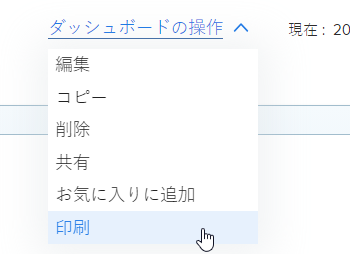

# ダッシュボードのエクスポート

Web ブラウザーで使用できる印刷オプションを使用して、ダッシュボードを .pdf ファイルに書き出すことができます。

>[!NOTE]
>
>Web ページからコンテンツを印刷する場合、コンテンツの形式設定に影響が及ぶ可能性があります。\
>例えば、ダッシュボード内のレポートのヘッダーがレポートリスト内の行から切り取られる場合があります。

## アクセス要件

以下が必要です。

<table style="table-layout:auto"> 
 <col> 
 <col> 
 <tbody> 
  <tr> 
   <td role="rowheader"><strong>Adobe Workfront プラン*</strong></td> 
   <td> 
任意
 </td> 
  </tr> 
  <tr> 
   <td role="rowheader"><strong>Adobe Workfront ライセンス*</strong></td> 
   <td> 
ワークまたはそれ以上
 </td> 
  </tr> 
  <tr> 
   <td role="rowheader"><strong>アクセスレベル設定*</strong></td> 
   <td> 
レポート、ダッシュボードおよびカレンダーの表示アクセス権
 
メモ：まだアクセス権がない場合は、アクセスレベルに追加の制限が設定されていないかどうか Workfront 管理者にお問い合わせください。Workfront 管理者がアクセスレベルを変更する方法について詳しくは、<a href="../../../administration-and-setup/add-users/configure-and-grant-access/create-modify-access-levels.md" class="MCXref xref">カスタムアクセスレベルの作成または変更</a>を参照してください。
 </td> 
  </tr> 
  <tr> 
   <td role="rowheader"><strong>オブジェクト権限</strong></td> 
   <td> 
ダッシュボードの表示権限
 
追加のアクセス権のリクエストについて詳しくは、<a href="../../../workfront-basics/grant-and-request-access-to-objects/request-access.md" class="MCXref xref">オブジェクトへのアクセス権のリクエスト</a>を参照してください。
 </td> 
  </tr> 
 </tbody> 
</table>

&#42;保有するプラン、ライセンスタイプ、アクセス権を確認するには、Workfront 管理者に問い合わせてください。

## 前提条件

ダッシュボードを書き出す前に、ダッシュボードを作成する必要があります。

ダッシュボードの作成については、[ダッシュボードの作成](../../../reports-and-dashboards/dashboards/creating-and-managing-dashboards/create-dashboard.md)を参照してください。

## ダッシュボードを .pdf ファイルに書き出します。

1. 書き出すダッシュボードに移動します。
1. 「**ダッシュボードの操作**」をクリックし、「**印刷**」を選択します。

   

   印刷ダイアログが開きます。

1. Web ブラウザーに応じて、適切な印刷オプションを選択し、.pdf を完成させます。ファイルの書き出し：

   <table style="table-layout:auto"> 
    <col> 
    <col> 
    <thead> 
     <tr> 
      <th>Web ブラウザー</th> 
      <th>印刷ダイアログの選択項目</th> 
     </tr> 
    </thead> 
    <tbody> 
     <tr> 
      <td>Google Chrome</td> 
      <td> 
       <ol> 
        <li value="1">「<strong>宛先</strong>」フィールドで、「<strong>PDF として保存</strong>」を選択して、変更したい他の印刷オプションを変更します。</li> 
        <li value="2">「<strong>保存</strong>」をクリックします。</li> 
        <li value="3">（オプション）「<strong>ファイル名</strong>」を編集して、ファイルの新規フォルダーの宛先を選択します。</li> 
        <li value="4">「<strong>保存</strong>」をクリックして、.pdf ファイルをハードドライブに保存します。  </li> 
       </ol> </td> 
     </tr> 
     <tr> 
      <td>Internet Explorer、Microsoft Edge、Mozilla Firefox</td> 
      <td> 
メモ：Internet Explorer バージョン 11 を使用している場合、サードパーティのプラグインをインストールしないと、PDF への印刷機能を使用できない場合があります。
 
       <ol> 
        <li value="1">「<strong>プリンター</strong>」または「<strong>プリンターの選択</strong>」フィールドで、「<strong>Microsoft Print to PDF</strong>」を選択し、変更する他の印刷オプションを変更します。</li> 
        <li value="2">「<strong>印刷</strong>」をクリックします。</li> 
        <li value="3"><strong>ファイル名</strong>を入力します。</li> 
        <li value="4">（オプション）ファイルの新規フォルダーの宛先を選択します。</li> 
        <li value="5">「<strong>保存</strong>」をクリックします。</li> 
       </ol> </td> 
     </tr> 
     <tr> 
      <td>Safari</td> 
      <td> 
       <ol> 
        <li value="1">左下隅でドロップダウン矢印をクリックし、「<strong>PDF として保存</strong>」を選択します。</li> 
        <li value="2"><strong>ファイル名</strong>を入力します。</li> 
        <li value="3">（オプション）ファイルの新規フォルダーの宛先の選択など、変更する他の印刷オプションを変更します。</li> 
        <li value="4">「<strong>保存</strong>」をクリックします。</li> 
       </ol> </td> 
     </tr> 
    </tbody> 
   </table>
