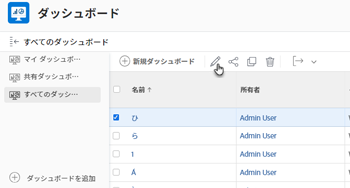
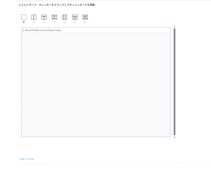

# ダッシュボードからの外部ページの削除

不要になった外部ページは、ダッシュボードから削除できます。

ただし、外部ページをAdobe Workfrontで作成した後に削除することはできません。 API を使用してのみ、外部ページを削除できます。 Workfront API について詳しくは、 [API の基本](../../../wf-api/general/api-basics.md). 外部ページの作成について詳しくは、 [外部 Web ページをダッシュボードに埋め込む](../../../reports-and-dashboards/dashboards/creating-and-managing-dashboards/embed-external-web-page-dashboard.md).

## アクセス要件

この記事の手順を実行するには、次のアクセス権が必要です。

<table style="table-layout:auto"> 
 <col> 
 <col> 
 <tbody> 
  <tr> 
   <td role="rowheader"><strong>Adobe Workfront plan*</strong></td> 
   <td> 
任意
 </td> 
  </tr> 
  <tr> 
   <td role="rowheader"><strong>Adobe Workfront license*</strong></td> 
   <td> 
計画 
 </td> 
  </tr> 
  <tr> 
   <td role="rowheader"><strong>アクセスレベル設定*</strong></td> 
   <td> 
レポート、ダッシュボード、カレンダーへのアクセスを編集
 
注意：まだアクセス権がない場合は、Workfront管理者に、アクセスレベルに追加の制限を設定しているかどうかを問い合わせてください。 Workfront管理者がアクセスレベルを変更する方法について詳しくは、 <a href="../../../administration-and-setup/add-users/configure-and-grant-access/create-modify-access-levels.md" class="MCXref xref">カスタムアクセスレベルの作成または変更</a>.
 </td> 
  </tr> 
  <tr> 
   <td role="rowheader"><strong>オブジェクト権限</strong></td> 
   <td> 
ダッシュボードに対する権限の管理
 
追加のアクセス権のリクエストについて詳しくは、 <a href="../../../workfront-basics/grant-and-request-access-to-objects/request-access.md" class="MCXref xref">オブジェクトへのアクセスのリクエスト </a>.
 </td> 
  </tr> 
 </tbody> 
</table>

&#42;保有しているプラン、ライセンスの種類、アクセス権を確認するには、Workfront管理者に問い合わせてください。

## ダッシュボードからの外部ページの削除

1. 次をクリック： **メインメニュー** アイコン を選択し、「 **ダッシュボード**.
1. 外部ページを削除するダッシュボードを選択し、「 」をクリックします。 **編集** .

   

1. 画面の右側で、削除する外部ページを見つけ、 **削除** アイコン .

   

1. クリック **保存して閉じる** をクリックします。

   これにより、選択したダッシュボードから外部ページが削除されます。 外部ページはWorkfrontに残り、レポートからアクセスできます。 詳しくは、この記事の「レポートでの外部ページの表示」の節を参照してください [外部 Web ページをダッシュボードに埋め込む](../../../reports-and-dashboards/dashboards/creating-and-managing-dashboards/embed-external-web-page-dashboard.md).
