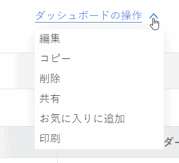

# ダッシュボードの共有

Adobe Workfront 管理者は、ユーザーにアクセスレベルを割り当てるときに、ダッシュボードを表示または編集するためのアクセス権を付与します。イシューに対するアクセス権の付与について詳しくは、[レポート、ダッシュボード、カレンダーへのアクセス権の付与](../../../administration-and-setup/add-users/configure-and-grant-access/grant-access-reports-dashboards-calendars.md)を参照してください。

ユーザーに付与するアクセスレベルに加えて、自分が共有を行うアクセス権を持っている特定のダッシュボードを、表示、管理する権限をユーザーに付与することもできます。アクセスレベルと権限について詳しくは、[アクセスレベルと権限の連携方法](../../../administration-and-setup/add-users/access-levels-and-object-permissions/how-access-levels-permissions-work-together.md)を参照してください。

権限は、Workfrontの 1 つの項目に固有で、その項目に対して実行できるアクションを定義します。

>[!NOTE]
>
>Workfront 管理者は、システム内のすべてのユーザーに対して、システム内のアイテムに対する権限の追加や削除を、それらのアイテムの所有者にならなくても行うことができます。

## アクセス要件

オブジェクトを共有するには、次の条件を満たしている必要があります。

<table style="table-layout:auto"> 
 <col> 
 <col> 
 <tbody> 
  <tr> 
   <td role="rowheader"><strong>Adobe Workfront プラン*</strong></td> 
   <td> 
任意 
 </td> 
  </tr> 
  <tr> 
   <td role="rowheader"><strong>Adobe Workfront ライセンス*</strong></td> 
   <td> 
レビュー以上
 </td> 
  </tr> 
  <tr> 
   <td role="rowheader"><strong>アクセスレベル設定*</strong></td> 
   <td> 
レポート、ダッシュボード、カレンダーへのアクセス権またはそれ以上の権限を表示
 
メモ：まだアクセス権がない場合は、アクセスレベルに追加の制限が設定されていないかどうか Workfront 管理者にお問い合わせください。Workfront 管理者がアクセスレベルを変更する方法について詳しくは、<a href="../../../administration-and-setup/add-users/configure-and-grant-access/create-modify-access-levels.md" class="MCXref xref">カスタムアクセスレベルの作成または変更</a>を参照してください。
 </td> 
  </tr> 
  <tr> 
   <td role="rowheader"><strong>オブジェクト権限</strong></td> 
   <td> 
ダッシュボードの表示権限またはそれ以上の権限
 
追加のアクセス権のリクエストについて詳しくは、<a href="../../../workfront-basics/grant-and-request-access-to-objects/request-access.md" class="MCXref xref">オブジェクトへのアクセス権のリクエスト</a>を参照してください。
 </td> 
  </tr> 
 </tbody> 
</table>

&#42;保有するプラン、ライセンスタイプ、アクセス権を確認するには、Workfront 管理者に問い合わせてください。

## 前提条件

ダッシュボードを共有するには、まずダッシュボードを作成する必要があります。

ダッシュボードの作成について詳しくは、[ダッシュボードを作成](../../../reports-and-dashboards/dashboards/creating-and-managing-dashboards/create-dashboard.md)を参照してください。

## ダッシュボードの共有に関する考慮事項

以下の考慮事項に加えて、[レポート、ダッシュボード、カレンダーを共有](../../../workfront-basics/grant-and-request-access-to-objects/permissions-reports-dashboards-calendars.md)も参照してください。

* ダッシュボードの作成者には、デフォルトでタスクの管理権限が付与されています。

* 作成したダッシュボードを、他の個人、チーム、グループ、担当業務や会社と共有できます。他の人が作成し、自分と共有したダッシュボードを共有することもできます。
* また、システム全体で表示できるようにすることで、組織全体と共有することもできます。
* 個々のダッシュボードを共有することも、リストから複数のダッシュボードを共有することもできます。
* ダッシュボードを共有する場合、ユーザーは、デフォルトで、ダッシュボード上のすべてのレポートオブジェクトに対して表示権限を継承します。

  Workfront のオブジェクトの階層について詳しくは、[Adobe Workfront のオブジェクトについて](../../../workfront-basics/navigate-workfront/workfront-navigation/understand-objects.md)を参照してください。

  継承された権限の表示について詳しくは、[オブジェクトの継承された権限を表示](../../../workfront-basics/grant-and-request-access-to-objects/view-inherited-permissions-on-objects.md)を参照してください。

## ダッシュボードの共有

リストから 1 つのダッシュボードを共有することも、複数のダッシュボードを共有することも同じです。

1. ダッシュボードのリストに移動し、1 つまたは複数のダッシュボードを選択して、**共有**  をクリックします。

   または

   1 つのダッシュボードの名前をクリックして、**ダッシュボードのアクション／****共有**&#x200B;をクリックします。

   

1. 「**ユーザー、チーム、役割、グループ、会社を追加…**」フィールドに、ダッシュボードを共有するユーザー、チーム、役割、グループ、または会社の名前の入力を開始し、ドロップダウンリストに表示されたら名前をクリックします。
1. （オプション）システム内のすべてのユーザーがダッシュボードにアクセスできるようにするには、共有ダイアログボックスの右上隅にある「**設定**」アイコンをクリックし、「**システム全体で表示できるようにします**」を選択します。

1. 「**保存**」をクリックします。
