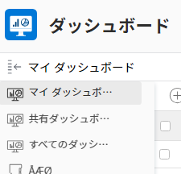
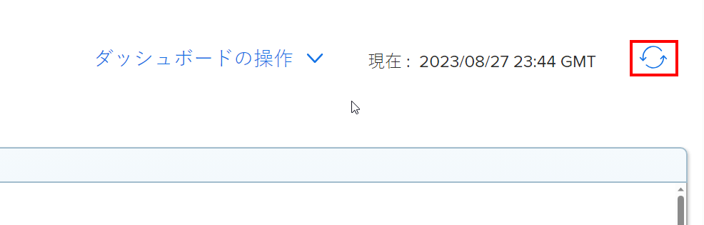

# ダッシュボードの概要

ダッシュボードの目的は、情報にすばやくアクセスできるようにすることです。 レポートで情報を収集し、ダッシュボードに配置して、情報にアクセスしやすくすることができます。

## アクセス要件

以下が必要です。

<table style="table-layout:auto">
 <col> 
 </col> 
 <col> 
 </col> 
 <tbody> 
  <tr> 
   <td> 
<strong>Adobe Workfront plan*</strong>
 </td> 
   <td>任意</td> 
  </tr> 
  <tr> 
   <td> 
<strong>Adobe Workfront license*</strong>
 </td> 
   <td> 
レビュー以上
 </td> 
  </tr> 
  <tr> 
   <td><strong>アクセスレベル*</strong> </td> 
   <td> 
レポート、ダッシュボード、カレンダーへのアクセス権を表示またはそれ以上に設定する
 
注意：まだアクセス権がない場合は、Workfront管理者に、アクセスレベルに追加の制限を設定しているかどうかを問い合わせてください。 Workfront管理者がアクセスレベルを変更する方法について詳しくは、 <a href="../../../administration-and-setup/add-users/configure-and-grant-access/create-modify-access-levels.md" class="MCXref xref">カスタムアクセスレベルの作成または変更</a>.
 </td> 
  </tr> 
  <tr> 
   <td> 
<strong>オブジェクト権限</strong> 
 </td> 
   <td> 
ダッシュボードに対する権限の表示
 
追加のアクセス権のリクエストについて詳しくは、 <a href="../../../workfront-basics/grant-and-request-access-to-objects/request-access.md" class="MCXref xref">オブジェクトへのアクセスのリクエスト </a>. ダッシュボードの権限について詳しくは、 <a href="../../../workfront-basics/grant-and-request-access-to-objects/permissions-reports-dashboards-calendars.md" class="MCXref xref">レポート、ダッシュボード、カレンダーの共有 </a>.
 </td> 
  </tr> 
 </tbody> 
</table>

&#42;保有しているプラン、ライセンスの種類、アクセス権を確認するには、Workfront管理者に問い合わせてください。

## ダッシュボードに追加できるオブジェクト

Adobe Workfrontでは、次の項目をダッシュボードに入力できます。

* レポート\
   レポートの作成について詳しくは、 [カスタムレポートの作成](../../../reports-and-dashboards/reports/creating-and-managing-reports/create-custom-report.md).

* カレンダー\
   カレンダーの作成について詳しくは、 [カレンダーレポートの概要](../../../reports-and-dashboards/reports/calendars/calendar-reports-overview.md).

* 外部ページ\
   外部ページの作成について詳しくは、 [外部 Web ページをダッシュボードに埋め込む](../../../reports-and-dashboards/dashboards/creating-and-managing-dashboards/embed-external-web-page-dashboard.md).

ダッシュボードの作成について詳しくは、 [ダッシュボードの作成](../../../reports-and-dashboards/dashboards/creating-and-managing-dashboards/create-dashboard.md).

## ダッシュボードの共有

ダッシュボードは、次の方法でユーザーと共有できます。

* 個人で共有。\
   ダッシュボードの共有について詳しくは、 [レポート、ダッシュボード、カレンダーの共有](../../../workfront-basics/grant-and-request-access-to-objects/permissions-reports-dashboards-calendars.md) および [ダッシュボードの共有](../../../reports-and-dashboards/dashboards/creating-and-managing-dashboards/share-dashboard.md).

* Workfront内の任意の領域またはオブジェクトに、カスタムセクションでダッシュボードを追加します。\
   カスタムセクションの作成について詳しくは、 [Adobe Workfrontの左側のナビゲーション](../../../workfront-basics/the-new-workfront-experience/simplified-left-navigation.md).

* ダッシュボードをレイアウトテンプレートに配置します。このテンプレートは、ユーザーと共有できます。\
   レイアウトテンプレートを使用したダッシュボードの共有について詳しくは、 [レイアウトテンプレートを使用して左のパネルをカスタマイズする](../../../administration-and-setup/customize-workfront/use-layout-templates/customize-left-panel.md).

* ユーザーと共有するためにハードコピーを印刷します。\
   ダッシュボードの印刷について詳しくは、 [ダッシュボードの印刷](../../../reports-and-dashboards/dashboards/creating-and-managing-dashboards/print-dashboard.md).

* ユーザーに電子メールで送信できるように、.pdf ファイルとして書き出します。\
   ダッシュボードを.pdf ファイルに書き出す方法について詳しくは、 [ダッシュボードのエクスポート](../../../reports-and-dashboards/dashboards/creating-and-managing-dashboards/export-dashboard.md).

ダッシュボードをユーザーと共有すると、デフォルトで、ダッシュボード上にあるすべてのレポート、カレンダーおよび外部ページも同じユーザーと共有されます。

>[!NOTE]
>
>ユーザーを削除すると、作成したすべてのダッシュボードにアクセスできなくなります。 詳しくは、 [ユーザーの削除](../../../administration-and-setup/add-users/create-and-manage-users/delete-a-user.md).

## ダッシュボードを表示

ダッシュボードは次の方法で表示できます。

* 配置先のセクションにアクセスすると、そのセクションに配置されたダッシュボードが表示されます。\
   ダッシュボードをカスタムセクションに配置する方法について詳しくは、 [Adobe Workfrontでの左ナビゲーション](../../../workfront-basics/the-new-workfront-experience/simplified-left-navigation.md).

* 見つかったら、を検索して手動でアクセスします。

## ダッシュボードへのアクセス

1. 次をクリック： **メインメニュー** を選択し、「 **ダッシュボード**.
1. 左側のサイドバーの上にマウスポインターを置いて、次のいずれかを選択します。

   * **マイダッシュボード**:作成したダッシュボードがここに表示されます。

      >[!TIP]
      >
      >アクセスレベルでレポート、ダッシュボード、カレンダーの編集アクセス権がない場合、ダッシュボードを作成できません。 この場合、マイダッシュボードリストは空です。

   * **共有ダッシュボード**:他のユーザーが作成し、自分と共有しているダッシュボードがここに表示されます。
   * **すべてのダッシュボード**:自分と他のユーザーのダッシュボードの両方が、自分と共有されている場合は、ここに表示されます。

   

1. ダッシュボードの名前をクリックして表示します。\
   ダッシュボードには、レポート、カレンダーまたは入力する外部ページに含まれる情報が表示されます。
1. （オプションおよび条件付き） **再読み込み** アイコンを使用して、ダッシュボードの情報を更新できます。\
   ダッシュボードに初めてアクセスしたときに、ダッシュボードの情報がリアルタイムで同期されます。 ブラウザーでしばらくダッシュボードを表示していた場合、ダッシュボードのレポート内の情報が古くなる可能性があります。 ダッシュボードが最後に更新された日時がこのアイコンの左側に表示されます。\
   

## ダッシュボードを削除

Workfrontからダッシュボードを削除する場合は、削除できます。

詳しくは、 [ダッシュボードの削除](../../../reports-and-dashboards/dashboards/creating-and-managing-dashboards/delete-dashboard.md).
