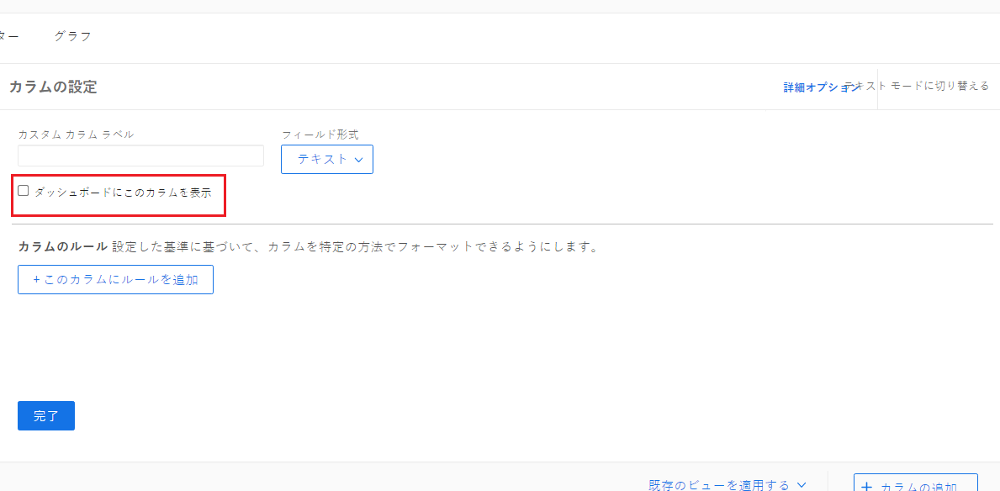
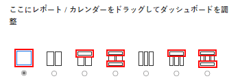
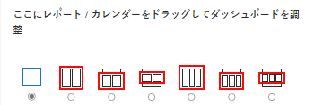

# ダッシュボードでのレポートの表示について

ダッシュボードに追加されたレポートのダッシュボードでの表示を管理できます。

ダッシュボードでのレポートのレイアウトの編集については、[ダッシュボードの作成](../../../reports-and-dashboards/dashboards/creating-and-managing-dashboards/create-dashboard.md)を参照してください。

レポートの作成時に、ダッシュボードに表示するレポート列を選択できます。レポートのすべての列を常にダッシュボードに表示する場合は、レポートの作成時に列ごとにそれを必ず指定してください。

ダッシュボードに表示するレポートの列の選択について詳しくは、[カスタムレポートの作成](../../../reports-and-dashboards/reports/creating-and-managing-reports/create-custom-report.md)を参照してください。

## ダッシュボードにレポートのすべての列を表示

ダッシュボードの全幅を占めるダッシュボード領域に対してレポートを選択した場合、デフォルトでは、レポートのすべての列がダッシュボードに表示されます。\

## ダッシュボードにレポートの最初の列のみを表示

ダッシュボードの全幅より小さいダッシュボード領域に対してレポートを選択した場合、デフォルトでは、レポートの最初の列のみがダッシュボードに表示されます。\

