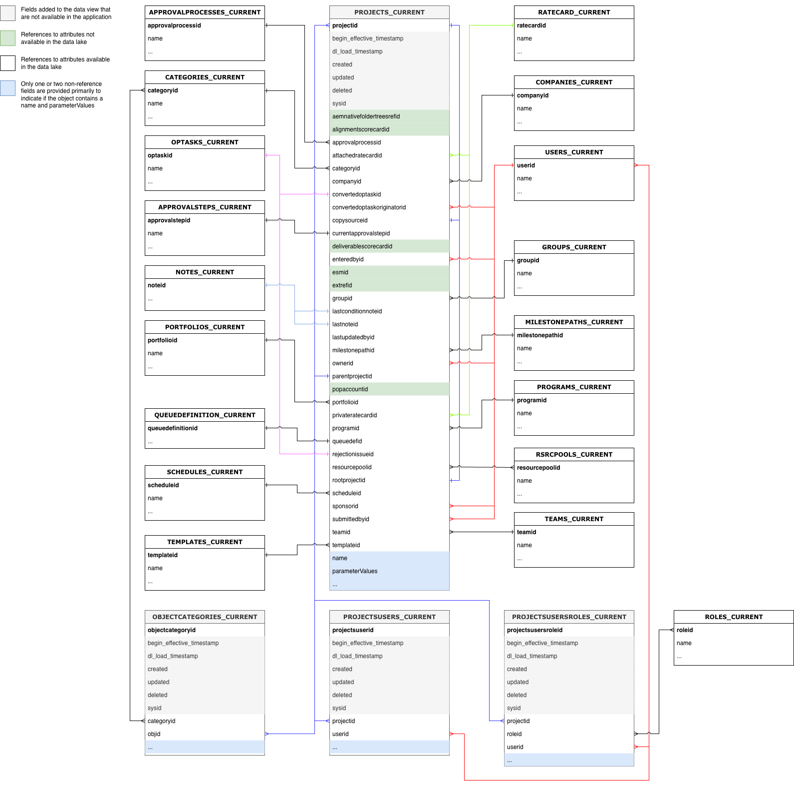

# Workfront Data Connect のデータ辞書

このページでは、Workfront Data Connectのデータの構造と内容について説明します。

>[!NOTE]
>
>Data Connectのデータは4時間ごとに更新されるため、最近の変更がすぐに反映されない場合があります。

## 表示タイプ

Data Connectには、insightを最も多く提供する方法でWorkfront データを表示するためのビューの種類がいくつかあります。

* **現在のビュー**

  現在のビューは、Workfrontでのデータの存在、すべてのオブジェクトとその現在の状態に似ています。 ただし、Workfront内よりも大幅に低い遅延でナビゲートできます。

* **イベントビュー**

  イベントビューでは、Workfront内のすべての変更レコードを追跡します。つまり、オブジェクトのステートが変更されるたびに、変更がいつ発生したか、誰が変更したか、何が変更されたかを示すレコードが作成されます。 したがって、このビューは特定の時点での比較に役立ちます。 このビューには、過去3年間のレコードのみが含まれます。

* **日別履歴ビュー**

  日次ヒストリービューでは、各イベントが発生した場合ではなく、各オブジェクトの状態を日次で示すという点で、イベントビューの省略版が提供されます。 このビューは傾向分析に役立ちます。

<!-- Custom view -->

## エンティティ関係図

Workfrontのオブジェクト（したがって、Data Connect データレイク内）は、個々の値だけでなく、他のオブジェクトとの関係によって定義されます。

以下のエンティティ関係図（ERD）は、コア Workfront オブジェクトのData Connectのオブジェクト関係の高レベルのマッピングを提供します。

>[!IMPORTANT]
>
>この図は、1つのオブジェクトを中心としており、Workfront アプリケーション全体のエンティティの包括的なリレーションシップ図を表すものではありません。 これらの図は、関係を使用して隣接するオブジェクトにデータを結合する方法の例を示すことを目的としています。

### エンティティ関係図の例

+++ 展開して図の例を表示

>[!TIP]
>
>ダイアグラムをより詳細に表示するには、画像を右クリックし、**新しいタブで画像を開く**&#x200B;を選択します。

### 割り当て

### ドキュメントとドキュメントの承認

### 時間とタイムシート

### イシュー

### プロジェクト

### タスク

### ユーザー

+++

## 日付タイプ

特定のイベントがいつ発生するかに関する情報を提供する日付オブジェクトがいくつかあります。

* `DL_LOAD_TIMESTAMP`：この日付は、データの更新が正常に完了した後に更新され、レコードの最新バージョンを提供した更新ジョブが開始されたときのタイムスタンプが含まれます。
* `CALENDAR_DATE`：この日付は、日次ヒストリービューにのみ表示されます。 日別履歴ビューには、`CALENDAR_DATE`で指定された日付ごとに、11:59 UTCでのデータの外観を記録します。
* `BEGIN_EFFECTIVE_TIMESTAMP`：この日付は、イベントと日次の履歴ビューの両方に表示され、レコードがアプリケーションの現在の値になる時間を表します。
* `END_EFFECTIVE_TIMESTAMP`：この日付は、イベントと日次の両方の履歴ビューに存在し、レコードが&#x200B;_から_&#x200B;現在の行の値を別の行の値に変更した正確な日付を記録します。 `BEGIN_EFFECTIVE_TIMESTAMP`と`END_EFFECTIVE_TIMESTAMP`でクエリ間を許可するには、新しい値がない場合でも、この値はnullになりません。 レコードがまだ有効な場合（つまり、値が変更されていない場合）、`END_EFFECTIVE_TIMESTAMP`の値は2300-01-01になります。

## Workfrontの用語の表と説明

次の表は、Workfrontのオブジェクト名（およびインターフェイスとAPIのオブジェクト名）とData Connectの同等の名前を関連付け、各オブジェクトの参照フィールドを他のWorkfront オブジェクトに含めます。

>[!NOTE]
>
>Workfront アプリケーションのデータ要求の変化をサポートするために、事前の通知なしで新しいフィールドをオブジェクトビューに追加できます。 ダウンストリームデータ受信者が追加された列を処理する準備ができていない場合は、「SELECT」クエリを使用しないでください。列の名前の変更または削除が必要な場合は、これらの変更を事前にお知らせします。

### アクセスレベル

<table>
    <thead>
        <tr>
            <th>Workfront エンティティ名</th>
            <th>インターフェイス参照</th>
            <th>API リファレンス</th>
            <th>API ラベル</th>
            <th>データレイクビュー</th>
        </tr>
      </thead>
      <tbody>
        <tr>
            <td>アクセスレベル</td>
            <td>アクセスレベル</td>
            <td>ACSLVL</td>
            <td>アクセスレベル</td>
            <td>ACCESSLEVELS_CURRENT ACCESSLEVELS_DAILY_HISTORY ACCESSLEVELS_EVENT</td>
        </tr>
      </tbody>
</table>
<table>
    <thead>
        <tr>
            <th>プライマリ/外部キー</th>
            <th>タイプ</th>
            <th>関連テーブル</th>
            <th>関連フィールド</th>
        </tr>
    </thead>
    <tbody>
        <tr>
             <td>ACCESSLEVELID</td>
             <td>PK</td>
             <td>-</td>
             <td>-</td>
        </tr>
        <tr>
             <td>APPGLOBALID</td>
             <td>-</td>
             <td colspan="2">関係ではなく、内部アプリケーションの目的で使用</td>
        </tr>
        <tr>
             <td>LASTUPDATEDBYID</td>
             <td>FK</td>
             <td>USERS_CURRENT</td>
             <td>ユーザーID</td>
        </tr>
        <tr>
             <td>LEGACYACCESSLEVELID</td>
             <td>-</td>
             <td colspan="2">関係ではなく、内部アプリケーションの目的で使用</td>
        </tr>
        <tr>
             <td>OBJID</td>
             <td>FK</td>
             <td>OBJCODEに基づく変数</td>
             <td>OBJCODE フィールドで識別されるオブジェクトのプライマリキー / ID</td>
        </tr>
        <tr>
             <td>SYSID</td>
             <td>-</td>
             <td colspan="2">関係ではなく、内部アプリケーションの目的で使用</td>
        </tr>
    </tbody>
</table>

### アクセスルール

<table>
    <thead>
        <tr>
            <th>Workfront エンティティ名</th>
            <th>インターフェイス参照</th>
            <th>API リファレンス</th>
            <th>API ラベル</th>
            <th>データレイクビュー</th>
        </tr>
      </thead>
      <tbody>
        <tr>
            <td>アクセスルール</td>
            <td>共有</td>
            <td>ACSRUL</td>
            <td>共有</td>
            <td>ACCESSRULES_CURRENT ACCESSRULES_DAILY_HISTORY ACCESSRULES_EVENT</td>
        </tr>
      </tbody>
</table>
<table>
    <thead>
        <tr>
            <th>プライマリ/外部キー</th>
            <th>タイプ</th>
            <th>関連テーブル</th>
            <th>関連フィールド</th>
        </tr>
    </thead>
    <tbody>
        <tr>
             <td>ACCESSORID</td>
             <td>FK</td>
             <td>ACCESSOROBJCODEに基づく変数</td>
             <td>ACCESSOROBJCODE フィールドで識別されるオブジェクトのプライマリキー / ID</td>
        </tr>
        <tr>
             <td>ACCESSRULEID</td>
             <td>PK</td>
             <td>-</td>
             <td>-</td>
        </tr>
        <tr>
             <td>祖先ID</td>
             <td>PK</td>
             <td>ANCESTOROBJCODEに基づく変数</td>
             <td>ANCESTOROBJCODE フィールドで識別されるオブジェクトのプライマリキー / ID</td>
        </tr>
        <tr>
             <td>LASTUPDATEDBYID</td>
             <td>FK</td>
             <td>USERS_CURRENT</td>
             <td>ユーザーID</td>
        </tr>
        <tr>
             <td>SECURITYOBJID</td>
             <td>FK</td>
             <td>SECURITYOBJCODEに基づく変数</td>
             <td>SECURITYOBJCODE フィールドで識別されるオブジェクトのプライマリキー / ID</td>
        </tr>
        <tr>
             <td>SYSID</td>
             <td>-</td>
             <td colspan="2">関係ではなく、内部アプリケーションの目的で使用</td>
        </tr>
    </tbody>
</table>

### 承認パス

<table>
    <thead>
        <tr>
            <th>Workfront エンティティ名</th>
            <th>インターフェイス参照</th>
            <th>API リファレンス</th>
            <th>API ラベル</th>
            <th>データレイクビュー</th>
        </tr>
      </thead>
      <tbody>
        <tr>
            <td>承認パス</td>
            <td>承認パス</td>
            <td>ARVPTH</td>
            <td>承認</td>
            <td>APPROVALPATHS_CURRENT APPROVALPATHS_DAILY_HISTORY APPROVALPATHS_EVENT</td>
        </tr>
      </tbody>
</table>
<table>
    <thead>
        <tr>
            <th>プライマリ/外部キー</th>
            <th>タイプ</th>
            <th>関連テーブル</th>
            <th>関連フィールド</th>
        </tr>
    </thead>
    <tbody>
        <tr>
             <td>APPROVALPATHID</td>
             <td>PK</td>
             <td>-</td>
             <td>-</td>
        </tr>
        <tr>
             <td>APPROVALPROCESSID</td>
             <td>FK</td>
             <td>APPROVALPROCESSES_CURRENT</td>
             <td>APPROVALPROCESSID</td>
        </tr>
        <tr>
             <td>ENTEREDBYID</td>
             <td>FK</td>
             <td>USERS_CURRENT</td>
             <td>ユーザーID</td>
        </tr>
        <tr>
             <td>GLOBALPATHID</td>
             <td>-</td>
             <td colspan="2">関係ではなく、内部アプリケーションの目的で使用</td>
        </tr>
        <tr>
             <td>LASTUPDATEDBYID</td>
             <td>FK</td>
             <td>USERS_CURRENT</td>
             <td>ユーザーID</td>
        </tr>
        <tr>
             <td>SYSID</td>
             <td>-</td>
             <td colspan="2">関係ではなく、内部アプリケーションの目的で使用</td>
        </tr>
    </tbody>
</table>

### 承認プロセス

<table>
    <thead>
        <tr>
            <th>Workfront エンティティ名</th>
            <th>インターフェイス参照</th>
            <th>API リファレンス</th>
            <th>API ラベル</th>
            <th>データレイクビュー</th>
        </tr>
      </thead>
      <tbody>
        <tr>
            <td>承認プロセス</td>
            <td>承認プロセス</td>
            <td>ARVPRC</td>
            <td>承認プロセス</td>
            <td>APPROVALPROCESSES_CURRENT APPROVALPROCESSES_DAILY_HISTORY APPROVALPROCESSES_EVENT</td>
        </tr>
      </tbody>
</table>
<table>
    <thead>
        <tr>
            <th>プライマリ/外部キー</th>
            <th>タイプ</th>
            <th>関連テーブル</th>
            <th>関連フィールド</th>
        </tr>
    </thead>
    <tbody>
        <tr>
             <td>APPROVALPROCESSID</td>
             <td>PK</td>
             <td>-</td>
             <td>-</td>
        </tr>
        <tr>
             <td>ENTEREDBYID</td>
             <td>FK</td>
             <td>USERS_CURRENT</td>
             <td>ユーザーID</td>
        </tr>
        <tr>
             <td>LASTUPDATEDBYID</td>
             <td>FK</td>
             <td>USERS_CURRENT</td>
             <td>ユーザーID</td>
        </tr>
        <tr>
             <td>SYSID</td>
             <td>-</td>
             <td colspan="2">関係ではなく、内部アプリケーションの目的で使用</td>
        </tr>
    </tbody>
</table>

### 承認ステップ

<table>
    <thead>
        <tr>
            <th>Workfront エンティティ名</th>
            <th>インターフェイス参照</th>
            <th>API リファレンス</th>
            <th>API ラベル</th>
            <th>データレイクビュー</th>
        </tr>
      </thead>
      <tbody>
        <tr>
            <td>承認ステップ</td>
            <td>承認ステップ</td>
            <td>ARVSTP</td>
            <td>承認ステージ</td>
            <td>APPROVALSTEPS_CURRENT APPROVALSTEPS_DAILY_HISTORY APPROVALSTEPS_EVENT</td>
        </tr>
      </tbody>
</table>
<table>
    <thead>
        <tr>
            <th>プライマリ/外部キー</th>
            <th>タイプ</th>
            <th>関連テーブル</th>
            <th>関連フィールド</th>
        </tr>
    </thead>
    <tbody>
        <tr>
             <td>APPROVALPATHID</td>
             <td>FK</td>
             <td>APPROVALPATHS_CURRENT</td>
             <td>APPROVALPATHID</td>
        </tr>
        <tr>
             <td>APPROVALSTEPID</td>
             <td>PK</td>
             <td>-</td>
             <td>-</td>
        </tr>
        <tr>
             <td>SYSID</td>
             <td>-</td>
             <td colspan="2">関係ではなく、内部アプリケーションの目的で使用</td>
        </tr>
    </tbody>
</table>

### 上書きされている

<table>
    <thead>
        <tr>
            <th>Workfront エンティティ名</th>
            <th>インターフェイス参照</th>
            <th>API リファレンス</th>
            <th>API ラベル</th>
            <th>データレイクビュー</th>
        </tr>
      </thead>
      <tbody>
        <tr>
            <td>上書きされている</td>
            <td>上書きされている</td>
            <td>ARVSTS</td>
            <td>ApproverStatus</td>
            <td>APPROVERSTATUSES_CURRENT APPROVERSTATUSES_DAILY_HISTORY APPROVERSTATUSES_EVENT</td>
        </tr>
      </tbody>
</table>
<table>
    <thead>
        <tr>
            <th>プライマリ/外部キー</th>
            <th>タイプ</th>
            <th>関連テーブル</th>
            <th>関連フィールド</th>
        </tr>
    </thead>
    <tbody>
        <tr>
             <td>APPROVERSTATUSID</td>
             <td>PK</td>
             <td>-</td>
             <td>-</td>
        </tr>
        <tr>
             <td>APPROVABLEOBJID</td>
             <td>FK</td>
             <td>APPROVABLEOBJCODEに基づく変数</td>
             <td>APPROVABLEOBJCODE フィールドで識別されるオブジェクトのプライマリキー / ID</td>
        </tr>
        <tr>
             <td>APPROVALSTEPID</td>
             <td>FK</td>
             <td>APPROVALSTEPS_CURRENT</td>
             <td>APPROVALSTEPID</td>
        </tr>
        <tr>
             <td>APPROVEDBYID</td>
             <td>FK</td>
             <td>USERS_CURRENT</td>
             <td>ユーザーID</td>
        </tr>
        <tr>
             <td>DELEGATEUSERID</td>
             <td>FK</td>
             <td>USERS_CURRENT</td>
             <td>ユーザーID</td>
        </tr>
        <tr>
             <td>LASTUPDATEDBYID</td>
             <td>FK</td>
             <td>USERS_CURRENT</td>
             <td>ユーザーID</td>
        </tr>
        <tr>
             <td>OPTASKID</td>
             <td>FK</td>
             <td>OPTASKS_CURRENT</td>
             <td>OPTASKID</td>
        </tr>
        <tr>
             <td>OVERRIDDENUSERID</td>
             <td>FK</td>
             <td>USERS_CURRENT</td>
             <td>ユーザーID</td>
        </tr>
        <tr>
             <td>PROJECTID</td>
             <td>FK</td>
             <td>PROJECTS_CURRENT</td>
             <td>PROJECTID</td>
        </tr>
        <tr>
             <td>STEPAPPROVERID</td>
             <td>FK</td>
             <td>USERS_CURRENT</td>
             <td>ユーザーID</td>
        </tr>
        <tr>
             <td>SYSYSYID</td>
             <td>-</td>
             <td colspan="2">関係ではなく、内部アプリケーションの目的で使用</td>
        </tr>
        <tr>
             <td>TASKID</td>
             <td>FK</td>
             <td>TASKS_CURRENT</td>
             <td>TASKID</td>
        </tr>
        <tr>
             <td>WILDCARDUSERID</td>
             <td>FK</td>
             <td>USERS_CURRENT</td>
             <td>ユーザーID</td>
        </tr>
    </tbody>
</table>

### 割り当て

<table>
    <thead>
        <tr>
            <th>Workfront エンティティ名</th>
            <th>インターフェイス参照</th>
            <th>API リファレンス</th>
            <th>API ラベル</th>
            <th>データレイクビュー</th>
        </tr>
      </thead>
      <tbody>
        <tr>
            <td>割り当て</td>
            <td>割り当て</td>
            <td>ASSGN</td>
            <td>割り当て</td>
            <td>ASSIGNMENTS_CURRENT ASSIGNMENTS_DAILY_HISTORY ASSIGNMENTS_EVENT</td>
        </tr>
      </tbody>
</table>
<table>
    <thead>
        <tr>
            <th>プライマリ/外部キー</th>
            <th>タイプ</th>
            <th>関連テーブル</th>
            <th>関連フィールド</th>
        </tr>
    </thead>
    <tbody>
        <tr>
             <td>ASSIGNEDBYID</td>
             <td>FK</td>
             <td>USERS_CURRENT</td>
             <td>ユーザーID</td>
        </tr>
        <tr>
             <td>ASSIGNEDTOID</td>
             <td>FK</td>
             <td>USERS_CURRENT</td>
             <td>ユーザーID</td>
        </tr>
        <tr>
             <td>ASSIGNMENTID</td>
             <td>PK</td>
             <td>-</td>
             <td>-</td>
        </tr>
        <tr>
             <td>CATEGORYID</td>
             <td>FK</td>
             <td>CATEGORIES_CURRENT</td>
             <td>CATEGORYID</td>
        </tr>
        <tr>
             <td>CLASSIFIERID</td>
             <td>FK</td>
             <td>CLASSIFIER_CURRENT</td>
             <td>CLASSIFIERID</td>
        </tr>
      <tr>
             <td>LASTUPDATEDBYID</td>
             <td>FK</td>
             <td>USERS_CURRENT</td>
             <td>ユーザーID</td>
        </tr>
        <tr>
             <td>OPTASKID</td>
             <td>FK</td>
             <td>OPTASKS_CURRENT</td>
             <td>OPTASKID</td>
        </tr>
        <tr>
             <td>PRIVATECARDID</td>
             <td>FK</td>
             <td>RATECARD_CURRENT</td>
             <td>RATECARDID</td>
        </tr>
        <tr>
             <td>PROJECTID</td>
             <td>FK</td>
             <td>PROJECTS_CURRENT</td>
             <td>PROJECTID</td>
        </tr>
        <tr>
             <td>ROLEID</td>
             <td>FK</td>
             <td>ROLES_CURRENT</td>
             <td>ROLEID</td>
        </tr>
        <tr>
             <td>TASKID</td>
             <td>FK</td>
             <td>TASKS_CURRENT</td>
             <td>TASKID</td>
        </tr>
        <tr>
             <td>TEAMID</td>
             <td>FK</td>
             <td>TEAMS_CURRENT</td>
             <td>TEAMID</td>
        </tr>
    </tbody>
</table>

### 承認待ち

<table>
    <thead>
        <tr>
            <th>Workfront エンティティ名</th>
            <th>インターフェイス参照</th>
            <th>API リファレンス</th>
            <th>API ラベル</th>
            <th>データレイクビュー</th>
        </tr>
      </thead>
      <tbody>
        <tr>
            <td>承認待ち</td>
            <td>承認待ち</td>
            <td>AWAPVL</td>
            <td>承認待ち</td>
            <td>AWAITINGAPPROVALS_CURRENT AWAITINGAPPROVALS_DAILY_HISTORY AWAITINGAPPROVALS_EVENT</td>
        </tr>
      </tbody>
</table>
<table>
    <thead>
        <tr>
            <th>プライマリ/外部キー</th>
            <th>タイプ</th>
            <th>関連テーブル</th>
            <th>関連フィールド</th>
        </tr>
    </thead>
    <tbody>
        <tr>
             <td>ACCESSREQUESTID</td>
             <td>-</td>
             <td colspan="2">アクセス要求テーブルは現在サポートされていません</td>
        </tr>
        <tr>
             <td>承認可能</td>
             <td>FK</td>
             <td>-</td>
             <td colspan="2">関係ではなく、内部アプリケーションの目的で使用</td>
        </tr>
        <tr>
             <td>APPROVERID</td>
             <td>FK</td>
             <td>USERS_CURRENT</td>
             <td>ユーザーID</td>
        </tr>
        <tr>
             <td>AWAITINGAPPROVALID</td>
             <td>PK</td>
             <td>-</td>
             <td>-</td>
        </tr>
        <tr>
             <td>DOCUMENTID</td>
             <td>FK</td>
             <td>DOCUMENTS_CURRENT</td>
             <td>DOCUMENTID</td>
        </tr>
        <tr>
             <td>DOCUMENTVERSIONID</td>
             <td>FK</td>
             <td>DOCUMENTVERSIONS_CURRENT</td>
             <td>DOCUMENTVERSIONID</td>
        </tr>
        <tr>
             <td>OPTASKID</td>
             <td>FK</td>
             <td>OPTASKS_CURRENT</td>
             <td>OPTASKID</td>
        </tr>
        <tr>
             <td>PROJECTID</td>
             <td>FK</td>
             <td>PROJECTS_CURRENT</td>
             <td>PROJECTID</td>
        </tr>
        <tr>
             <td>ROLEID</td>
             <td>FK</td>
             <td>ROLES_CURRENT</td>
             <td>ROLEID</td>
        </tr>
        <tr>
             <td>SUBMITTEDBYID</td>
             <td>FK</td>
             <td>USERS_CURRENT</td>
             <td>ユーザーID</td>
        </tr>
        <tr>
             <td>SYSID</td>
             <td>-</td>
             <td colspan="2">関係ではなく、内部アプリケーションの目的で使用</td>
        </tr>
        <tr>
             <td>TASKID</td>
             <td>FK</td>
             <td>TASKS_CURRENT</td>
             <td>TASKID</td>
        </tr>
        <tr>
             <td>TEAMID</td>
             <td>FK</td>
             <td>TEAMS_CURRENT</td>
             <td>TEAMID</td>
        </tr>
        <tr>
             <td>TIMESHEETID</td>
             <td>FK</td>
             <td>TIMESHEETS_CURRENT</td>
             <td>TIMESHEETID</td>
        </tr>
        <tr>
             <td>ユーザーID</td>
             <td>FK</td>
             <td>USERS_CURRENT</td>
             <td>ユーザーID</td>
        </tr>
    </tbody>
</table>

### ベースライン

<table>
    <thead>
        <tr>
            <th>Workfront エンティティ名</th>
            <th>インターフェイス参照</th>
            <th>API リファレンス</th>
            <th>API ラベル</th>
            <th>データレイクビュー</th>
        </tr>
      </thead>
      <tbody>
        <tr>
            <td>ベースライン</td>
            <td>ベースライン</td>
            <td>BLIN</td>
            <td>ベースライン</td>
            <td>BASELINES_CURRENT BASELINES_DAILY_HISTORY BASELINES_EVENT</td>
        </tr>
      </tbody>
</table>
<table>
    <thead>
        <tr>
            <th>プライマリ/外部キー</th>
            <th>タイプ</th>
            <th>関連テーブル</th>
            <th>関連フィールド</th>
        </tr>
    </thead>
    <tbody>
        <tr>
             <td>BASELINEID</td>
             <td>PK</td>
             <td>-</td>
             <td>-</td>
        </tr>
        <tr>
             <td>EXCHANGERATEID</td>
             <td>FK</td>
             <td>EXCHANGERATES_CURRENT</td>
             <td>EXCHANGERATEID</td>
        </tr>
        <tr>
             <td>PROJECTID</td>
             <td>FK</td>
             <td>PROJECTS_CURRENT</td>
             <td>PROJECTID</td>
        </tr>
        <tr>
             <td>SYSID</td>
             <td>-</td>
             <td colspan="2">関係ではなく、内部アプリケーションの目的で使用</td>
        </tr>
    </tbody>
</table>

### ベースライン タスク

<table>
    <thead>
        <tr>
            <th>Workfront エンティティ名</th>
            <th>インターフェイス参照</th>
            <th>API リファレンス</th>
            <th>API ラベル</th>
            <th>データレイクビュー</th>
        </tr>
      </thead>
      <tbody>
        <tr>
            <td>ベースライン タスク</td>
            <td>ベースライン タスク</td>
            <td>BSTSK</td>
            <td>ベースライン タスク</td>
            <td>BASELINETASKS_CURRENT BASELINETASKS_DAILY_HISTORY BASELINETASKS_EVENT</td>
        </tr>
      </tbody>
</table>
<table>
    <thead>
        <tr>
            <th>プライマリ/外部キー</th>
            <th>タイプ</th>
            <th>関連テーブル</th>
            <th>関連フィールド</th>
        </tr>
    </thead>
    <tbody>
        <tr>
             <td>BASELINEID</td>
             <td>FK</td>
             <td>BASELINES_CURRENT</td>
             <td>BASELINEID</td>
        </tr>
        <tr>
             <td>BASELINETASKID</td>
             <td>PK</td>
             <td>-</td>
             <td>-</td>
        </tr>
        <tr>
             <td>EXCHANGERATEID</td>
             <td>FK</td>
             <td>EXCHANGERATES_CURRENT</td>
             <td>EXCHANGERATEID</td>
        </tr>
        <tr>
             <td>PROJECTID</td>
             <td>FK</td>
             <td>PROJECTS_CURRENT</td>
             <td>PROJECTID</td>
        </tr>
        <tr>
             <td>SYSID</td>
             <td>-</td>
             <td colspan="2">関係ではなく、内部アプリケーションの目的で使用</td>
        </tr>
        <tr>
             <td>TASKID</td>
             <td>FK</td>
             <td>TASKS_CURRENT</td>
             <td>TASKID</td>
        </tr>
    </tbody>
</table>

### 請求レート

<table>
    <thead>
        <tr>
            <th>Workfront エンティティ名</th>
            <th>インターフェイス参照</th>
            <th>API リファレンス</th>
            <th>API ラベル</th>
            <th>データレイクビュー</th>
        </tr>
      </thead>
      <tbody>
        <tr>
            <td>請求レート</td>
            <td>レートまたは上書きレート</td>
            <td>率</td>
            <td>請求レート</td>
            <td>RATES_CURRENT RATES_DAILY_HISTORY RATES_EVENT</td>
        </tr>
      </tbody>
</table>
<table>
    <thead>
        <tr>
            <th>プライマリ/外部キー</th>
            <th>タイプ</th>
            <th>関連テーブル</th>
            <th>関連フィールド</th>
        </tr>
    </thead>
    <tbody>
        <tr>
             <td>ASSIGNMENTID</td>
             <td>FK</td>
             <td>ASSIGNMENTS_CURRENT</td>
             <td>ASSIGNMENTID</td>
        </tr>
        <tr>
             <td>CLASSIFIERID</td>
             <td>FK</td>
             <td>CLASSIFIER_CURRENT</td>
             <td>CLASSIFIERID</td>
        </tr>
        <tr>
             <td>EXCHANGERATEID</td>
             <td>FK</td>
             <td>EXCHANGERATES_CURRENT</td>
             <td>EXCHANGERATEID</td>
        </tr>
        <tr>
             <td>NLBRCATEGORYID</td>
             <td>FK</td>
             <td>NLBRCATEGORIES_CURRENT</td>
             <td>NLBRCATEGORYID</td>
        </tr>
        <tr>
             <td>NONLABORRESOURCEID</td>
             <td>FK</td>
             <td>NONLABORRESOURCES_CURRENT</td>
             <td>NONLABORRESOURCEID</td>
        </tr>
        <tr>
             <td>OBJID</td>
             <td>FK</td>
             <td>OBJCODEに基づく変数</td>
             <td>OBJCODE フィールドで識別されるオブジェクトのプライマリキー / ID</td>
        </tr>
        <tr>
             <td>PROJECTID</td>
             <td>FK</td>
             <td>PROJECTS_CURRENT</td>
             <td>PROJECTID</td>
        </tr>
        <tr>
             <td>RATECARDID</td>
             <td>FK</td>
             <td>RATECARD_CURRENT</td>
             <td>RATECARDID</td>
        </tr>
        <tr>
             <td>RATEID</td>
             <td>PK</td>
             <td>-</td>
             <td>-</td>
        </tr>
        <tr>
             <td>ROLEID</td>
             <td>FK</td>
             <td>ROLES_CURRENT</td>
             <td>ROLEID</td>
        </tr>
        <tr>
             <td>SOURCERATECARDID</td>
             <td>FK</td>
             <td>RATECARD_CURRENT</td>
             <td>RATECARDID</td>
        </tr>
        <tr>
             <td>SYSID</td>
             <td>-</td>
             <td colspan="2">関係ではなく、内部アプリケーションの目的で使用</td>
        </tr>
        <tr>
             <td>TEMPLATEID</td>
             <td>FK</td>
             <td>TEMPLATES_CURRNT</td>
             <td>TEMPLATEID</td>
        </tr>
        <tr>
             <td>ユーザーID</td>
             <td>FK</td>
             <td>USERS_CURRENT</td>
             <td>ユーザーID</td>
        </tr>
    </tbody>
</table>

### 請求記録

<table>
    <thead>
        <tr>
            <th>Workfront エンティティ名</th>
            <th>インターフェイス参照</th>
            <th>API リファレンス</th>
            <th>API ラベル</th>
            <th>データレイクビュー</th>
        </tr>
      </thead>
      <tbody>
        <tr>
            <td>請求記録</td>
            <td>請求記録</td>
            <td>ビル</td>
            <td>請求記録</td>
            <td>BILLINGRECORDS_CURRENT BILLINGRECORDS_DAILY_HISTORY BILLINGRECORDS_EVENT</td>
        </tr>
      </tbody>
</table>
<table>
    <thead>
        <tr>
            <th>プライマリ/外部キー</th>
            <th>タイプ</th>
            <th>関連テーブル</th>
            <th>関連フィールド</th>
        </tr>
    </thead>
    <tbody>
        <tr>
             <td>BILLINGRECORDID</td>
             <td>PK</td>
             <td>-</td>
             <td>-</td>
        </tr>
        <tr>
             <td>CATEGORYID</td>
             <td>FK</td>
             <td>CATEGORIES_CURRENT</td>
             <td>CATEGORYID</td>
        </tr>
        <tr>
             <td>EXCHANGERATEID</td>
             <td>FK</td>
             <td>EXCHANGERATES_CURRENT</td>
             <td>EXCHANGERATEID</td>
        </tr>
        <tr>
             <td>INVOICEID</td>
             <td>-</td>
             <td colspan="2">請求書テーブルは現在サポートされていません</td>
        </tr>
        <tr>
             <td>LASTUPDATEDBYID</td>
             <td>FK</td>
             <td>USERS_CURRENT</td>
             <td>ユーザーID</td>
        </tr>
        <tr>
             <td>PROJECTID</td>
             <td>FK</td>
             <td>PROJECTS_CURRENT</td>
             <td>PROJECTID</td>
        </tr>
        <tr>
             <td>SYSID</td>
             <td>-</td>
             <td colspan="2">関係ではなく、内部アプリケーションの目的で使用</td>
        </tr>
    </tbody>
</table>

### 予約

<table>
    <thead>
        <tr>
            <th>Workfront エンティティ名</th>
            <th>インターフェイス参照</th>
            <th>API リファレンス</th>
            <th>API ラベル</th>
            <th>データレイクビュー</th>
        </tr>
      </thead>
      <tbody>
        <tr>
            <td>予約</td>
            <td>予約</td>
            <td>予約</td>
            <td>予約</td>
            <td>BOOKINGS_CURRENT BOOKINGS_DAILY_HISTORY BOOKINGS_EVENT</td>
        </tr>
      </tbody>
</table>
<table>
    <thead>
        <tr>
            <th>プライマリ/外部キー</th>
            <th>タイプ</th>
            <th>関連テーブル</th>
            <th>関連フィールド</th>
        </tr>
    </thead>
    <tbody>
        <tr>
             <td>BOOKINGID</td>
             <td>PK</td>
             <td>-</td>
             <td>-</td>
        </tr>
        <tr>
             <td>ENTEREDBYID</td>
             <td>FK</td>
             <td>USERS_CURRENT</td>
             <td>ユーザーID</td>
        </tr>
        <tr>
             <td>LASTUPDATEDBYID</td>
             <td>FK</td>
             <td>USERS_CURRENT</td>
             <td>ユーザーID</td>
        </tr>
        <tr>
             <td>NLBRCATEGORYID</td>
             <td>FK</td>
             <td>NLBRCATEGORIES_CURRENT</td>
             <td>NLBRCATEGORYID</td>
        </tr>
        <tr>
             <td>NONLABORRESOURCEID</td>
             <td>FK</td>
             <td>NONLABORRESOURCES_CURRENT</td>
             <td>NONLABORRESOURCEID</td>
        </tr>
        <tr>
             <td>OBJID</td>
             <td>FK</td>
             <td>OBJCODEに基づく変数</td>
             <td>OBJCODE フィールドで識別されるオブジェクトのプライマリキー / ID</td>
        </tr>
        <tr>
             <td>PROJECTID</td>
             <td>FK</td>
             <td>PROJECTS_CURRENT</td>
             <td>PROJECTID</td>
        </tr>
        <tr>
             <td>SYSID</td>
             <td>-</td>
             <td colspan="2">関係ではなく、内部アプリケーションの目的で使用</td>
        </tr>
        <tr>
             <td>TASKID</td>
             <td>FK</td>
             <td>TASKS_CURRENT</td>
             <td>TASKID</td>
        </tr>
        <tr>
             <td>TEMPLATEID</td>
             <td>FK</td>
             <td>TEMPLATES_CURRENT</td>
             <td>TEMPLATEID</td>
        </tr>
        <tr>
             <td>TEMPLATETASKID</td>
             <td>FK</td>
             <td>TEMPLATETASKS_CURRENT</td>
             <td>TEMPLATETASKID</td>
        </tr>
        <tr>
             <td>TOPOBJID</td>
             <td>FK</td>
             <td>TOPOBJCODEに基づく変数</td>
             <td>TOPOBJCODE フィールドで識別されるオブジェクトのプライマリキー / ID</td>
        </tr>
    </tbody>
</table>

### ビジネスプロファイル

<table>
    <thead>
        <tr>
            <th>Workfront エンティティ名</th>
            <th>インターフェイス参照</th>
            <th>API リファレンス</th>
            <th>API ラベル</th>
            <th>データレイクビュー</th>
        </tr>
      </thead>
      <tbody>
        <tr>
            <td>ビジネスプロファイル</td>
            <td>ビジネスプロファイル</td>
            <td>BSNPRF</td>
            <td>BusinessProfile</td>
            <td>BUSINESSPROFILE_CURRENT BUSINESSPROFILE_DAILY_HISTORY BUSINESSPROFILE_EVENT</td>
        </tr>
      </tbody>
</table>
<table>
    <thead>
        <tr>
            <th>プライマリ/外部キー</th>
            <th>タイプ</th>
            <th>関連テーブル</th>
            <th>関連フィールド</th>
        </tr>
    </thead>
    <tbody>
        <tr>
             <td>ACCESSLEVELID</td>
             <td>FK</td>
             <td>ACCESSLEVELS_CURRENT</td>
             <td>ACCESSLEVELID</td>
        </tr>
        <tr>
             <td>BUSINESSPROFILEID</td>
             <td>PK</td>
             <td>-</td>
             <td>-</td>
        </tr>
        <tr>
             <td>ENTEREDBYID</td>
             <td>FK</td>
             <td>USERS_CURRENT</td>
             <td>ユーザーID</td>
        </tr>
        <tr>
             <td>GROUPID</td>
             <td>FK</td>
             <td>GROUPS_CURRENT</td>
             <td>GROUPID</td>
        </tr>
        <tr>
             <td>LASTUPDATEDBYID</td>
             <td>FK</td>
             <td>USERS_CURRENT</td>
             <td>ユーザーID</td>
        </tr>
        <tr>
             <td>SYSID</td>
             <td>-</td>
             <td colspan="2">関係ではなく、内部アプリケーションの目的で使用</td>
        </tr>
    </tbody>
</table>

### ビジネスルール

<table>
    <thead>
        <tr>
            <th>Workfront エンティティ名</th>
            <th>インターフェイス参照</th>
            <th>API リファレンス</th>
            <th>API ラベル</th>
            <th>データレイクビュー</th>
        </tr>
      </thead>
      <tbody>
        <tr>
            <td>ビジネスルール</td>
            <td>ビジネスルール</td>
            <td>BSNRUL</td>
            <td>ビジネスルール</td>
            <td>BUSINESSRULE_CURRENT BUSINESSRULE_DAILY_HISTORY BUSINESSRULE_EVENT</td>
        </tr>
      </tbody>
</table>
<table>
    <thead>
        <tr>
            <th>プライマリ/外部キー</th>
            <th>タイプ</th>
            <th>関連テーブル</th>
            <th>関連フィールド</th>
        </tr>
    </thead>
    <tbody>
        <tr>
             <td>BUSINESSRULEID</td>
             <td>PK</td>
             <td>-</td>
             <td>-</td>
        </tr>
        <tr>
             <td>ENTEREDBYID</td>
             <td>FK</td>
             <td>USERS_CURRENT</td>
             <td>ユーザーID</td>
        </tr>
        <tr>
             <td>LASTUPDATEDBYID</td>
             <td>FK</td>
             <td>USERS_CURRENT</td>
             <td>ユーザーID</td>
        </tr>
        <tr>
             <td>SYSID</td>
             <td>-</td>
             <td colspan="2">関係ではなく、内部アプリケーションの目的で使用</td>
        </tr>
    </tbody>
</table>

### カテゴリ

<table>
    <thead>
        <tr>
            <th>Workfront エンティティ名</th>
            <th>インターフェイス参照</th>
            <th>API リファレンス</th>
            <th>API ラベル</th>
            <th>データレイクビュー</th>
        </tr>
      </thead>
      <tbody>
        <tr>
            <td>カテゴリ</td>
            <td>カスタムフォーム</td>
            <td>CTGY</td>
            <td>カテゴリ</td>
            <td>CATEGORIES_CURRENT CATEGORIES_DAILY_HISTORY CATEGORIES_EVENT</td>
        </tr>
      </tbody>
</table>
<table>
    <thead>
        <tr>
            <th>プライマリ/外部キー</th>
            <th>タイプ</th>
            <th>関連テーブル</th>
            <th>関連フィールド</th>
        </tr>
    </thead>
    <tbody>
        <tr>
             <td>CATEGORYID</td>
             <td>PK</td>
             <td>-</td>
             <td>-</td>
        </tr>
        <tr>
             <td>ENTEREDBYID</td>
             <td>FK</td>
             <td>USERS_CURRENT</td>
             <td>ユーザーID</td>
        </tr>
        <tr>
             <td>GROUPID</td>
             <td>FK</td>
             <td>GROUPS_CURRENT</td>
             <td>GROUPID</td>
        </tr>
        <tr>
             <td>LASTUPDATEDBYID</td>
             <td>FK</td>
             <td>USERS_CURRENT</td>
             <td>ユーザーID</td>
        </tr>
        <tr>
             <td>SYSID</td>
             <td>-</td>
             <td colspan="2">関係ではなく、内部アプリケーションの目的で使用</td>
        </tr>
    </tbody>
</table>

### カテゴリパラメーター

<table>
    <thead>
        <tr>
            <th>Workfront エンティティ名</th>
            <th>インターフェイス参照</th>
            <th>API リファレンス</th>
            <th>API ラベル</th>
            <th>データレイクビュー</th>
        </tr>
      </thead>
      <tbody>
        <tr>
            <td>カテゴリパラメーター</td>
            <td>カスタムフォームフィールド</td>
            <td>CTGYPA</td>
            <td>カテゴリパラメーター</td>
            <td>CATEGORIESPARAMETERS_CURRENT CATEGORIESPARAMETERS_DAILY_HISTORY CATEGORIESPARAMETERS_EVENT</td>
        </tr>
      </tbody>
</table>
<table>
    <thead>
        <tr>
            <th>プライマリ/外部キー</th>
            <th>タイプ</th>
            <th>関連テーブル</th>
            <th>関連フィールド</th>
        </tr>
    </thead>
    <tbody>
        <tr>
             <td>CATEGORIESPARAMETERID</td>
             <td>PK</td>
             <td>-</td>
             <td>-</td>
        </tr>
        <tr>
             <td>CATEGORYID</td>
             <td>FK</td>
             <td>CATEGORIES_CURRENT</td>
             <td>CATEGORYID</td>
        </tr>
        <tr>
             <td>PARAMETERGROUPID</td>
             <td>FK</td>
             <td>PARAMETERGROUPS_CURRENT</td>
             <td>PARAMETERGROUPID</td>
        </tr>
        <tr>
             <td>PARAMETERID</td>
             <td>FK</td>
             <td>PARAMETERS_CURRENT</td>
             <td>PARAMETERID</td>
        </tr>
        <tr>
             <td>SYSID</td>
             <td>-</td>
             <td colspan="2">関係ではなく、内部アプリケーションの目的で使用</td>
        </tr>
    </tbody>
</table>

### 分類子

<table>
    <thead>
        <tr>
            <th>Workfront エンティティ名</th>
            <th>インターフェイス参照</th>
            <th>API リファレンス</th>
            <th>API ラベル</th>
            <th>データレイクビュー</th>
        </tr>
      </thead>
      <tbody>
        <tr>
            <td>分類子</td>
            <td>Location</td>
            <td>CLSF</td>
            <td>Location</td>
            <td>CLASSIFIER_CURRENT CLASSIFIER_DAILY_HISTORY CLASSIFIER_EVENT</td>
        </tr>
      </tbody>
</table>
<table>
    <thead>
        <tr>
            <th>プライマリ/外部キー</th>
            <th>タイプ</th>
            <th>関連テーブル</th>
            <th>関連フィールド</th>
        </tr>
    </thead>
    <tbody>
        <tr>
             <td>CLASSIFIERID</td>
             <td>PK</td>
             <td>-</td>
             <td>-</td>
        </tr>
        <tr>
             <td>ENTEREDBYID</td>
             <td>FK</td>
             <td>USERS_CURRENT</td>
             <td>ユーザーID</td>
        </tr>
        <tr>
             <td>LASTUPDATEDBYID</td>
             <td>FK</td>
             <td>USERS_CURRENT</td>
             <td>ユーザーID</td>
        </tr>
        <tr>
             <td>親ID</td>
             <td>FK</td>
             <td>CLASSIFIER_CURRENT</td>
             <td>CLASSIFIERID</td>
        </tr>
        <tr>
             <td>SYSID</td>
             <td>-</td>
             <td colspan="2">関係ではなく、内部アプリケーションの目的で使用</td>
        </tr>
    </tbody>
</table>

### 会社

<table>
    <thead>
        <tr>
            <th>Workfront エンティティ名</th>
            <th>インターフェイス参照</th>
            <th>API リファレンス</th>
            <th>API ラベル</th>
            <th>データレイクビュー</th>
        </tr>
      </thead>
      <tbody>
        <tr>
            <td>会社</td>
            <td>会社</td>
            <td>CMPY</td>
            <td>会社</td>
            <td>COMPANIES_CURRENT COMPANIES_DAILY_HISTORY COMPANIES_EVENT</td>
        </tr>
      </tbody>
</table>
<table>
    <thead>
        <tr>
            <th>プライマリ/外部キー</th>
            <th>タイプ</th>
            <th>関連テーブル</th>
            <th>関連フィールド</th>
        </tr>
    </thead>
    <tbody>
        <tr>
             <td>CATEGORYID</td>
             <td>FK</td>
             <td>CATEGORIES_CURRENT</td>
             <td>CATEGORYID</td>
        </tr>
        <tr>
             <td>COMPANYID</td>
             <td>PK</td>
             <td>-</td>
             <td>-</td>
        </tr>
        <tr>
             <td>ENTEREDBYID</td>
             <td>FK</td>
             <td>USERS_CURRENT</td>
             <td>ユーザーID</td>
        </tr>
        <tr>
             <td>GROUPID</td>
             <td>FK</td>
             <td>GROUPS_CURRENT</td>
             <td>GROUPID</td>
        </tr>
        <tr>
             <td>LASTUPDATEDBYID</td>
             <td>FK</td>
             <td>USERS_CURRENT</td>
             <td>ユーザーID</td>
        </tr>
        <tr>
             <td>PRIVATECARDID</td>
             <td>FK</td>
             <td>RATECARD_CURRENT</td>
             <td>RATECARDID</td>
        </tr>
        <tr>
             <td>SYSID</td>
             <td>-</td>
             <td colspan="2">関係ではなく、内部アプリケーションの目的で使用</td>
        </tr>
    </tbody>
</table>

### カスタム四半期

<table>
    <thead>
        <tr>
            <th>Workfront エンティティ名</th>
            <th>インターフェイス参照</th>
            <th>API リファレンス</th>
            <th>API ラベル</th>
            <th>データレイクビュー</th>
        </tr>
      </thead>
      <tbody>
        <tr>
            <td>カスタム四半期</td>
            <td>カスタム四半期</td>
            <td>CSTQRT</td>
            <td>カスタム四半期</td>
            <td>CUSTOMQUARTERS_CURRENT CUSTOMQUARTERS_DAILY_HISTORY CUSTOMQUARTERS_EVENT</td>
        </tr>
      </tbody>
</table>
<table>
    <thead>
        <tr>
            <th>プライマリ/外部キー</th>
            <th>タイプ</th>
            <th>関連テーブル</th>
            <th>関連フィールド</th>
        </tr>
    </thead>
    <tbody>
        <tr>
             <td>CUSTOMQUARTERID</td>
             <td>PK</td>
             <td>-</td>
             <td>-</td>
        </tr>
        <tr>
             <td>SYSID</td>
             <td>-</td>
             <td colspan="2">関係ではなく、内部アプリケーションの目的で使用</td>
        </tr>
    </tbody>
</table>

### カスタム列挙

<table>
    <thead>
        <tr>
            <th>Workfront エンティティ名</th>
            <th>インターフェイス参照</th>
            <th>API リファレンス</th>
            <th>API ラベル</th>
            <th>データレイクビュー</th>
        </tr>
      </thead>
      <tbody>
        <tr>
            <td>CustomEnum</td>
            <td>状況、優先度、重大度、ステータス</td>
            <td>CSTEM</td>
            <td>カスタム列挙</td>
            <td>CUSTOMENUMS_CURRENT CUSTOMENUMS_DAILY_HISTORY CUSTOMENUMS_EVENT</td>
        </tr>
      </tbody>
</table>
<table>
    <thead>
        <tr>
            <th>プライマリ/外部キー</th>
            <th>タイプ</th>
            <th>関連テーブル</th>
            <th>関連フィールド</th>
        </tr>
    </thead>
    <tbody>
        <tr>
             <td>CUSTOMENUMID</td>
             <td>PK</td>
             <td>-</td>
             <td>-</td>
        </tr>
        <tr>
             <td>ENTEREDBYID</td>
             <td>FK</td>
             <td>USERS_CURRENT</td>
             <td>ユーザーID</td>
        </tr>
        <tr>
             <td>GROUPID</td>
             <td>FK</td>
             <td>GROUPS_CURRENT</td>
             <td>GROUPID</td>
        </tr>
        <tr>
             <td>LASTUPDATEDBYID</td>
             <td>FK</td>
             <td>USERS_CURRENT</td>
             <td>ユーザーID</td>
        </tr>
        <tr>
             <td>SYSID</td>
             <td>-</td>
             <td colspan="2">関係ではなく、内部アプリケーションの目的で使用</td>
        </tr>
    </tbody>
</table>

>[!NOTE]
>
>レコードのタイプは、`enumClass` プロパティを通じて識別されます。 次の種類が必要です： 
><ul><li>CONDITION_OPTASK</li>
&gt;<li>CONDITION_PROJ</li>
&gt;<li>CONDITION_TASK</li>
&gt;<li>PRIORITY_OPTASK</li>
&gt;<li>PRIORITY_PROJ</li>
&gt;<li>PRIORITY_TASK</li>
&gt;<li>SEVERITY_OPTASK</li>
&gt;<li>STATUS_OPTASK</li>
&gt;<li>STATUS_PROJ</li>
&gt;<li>STATUS_TASK</li></ul>

### ドキュメント

<table>
    <thead>
        <tr>
            <th>Workfront エンティティ名</th>
            <th>インターフェイス参照</th>
            <th>API リファレンス</th>
            <th>API ラベル</th>
            <th>データレイクビュー</th>
        </tr>
      </thead>
      <tbody>
        <tr>
            <td>ドキュメント</td>
            <td>ドキュメント</td>
            <td>DOCU</td>
            <td>ドキュメント</td>
            <td>DOCUMENTS_CURRENT DOCUMENTS_DAILY_HISTORY DOCUMENTS_EVENT</td>
        </tr>
      </tbody>
</table>
<table>
    <thead>
        <tr>
            <th>プライマリ/外部キー</th>
            <th>タイプ</th>
            <th>関連テーブル</th>
            <th>関連フィールド</th>
        </tr>
    </thead>
    <tbody>
        <tr>
             <td>CATEGORYID</td>
             <td>FK</td>
             <td>CATEGORIES_CURRENT</td>
             <td>CATEGORYID</td>
        </tr>
        <tr>
             <td>CHECKEDOUTBYID</td>
             <td>FK</td>
             <td>USERS_CURRENT</td>
             <td>ユーザーID</td>
        </tr>
        <tr>
             <td>DOCUMENTID</td>
             <td>PK</td>
             <td>-</td>
             <td>-</td>
        </tr>
        <tr>
             <td>DOCUMENTREQUESTID</td>
             <td>-</td>
             <td colspan="2">Document Request テーブルは現在サポートされていません</td>
        </tr>
        <tr>
             <td>EXCHANGERATEID</td>
             <td>FK</td>
             <td>EXCHANGERATES_CURRENT</td>
             <td>EXCHANGERATEID</td>
        </tr>
        <tr>
             <td>ITERATIONID</td>
             <td>FK</td>
             <td>ITERATIONS_CURRENT</td>
             <td>ITERATIONID</td>
        </tr>
        <tr>
             <td>LASTNOTEID</td>
             <td>FK</td>
             <td>NOTES_CURRENT</td>
             <td>メモ ID</td>
        </tr>
        <tr>
             <td>LASTUPDATEDBYID</td>
             <td>FK</td>
             <td>USERS_CURRENT</td>
             <td>ユーザーID</td>
        </tr>
        <tr>
             <td>メモ ID</td>
             <td>FK</td>
             <td>NOTES_CURRENT</td>
             <td>メモ ID</td>
        </tr>
        <tr>
             <td>OBJID</td>
             <td>FK</td>
             <td>OBJCODEに基づく変数</td>
             <td>OBJCODE フィールドで識別されるオブジェクトのプライマリキー / ID</td>
        </tr>
        <tr>
             <td>OPTASKID</td>
             <td>FK</td>
             <td>OPTASKS_CURRENT</td>
             <td>OPTASKID</td>
        </tr>
        <tr>
             <td>所有者ID</td>
             <td>FK</td>
             <td>USERS_CURRENT</td>
             <td>ユーザーID</td>
        </tr>
        <tr>
             <td>PORTFOLIOID</td>
             <td>FK</td>
             <td>PORTFOLIOS_CURRENT</td>
             <td>PORTFOLIOID</td>
        </tr>
        <tr>
             <td>PROGRAMID</td>
             <td>FK</td>
             <td>PROGRAMS_CURRENT</td>
             <td>PROGRAMID</td>
        </tr>
        <tr>
             <td>PROJECTID</td>
             <td>FK</td>
             <td>PROJECTS_CURRENT</td>
             <td>PROJECTID</td>
        </tr>
        <tr>
             <td>RELEASEVERSIONID</td>
             <td>-</td>
             <td colspan="2">リリースバージョンテーブルは現在サポートされていません</td>
        </tr>
        <tr>
             <td>SYSID</td>
             <td>-</td>
             <td colspan="2">関係ではなく、内部アプリケーションの目的で使用</td>
        </tr>
        <tr>
             <td>TASKID</td>
             <td>FK</td>
             <td>TASKS_CURRENT</td>
             <td>TASKID</td>
        </tr>
        <tr>
             <td>TEMPLATEID</td>
             <td>FK</td>
             <td>TEMPLATES_CURRENT</td>
             <td>TEMPLATEID</td>
        </tr>
        <tr>
             <td>TEMPLATETASKID</td>
             <td>FK</td>
             <td>TEMPLATETASKS_CURRENT</td>
             <td>TEMPLATETASKID</td>
        </tr>
        <tr>
             <td>TOPOBJID</td>
             <td>FK</td>
             <td>TOPOBJCODEに基づく変数</td>
             <td>TOPOBJCODE フィールドで識別されるオブジェクトのプライマリキー / ID</td>
        </tr>
        <tr>
             <td>ユーザーID</td>
             <td>FK</td>
             <td>USERS_CURRENT</td>
             <td>ユーザーID</td>
        </tr>
    </tbody>
</table>

### ドキュメントの承認

<table>
    <thead>
        <tr>
            <th>Workfront エンティティ名</th>
            <th>インターフェイス参照</th>
            <th>API リファレンス</th>
            <th>API ラベル</th>
            <th>データレイクビュー</th>
        </tr>
      </thead>
      <tbody>
        <tr>
            <td>ドキュメントの承認</td>
            <td>ドキュメントの承認</td>
            <td>DOCAPL</td>
            <td>ドキュメントの承認</td>
            <td>DOCAPPROVALS_CURRENT DOCAPPROVALS_DAILY_HISTORY DOCAPPROVALS_EVENT</td>
        </tr>
      </tbody>
</table>
<table>
    <thead>
        <tr>
            <th>プライマリ/外部キー</th>
            <th>タイプ</th>
            <th>関連テーブル</th>
            <th>関連フィールド</th>
        </tr>
    </thead>
    <tbody>
        <tr>
             <td>APPROVERID</td>
             <td>FK</td>
             <td>USERS_CURRENT</td>
             <td>ユーザーID</td>
        </tr>
        <tr>
             <td>DOCAPPROVALID</td>
             <td>PK</td>
             <td>-</td>
             <td>-</td>
        </tr>
        <tr>
             <td>DOCUMENTID</td>
             <td>FK</td>
             <td>DOCUMENTS_CURRENT</td>
             <td>DOCUMENTID</td>
        </tr>
        <tr>
             <td>メモ ID</td>
             <td>FK</td>
             <td>NOTES_CURRENT</td>
             <td>メモ ID</td>
        </tr>
        <tr>
             <td>REQUESTORID</td>
             <td>FK</td>
             <td>USERS_CURRENT</td>
             <td>ユーザーID</td>
        </tr>
        <tr>
             <td>SYSID</td>
             <td>-</td>
             <td colspan="2">関係ではなく、内部アプリケーションの目的で使用</td>
        </tr>
    </tbody>
</table>

### 文書の承認（新規）

可用性の制限

<table>
    <thead>
        <tr>
            <th>Workfront エンティティ名</th>
            <th>インターフェイス参照</th>
            <th>API リファレンス</th>
            <th>API ラベル</th>
            <th>データレイクビュー</th>
        </tr>
      </thead>
      <tbody>
        <tr>
            <td>ドキュメントの承認</td>
            <td>承認</td>
            <td>該当なし</td>
            <td>該当なし</td>
            <td>APPROVAL_CURRENT APPROVAL_DAILY_HISTORY APPROVAL_EVENT</td>
        </tr>
      </tbody>
</table>
<table>
    <thead>
        <tr>
            <th>プライマリ/外部キー</th>
            <th>タイプ</th>
            <th>関連テーブル</th>
            <th>関連フィールド</th>
        </tr>
    </thead>
    <tbody>
        <tr>
             <td class="key">承認済み</td>
             <td>PK</td>
             <td>-</td>
             <td>メモ：これは、承認が関連付けられているDOCUMENTVERSION オブジェクトのIDでもあります。</td>
        </tr>
        <tr>
             <td class="key">ASSETID</td>
             <td>FK</td>
             <td>ASSETTYPEに基づく変数</td>
             <td>ASSETTYPE フィールドで識別されるオブジェクトのプライマリキー / ID</td>
        </tr>
        <tr>
             <td class="key">CREATORID</td>
             <td>FK</td>
             <td>USERS_CURRENT</td>
             <td>ユーザーID</td>
        </tr>
        <tr>
             <td class="key">EAUTHTENANTID</td>
             <td>-</td>
             <td colspan="2">関係ではなく、内部アプリケーションの目的で使用</td>
        </tr>
        <tr>
             <td class="key">PRODUCTID</td>
             <td>-</td>
             <td colspan="2">関係ではなく、内部アプリケーションの目的で使用</td>
        </tr>
        <tr>
             <td class="key">REALCREATORID</td>
             <td>FK</td>
             <td>USERS_CURRENT</td>
             <td>ユーザーID</td>
        </tr>
    </tbody>
</table>

### ドキュメント承認ステージ（新規）

可用性の制限

<table>
    <thead>
        <tr>
            <th>Workfront エンティティ名</th>
            <th>インターフェイス参照</th>
            <th>API リファレンス</th>
            <th>API ラベル</th>
            <th>データレイクビュー</th>
        </tr>
      </thead>
      <tbody>
        <tr>
            <td>ドキュメントの承認ステージ</td>
            <td>承認ステージ</td>
            <td>該当なし</td>
            <td>該当なし</td>
            <td>APPROVAL_STAGE_CURRENT APPROVAL_STAGE_DAILY_HISTORY APPROVAL_STAGE_EVENT</td>
        </tr>
      </tbody>
</table>
<table>
    <thead>
        <tr>
            <th>プライマリ/外部キー</th>
            <th>タイプ</th>
            <th>関連テーブル</th>
            <th>関連フィールド</th>
        </tr>
    </thead>
    <tbody>
        <tr>
             <td class="key">承認済み</td>
             <td>FK</td>
             <td>APPROVAL_CURRENT</td>
             <td>承認済み</td>
        </tr>
        <tr>
             <td class="key">APPROVALSTAGEID</td>
             <td>PK</td>
             <td>-</td>
             <td>-</td>
        </tr>
        <tr>
             <td class="key">CREATORID</td>
             <td>FK</td>
             <td>USERS_CURRENT</td>
             <td>ユーザーID</td>
        </tr>
        <tr>
             <td class="key">OBJID</td>
             <td class="type">FK</td>
             <td class="relatedtable">OBJCODEに基づく変数</td>
             <td>OBJCODE フィールドで識別されるオブジェクトのプライマリキー / ID</td>
        </tr>
    </tbody>
</table>

### 文書の承認ステージの参加者（新規）

可用性の制限

<table>
    <thead>
        <tr>
            <th>Workfront エンティティ名</th>
            <th>インターフェイス参照</th>
            <th>API リファレンス</th>
            <th>API ラベル</th>
            <th>データレイクビュー</th>
        </tr>
      </thead>
      <tbody>
        <tr>
            <td>ドキュメントの承認ステージ参加者</td>
            <td>承認の決定</td>
            <td>該当なし</td>
            <td>該当なし</td>
            <td>APPROVAL_STAGE_PARTICIPANT_CURRENT APPROVAL_STAGE_PARTICIPANT_DAILY_HISTORY APPROVAL_STAGE_PARTICIPANT_EVENT</td>
        </tr>
      </tbody>
</table>
<table>
    <thead>
        <tr>
            <th>プライマリ/外部キー</th>
            <th>タイプ</th>
            <th>関連テーブル</th>
            <th>関連フィールド</th>
        </tr>
    </thead>
    <tbody>
        <tr>
             <td class="key">承認済み</td>
             <td>FK</td>
             <td>APPROVAL_CURRENT</td>
             <td>承認済み</td>
        </tr>
        <tr>
             <td class="key">APPROVALSTAGEPARTICIPANTID/td&gt;
             <td>PK</td>
             <td>-</td>
             <td>-</td>
        </tr>
        <tr>
             <td class="key">ASSETID</td>
             <td>FK</td>
             <td>ASSETTYPEに基づく変数</td>
             <td>ASSETTYPE フィールドで識別されるオブジェクトのプライマリキー / ID</td>
        </tr>
        <tr>
             <td class="key">DECISIONUSERID</td>
             <td>FK</td>
             <td>USERS_CURRENT</td>
             <td>ユーザーID</td>
        </tr>
        <tr>
             <td class="key">OBJID</td>
             <td class="type">FK</td>
             <td class="relatedtable">OBJCODEに基づく変数</td>
             <td>OBJCODE フィールドで識別されるオブジェクトのプライマリキー / ID</td>
        </tr>
        <tr>
             <td class="key">PARTICIPANTID</td>
             <td>FK</td>
             <td class="relatedtable">PARTICIPANTTYPEに基づく変数</td>
             <td>PARTICIPANTTYPE フィールドで識別されるオブジェクトのプライマリキー / ID</td>
        </tr>
        <tr>
             <td class="key">REALREQUESTORID</td>
             <td>FK</td>
             <td>USERS_CURRENT</td>
             <td>ユーザーID</td>
        </tr>
        <tr>
             <td class="key">REALUSERID</td>
             <td>FK</td>
             <td>USERS_CURRENT</td>
             <td>ユーザーID</td>
        </tr>
        <tr>
             <td class="key">REQUESTORID</td>
             <td>FK</td>
             <td>USERS_CURRENT</td>
             <td>ユーザーID</td>
        </tr>
        <tr>
             <td class="key">STAGEID</td>
             <td>FK</td>
             <td>APPROVAL_STAGE_CURRENT</td>
             <td>STAGEID</td>
        </tr>
    </tbody>
</table>

### ドキュメントフォルダー

<table>
    <thead>
        <tr>
            <th>Workfront エンティティ名</th>
            <th>インターフェイス参照</th>
            <th>API リファレンス</th>
            <th>API ラベル</th>
            <th>データレイクビュー</th>
        </tr>
      </thead>
      <tbody>
        <tr>
            <td>ドキュメントフォルダー</td>
            <td>ドキュメントフォルダー</td>
            <td>DOCFLD</td>
            <td>DocsFolders</td>
            <td>DOCFOLDERS_CURRENT DOCFOLDERS_DAILY_HISTORY DOCFOLDERS_EVENT</td>
        </tr>
      </tbody>
</table>
<table>
    <thead>
        <tr>
            <th>プライマリ/外部キー</th>
            <th>タイプ</th>
            <th>関連テーブル</th>
            <th>関連フィールド</th>
        </tr>
    </thead>
    <tbody>
        <tr>
             <td>DOCFOLDERID</td>
             <td>PK</td>
             <td>-</td>
             <td>-</td>
        </tr>
        <tr>
             <td>ENTEREDBYID</td>
             <td>FK</td>
             <td>USERS_CURRENT</td>
             <td>ユーザーID</td>
        </tr>
        <tr>
             <td>イシュア ID</td>
             <td>FK</td>
             <td>OPTASKS_CURRENT</td>
             <td>OPTASKID</td>
        </tr>
        <tr>
             <td>ITERATIONID</td>
             <td>FK</td>
             <td>ITERATIONS_CURRENT</td>
             <td>ITERATIONID</td>
        </tr>
        <tr>
             <td>LINKEDFOLDERID</td>
             <td>FK</td>
             <td>LINKEDFOLDERS_CURRENT</td>
             <td>LINKEDFOLDERID</td>
        </tr>
        <tr>
             <td>親ID</td>
             <td>FK</td>
             <td>DOCFOLDERS_CURRENT</td>
             <td>DOCFOLDERID</td>
        </tr>
        <tr>
             <td>PORTFOLIOID</td>
             <td>FK</td>
             <td>PORTFOLIOS_CURRENT</td>
             <td>PORTFOLIOID</td>
        </tr>
        <tr>
             <td>PROGRAMID</td>
             <td>FK</td>
             <td>PROGRAMS_CURRENT</td>
             <td>PROGRAMID</td>
        </tr>
        <tr>
             <td>PROJECTID</td>
             <td>FK</td>
             <td>PROJECTS_CURRENT</td>
             <td>PROJECTID</td>
        </tr>
        <tr>
             <td>SYSID</td>
             <td>-</td>
             <td colspan="2">関係ではなく、内部アプリケーションの目的で使用</td>
        </tr>
        <tr>
             <td>TASKID</td>
             <td>FK</td>
             <td>TASKS_CURRENT</td>
             <td>TASKID</td>
        </tr>
        <tr>
             <td>TEMPLATEID</td>
             <td>FK</td>
             <td>TEMPLATES_CURRENT</td>
             <td>TEMPLATEID</td>
        </tr>
        <tr>
             <td>TEMPLATETASKID</td>
             <td>FK</td>
             <td>TEMPLATETASKS_CURRENT</td>
             <td>TEMPLATETASKID</td>
        </tr>
        <tr>
             <td>ユーザーID</td>
             <td>FK</td>
             <td>USERS_CURRENT</td>
             <td>ユーザーID</td>
        </tr>
    </tbody>
</table>

### ドキュメントプロバイダーメタデータ

<table>
    <thead>
        <tr>
            <th>Workfront エンティティ名</th>
            <th>インターフェイス参照</th>
            <th>API リファレンス</th>
            <th>API ラベル</th>
            <th>データレイクビュー</th>
        </tr>
      </thead>
      <tbody>
        <tr>
            <td>ドキュメントプロバイダーメタデータ</td>
            <td>ドキュメントプロバイダーメタデータ</td>
            <td>DOCMET</td>
            <td>DocumentProviderMetadata</td>
            <td>DOCPROVIDERMETA_CURRENT DOCPROVIDERMETA_DAILY_HISTORY DOCPROVIDERMETA_EVENT</td>
        </tr>
      </tbody>
</table>
<table>
    <thead>
        <tr>
            <th>プライマリ/外部キー</th>
            <th>タイプ</th>
            <th>関連テーブル</th>
            <th>関連フィールド</th>
        </tr>
    </thead>
    <tbody>
        <tr>
             <td>DOCPROVIDERMETAID</td>
             <td>PK</td>
             <td>-</td>
             <td>-</td>
        </tr>
        <tr>
             <td>SYSID</td>
             <td>-</td>
             <td colspan="2">関係ではなく、内部アプリケーションの目的で使用</td>
        </tr>
    </tbody>
</table>

### ドキュメント プロバイダー

<table>
    <thead>
        <tr>
            <th>Workfront エンティティ名</th>
            <th>インターフェイス参照</th>
            <th>API リファレンス</th>
            <th>API ラベル</th>
            <th>データレイクビュー</th>
        </tr>
      </thead>
      <tbody>
        <tr>
            <td>ドキュメント プロバイダー</td>
            <td>ドキュメント プロバイダー</td>
            <td>DOCPRO</td>
            <td>ドキュメント プロバイダー</td>
            <td>DOCPROVIDERS_CURRENT DOCPROVIDERS_DAILY_HISTORY DOCPROVIDERS_EVENT</td>
        </tr>
      </tbody>
</table>
<table>
    <thead>
        <tr>
            <th>プライマリ/外部キー</th>
            <th>タイプ</th>
            <th>関連テーブル</th>
            <th>関連フィールド</th>
        </tr>
    </thead>
    <tbody>
        <tr>
             <td>DOCPROVIDERCONFIGID</td>
             <td>FK</td>
             <td>DOCPROVIDERCONFIG_CURRENT</td>
             <td>DOCPROVIDERCONFIGID</td>
        </tr>
        <tr>
             <td>DOCPROVIDERID</td>
             <td>PK</td>
             <td>-</td>
             <td>-</td>
        </tr>
        <tr>
             <td>所有者ID</td>
             <td>FK</td>
             <td>USERS_CURRENT</td>
             <td>ユーザーID</td>
        </tr>
        <tr>
             <td>SYSID</td>
             <td>-</td>
             <td colspan="2">関係ではなく、内部アプリケーションの目的で使用</td>
        </tr>
    </tbody>
</table>

### ドキュメントプロバイダー設定

<table>
    <thead>
        <tr>
            <th>Workfront エンティティ名</th>
            <th>インターフェイス参照</th>
            <th>API リファレンス</th>
            <th>API ラベル</th>
            <th>データレイクビュー</th>
        </tr>
      </thead>
      <tbody>
        <tr>
            <td>ドキュメントプロバイダー設定</td>
            <td>ドキュメントプロバイダー設定</td>
            <td>DOCCFG</td>
            <td>DocumentProviderConfig</td>
            <td>DOCPROVIDERCONFIG_CURRENT DOCPROVIDERCONFIG_DAILY_HISTORY DOCPROVIDERCONFIG_EVENT</td>
        </tr>
      </tbody>
</table>
<table>
    <thead>
        <tr>
            <th>プライマリ/外部キー</th>
            <th>タイプ</th>
            <th>関連テーブル</th>
            <th>関連フィールド</th>
        </tr>
    </thead>
    <tbody>
        <tr>
             <td>DOCPROVIDERCONFIGID</td>
             <td>PK</td>
             <td>-</td>
             <td>-</td>
        </tr>
        <tr>
             <td>SYSID</td>
             <td>-</td>
             <td colspan="2">関係ではなく、内部アプリケーションの目的で使用</td>
        </tr>
    </tbody>
</table>

### ドキュメントのバージョン

<table>
    <thead>
        <tr>
            <th>Workfront エンティティ名</th>
            <th>インターフェイス参照</th>
            <th>API リファレンス</th>
            <th>API ラベル</th>
            <th>データレイクビュー</th>
        </tr>
      </thead>
      <tbody>
        <tr>
            <td>ドキュメントのバージョン</td>
            <td>ドキュメントのバージョン</td>
            <td>DOCV</td>
            <td>ドキュメントのバージョン</td>
            <td>DOCUMENTVERSIONS_CURRENT DOCUMENTVERSIONS_DAILY_HISTORY DOCUMENTVERSIONS_EVENT</td>
        </tr>
      </tbody>
</table>
<table>
    <thead>
        <tr>
            <th>プライマリ/外部キー</th>
            <th>タイプ</th>
            <th>関連テーブル</th>
            <th>関連フィールド</th>
        </tr>
    </thead>
    <tbody>
        <tr>
             <td>DOCUMENTID</td>
             <td>FK</td>
             <td>DOCUMENTS_CURRENT</td>
             <td>DOCUMENTID</td>
        </tr>
        <tr>
             <td>DOCUMENTPROVIDERID</td>
             <td>FK</td>
             <td>DOCPROVIDERS_CURRENT</td>
             <td>DOCUMENTPROVIDERID</td>
        </tr>
        <tr>
             <td>DOCUMENTVERSIONID</td>
             <td>PK</td>
             <td>-</td>
             <td>-</td>
        </tr>
        <tr>
             <td>ENTEREDBYID</td>
             <td>FK</td>
             <td>USERS_CURRENT</td>
             <td>ユーザーID</td>
        </tr>
        <tr>
             <td>EXTERNALSTORAGEID</td>
             <td>-</td>
             <td colspan="2">外部ストレージ・システムの外部ID</td>
        </tr>
        <tr>
             <td>PROOFAPPROVALSTATUSID</td>
             <td>-</td>
             <td colspan="2">プルーフ承認ステータス テーブルは現在サポートされていません</td>
        </tr>
        <tr>
             <td>PROOFEDBYUSERID</td>
             <td>FK</td>
             <td>USERS_CURRENT</td>
             <td>ユーザーID</td>
        </tr>
        <tr>
             <td>PROOFID</td>
             <td>-</td>
             <td colspan="2">プルーフテーブルは現在サポートされていません</td>
        </tr>
        <tr>
             <td>PROOFOWNERID</td>
             <td>FK</td>
             <td>USERS_CURRENT</td>
             <td>ユーザーID</td>
        </tr>
        <tr>
             <td>PROOFSTAGEID</td>
             <td>FK</td>
             <td>-</td>
             <td colspan="2">プルーフステージテーブルは現在サポートされていません</td>
        </tr>
        <tr>
             <td>SYSID</td>
             <td>-</td>
             <td colspan="2">関係ではなく、内部アプリケーションの目的で使用</td>
        </tr>
    </tbody>
</table>

### 為替レート

<table>
    <thead>
        <tr>
            <th>Workfront エンティティ名</th>
            <th>インターフェイス参照</th>
            <th>API リファレンス</th>
            <th>API ラベル</th>
            <th>データレイクビュー</th>
        </tr>
      </thead>
      <tbody>
        <tr>
            <td>為替レート</td>
            <td>為替レート</td>
            <td>EXRATE</td>
            <td>為替レート</td>
            <td>EXCHANGERATES_CURRENT EXCHANGERATES_DAILY_HISTORY EXCHANGERATES_EVENT</td>
        </tr>
      </tbody>
</table>
<table>
    <thead>
        <tr>
            <th>プライマリ/外部キー</th>
            <th>タイプ</th>
            <th>関連テーブル</th>
            <th>関連フィールド</th>
        </tr>
    </thead>
    <tbody>
        <tr>
             <td>EXCHANGERATEID</td>
             <td>PK</td>
             <td>-</td>
             <td>-</td>
        </tr>
        <tr>
             <td>PROJECTID</td>
             <td>FK</td>
             <td>PROJECTS_CURRENT</td>
             <td>PROJECTID</td>
        </tr>
        <tr>
             <td>SYSID</td>
             <td>-</td>
             <td colspan="2">関係ではなく、内部アプリケーションの目的で使用</td>
        </tr>
        <tr>
             <td>TEMPLATEID</td>
             <td>FK</td>
             <td>TEMPLATES_CURRENT</td>
             <td>TEMPLATEID</td>
        </tr>
    </tbody>
</table>

### 費用

<table>
    <thead>
        <tr>
            <th>Workfront エンティティ名</th>
            <th>インターフェイス参照</th>
            <th>API リファレンス</th>
            <th>API ラベル</th>
            <th>データレイクビュー</th>
        </tr>
      </thead>
      <tbody>
        <tr>
            <td>費用</td>
            <td>費用</td>
            <td>EXPNS</td>
            <td>費用</td>
            <td>EXPENSES_CURRENT EXPENSES_DAILY_HISTORY EXPENSES_EVENT</td>
        </tr>
      </tbody>
</table>
<table>
    <thead>
        <tr>
            <th>プライマリ/外部キー</th>
            <th>タイプ</th>
            <th>関連テーブル</th>
            <th>関連フィールド</th>
        </tr>
    </thead>
    <tbody>
        <tr>
             <td>BILLINGRECORDID</td>
             <td>FK</td>
             <td>BILLINGRECORDS_CURRENT</td>
             <td>BILLINGRECORDID</td>
        </tr>
        <tr>
             <td>CATEGORYID</td>
             <td>FK</td>
             <td>CATEGORIES_CURRENT</td>
             <td>CATEGORYID</td>
        </tr>
        <tr>
             <td>ENTEREDBYID</td>
             <td>FK</td>
             <td>USERS_CURRENT</td>
             <td>ユーザーID</td>
        </tr>
        <tr>
             <td>EXCHANGERATEID</td>
             <td>FK</td>
             <td>EXCHANGERATES_CURRENT</td>
             <td>EXCHANGERATEID</td>
        </tr>
        <tr>
             <td>EXPENSEID</td>
             <td>PK</td>
             <td>-</td>
             <td>-</td>
        </tr>
        <tr>
             <td>EXPENSETYPEID</td>
             <td>FK</td>
             <td>EXPENSETYPES_CURRENT</td>
             <td>EXPENSETYPEID</td>
        </tr>
        <tr>
             <td>LASTUPDATEDBYID</td>
             <td>FK</td>
             <td>USERS_CURRENT</td>
             <td>ユーザーID</td>
        </tr>
        <tr>
             <td>OBJID</td>
             <td>FK</td>
             <td>OBJCODEに基づく変数</td>
             <td>OBJCODE フィールドで識別されるオブジェクトのプライマリキー / ID</td>
        </tr>
        <tr>
             <td>PROJECTID</td>
             <td>FK</td>
             <td>PROJECTS_CURRENT</td>
             <td>PROJECTID</td>
        </tr>
        <tr>
             <td>SYSID</td>
             <td>-</td>
             <td colspan="2">関係ではなく、内部アプリケーションの目的で使用</td>
        </tr>
        <tr>
             <td>TASKID</td>
             <td>FK</td>
             <td>TASKS_CURRENT</td>
             <td>TASKID</td>
        </tr>
        <tr>
             <td>TEMPLATEID</td>
             <td>FK</td>
             <td>TEMPLATES_CURRENT</td>
             <td>TEMPLATEID</td>
        </tr>
        <tr>
             <td>TEMPLATETASKID</td>
             <td>FK</td>
             <td>TEMPLATETASKS_CURRENT</td>
             <td>TEMPLATETASKID</td>
        </tr>
        <tr>
             <td>TOPOBJID</td>
             <td>FK</td>
             <td>TOPBJCODEに基づく変数</td>
             <td>TOPBJCODE フィールドで識別されるオブジェクトのプライマリキー / ID</td>
        </tr>
    </tbody>
</table>

### 費用タイプ

<table>
    <thead>
        <tr>
            <th>Workfront エンティティ名</th>
            <th>インターフェイス参照</th>
            <th>API リファレンス</th>
            <th>API ラベル</th>
            <th>データレイクビュー</th>
        </tr>
      </thead>
      <tbody>
        <tr>
            <td>費用タイプ</td>
            <td>費用タイプ</td>
            <td>EXPTYP</td>
            <td>費用タイプ</td>
            <td>EXPENSETYPES_CURRENT EXPENSETYPES_DAILY_HISTORY EXPENSETYPES_EVENT</td>
        </tr>
      </tbody>
</table>
<table>
    <thead>
        <tr>
            <th>プライマリ/外部キー</th>
            <th>タイプ</th>
            <th>関連テーブル</th>
            <th>関連フィールド</th>
        </tr>
    </thead>
    <tbody>
        <tr>
             <td>APPGLOBALID</td>
             <td>-</td>
             <td colspan="2">関係ではなく、内部アプリケーションの目的で使用</td>
        </tr>
        <tr>
             <td>EXPENSETYPEID</td>
             <td>PK</td>
             <td>-</td>
             <td>-</td>
        </tr>
        <tr>
             <td>OBJID</td>
             <td>FK</td>
             <td>OBJCODEに基づく変数</td>
             <td>OBJCODE フィールドで識別されるオブジェクトのプライマリキー / ID</td>
        </tr>
        <tr>
             <td>SYSID</td>
             <td>-</td>
             <td colspan="2">関係ではなく、内部アプリケーションの目的で使用</td>
        </tr>
    </tbody>
</table>

### グループ

<table>
    <thead>
        <tr>
            <th>Workfront エンティティ名</th>
            <th>インターフェイス参照</th>
            <th>API リファレンス</th>
            <th>API ラベル</th>
            <th>データレイクビュー</th>
        </tr>
      </thead>
      <tbody>
        <tr>
            <td>グループ</td>
            <td>グループ</td>
            <td>グループ</td>
            <td>グループ</td>
            <td>GROUPS_CURRENT GROUPS_DAILY_HISTORY GROUPS_EVENT</td>
        </tr>
      </tbody>
</table>
<table>
    <thead>
        <tr>
            <th>プライマリ/外部キー</th>
            <th>タイプ</th>
            <th>関連テーブル</th>
            <th>関連フィールド</th>
        </tr>
    </thead>
    <tbody>
        <tr>
             <td>BUSINESSLEADERID</td>
             <td>FK</td>
             <td>USERS_CURRENT</td>
             <td>ユーザーID</td>
        </tr>
        <tr>
             <td>CATEGORYID</td>
             <td>FK</td>
             <td>CATEGORIES_CURRENT</td>
             <td>CATEGORYID</td>
        </tr>
        <tr>
             <td>ENTEREDBYID</td>
             <td>FK</td>
             <td>USERS_CURRENT</td>
             <td>ユーザーID</td>
        </tr>
        <tr>
             <td>GROUPID</td>
             <td>PK</td>
             <td>-</td>
             <td>-</td>
        </tr>
        <tr>
             <td>LAYOUTTEMPLATEID</td>
             <td>-</td>
             <td colspan="2">関係ではなく、内部アプリケーションの目的で使用</td>
        </tr>
        <tr>
             <td>親ID</td>
             <td>FK</td>
             <td>GROUPS_CURRENT</td>
             <td>GROUPID</td>
        </tr>
        <tr>
             <td>ROOTID</td>
             <td>FK</td>
             <td>GROUPS_CURRENT</td>
             <td>GROUPID</td>
        </tr>
        <tr>
             <td>SYSID</td>
             <td>-</td>
             <td colspan="2">関係ではなく、内部アプリケーションの目的で使用</td>
        </tr>
        <tr>
             <td>UITEMPLATEID</td>
             <td>FK</td>
             <td>UITEMPLATES_CURRENT</td>
             <td>UITEMPLATEID</td>
        </tr>
    </tbody>
</table>

### 時間

<table>
    <thead>
        <tr>
            <th>Workfront エンティティ名</th>
            <th>インターフェイス参照</th>
            <th>API リファレンス</th>
            <th>API ラベル</th>
            <th>データレイクビュー</th>
        </tr>
      </thead>
      <tbody>
        <tr>
            <td>時間</td>
            <td>時間</td>
            <td>時間</td>
            <td>時間</td>
            <td>HOURS_CURRENT HOURS_DAILY_HISTORY HOURS_EVENT</td>
        </tr>
      </tbody>
</table>
<table>
    <thead>
        <tr>
            <th>プライマリ/外部キー</th>
            <th>タイプ</th>
            <th>関連テーブル</th>
            <th>関連フィールド</th>
        </tr>
    </thead>
    <tbody>
        <tr>
             <td>APPROVEDBYID</td>
             <td>FK</td>
             <td>USERS_CURRENT</td>
             <td>ユーザーID</td>
        </tr>
        <tr>
             <td>BILLINGRECORDID</td>
             <td>FK</td>
             <td>BILLINGRECORDS_CURRENT</td>
             <td>BILLINGRECORDID</td>
        </tr>
        <tr>
             <td>CATEGORYID</td>
             <td>FK</td>
             <td>CATEGORIES_CURRENT</td>
             <td>CATEGORYID</td>
        </tr>
        <tr>
             <td>CLASSIFIERID</td>
             <td>FK</td>
             <td>CLASSIFIER_CURRENT</td>
             <td>CLASSIFIERID</td>
        </tr>
        <tr>
             <td>DUPID</td>
             <td>-</td>
             <td colspan="2">関係ではなく、内部アプリケーションの目的で使用</td>
        </tr>
        <tr>
             <td>EXCHANGERATEID</td>
             <td>FK</td>
             <td>EXCHANGERATES_CURRENT</td>
             <td>EXCHANGERATEID</td>
        </tr>
        <tr>
             <td>EXTERNALTIMESHEETID</td>
             <td>-</td>
             <td colspan="2">Workfront リレーションシップではありません。外部システムとの統合に使用されます
自分</td>
        </tr>
        <tr>
             <td>フーリッド</td>
             <td>PK</td>
             <td>-</td>
             <td>-</td>
        </tr>
        <tr>
             <td>HOURTYPEID</td>
             <td>FK</td>
             <td>HOURTYPES_CURRENT</td>
             <td>HOURTYPEID</td>
        </tr>
        <tr>
             <td>LASTUPDATEDBYID</td>
             <td>FK</td>
             <td>USERS_CURRENT</td>
             <td>ユーザーID</td>
        </tr>
        <tr>
             <td>OPTASKID</td>
             <td>FK</td>
             <td>OPTASKS_CURRENT</td>
             <td>OPTASKID</td>
        </tr>
        <tr>
             <td>所有者ID</td>
             <td>FK</td>
             <td>USERS_CURRENT</td>
             <td>ユーザーID</td>
        </tr>
        <tr>
             <td>PROJECTID</td>
             <td>FK</td>
             <td>PROJECTS_CURRENT</td>
             <td>PROJECTID</td>
        </tr>
        <tr>
             <td>PROJECTOVERHEADID</td>
             <td>-</td>
             <td colspan="2">関係ではなく、内部アプリケーションの目的で使用</td>
        </tr>
        <tr>
             <td>ROLEID</td>
             <td>FK</td>
             <td>ROLES_CURRENT</td>
             <td>ROLEID</td>
        </tr>
        <tr>
             <td>SYSID</td>
             <td>-</td>
             <td colspan="2">関係ではなく、内部アプリケーションの目的で使用</td>
        </tr>
        <tr>
             <td>TASKID</td>
             <td>FK</td>
             <td>TASKS_CURRENT</td>
             <td>TASKID</td>
        </tr>
        <tr>
             <td>TIMESHEETID</td>
             <td>FK</td>
             <td>TIMESHEETS_CURRENT</td>
             <td>TIMESHEETID</td>
        </tr>
    </tbody>
</table>

### 時間タイプ

<table>
    <thead>
        <tr>
            <th>Workfront エンティティ名</th>
            <th>インターフェイス参照</th>
            <th>API リファレンス</th>
            <th>API ラベル</th>
            <th>データレイクビュー</th>
        </tr>
      </thead>
      <tbody>
        <tr>
            <td>時間タイプ</td>
            <td>時間タイプ</td>
            <td>時間</td>
            <td>時間タイプ</td>
            <td>HOURTYPES_CURRENT HOURTYPES_DAILY_HISTORY HOURTYPES_EVENT</td>
        </tr>
      </tbody>
</table>
<table>
    <thead>
        <tr>
            <th>プライマリ/外部キー</th>
            <th>タイプ</th>
            <th>関連テーブル</th>
            <th>関連フィールド</th>
        </tr>
    </thead>
    <tbody>
        <tr>
             <td>APPGLOBALID</td>
             <td>-</td>
             <td colspan="2">関係ではなく、内部アプリケーションの目的で使用</td>
        </tr>
        <tr>
             <td>HOURTYPEID</td>
             <td>PK</td>
             <td>-</td>
             <td>-</td>
        </tr>
        <tr>
             <td>OBJID</td>
             <td>FK</td>
             <td>OBJCODEに基づく変数</td>
             <td>OBJCODE フィールドで識別されるオブジェクトのプライマリキー / ID</td>
        </tr>
        <tr>
             <td>SYSID</td>
             <td>-</td>
             <td colspan="2">関係ではなく、内部アプリケーションの目的で使用</td>
        </tr>
    </tbody>
</table>

### イテレーション

<table>
    <thead>
        <tr>
            <th>Workfront エンティティ名</th>
            <th>インターフェイス参照</th>
            <th>API リファレンス</th>
            <th>API ラベル</th>
            <th>データレイクビュー</th>
        </tr>
      </thead>
      <tbody>
        <tr>
            <td>イテレーション</td>
            <td>イテレーション</td>
            <td>ITRN</td>
            <td>イテレーション</td>
            <td>ITERATIONS_CURRENT ITERATIONS_DAILY_HISTORY ITERATIONS_EVENT</td>
        </tr>
      </tbody>
</table>
<table>
    <thead>
        <tr>
            <th>プライマリ/外部キー</th>
            <th>タイプ</th>
            <th>関連テーブル</th>
            <th>関連フィールド</th>
        </tr>
    </thead>
    <tbody>
        <tr>
             <td>CATEGORYID</td>
             <td>FK</td>
             <td>CATEGORIES_CURRENT</td>
             <td>CATEGORYID</td>
        </tr>
        <tr>
             <td>ENTEREDBYID</td>
             <td>FK</td>
             <td>USERS_CURRENT</td>
             <td>ユーザーID</td>
        </tr>
        <tr>
             <td>ITERATIONID</td>
             <td>PK</td>
             <td>-</td>
             <td>-</td>
        </tr>
        <tr>
             <td>LASTUPDATEDBYID</td>
             <td>FK</td>
             <td>USERS_CURRENT</td>
             <td>ユーザーID</td>
        </tr>
        <tr>
             <td>所有者ID</td>
             <td>FK</td>
             <td>USERS_CURRENT</td>
             <td>ユーザーID</td>
        </tr>
        <tr>
             <td>SYSID</td>
             <td>-</td>
             <td colspan="2">関係ではなく、内部アプリケーションの目的で使用</td>
        </tr>
        <tr>
             <td>TEAMID</td>
             <td>FK</td>
             <td>TEAMS_CURRENT</td>
             <td>TEAMID</td>
        </tr>
    </tbody>
</table>

### ジャーナルエントリ

<table>
    <thead>
        <tr>
            <th>Workfront エンティティ名</th>
            <th>インターフェイス参照</th>
            <th>API リファレンス</th>
            <th>API ラベル</th>
            <th>データレイクビュー</th>
        </tr>
      </thead>
      <tbody>
        <tr>
            <td>ジャーナルエントリ</td>
            <td>ジャーナルエントリ</td>
            <td>JRNLE</td>
            <td>ジャーナルエントリ</td>
            <td>JOURNALENTRIES_CURRENT JOURNALENTRIES_DAILY_HISTORY JOURNALENTRIES_EVENT</td>
        </tr>
      </tbody>
</table>
<table>
    <thead>
        <tr>
            <th>プライマリ/外部キー</th>
            <th>タイプ</th>
            <th>関連テーブル</th>
            <th>関連フィールド</th>
        </tr>
    </thead>
    <tbody>
        <tr>
             <td>APPROVERSTATUSID</td>
             <td>FK</td>
             <td>APPROVERSTATUSES_CURRENT</td>
             <td>APPROVERSTATUSID</td>
        </tr>
        <tr>
             <td>ASSIGNMENTID</td>
             <td>FK</td>
             <td>ASSIGNMENTS_CURRENT</td>
             <td>ASSIGNMENTID</td>
        </tr>
        <tr>
             <td>AUDITRECORDID</td>
             <td>-</td>
             <td colspan="2">監査レコードテーブルは現在サポートされていません</td>
        </tr>
        <tr>
             <td>BASELINEID</td>
             <td>FK</td>
             <td>BASELINES_CURRENT</td>
             <td>BASELINEID</td>
        </tr>
        <tr>
             <td>BILLINGRECORDID</td>
             <td>FK</td>
             <td>BILLINGRECORDS_CURRENT</td>
             <td>BILLINGRECORDID</td>
        </tr>
        <tr>
             <td>COMPANYID</td>
             <td>FK</td>
             <td>COMPANIES_CURRENT</td>
             <td>COMPANYID</td>
        </tr>
        <tr>
             <td>DOCUMENTID</td>
             <td>FK</td>
             <td>DOCUMENTS_CURRENT</td>
             <td>DOCUMENTID</td>
        </tr>
        <tr>
             <td>DOCUMENTSHAREID</td>
             <td>-</td>
             <td colspan="2">ドキュメント共有テーブルは現在サポートされていません</td>
        </tr>
        <tr>
             <td>EDITEDBYID</td>
             <td>FK</td>
             <td>USERS_CURRENT</td>
             <td>ユーザーID</td>
        </tr>
        <tr>
             <td>EXPENSEID</td>
             <td>FK</td>
             <td>EXPENSES_CURRENT</td>
             <td>EXPENSEID</td>
        </tr>
        <tr>
             <td>フーリッド</td>
             <td>FK</td>
             <td>HOURS_CURRENT</td>
             <td>フーリッド</td>
        </tr>
        <tr>
             <td>INITIATIVEID</td>
             <td>-</td>
             <td colspan="2">イニシアチブテーブルは現在サポートされていません</td>
        </tr>
        <tr>
             <td>JOURNALENTRIESID</td>
             <td>PK</td>
             <td>-</td>
             <td>-</td>
        </tr>
        <tr>
             <td>OBJID</td>
             <td>FK</td>
             <td>OBJCODEに基づく変数</td>
             <td>OBJCODE フィールドで識別されるオブジェクトのプライマリキー / ID</td>
        </tr>
        <tr>
             <td>OPTASKID</td>
             <td>FK</td>
             <td>OPTASKS_CURRENT</td>
             <td>OPTASKID</td>
        </tr>
        <tr>
             <td>PORTFOLIOID</td>
             <td>FK</td>
             <td>PORTFOLIOS_CURRENT</td>
             <td>PORTFOLIOID</td>
        </tr>
        <tr>
             <td>PROGRAMID</td>
             <td>FK</td>
             <td>PROGRAMS_CURRENT</td>
             <td>PROGRAMID</td>
        </tr>
        <tr>
             <td>PROJECTID</td>
             <td>FK</td>
             <td>PROJECTS_CURRENT</td>
             <td>PROJECTID</td>
        </tr>
        <tr>
             <td>SUBOBJID</td>
             <td>FK</td>
             <td>変数（SUBOBJCODEに基づく）</td>
             <td>SUBOBJCODE フィールドで識別されるオブジェクトのプライマリキー / ID</td>
        </tr>
        <tr>
             <td>SUBSCRIBEID</td>
             <td>-</td>
             <td colspan="2">関係ではなく、内部アプリケーションの目的で使用</td>
        </tr>
        <tr>
             <td>SYSID</td>
             <td>-</td>
             <td colspan="2">関係ではなく、内部アプリケーションの目的で使用</td>
        </tr>
        <tr>
             <td>TASKID</td>
             <td>FK</td>
             <td>TASKS_CURRENT</td>
             <td>TASKID</td>
        </tr>
        <tr>
             <td>TEMPLATEID</td>
             <td>FK</td>
             <td>TEMPLATES_CURRENT</td>
             <td>TEMPLATEID</td>
        </tr>
        <tr>
             <td>TIMESHEETID</td>
             <td>FK</td>
             <td>TIMESHEETS_CURRENT</td>
             <td>TIMESHEETID</td>
        </tr>
        <tr>
             <td>TOPOBJID</td>
             <td>FK</td>
             <td>TOPOBJCODEに基づく変数</td>
             <td>TOPOBJCODE フィールドで識別されるオブジェクトのプライマリキー / ID</td>
        </tr>
        <tr>
             <td>ユーザーID</td>
             <td>FK</td>
             <td>USERS_CURRENT</td>
             <td>ユーザーID</td>
        </tr>
    </tbody>
</table>

### リンクされたフォルダー

<table>
    <thead>
        <tr>
            <th>Workfront エンティティ名</th>
            <th>インターフェイス参照</th>
            <th>API リファレンス</th>
            <th>API ラベル</th>
            <th>データレイクビュー</th>
        </tr>
      </thead>
      <tbody>
        <tr>
            <td>リンクされたフォルダー</td>
            <td>リンクされたフォルダー</td>
            <td>LNKFDR</td>
            <td>LinkedFolder</td>
            <td>LINKEDFOLDERS_CURRENT LINKEDFOLDERS_DAILY_HISTORY LINKEDFOLDERS_EVENT</td>
        </tr>
      </tbody>
</table>
<table>
    <thead>
        <tr>
            <th>プライマリ/外部キー</th>
            <th>タイプ</th>
            <th>関連テーブル</th>
            <th>関連フィールド</th>
        </tr>
    </thead>
    <tbody>
        <tr>
             <td>DOCUMENTPROVIDERID</td>
             <td>FK</td>
             <td>DOCPROVIDERS_CURRENT</td>
             <td>DOCUMENTPROVIDERID</td>
        </tr>
        <tr>
             <td>EXTERNALSTORAGEID</td>
             <td>-</td>
             <td colspan="2">外部ストレージ・システムの外部ID</td>
        </tr>
        <tr>
             <td>FOLDERID</td>
             <td>FK</td>
             <td>DOCFOLDERS_CURRENT</td>
             <td>FOLDERID</td>
        </tr>
        <tr>
             <td>LINKEDBYID</td>
             <td>FK</td>
             <td>USERS_CURRENT</td>
             <td>ユーザーID</td>
        </tr>
        <tr>
             <td>LINKEDFOLDERID</td>
             <td>PK</td>
             <td>-</td>
             <td>-</td>
        </tr>
        <tr>
             <td>SYSID</td>
             <td>-</td>
             <td colspan="2">関係ではなく、内部アプリケーションの目的で使用</td>
        </tr>
    </tbody>
</table>

### マイルストーン

<table>
    <thead>
        <tr>
            <th>Workfront エンティティ名</th>
            <th>インターフェイス参照</th>
            <th>API リファレンス</th>
            <th>API ラベル</th>
            <th>データレイクビュー</th>
        </tr>
      </thead>
      <tbody>
        <tr>
            <td>マイルストーン</td>
            <td>マイルストーン</td>
            <td>マイル</td>
            <td>マイルストーン</td>
            <td>MILESTONES_CURRENT MILESTONES_DAILY_HISTORY MILESTONES_EVENT</td>
        </tr>
      </tbody>
</table>
<table>
    <thead>
        <tr>
            <th>プライマリ/外部キー</th>
            <th>タイプ</th>
            <th>関連テーブル</th>
            <th>関連フィールド</th>
        </tr>
    </thead>
    <tbody>
        <tr>
             <td>LASTUPDATEDBYID</td>
             <td>FK</td>
             <td>USERS_CURRENT</td>
             <td>ユーザーID</td>
        </tr>
        <tr>
             <td>MILESTONEID</td>
             <td>PK</td>
             <td>-</td>
             <td>-</td>
        </tr>
        <tr>
             <td>MILESTONEPATHID</td>
             <td>FK</td>
             <td>MILESTONEPATHS_CURRENT</td>
             <td>MILESTONEPATHID</td>
        </tr>
        <tr>
             <td>SYSID</td>
             <td>-</td>
             <td colspan="2">関係ではなく、内部アプリケーションの目的で使用</td>
        </tr>
    </tbody>
</table>

### マイルストーンパス

<table>
    <thead>
        <tr>
            <th>Workfront エンティティ名</th>
            <th>インターフェイス参照</th>
            <th>API リファレンス</th>
            <th>API ラベル</th>
            <th>データレイクビュー</th>
        </tr>
      </thead>
      <tbody>
        <tr>
            <td>マイルストーンパス</td>
            <td>マイルストーンパス</td>
            <td>MPATH</td>
            <td>マイルストーンパス</td>
            <td>MILESTONEPATHS_CURRENT MILESTONEPATHS_DAILY_HISTORY MILESTONEPATHS_EVENT</td>
        </tr>
      </tbody>
</table>
<table>
    <thead>
        <tr>
            <th>プライマリ/外部キー</th>
            <th>タイプ</th>
            <th>関連テーブル</th>
            <th>関連フィールド</th>
        </tr>
    </thead>
    <tbody>
        <tr>
             <td>ENTEREDBYID</td>
             <td>FK</td>
             <td>USERS_CURRENT</td>
             <td>ユーザーID</td>
        </tr>
        <tr>
             <td>LASTUPDATEDBYID</td>
             <td>FK</td>
             <td>USERS_CURRENT</td>
             <td>ユーザーID</td>
        </tr>
        <tr>
             <td>MILESTONEPATHID</td>
             <td>PK</td>
             <td>-</td>
             <td>-</td>
        </tr>
        <tr>
             <td>SYSID</td>
             <td>-</td>
             <td colspan="2">関係ではなく、内部アプリケーションの目的で使用</td>
        </tr>
    </tbody>
</table>

### 労力以外のリソース

<table>
    <thead>
        <tr>
            <th>Workfront エンティティ名</th>
            <th>インターフェイス参照</th>
            <th>API リファレンス</th>
            <th>API ラベル</th>
            <th>データレイクビュー</th>
        </tr>
      </thead>
      <tbody>
        <tr>
            <td>労力以外のリソース</td>
            <td>労力以外のリソース</td>
            <td>NLBR</td>
            <td>労力以外のリソース</td>
            <td>NONLABORRESOURCES_CURRENT NONLABORRESOURCES_DAILY_HISTORY NONLABORRESOURCES_EVENT</td>
        </tr>
      </tbody>
</table>
<table>
    <thead>
        <tr>
            <th>プライマリ/外部キー</th>
            <th>タイプ</th>
            <th>関連テーブル</th>
            <th>関連フィールド</th>
        </tr>
    </thead>
    <tbody>
        <tr>
             <td>CATEGORYID</td>
             <td>FK</td>
             <td>CATEGORIES_CURRENT</td>
             <td>CATEGORYID</td>
        </tr>
        <tr>
             <td>NONLABORRESOURCEID</td>
             <td>PK</td>
             <td>-</td>
             <td>-</td>
        </tr>
        <tr>
             <td>ENTEREDBYID</td>
             <td>FK</td>
             <td>USERS_CURRENT</td>
             <td>ユーザーID</td>
        </tr>
        <tr>
             <td>HOMEGROUPID</td>
             <td>FK</td>
             <td>GROUPS_CURRENT</td>
             <td>GROUPID</td>
        </tr>
        <tr>
             <td>LASTUPDATEDBYID</td>
             <td>FK</td>
             <td>USERS_CURRENT</td>
             <td>ユーザーID</td>
        </tr>
        <tr>
             <td>NONLABORRESOURCECATEGORYID</td>
             <td>FK</td>
             <td>NLBRCATEGORIES_CURRENT</td>
             <td>NLBRCATEGORYID</td>
        </tr>
        <tr>
             <td>SYSID</td>
             <td>-</td>
             <td colspan="2">関係ではなく、内部アプリケーションの目的で使用</td>
        </tr>
    </tbody>
</table>

### 労力以外のリソースカテゴリ

<table>
    <thead>
        <tr>
            <th>Workfront エンティティ名</th>
            <th>インターフェイス参照</th>
            <th>API リファレンス</th>
            <th>API ラベル</th>
            <th>データレイクビュー</th>
        </tr>
      </thead>
      <tbody>
        <tr>
            <td>労力以外のリソースカテゴリ</td>
            <td>労力以外のリソースカテゴリ</td>
            <td>NLBRCY</td>
            <td>労力以外のリソースカテゴリ</td>
            <td>NLBRCATEGORIES_CURRENT NLBRCATEGORIES_DAILY_HISTORY NLBRCATEGORIES_EVENT</td>
        </tr>
      </tbody>
</table>
<table>
    <thead>
        <tr>
            <th>プライマリ/外部キー</th>
            <th>タイプ</th>
            <th>関連テーブル</th>
            <th>関連フィールド</th>
        </tr>
    </thead>
    <tbody>
        <tr>
             <td>CATEGORYID</td>
             <td>FK</td>
             <td>CATEGORIES_CURRENT</td>
             <td>CATEGORYID</td>
        </tr>
        <tr>
             <td>ENTEREDBYID</td>
             <td>FK</td>
             <td>USERS_CURRENT</td>
             <td>ユーザーID</td>
        </tr>
        <tr>
             <td>LASTUPDATEDBYID</td>
             <td>FK</td>
             <td>USERS_CURRENT</td>
             <td>ユーザーID</td>
        </tr>
        <tr>
             <td>NLBRCATEGORYID</td>
             <td>PK</td>
             <td>-</td>
             <td>-</td>
        </tr>
        <tr>
             <td>PRIVATECARDID</td>
             <td>FK</td>
             <td>RATECARD_CURRENT</td>
             <td>RATECARDID</td>
        </tr>
        <tr>
             <td>SCHEDULEID</td>
             <td>FK</td>
             <td>SCHEDULES_CURRENT</td>
             <td>SCHEDULEID</td>
        </tr>
        <tr>
             <td>SYSID</td>
             <td>-</td>
             <td colspan="2">関係ではなく、内部アプリケーションの目的で使用</td>
        </tr>
    </tbody>
</table>

### 非稼働日

<table>
    <thead>
        <tr>
            <th>Workfront エンティティ名</th>
            <th>インターフェイス参照</th>
            <th>API リファレンス</th>
            <th>API ラベル</th>
            <th>データレイクビュー</th>
        </tr>
      </thead>
      <tbody>
        <tr>
            <td>非稼働日</td>
            <td>スケジュールの例外</td>
            <td>NONWKD</td>
            <td>非稼働日</td>
            <td>NONWORKDAYS_CURRENT NONWORKDAYS_DAILY_HISTORY NONWORKDAYS_EVENT</td>
        </tr>
      </tbody>
</table>
<table>
    <thead>
        <tr>
            <th>プライマリ/外部キー</th>
            <th>タイプ</th>
            <th>関連テーブル</th>
            <th>関連フィールド</th>
        </tr>
    </thead>
    <tbody>
        <tr>
             <td>NONWORKDAYID</td>
             <td>PK</td>
             <td>-</td>
             <td>-</td>
        </tr>
        <tr>
             <td>OBJID</td>
             <td>FK</td>
             <td>OBJCODEに基づく変数</td>
             <td>OBJCODE フィールドで識別されるオブジェクトのプライマリキー / ID</td>
        </tr>
        <tr>
             <td>SCHEDULEID</td>
             <td>FK</td>
             <td>SCHEDULES_CURRENT</td>
             <td>SCHEDULEID</td>
        </tr>
        <tr>
             <td>SYSID</td>
             <td>-</td>
             <td colspan="2">関係ではなく、内部アプリケーションの目的で使用</td>
        </tr>
        <tr>
             <td>ユーザーID</td>
             <td>FK</td>
             <td>USERS_CURRENT</td>
             <td>ユーザーID</td>
        </tr>
    </tbody>
</table>

### メモ

<table>
    <thead>
        <tr>
            <th>Workfront エンティティ名</th>
            <th>インターフェイス参照</th>
            <th>API リファレンス</th>
            <th>API ラベル</th>
            <th>データレイクビュー</th>
        </tr>
      </thead>
      <tbody>
        <tr>
            <td>メモ</td>
            <td>メモ</td>
            <td>メモ</td>
            <td>メモ</td>
            <td>NOTES_CURRENT NOTES_DAILY_HISTORY NOTES_EVENT</td>
        </tr>
      </tbody>
</table>
<table>
    <thead>
        <tr>
            <th>プライマリ/外部キー</th>
            <th>タイプ</th>
            <th>関連テーブル</th>
            <th>関連フィールド</th>
        </tr>
    </thead>
    <tbody>
        <tr>
             <td>ATTACHDOCUMENTID</td>
             <td>FK</td>
             <td>DOCUMENTS_CURRENT</td>
             <td>DOCUMENTID</td>
        </tr>
        <tr>
             <td>ATTACHOBJID</td>
             <td>FK</td>
             <td>ATTACHOBJCODEに基づく変数</td>
             <td>OBJCODE ATTACHOBJCODEで識別されるオブジェクトのプライマリキー / ID</td>
        </tr>
        <tr>
             <td>ATTACHOPTASKID</td>
             <td>FK</td>
             <td>OPTASKS_CURRENT</td>
             <td>OPTASKID</td>
        </tr>
        <tr>
             <td>ATTACHWORKID</td>
             <td>FK</td>
             <td>WORKITEMS_CURRENT</td>
             <td>WORKITEMID</td>
        </tr>
        <tr>
             <td>ATTACHWORKUSERID</td>
             <td>FK</td>
             <td>USERS_CURRENT</td>
             <td>ユーザーID</td>
        </tr>
        <tr>
             <td>AUDITRECORDID</td>
             <td>-</td>
             <td colspan="2">監査レコードテーブルは現在サポートされていません</td>
        </tr>
        <tr>
             <td>COMPANYID</td>
             <td>FK</td>
             <td>COMPANIES_CURRENT</td>
             <td>COMPANYID</td>
        </tr>
        <tr>
             <td>DOCUMENTID</td>
             <td>FK</td>
             <td>DOCUMENTS_CURRENT</td>
             <td>DOCUMENTID</td>
        </tr>
        <tr>
             <td>EXTERNALSERVICEID</td>
             <td>-</td>
             <td colspan="2">Workfront リレーションシップではありません。外部システムとの統合に使用されます</td>
        </tr>
        <tr>
             <td>ITERATIONID</td>
             <td>FK</td>
             <td>ITERATIONS_CURRENT</td>
             <td>ITERATIONID</td>
        </tr>
        <tr>
             <td>メモ ID</td>
             <td>PK</td>
             <td>-</td>
             <td>-</td>
        </tr>
        <tr>
             <td>OBJID</td>
             <td>FK</td>
             <td>変数（NOTEOBJCODEに基づく）</td>
             <td>NOTEOBJCODE フィールドで識別されるオブジェクトのプライマリキー / ID</td>
        </tr>
        <tr>
             <td>OPTASKID</td>
             <td>FK</td>
             <td>OPTASKS_CURRENT</td>
             <td>OPTASKID</td>
        </tr>
        <tr>
             <td>所有者ID</td>
             <td>FK</td>
             <td>USERS_CURRENT</td>
             <td>ユーザーID</td>
        </tr>
        <tr>
             <td>PARENTENDORSEMENTID</td>
             <td>-</td>
             <td colspan="2">現在、支持テーブルはサポートされていません</td>
        </tr>
        <tr>
             <td>PARENTJOURNALENTRYID</td>
             <td>FK</td>
             <td>JOURNALENTRIES_CURRENT</td>
             <td>JOURNALENTRYID</td>
        </tr>
        <tr>
             <td>PARENTNOTEID</td>
             <td>FK</td>
             <td>NOTES_CURRENT</td>
             <td>メモ ID</td>
        </tr>
        <tr>
             <td>PORTFOLIOID</td>
             <td>FK</td>
             <td>PORTFOLIOS_CURRENT</td>
             <td>PORTFOLIOID</td>
        </tr>
        <tr>
             <td>PROGRAMID</td>
             <td>FK</td>
             <td>PROGRAMS_CURRENT</td>
             <td>PROGRAMID</td>
        </tr>
        <tr>
             <td>PROJECTID</td>
             <td>FK</td>
             <td>PROJECTS_CURRENT</td>
             <td>PROJECTID</td>
        </tr>
        <tr>
             <td>PROOFACTIONID</td>
             <td>-</td>
             <td colspan="2">プルーフアクションテーブルは現在サポートされていません</td>
        </tr>
        <tr>
             <td>PROOFID</td>
             <td>-</td>
             <td colspan="2">プルーフテーブルは現在サポートされていません</td>
        </tr>
        <tr>
             <td>RICHTEXTNOTEID</td>
             <td>FK</td>
             <td>RESERVEDTEXTNOTES_CURRENT</td>
             <td>RICHTEXTNOTEID</td>
        </tr>
        <tr>
             <td>SYSID</td>
             <td>-</td>
             <td colspan="2">関係ではなく、内部アプリケーションの目的で使用</td>
        </tr>
        <tr>
             <td>TASKID</td>
             <td>FK</td>
             <td>TASKS_CURRENT</td>
             <td>TASKID</td>
        </tr>
        <tr>
             <td>TEMPLATEID</td>
             <td>FK</td>
             <td>TEMPLATES_CURRENT</td>
             <td>TEMPLATEID</td>
        </tr>
        <tr>
             <td>TEMPLATETASKID</td>
             <td>FK</td>
             <td>TEMPLATETASKS_CURRENT</td>
             <td>TEMPLATETASKID</td>
        </tr>
        <tr>
             <td>THREADID</td>
             <td>FK</td>
             <td>NOTES_CURRENT</td>
             <td>メモ ID</td>
        </tr>
        <tr>
             <td>TIMESHEETID</td>
             <td>FK</td>
             <td>TIMESHEETS_CURRENT</td>
             <td>TIMESHEETID</td>
        </tr>
        <tr>
             <td>TOPOBJID</td>
             <td>FK</td>
             <td>TOPOBJCODEに基づく変数</td>
             <td>TOPOBJCODE フィールドで識別されるオブジェクトのプライマリキー / ID</td>
        </tr>
        <tr>
             <td>ユーザーID</td>
             <td>FK</td>
             <td>USERS_CURRENT</td>
             <td>ユーザーID</td>
        </tr>

</table>

### オブジェクト統合

<table>
    <thead>
        <tr>
            <th>Workfront エンティティ名</th>
            <th>インターフェイス参照</th>
            <th>API リファレンス</th>
            <th>API ラベル</th>
            <th>データレイクビュー</th>
        </tr>
      </thead>
      <tbody>
        <tr>
            <td>オブジェクト統合</td>
            <td>オブジェクト統合</td>
            <td>OBJINT</td>
            <td>ObjectIntegration</td>
            <td>OBJECTINTEGRATION_CURRENT OBJECTINTEGRATION_DAILY_HISTORY OBJECTINTEGRATION_EVENT</td>
        </tr>
      </tbody>
</table>
<table>
    <thead>
        <tr>
            <th>プライマリ/外部キー</th>
            <th>タイプ</th>
            <th>関連テーブル</th>
            <th>関連フィールド</th>
        </tr>
    </thead>
    <tbody>
        <tr>
             <td>LINKEDOBJECTID</td>
             <td>FK</td>
             <td>LINKEDOBJECTCODEに基づく変数</td>
             <td>LINKEDOBJECTCODE フィールドで識別されるオブジェクトのプライマリキー / ID</td>
        </tr>
        <tr>
             <td>OBJECTINTEGRATIONID</td>
             <td>PK</td>
             <td>-</td>
             <td>-</td>
        </tr>
        <tr>
             <td>OBJID</td>
             <td>FK</td>
             <td>OBJCODEに基づく変数</td>
             <td>OBJCODE フィールドで識別されるオブジェクトのプライマリキー / ID</td>
        </tr>
        <tr>
             <td>SYSID</td>
             <td>-</td>
             <td colspan="2">関係ではなく、内部アプリケーションの目的で使用</td>
        </tr>

</table>

### オブジェクトカテゴリ

<table>
    <thead>
        <tr>
            <th>Workfront エンティティ名</th>
            <th>インターフェイス参照</th>
            <th>API リファレンス</th>
            <th>API ラベル</th>
            <th>データレイクビュー</th>
        </tr>
      </thead>
      <tbody>
        <tr>
            <td>オブジェクトカテゴリ</td>
            <td>オブジェクトカテゴリ</td>
            <td>OBJCAT</td>
            <td>オブジェクト カテゴリ</td>
            <td>OBJECTSCATEGORIES_CURRENT OBJECTSCATEGORIES_DAILY_HISTORY OBJECTSCATEGORIES_EVENT</td>
        </tr>
      </tbody>
</table>
<table>
    <thead>
        <tr>
            <th>プライマリ/外部キー</th>
            <th>タイプ</th>
            <th>関連テーブル</th>
            <th>関連フィールド</th>
        </tr>
    </thead>
    <tbody>
        <tr>
             <td>CATEGORYID</td>
             <td>FK</td>
             <td>CATEGORIES_CURRENT</td>
             <td>CATEGORYID</td>
        </tr>
        <tr>
             <td>OBJECTSCATEGORYID</td>
             <td>PK</td>
             <td>-</td>
             <td>-</td>
        </tr>
        <tr>
             <td>OBJID</td>
             <td>FK</td>
             <td>OBJCODEに基づく変数</td>
             <td>OBJCODE フィールドで識別されるオブジェクトのプライマリキー / ID</td>
        </tr>
        <tr>
             <td>SYSID</td>
             <td>-</td>
             <td colspan="2">関係ではなく、内部アプリケーションの目的で使用</td>
        </tr>
    </tbody>
</table>

### OpTask/イシュー

<table>
    <thead>
        <tr>
            <th>Workfront エンティティ名</th>
            <th>インターフェイス参照</th>
            <th>API リファレンス</th>
            <th>API ラベル</th>
            <th>データレイクビュー</th>
        </tr>
      </thead>
      <tbody>
        <tr>
            <td>OpTask</td>
            <td>イシュー、リクエスト</td>
            <td>OPTASK</td>
            <td>イシュー</td>
            <td>OPTASKS_CURRENT OPTASKS_DAILY_HISTORY OPTASKS_EVENT</td>
        </tr>
      </tbody>
</table>
<table>
    <thead>
        <tr>
            <th>プライマリ/外部キー</th>
            <th>タイプ</th>
            <th>関連テーブル</th>
            <th>関連フィールド</th>
        </tr>
    </thead>
    <tbody>
        <tr>
             <td>APPROVALPROCESSID</td>
             <td>FK</td>
             <td>APPROVALPROCESSES_CURRENT</td>
             <td>APPROVALPROCESSID</td>
        </tr>
        <tr>
             <td>ASSIGNEDTOID</td>
             <td>FK</td>
             <td>USERS_CURRENT</td>
             <td>ユーザーID</td>
        </tr>
        <tr>
             <td>CATEGORYID</td>
             <td>FK</td>
             <td>CATEGORIES_CURRENT</td>
             <td>CATEGORYID</td>
        </tr>
        <tr>
             <td>CURRENTAPPROVALSTEPID</td>
             <td>FK</td>
             <td>APPROVALSTEPS_CURRENT</td>
             <td>APPROVALSTEPID</td>
        </tr>
        <tr>
             <td>ENTEREDBYID</td>
             <td>FK</td>
             <td>USERS_CURRENT</td>
             <td>ユーザーID</td>
        </tr>
        <tr>
             <td>EXCHANGERATEID</td>
             <td>FK</td>
             <td>EXCHANGERATES_CURRENT</td>
             <td>EXCHANGERATEID</td>
        </tr>
        <tr>
             <td>ITERATIONID</td>
             <td>FK</td>
             <td>ITERATIONS_CURRENT</td>
             <td>ITERATIONID</td>
        </tr>
        <tr>
             <td>KANBANBOARDID</td>
             <td>-</td>
             <td colspan="2">カンバンボードテーブルは現在サポートされていません</td>
        </tr>
        <tr>
             <td>LASTCONDITIONNOTEID</td>
             <td>FK</td>
             <td>NOTES_CURRENT</td>
             <td>メモ ID</td>
        </tr>
        <tr>
             <td>LASTNOTEID</td>
             <td>FK</td>
             <td>NOTES_CURRENT</td>
             <td>メモ ID</td>
        </tr>
        <tr>
             <td>LASTUPDATEDBYID</td>
             <td>FK</td>
             <td>USERS_CURRENT</td>
             <td>ユーザーID</td>
        </tr>
        <tr>
             <td>OPTASKID</td>
             <td>PK</td>
             <td>-</td>
             <td>-</td>
        </tr>
        <tr>
             <td>所有者ID</td>
             <td>FK</td>
             <td>USERS_CURRENT</td>
             <td>ユーザーID</td>
        </tr>
        <tr>
             <td>PROJECTID</td>
             <td>FK</td>
             <td>PROJECTS_CURRENT</td>
             <td>PROJECTID</td>
        </tr>
        <tr>
             <td>QUEUEDEFID</td>
             <td>-</td>
             <td colspan="2">キュー定義テーブルは現在サポートされていません</td>
        </tr>
        <tr>
             <td>QUEUETOPICID</td>
             <td>-</td>
             <td colspan="2">キュートピックテーブルは現在サポートされていません</td>
        </tr>
        <tr>
             <td>RESOLVEOPTASKID</td>
             <td>FK</td>
             <td>OPTASKS_CURRENT</td>
             <td>OPTASKID</td>
        </tr>
        <tr>
             <td>RESOLVEPROJECTID</td>
             <td>FK</td>
             <td>PROJECTS_CURRENT</td>
             <td>PROJECTID</td>
        </tr>
        <tr>
             <td>RESOLVETASKID</td>
             <td>FK</td>
             <td>TASKS_CURRENT</td>
             <td>TASKID</td>
        </tr>
        <tr>
             <td>RESOLVINGOBJID</td>
             <td>FK</td>
             <td>RESOLVINGOBJCODEに基づく変数</td>
             <td>RESOLVINGOBJCODE フィールドで識別されるオブジェクトのプライマリキー / ID</td>
        </tr>
        <tr>
             <td>ROLEID</td>
             <td>FK</td>
             <td>ROLES_CURRENT</td>
             <td>ROLEID</td>
        </tr>
        <tr>
             <td>SOURCEOBJID</td>
             <td>FK</td>
             <td>SOURCEOBJCODEに基づく変数</td>
             <td>SOURCEOBJCODE フィールドで識別されるオブジェクトのプライマリキー / ID</td>
        </tr>
        <tr>
             <td>SOURCETASKID</td>
             <td>FK</td>
             <td>TASKS_CURRENT</td>
             <td>TASKID</td>
        </tr>
        <tr>
             <td>SUBMITTEDBYID</td>
             <td>FK</td>
             <td>USERS_CURRENT</td>
             <td>ユーザーID</td>
        </tr>
        <tr>
             <td>SYSID</td>
             <td>-</td>
             <td colspan="2">関係ではなく、内部アプリケーションの目的で使用</td>
        </tr>
        <tr>
             <td>TEAMID</td>
             <td>FK</td>
             <td>TEAMS_CURRENT</td>
             <td>TEAMID</td>
        </tr>
    </tbody>
</table>

### パラメーター

<table>
    <thead>
        <tr>
            <th>Workfront エンティティ名</th>
            <th>インターフェイス参照</th>
            <th>API リファレンス</th>
            <th>API ラベル</th>
            <th>データレイクビュー</th>
        </tr>
      </thead>
      <tbody>
        <tr>
            <td>パラメーター</td>
            <td>カスタムフィールド</td>
            <td>PARAM</td>
            <td>パラメーター</td>
            <td>PARAMETERS_CURRENT PARAMETERS_DAILY_HISTORY PARAMETERS_EVENT</td>
        </tr>
      </tbody>
</table>
<table>
    <thead>
        <tr>
            <th>プライマリ/外部キー</th>
            <th>タイプ</th>
            <th>関連テーブル</th>
            <th>関連フィールド</th>
        </tr>
    </thead>
    <tbody>
        <tr>
             <td>LASTUPDATEDBYID</td>
             <td>FK</td>
             <td>USERS_CURRENT</td>
             <td>ユーザーID</td>
        </tr>
        <tr>
             <td>PARAMETERFILTERID</td>
             <td>-</td>
             <td colspan="2">パラメーターフィルターテーブルは現在サポートされていません</td>
        </tr>
        <tr>
             <td>PARAMETERID</td>
             <td>PK</td>
             <td>-</td>
             <td>-</td>
        </tr>
        <tr>
             <td>SYSID</td>
             <td>-</td>
             <td colspan="2">関係ではなく、内部アプリケーションの目的で使用</td>
        </tr>
    </tbody>
</table>

### パラメーターグループ

<table>
    <thead>
        <tr>
            <th>Workfront エンティティ名</th>
            <th>インターフェイス参照</th>
            <th>API リファレンス</th>
            <th>API ラベル</th>
            <th>データレイクビュー</th>
        </tr>
      </thead>
      <tbody>
        <tr>
            <td>パラメーターグループ</td>
            <td>フォームセクション</td>
            <td>PARAM</td>
            <td>パラメーターグループ</td>
            <td>PARAMETERGROUPS_CURRENT PARAMETERGROUPS_DAILY_HISTORY PARAMETERGROUPS_EVENT</td>
        </tr>
      </tbody>
</table>
<table>
    <thead>
        <tr>
            <th>プライマリ/外部キー</th>
            <th>タイプ</th>
            <th>関連テーブル</th>
            <th>関連フィールド</th>
        </tr>
    </thead>
    <tbody>
        <tr>
             <td>LASTUPDATEDBYID</td>
             <td>FK</td>
             <td>USERS_CURRENT</td>
             <td>ユーザーID</td>
        </tr>
        <tr>
             <td>PARAMETERGROUPID</td>
             <td>PK</td>
             <td>-</td>
             <td>-</td>
        </tr>
        <tr>
             <td>SYSID</td>
             <td>-</td>
             <td colspan="2">関係ではなく、内部アプリケーションの目的で使用</td>
        </tr>
    </tbody>
</table>

### パラメーターオプション

<table>
    <thead>
        <tr>
            <th>Workfront エンティティ名</th>
            <th>インターフェイス参照</th>
            <th>API リファレンス</th>
            <th>API ラベル</th>
            <th>データレイクビュー</th>
        </tr>
      </thead>
      <tbody>
        <tr>
            <td>パラメーターオプション</td>
            <td>パラメーターオプション</td>
            <td>POPT</td>
            <td>パラメーターオプション</td>
            <td>PARAMETEROPTIONS_CURRENT PARAMETEROPTIONS_DAILY_HISTORY PARAMETEROPTIONS_EVENT</td>
        </tr>
      </tbody>
</table>
<table>
    <thead>
        <tr>
            <th>プライマリ/外部キー</th>
            <th>タイプ</th>
            <th>関連テーブル</th>
            <th>関連フィールド</th>
        </tr>
    </thead>
    <tbody>
        <tr>
             <td>PARAMETERID</td>
             <td>FK</td>
             <td>PARAMETERS_CURRENT</td>
             <td>PARAMETERID</td>
        </tr>
        <tr>
             <td>PARAMETEROPTIONID</td>
             <td>PK</td>
             <td>-</td>
             <td>-</td>
        </tr>
        <tr>
             <td>SYSID</td>
             <td>-</td>
             <td colspan="2">関係ではなく、内部アプリケーションの目的で使用</td>
        </tr>
    </tbody>
</table>

### ポータルのセクション/レポート

<table>
    <thead>
        <tr>
            <th>Workfront エンティティ名</th>
            <th>インターフェイス参照</th>
            <th>API リファレンス</th>
            <th>API ラベル</th>
            <th>データレイクビュー</th>
        </tr>
      </thead>
      <tbody>
        <tr>
            <td>ポータルのセクション</td>
            <td>レポート</td>
            <td>PTLSEC</td>
            <td>レポート</td>
            <td>PORTALSECTIONS_CURRENT PORTALSECTIONS_DAILY_HISTORY PORTALSECTIONS_EVENT</td>
        </tr>
      </tbody>
</table>
<table>
    <thead>
        <tr>
            <th>プライマリ/外部キー</th>
            <th>タイプ</th>
            <th>関連テーブル</th>
            <th>関連フィールド</th>
        </tr>
    </thead>
    <tbody>
        <tr>
             <td>APPGLOBALID</td>
             <td>-</td>
             <td colspan="2">関係ではなく、内部アプリケーションの目的で使用</td>
        </tr>
        <tr>
             <td>ENTEREDBYID</td>
             <td>FK</td>
             <td>USERS_CURRENT</td>
             <td>ユーザーID</td>
        </tr>
        <tr>
             <td>FILTERID</td>
             <td>FK</td>
             <td>UIFILTERS_CURRENT</td>
             <td>FILTERID</td>
        </tr>
        <tr>
             <td>GROUPBYID</td>
             <td>FK</td>
             <td>UIGROUPBYS_CURRENT</td>
             <td>GROUPBYID</td>
        </tr>
        <tr>
             <td>LASTUPDATEDBYID</td>
             <td>FK</td>
             <td>USERS_CURRENT</td>
             <td>ユーザーID</td>
        </tr>
        <tr>
             <td>LASTVIEWEDBYID</td>
             <td>FK</td>
             <td>USERS_CURRENT</td>
             <td>ユーザーID</td>
        </tr>
        <tr>
             <td>OBJID</td>
             <td>FK</td>
             <td>OBJCODEに基づく変数</td>
             <td>OBJCODE フィールドで識別されるオブジェクトのプライマリキー / ID</td>
        </tr>
        <tr>
             <td>PORTALSECTIONID</td>
             <td>PK</td>
             <td>-</td>
             <td>-</td>
        </tr>
        <tr>
             <td>PREFERENCEID</td>
             <td>FK</td>
             <td>PREFERENCES_CURRENT</td>
             <td>PREFERENCEID</td>
        </tr>
        <tr>
             <td>PUBLICRUNASUSERID</td>
             <td>FK</td>
             <td>USERS_CURRENT</td>
             <td>ユーザーID</td>
        </tr>
        <tr>
             <td>REPORTFOLDERID</td>
             <td>FK</td>
             <td>REPORTFOLDERS_CURRENT</td>
             <td>REPORTFOLDERID</td>
        </tr>
        <tr>
             <td>RUNASUSERID</td>
             <td>FK</td>
             <td>USERS_CURRENT</td>
             <td>ユーザーID</td>
        </tr>
        <tr>
             <td>SCHEDULEDREPORTID</td>
             <td>-</td>
             <td colspan="2">スケジュールされたレポートテーブルは現在サポートされていません</td>
        </tr>
        <tr>
             <td>SYSID</td>
             <td>-</td>
             <td colspan="2">関係ではなく、内部アプリケーションの目的で使用</td>
        </tr>
        <tr>
             <td>VIEWID</td>
             <td>FK</td>
             <td>UIVIEWS_CURRENT</td>
             <td>VIEWID</td>
        </tr>
    </tbody>
</table>

### ポータルのタブ / ダッシュボード

<table>
    <thead>
        <tr>
            <th>Workfront エンティティ名</th>
            <th>インターフェイス参照</th>
            <th>API リファレンス</th>
            <th>API ラベル</th>
            <th>データレイクビュー</th>
        </tr>
      </thead>
      <tbody>
        <tr>
            <td>ポータルのタブ</td>
            <td>ダッシュボード</td>
            <td>PTLTAB</td>
            <td>ダッシュボード</td>
            <td>PORTALTABS_CURRENT PORTALTABS_DAILY_HISTORY PORTALTABS_EVENT</td>
        </tr>
      </tbody>
</table>
<table>
    <thead>
        <tr>
            <th>プライマリ/外部キー</th>
            <th>タイプ</th>
            <th>関連テーブル</th>
            <th>関連フィールド</th>
        </tr>
    </thead>
    <tbody>
        <tr>
             <td>DOCID</td>
             <td>-</td>
             <td colspan="2">関係ではなく、内部アプリケーションの目的で使用</td>
        </tr>
        <tr>
             <td>LASTUPDATEDBYID</td>
             <td>FK</td>
             <td>USERS_CURRENT</td>
             <td>ユーザーID</td>
        </tr>
        <tr>
             <td>PORTALPROFILEID</td>
             <td>-</td>
             <td colspan="2">関係ではなく、内部アプリケーションの目的で使用</td>
        </tr>
        <tr>
             <td>PORTALTABID</td>
             <td>PK</td>
             <td>-</td>
             <td>-</td>
        </tr>
        <tr>
             <td>SYSID</td>
             <td>-</td>
             <td colspan="2">関係ではなく、内部アプリケーションの目的で使用</td>
        </tr>
        <tr>
             <td>ユーザーID</td>
             <td>FK</td>
             <td>USERS_CURRENT</td>
             <td>ユーザーID</td>
        </tr>
    </tbody>
</table>

### ポータルのタブセクション

<table>
    <thead>
        <tr>
            <th>Workfront エンティティ名</th>
            <th>インターフェイス参照</th>
            <th>API リファレンス</th>
            <th>API ラベル</th>
            <th>データレイクビュー</th>
        </tr>
      </thead>
      <tbody>
        <tr>
            <td>ポータルのタブセクション</td>
            <td>ダッシュボードセクション</td>
            <td>PRTBSC</td>
            <td>ポータルのタブセクション</td>
            <td>PORTALTABSPORTALSECTIONS_CURRENT PORTALTABSPORTALSECTIONS_DAILY_HISTORY PORTALTABSPORTALSECTIONS_EVENT</td>
        </tr>
      </tbody>
</table>
<table>
    <thead>
        <tr>
            <th>プライマリ/外部キー</th>
            <th>タイプ</th>
            <th>関連テーブル</th>
            <th>関連フィールド</th>
        </tr>
    </thead>
    <tbody>
        <tr>
             <td>CALENDARPORTALSECTIONID</td>
             <td>-</td>
             <td colspan="2">カレンダーポータルのセクションは現在サポートされていません</td>
        </tr>
        <tr>
             <td>EXTERNALSECTIONID</td>
             <td>-</td>
             <td colspan="2">外部セクション テーブルは現在サポートされていません</td>
        </tr>
        <tr>
             <td>INTERNALSECTIONID</td>
             <td>FK</td>
             <td>PORTALSECTIONS_CURRENT</td>
             <td>PORTALSECTIONID</td>
        </tr>
        <tr>
             <td>PORTALSECTIONOBJID</td>
             <td>FK</td>
             <td>PORTALSECTIONOBJCODEに基づく変数</td>
             <td>PORTALSECTIONOBJCODE フィールドで識別されるオブジェクトのプライマリキー / ID</td>
        </tr>
        <tr>
             <td>PORTALTABID</td>
             <td>FK</td>
             <td>PORTALTABS_CURRENT</td>
             <td>PORTALTABID</td>
        </tr>
        <tr>
             <td>PORTALTABSECTIONID</td>
             <td>PK</td>
             <td>-</td>
             <td>-</td>
        </tr>
        <tr>
             <td>SYSID</td>
             <td>-</td>
             <td colspan="2">関係ではなく、内部アプリケーションの目的で使用</td>
        </tr>
    </tbody>
</table>

### ポータルのセクションの最後のビューアー

<table>
    <thead>
        <tr>
            <th>Workfront エンティティ名</th>
            <th>インターフェイス参照</th>
            <th>API リファレンス</th>
            <th>API ラベル</th>
            <th>データレイクビュー</th>
        </tr>
      </thead>
      <tbody>
        <tr>
            <td>PortalSectionLastViewer</td>
            <td>最終表示者を報告</td>
            <td>PLSLSV</td>
            <td>PortalSectionLastViewer</td>
            <td>REPORTLASTVIEWERS_CURRENT REPORTLASTVIEWERS_DAILY_HISTORY REPORTLASTVIEWERS_EVENT</td>
        </tr>
      </tbody>
</table>
<table>
    <thead>
        <tr>
            <th>プライマリ/外部キー</th>
            <th>タイプ</th>
            <th>関連テーブル</th>
            <th>関連フィールド</th>
        </tr>
    </thead>
    <tbody>
        <tr>
             <td>REPORTID</td>
             <td>FK</td>
             <td>PORTALSECTIONS_CURRENT</td>
             <td>REPORTID</td>
        </tr>
        <tr>
             <td>REPORTLASTVIEWERID</td>
             <td>PK</td>
             <td>-</td>
             <td>-</td>
        </tr>
        <tr>
             <td>SYSID</td>
             <td>-</td>
             <td colspan="2">関係ではなく、内部アプリケーションの目的で使用</td>
        </tr>
        <tr>
             <td>VIEWERID</td>
             <td>FK</td>
             <td>USERS_CURRENT</td>
             <td>ユーザーID</td>
        </tr>
    </tbody>
</table>

### ポートフォリオ

<table>
    <thead>
        <tr>
            <th>Workfront エンティティ名</th>
            <th>インターフェイス参照</th>
            <th>API リファレンス</th>
            <th>API ラベル</th>
            <th>データレイクビュー</th>
        </tr>
      </thead>
      <tbody>
        <tr>
            <td>ポートフォリオ</td>
            <td>ポートフォリオ</td>
            <td>PORT</td>
            <td>ポートフォリオ</td>
            <td>PORTFOLIOS_CURRENT PORTFOLIOS_DAILY_HISTORY PORTFOLIOS_EVENT</td>
        </tr>
      </tbody>
</table>
<table>
    <thead>
        <tr>
            <th>プライマリ/外部キー</th>
            <th>タイプ</th>
            <th>関連テーブル</th>
            <th>関連フィールド</th>
        </tr>
    </thead>
    <tbody>
        <tr>
             <td>ALIGNMENTSCORECARDID</td>
             <td>-</td>
             <td colspan="2">スコアカードテーブルは現在サポートされていません</td>
        </tr>
        <tr>
             <td>CATEGORYID</td>
             <td>FK</td>
             <td>CATEGORIES_CURRENT</td>
             <td>CATEGORYID</td>
        </tr>
        <tr>
             <td>ENTEREDBYID</td>
             <td>FK</td>
             <td>USERS_CURRENT</td>
             <td>ユーザーID</td>
        </tr>
        <tr>
             <td>GROUPID</td>
             <td>FK</td>
             <td>GROUPS_CURRENT</td>
             <td>GROUPID</td>
        </tr>
        <tr>
             <td>LASTUPDATEDBYID</td>
             <td>FK</td>
             <td>USERS_CURRENT</td>
             <td>ユーザーID</td>
        </tr>
        <tr>
             <td>所有者ID</td>
             <td>FK</td>
             <td>USERS_CURRENT</td>
             <td>ユーザーID</td>
        </tr>
        <tr>
             <td>PORTFOLIOID</td>
             <td>PK</td>
             <td>-</td>
             <td>-</td>
        </tr>
        <tr>
             <td>SYSID</td>
             <td>-</td>
             <td colspan="2">関係ではなく、内部アプリケーションの目的で使用</td>
        </tr>
    </tbody>
</table>

### 設定

<table>
    <thead>
        <tr>
            <th>Workfront エンティティ名</th>
            <th>インターフェイス参照</th>
            <th>API リファレンス</th>
            <th>API ラベル</th>
            <th>データレイクビュー</th>
        </tr>
      </thead>
      <tbody>
        <tr>
            <td>設定</td>
            <td>表示、フィルター、グループ化、レポート定義</td>
            <td>PROSET</td>
            <td>設定</td>
            <td>PREFERENCES_CURRENT PREFERENCES_DAILY_HISTORY PREFERENCES_EVENT</td>
        </tr>
      </tbody>
</table>
<table>
    <thead>
        <tr>
            <th>プライマリ/外部キー</th>
            <th>タイプ</th>
            <th>関連テーブル</th>
            <th>関連フィールド</th>
        </tr>
    </thead>
    <tbody>
        <tr>
             <td>APPGLOBALID</td>
             <td>-</td>
             <td colspan="2">関係ではなく、内部アプリケーションの目的で使用</td>
        </tr>
        <tr>
             <td>PREFERENCEID</td>
             <td>PK</td>
             <td>-</td>
             <td>-</td>
        </tr>
        <tr>
             <td>SYSID</td>
             <td>-</td>
             <td colspan="2">関係ではなく、内部アプリケーションの目的で使用</td>
        </tr>
    </tbody>
</table>

### プログラム

<table>
    <thead>
        <tr>
            <th>Workfront エンティティ名</th>
            <th>インターフェイス参照</th>
            <th>API リファレンス</th>
            <th>API ラベル</th>
            <th>データレイクビュー</th>
        </tr>
      </thead>
      <tbody>
        <tr>
            <td>プログラム</td>
            <td>プログラム</td>
            <td>PRGM</td>
            <td>プログラム</td>
            <td>PROGRAMS_CURRENT PROGRAMS_DAILY_HISTORY PROGRAMS_EVENT</td>
        </tr>
      </tbody>
</table>
<table>
    <thead>
        <tr>
            <th>プライマリ/外部キー</th>
            <th>タイプ</th>
            <th>関連テーブル</th>
            <th>関連フィールド</th>
        </tr>
    </thead>
    <tbody>
        <tr>
             <td>CATEGORYID</td>
             <td>FK</td>
             <td>CATEGORIES_CURRENT</td>
             <td>CATEGORYID</td>
        </tr>
        <tr>
             <td>ENTEREDBYID</td>
             <td>FK</td>
             <td>USERS_CURRENT</td>
             <td>ユーザーID</td>
        </tr>
        <tr>
             <td>GROUPID</td>
             <td>FK</td>
             <td>GROUPS_CURRENT</td>
             <td>GROUPID</td>
        </tr>
        <tr>
             <td>LASTUPDATEDBYID</td>
             <td>FK</td>
             <td>USERS_CURRENT</td>
             <td>ユーザーID</td>
        </tr>
        <tr>
             <td>所有者ID</td>
             <td>FK</td>
             <td>USERS_CURRENT</td>
             <td>ユーザーID</td>
        </tr>
        <tr>
             <td>PORTFOLIOID</td>
             <td>FK</td>
             <td>PORTFOLIOS_CURRENT</td>
             <td>PORTFOLIOID</td>
        </tr>
        <tr>
             <td>PROGRAMID</td>
             <td>PK</td>
             <td>-</td>
             <td>-</td>
        </tr>
        <tr>
             <td>SYSID</td>
             <td>-</td>
             <td colspan="2">関係ではなく、内部アプリケーションの目的で使用</td>
        </tr>
    </tbody>
</table>

### プロジェクト

<table>
    <thead>
        <tr>
            <th>Workfront エンティティ名</th>
            <th>インターフェイス参照</th>
            <th>API リファレンス</th>
            <th>API ラベル</th>
            <th>データレイクビュー</th>
        </tr>
      </thead>
      <tbody>
        <tr>
            <td>プロジェクト</td>
            <td>プロジェクト</td>
            <td>PROJ</td>
            <td>プロジェクト</td>
            <td>PROJECTS_CURRENT PROJECTS_DAILY_HISTORY PROJECTS_EVENT</td>
        </tr>
      </tbody>
</table>
<table>
    <thead>
        <tr>
            <th>プライマリ/外部キー</th>
            <th>タイプ</th>
            <th>関連テーブル</th>
            <th>関連フィールド</th>
        </tr>
    </thead>
    <tbody>
        <tr>
             <td>AEMNATIVEFOLDERTREESREFID</td>
             <td>-</td>
             <td colspan="2">関係ではなく、内部アプリケーションの目的で使用</td>
        </tr>
        <tr>
             <td>ALIGNMENTSCORECARDID</td>
             <td>-</td>
             <td colspan="2">スコアカードテーブルは現在サポートされていません</td>
        </tr>
        <tr>
             <td>APPROVALPROCESSID</td>
             <td>FK</td>
             <td>APPROVALPROCESSES_CURRENT</td>
             <td>APPROVALPROCESSID</td>
        </tr>
        <tr>
             <td>ATTACHEDRATECARDID</td>
             <td>FK</td>
             <td>RATECARD_CURRENT</td>
             <td>RATECARDID</td>
        </tr>
        <tr>
             <td>CATEGORYID</td>
             <td>FK</td>
             <td>CATEGORIES_CURRENT</td>
             <td>CATEGORYID</td>
        </tr>
        <tr>
             <td>COMPANYID</td>
             <td>FK</td>
             <td>COMPANIES_CURRENT</td>
             <td>COMPANYID</td>
        </tr>
        <tr>
             <td>CONVERTEDOPTASKID</td>
             <td>FK</td>
             <td>OPTASKS_CURRENT</td>
             <td>OPTASKID</td>
        </tr>
        <tr>
             <td>CONVERTEDOPTASKORIGINATORID</td>
             <td>FK</td>
             <td>USERS_CURRENT</td>
             <td>ユーザーID</td>
        </tr>
        <tr>
             <td>CURRENTAPPROVALSTEPID</td>
             <td>FK</td>
             <td>APPROVALSTEPS_CURRENT</td>
             <td>APPROVALSTEPID</td>
        </tr>
        <tr>
             <td>DELIVERABLESCORECARDID</td>
             <td>-</td>
             <td colspan="2">スコアカードテーブルは現在サポートされていません</td>
        </tr>
        </tr>
        <tr>
             <td>ENTEREDBYID</td>
             <td>FK</td>
             <td>USERS_CURRENT</td>
             <td>ユーザーID</td>
        </tr>
        <tr>
             <td>GROUPID</td>
             <td>FK</td>
             <td>GROUPS_CURRENT</td>
             <td>GROUPID</td>
        </tr>
        <tr>
             <td>LASTCONDITIONNOTEID</td>
             <td>FK</td>
             <td>NOTES_CURRENT</td>
             <td>メモ ID</td>
        </tr>
        <tr>
             <td>LASTNOTEID</td>
             <td>FK</td>
             <td>NOTES_CURRENT</td>
             <td>メモ ID</td>
        </tr>
        <tr>
             <td>LASTUPDATEDBYID</td>
             <td>FK</td>
             <td>USERS_CURRENT</td>
             <td>ユーザーID</td>
        </tr>
        <tr>
             <td>MILESTONEPATHID</td>
             <td>FK</td>
             <td>MILESTONEPATHS_CURRENT</td>
             <td>MILESTONEPATHID</td>
        </tr>
        <tr>
             <td>所有者ID</td>
             <td>FK</td>
             <td>USERS_CURRENT</td>
             <td>ユーザーID</td>
        </tr>
        <tr>
             <td>POPACCOUNTID</td>
             <td>-</td>
             <td colspan="2">ポップ アカウント テーブルは現在サポートされていません</td>
        </tr>
        <tr>
             <td>PORTFOLIOID</td>
             <td>FK</td>
             <td>PORTFOLIOS_CURRENT</td>
             <td>PORTFOLIOID</td>
        </tr>
        <tr>
             <td>PRIVATECARDID</td>
             <td>FK</td>
             <td>RATECARD_CURRENT</td>
             <td>RATECARDID</td>
        </tr>
        <tr>
             <td>PROGRAMID</td>
             <td>FK</td>
             <td>PROGRAMS_CURRENT</td>
             <td>PROGRAMID</td>
        </tr>
        <tr>
             <td>PROJECTID</td>
             <td>PK</td>
             <td>-</td>
             <td>-</td>
        </tr>
        <tr>
             <td>QUEUEDEFID</td>
             <td>-</td>
             <td colspan="2">キュー定義テーブルは現在サポートされていません</td>
        </tr>
        <tr>
             <td>REJECTIONISSUEID</td>
             <td>FK</td>
             <td>OPTASKS_CURRENT</td>
             <td>OPTASKID</td>
        </tr>
        <tr>
             <td>RESOURCEPOOLID</td>
             <td>FK</td>
             <td>RESOURCEPOOLS_CURRENT</td>
             <td>RESOURCEPOOLID</td>
        </tr>
        <tr>
             <td>SCHEDULEID</td>
             <td>FK</td>
             <td>SCHEDULES_CURRENT</td>
             <td>SCHEDULEID</td>
        </tr>
        <tr>
             <td>SPONSORID</td>
             <td>FK</td>
             <td>USERS_CURRENT</td>
             <td>ユーザーID</td>
        </tr>
        <tr>
             <td>SUBMITTEDBYID</td>
             <td>FK</td>
             <td>USERS_CURRENT</td>
             <td>ユーザーID</td>
        </tr>
        <tr>
             <td>SYSID</td>
             <td>-</td>
             <td colspan="2">関係ではなく、内部アプリケーションの目的で使用</td>
        </tr>
        <tr>
             <td>TEAMID</td>
             <td>FK</td>
             <td>TEAMS_CURRENT</td>
             <td>TEAMID</td>
        </tr>
        <tr>
             <td>TEMPLATEID</td>
             <td>FK</td>
             <td>TEMPLATES_CURRENT</td>
             <td>TEMPLATEID</td>
        </tr>
    </tbody>
</table>

### プロジェクトチームユーザー

<table>
    <thead>
        <tr>
            <th>Workfront エンティティ名</th>
            <th>インターフェイス参照</th>
            <th>API リファレンス</th>
            <th>API ラベル</th>
            <th>データレイクビュー</th>
        </tr>
      </thead>
      <tbody>
        <tr>
            <td>プロジェクトチームユーザー</td>
            <td>プロジェクトチームユーザー</td>
            <td>PRTU</td>
            <td>プロジェクトユーザー</td>
            <td>PROJECTSUSERS_CURRENT PROJECTSUSERS_DAILY_HISTORY PROJECTSUSERS_EVENT</td>
        </tr>
      </tbody>
</table>
<table>
    <thead>
        <tr>
            <th>プライマリ/外部キー</th>
            <th>タイプ</th>
            <th>関連テーブル</th>
            <th>関連フィールド</th>
        </tr>
    </thead>
    <tbody>
        <tr>
             <td>PROJECTID</td>
             <td>FK</td>
             <td>PROJECTS_CURRENT</td>
             <td>PROJECTID</td>
        </tr>
        <tr>
             <td>PROJECTSUSERID</td>
             <td>PK</td>
             <td>-</td>
             <td>-</td>
        </tr>
        <tr>
             <td>SYSID</td>
             <td>-</td>
             <td colspan="2">関係ではなく、内部アプリケーションの目的で使用</td>
        </tr>
        <tr>
             <td>TMPUSERID</td>
             <td>-</td>
             <td colspan="2">関係ではなく、内部アプリケーションの目的で使用</td>
        </tr>
        <tr>
             <td>ユーザーID</td>
             <td>FK</td>
             <td>USERS_CURRENT</td>
             <td>ユーザーID</td>
        </tr>
    </tbody>
</table>

### プロジェクトチームユーザーの役割

<table>
    <thead>
        <tr>
            <th>Workfront エンティティ名</th>
            <th>インターフェイス参照</th>
            <th>API リファレンス</th>
            <th>API ラベル</th>
            <th>データレイクビュー</th>
        </tr>
      </thead>
      <tbody>
        <tr>
            <td>プロジェクトチームユーザーの役割</td>
            <td>プロジェクトチームユーザーの役割</td>
            <td>チーム</td>
            <td>ProjectUserRole</td>
            <td>PROJECTSUSERSROLES_CURRENT PROJECTSUSERSROLES_DAILY_HISTORY PROJECTSUSERSROLES_EVENT</td>
        </tr>
      </tbody>
</table>
<table>
    <thead>
        <tr>
            <th>プライマリ/外部キー</th>
            <th>タイプ</th>
            <th>関連テーブル</th>
            <th>関連フィールド</th>
        </tr>
    </thead>
    <tbody>
        <tr>
             <td>PROJECTID</td>
             <td>FK</td>
             <td>PROJECTS_CURRENT</td>
             <td>PROJECTID</td>
        </tr>
        <tr>
             <td>PROJECTSUSERSROLEID</td>
             <td>PK</td>
             <td>-</td>
             <td>-</td>
        </tr>
        <tr>
             <td>ROLEID</td>
             <td>FK</td>
             <td>ROLES_CURRENT</td>
             <td>ROLEID</td>
        </tr>
        <tr>
             <td>SYSID</td>
             <td>-</td>
             <td colspan="2">関係ではなく、内部アプリケーションの目的で使用</td>
        </tr>
        <tr>
             <td>ユーザーID</td>
             <td>FK</td>
             <td>USERS_CURRENT</td>
             <td>ユーザーID</td>
        </tr>
    </tbody>
</table>

### レートカード

<table>
    <thead>
        <tr>
            <th>Workfront エンティティ名</th>
            <th>インターフェイス参照</th>
            <th>API リファレンス</th>
            <th>API ラベル</th>
            <th>データレイクビュー</th>
        </tr>
      </thead>
      <tbody>
        <tr>
            <td>レートカード</td>
            <td>レートカード</td>
            <td>RTCRD</td>
            <td>レートカード</td>
            <td>RATECARD_CURRENT RATECARD_DAILY_HISTORY RATECARD_EVENT</td>
        </tr>
      </tbody>
</table>
<table>
    <thead>
        <tr>
            <th>プライマリ/外部キー</th>
            <th>タイプ</th>
            <th>関連テーブル</th>
            <th>関連フィールド</th>
        </tr>
    </thead>
    <tbody>
        <tr>
             <td>CATEGORYID</td>
             <td>FK</td>
             <td>CATEGORIES_CURRENT</td>
             <td>CATEGORYID</td>
        </tr>
        <tr>
             <td>ENTEREDBYID</td>
             <td>FK</td>
             <td>USERS_CURRENT</td>
             <td>ユーザーID</td>
        </tr>
        <tr>
             <td>LASTUPDATEDBYID</td>
             <td>FK</td>
             <td>USERS_CURRENT</td>
             <td>ユーザーID</td>
        </tr>
        <tr>
             <td>RATECARDID</td>
             <td>PK</td>
             <td>-</td>
             <td>-</td>
        </tr>
        <tr>
             <td>SECURITYROOTID</td>
             <td>FK</td>
             <td>SECURITYOBJCODEに基づく変数</td>
             <td>SECURITYOBJCODE フィールドで識別されるオブジェクトのプライマリキー / ID</td>
        </tr>
        <tr>
             <td>SOURCEID</td>
             <td>FK</td>
             <td>SOURCEOBJCODEに基づく変数</td>
             <td>SOURCEOBJCODE フィールドで識別されるオブジェクトのプライマリキー / ID</td>
        </tr>
        <tr>
             <td>SYSID</td>
             <td>-</td>
             <td colspan="2">関係ではなく、内部アプリケーションの目的で使用</td>
        </tr>

</table>

### 報告書フォルダー

<table>
    <thead>
        <tr>
            <th>Workfront エンティティ名</th>
            <th>インターフェイス参照</th>
            <th>API リファレンス</th>
            <th>API ラベル</th>
            <th>データレイクビュー</th>
        </tr>
      </thead>
      <tbody>
        <tr>
            <td>報告書フォルダー</td>
            <td>報告書フォルダー</td>
            <td>RPTFDR</td>
            <td>報告書フォルダー</td>
            <td>REPORTFOLDERS_CURRENT REPORTFOLDERS_DAILY_HISTORY REPORTFOLDERS_EVENT</td>
        </tr>
      </tbody>
</table>
<table>
    <thead>
        <tr>
            <th>プライマリ/外部キー</th>
            <th>タイプ</th>
            <th>関連テーブル</th>
            <th>関連フィールド</th>
        </tr>
    </thead>
    <tbody>
        <tr>
             <td>REPORTFOLDERID</td>
             <td>PK</td>
             <td>-</td>
             <td>-</td>
        </tr>
        <tr>
             <td>SYSID</td>
             <td>-</td>
             <td colspan="2">関係ではなく、内部アプリケーションの目的で使用</td>
        </tr>
    </tbody>
</table>

### レポート ビューの統計数

<table>
    <thead>
        <tr>
            <th>Workfront エンティティ名</th>
            <th>インターフェイス参照</th>
            <th>API リファレンス</th>
            <th>API ラベル</th>
            <th>データレイクビュー</th>
        </tr>
      </thead>
      <tbody>
        <tr>
            <td>レポート ビューの統計数</td>
            <td>レポート ビューの統計数</td>
            <td>PLSVST</td>
            <td>PortalSectionStatisticInfo</td>
            <td>REPORTVIEWSTATISTICCOUNTS_CURRENT REPORTVIEWSTATISTICCOUNTS_DAILY_HISTORY REPORTVIEWSTATISTICCOUNTS_EVENT</td>
        </tr>
      </tbody>
</table>
<table>
    <thead>
        <tr>
            <th>プライマリ/外部キー</th>
            <th>タイプ</th>
            <th>関連テーブル</th>
            <th>関連フィールド</th>
        </tr>
    </thead>
    <tbody>
        <tr>
             <td>REPORTID</td>
             <td>FK</td>
             <td>PORTALSECTIONS_CURRENT</td>
             <td>PORTALSECTIONID</td>
        </tr>
        <tr>
             <td>REPORTVIEWSTATISTICCOUNTID</td>
             <td>PK</td>
             <td>-</td>
             <td>-</td>
        </tr>
        <tr>
             <td>SYSID</td>
             <td>-</td>
             <td colspan="2">関係ではなく、内部アプリケーションの目的で使用</td>
        </tr>
    </tbody>
</table>

### 報告可能な予算計上時間数

<table>
    <thead>
        <tr>
            <th>Workfront エンティティ名</th>
            <th>インターフェイス参照</th>
            <th>API リファレンス</th>
            <th>API ラベル</th>
            <th>データレイクビュー</th>
        </tr>
      </thead>
      <tbody>
        <tr>
            <td>報告可能な予算計上時間数</td>
            <td>報告可能な予算計上時間数</td>
            <td>RPBGHR</td>
            <td>予算計上時間数</td>
            <td>REPORTABLEBUDGETEDHOURS_CURRENT REPORTABLEBUDGETEDHOURS_DAILY_HISTORY REPORTABLEBUDGETEDHOURS_EVENT</td>
        </tr>
      </tbody>
</table>
<table>
    <thead>
        <tr>
            <th>プライマリ/外部キー</th>
            <th>タイプ</th>
            <th>関連テーブル</th>
            <th>関連フィールド</th>
        </tr>
    </thead>
    <tbody>
        <tr>
             <td>PROJECTID</td>
             <td>FK</td>
             <td>PROJECTS_CURRENT</td>
             <td>PROJECTID</td>
        </tr>
        <tr>
             <td>REPORTABLEBUDGETEDHOURID</td>
             <td>PK</td>
             <td>-</td>
             <td>-</td>
        </tr>
        <tr>
             <td>ROLEID</td>
             <td>FK</td>
             <td>ROLES_CURRENT</td>
             <td>ROLEID</td>
        </tr>
        <tr>
             <td>SYSID</td>
             <td>-</td>
             <td colspan="2">関係ではなく、内部アプリケーションの目的で使用</td>
        </tr>
        <tr>
             <td>ユーザーID</td>
             <td>FK</td>
             <td>USERS_CURRENT</td>
             <td>ユーザーID</td>
        </tr>
    </tbody>
</table>

### 予約済み時間/PTO

<table>
    <thead>
        <tr>
            <th>Workfront エンティティ名</th>
            <th>インターフェイス参照</th>
            <th>API リファレンス</th>
            <th>API ラベル</th>
            <th>データレイクビュー</th>
        </tr>
      </thead>
      <tbody>
        <tr>
            <td>予約済み時間</td>
            <td>（個人）休暇</td>
            <td>結果</td>
            <td>休暇</td>
            <td>RESERVEDTIMES_CURRENT RESERVEDTIMES_DAILY_HISTORY RESERVEDTIMES_EVENT</td>
        </tr>
      </tbody>
</table>
<table>
    <thead>
        <tr>
            <th>プライマリ/外部キー</th>
            <th>タイプ</th>
            <th>関連テーブル</th>
            <th>関連フィールド</th>
        </tr>
    </thead>
    <tbody>
        <tr>
             <td>RESERVEDTIMEID</td>
             <td>PK</td>
             <td>-</td>
             <td>-</td>
        </tr>
        <tr>
             <td>SYSID</td>
             <td>-</td>
             <td colspan="2">関係ではなく、内部アプリケーションの目的で使用</td>
        </tr>
        <tr>
             <td>TASKID</td>
             <td>FK</td>
             <td>TASKS_CURRENT</td>
             <td>TASKID</td>
        </tr>
        <tr>
             <td>ユーザーID</td>
             <td>FK</td>
             <td>USERS_CURRENT</td>
             <td>ユーザーID</td>
        </tr>
    </tbody>
</table>

### リソース管理者

<table>
    <thead>
        <tr>
            <th>Workfront エンティティ名</th>
            <th>インターフェイス参照</th>
            <th>API リファレンス</th>
            <th>API ラベル</th>
            <th>データレイクビュー</th>
        </tr>
      </thead>
      <tbody>
        <tr>
            <td>リソース管理者</td>
            <td>リソース管理者</td>
            <td>RESMGR</td>
            <td>リソース管理者</td>
            <td>RESOURCEMANAGERS_CURRENT RESOURCEMANAGERS_DAILY_HISTORY RESOURCEMANAGERS_EVENT</td>
        </tr>
      </tbody>
</table>
<table>
    <thead>
        <tr>
            <th>プライマリ/外部キー</th>
            <th>タイプ</th>
            <th>関連テーブル</th>
            <th>関連フィールド</th>
        </tr>
    </thead>
    <tbody>
        <tr>
             <td>ID</td>
             <td>PK</td>
             <td>-</td>
             <td>-</td>
        </tr>
        <tr>
             <td>PROJECTID</td>
             <td>FK</td>
             <td>PROJECTS_CURRENT</td>
             <td>PROJECTID</td>
        </tr>
        <tr>
             <td>RESOURCEMANAGERID</td>
             <td>FK</td>
             <td>USERS_CURRENT</td>
             <td>ユーザーID</td>
        </tr>
        <tr>
             <td>SYSID</td>
             <td>-</td>
             <td colspan="2">関係ではなく、内部アプリケーションの目的で使用</td>
        </tr>
        <tr>
             <td>TEMPLATEID</td>
             <td>FK</td>
             <td>TEMPLATES_CURRENT</td>
             <td>TEMPLATEID</td>
        </tr>
    </tbody>
</table>

### リソースプール

<table>
    <thead>
        <tr>
            <th>Workfront エンティティ名</th>
            <th>インターフェイス参照</th>
            <th>API リファレンス</th>
            <th>API ラベル</th>
            <th>データレイクビュー</th>
        </tr>
      </thead>
      <tbody>
        <tr>
            <td>リソースプール</td>
            <td>リソースプール</td>
            <td>RSPL</td>
            <td>リソースプール</td>
            <td>RSRCPOOLS_CURRENT RSRCPOOLS_DAILY_HISTORY RSRCPOOLS_EVENT</td>
        </tr>
      </tbody>
</table>
<table>
    <thead>
        <tr>
            <th>プライマリ/外部キー</th>
            <th>タイプ</th>
            <th>関連テーブル</th>
            <th>関連フィールド</th>
        </tr>
    </thead>
    <tbody>
        <tr>
             <td>ENTEREDBYID</td>
             <td>FK</td>
             <td>USERS_CURRENT</td>
             <td>ユーザーID</td>
        </tr>
        <tr>
             <td>LASTUPDATEDBYID</td>
             <td>FK</td>
             <td>USERS_CURRENT</td>
             <td>ユーザーID</td>
        </tr>
        <tr>
             <td>RESOURCEPOOLID</td>
             <td>PK</td>
             <td>-</td>
             <td>-</td>
        </tr>
        <tr>
             <td>SYSID</td>
             <td>-</td>
             <td colspan="2">関係ではなく、内部アプリケーションの目的で使用</td>
        </tr>
    </tbody>
</table>

### Rich Text メモ

<table>
    <thead>
        <tr>
            <th>Workfront エンティティ名</th>
            <th>インターフェイス参照</th>
            <th>API リファレンス</th>
            <th>API ラベル</th>
            <th>データレイクビュー</th>
        </tr>
      </thead>
      <tbody>
        <tr>
            <td>Rich Text メモ</td>
            <td>Rich Text メモ</td>
            <td>RHNOTE</td>
            <td>Rich Text メモ</td>
            <td>RESERVEDTEXTNOTES_CURRENT RESERVEDTEXTNOTES_DAILY_HISTORY RESERVEDTEXTNOTES_EVENT</td>
        </tr>
      </tbody>
</table>
<table>
    <thead>
        <tr>
            <th>プライマリ/外部キー</th>
            <th>タイプ</th>
            <th>関連テーブル</th>
            <th>関連フィールド</th>
        </tr>
    </thead>
    <tbody>
        <tr>
             <td>RICHTEXTNOTEID</td>
             <td>PK</td>
             <td>-</td>
             <td>-</td>
        </tr>
        <tr>
             <td>SYSID</td>
             <td>-</td>
             <td colspan="2">関係ではなく、内部アプリケーションの目的で使用</td>
        </tr>
    </tbody>
</table>

### リッチテキストパラメーター値

<table>
    <thead>
        <tr>
            <th>Workfront エンティティ名</th>
            <th>インターフェイス参照</th>
            <th>API リファレンス</th>
            <th>API ラベル</th>
            <th>データレイクビュー</th>
        </tr>
      </thead>
      <tbody>
        <tr>
            <td>リッチテキストパラメーター値</td>
            <td>リッチテキストパラメーター値</td>
            <td>RCHVAL</td>
            <td>RichTextParameterValue</td>
            <td>RICHTEXTPARAMETERVALUES_CURRENT RICHTEXTPARAMETERVALUES_DAILY_HISTORY RICHTEXTPARAMETERVALUES_EVENT</td>
        </tr>
      </tbody>
</table>
<table>
    <thead>
        <tr>
            <th>プライマリ/外部キー</th>
            <th>タイプ</th>
            <th>関連テーブル</th>
            <th>関連フィールド</th>
        </tr>
    </thead>
    <tbody>
        <tr>
             <td>PARAMETERVALUEID</td>
             <td>-</td>
             <td colspan="2">パラメーター値テーブルは現在サポートされていません</td>
        </tr>
        <tr>
             <td>RICHTEXTPARAMETERVALUEID</td>
             <td>PK</td>
             <td>-</td>
             <td>-</td>
        </tr>
        <tr>
             <td>SYSID</td>
             <td>-</td>
             <td colspan="2">関係ではなく、内部アプリケーションの目的で使用</td>
        </tr>
    </tbody>
</table>

### リスク

<table>
    <thead>
        <tr>
            <th>Workfront エンティティ名</th>
            <th>インターフェイス参照</th>
            <th>API リファレンス</th>
            <th>API ラベル</th>
            <th>データレイクビュー</th>
        </tr>
      </thead>
      <tbody>
        <tr>
            <td>リスク</td>
            <td>リスク</td>
            <td>リスク</td>
            <td>リスク</td>
            <td>RISKS_CURRENT RISKS_DAILY_HISTORY RISKS_EVENT</td>
        </tr>
      </tbody>
</table>
<table>
    <thead>
        <tr>
            <th>プライマリ/外部キー</th>
            <th>タイプ</th>
            <th>関連テーブル</th>
            <th>関連フィールド</th>
        </tr>
    </thead>
    <tbody>
        <tr>
             <td>ENTEREDBYID</td>
             <td>FK</td>
             <td>USERS_CURRENT</td>
             <td>ユーザーID</td>
        </tr>
        <tr>
             <td>EXCHANGERATEID</td>
             <td>FK</td>
             <td>EXCHANGERATES_CURRENT</td>
             <td>EXCHANGERATEID</td>
        </tr>
        <tr>
             <td>LASTUPDATEDBYID</td>
             <td>FK</td>
             <td>USERS_CURRENT</td>
             <td>ユーザーID</td>
        </tr>
        <tr>
             <td>PROJECTID</td>
             <td>FK</td>
             <td>PROJECTS_CURRENT</td>
             <td>PROJECTID</td>
        </tr>
        <tr>
             <td>RISKID</td>
             <td>PK</td>
             <td>-</td>
             <td>-</td>
        </tr>
        <tr>
             <td>RISKTYPEID</td>
             <td>FK</td>
             <td>RISKTYPES_CURRENT</td>
             <td>RISKTYPEID</td>
        </tr>
        <tr>
             <td>SYSID</td>
             <td>-</td>
             <td colspan="2">関係ではなく、内部アプリケーションの目的で使用</td>
        </tr>
        <tr>
             <td>TEMPLATEID</td>
             <td>FK</td>
             <td>TEMPLATES_CURRENT</td>
             <td>TEMPLATEID</td>
        </tr>
    </tbody>
</table>

### リスクタイプ

<table>
    <thead>
        <tr>
            <th>Workfront エンティティ名</th>
            <th>インターフェイス参照</th>
            <th>API リファレンス</th>
            <th>API ラベル</th>
            <th>データレイクビュー</th>
        </tr>
      </thead>
      <tbody>
        <tr>
            <td>リスクタイプ</td>
            <td>リスクタイプ</td>
            <td>RSKTYP</td>
            <td>リスクタイプ</td>
            <td>RISKTYPES_CURRENT RISKTYPES_DAILY_HISTORY RISKTYPES_EVENT</td>
        </tr>
      </tbody>
</table>
<table>
    <thead>
        <tr>
            <th>プライマリ/外部キー</th>
            <th>タイプ</th>
            <th>関連テーブル</th>
            <th>関連フィールド</th>
        </tr>
    </thead>
    <tbody>
        <tr>
             <td>RISKTYPEID</td>
             <td>PK</td>
             <td>-</td>
             <td>-</td>
        </tr>
        <tr>
             <td>SYSID</td>
             <td>-</td>
             <td colspan="2">関係ではなく、内部アプリケーションの目的で使用</td>
        </tr>
    </tbody>
</table>

### 役割

<table>
    <thead>
        <tr>
            <th>Workfront エンティティ名</th>
            <th>インターフェイス参照</th>
            <th>API リファレンス</th>
            <th>API ラベル</th>
            <th>データレイクビュー</th>
        </tr>
      </thead>
      <tbody>
        <tr>
            <td>役割</td>
            <td>担当業務</td>
            <td>役割</td>
            <td>担当業務</td>
            <td>ROLES_CURRENT ROLES_DAILY_HISTORY ROLES_EVENT</td>
        </tr>
      </tbody>
</table>
<table>
    <thead>
        <tr>
            <th>プライマリ/外部キー</th>
            <th>タイプ</th>
            <th>関連テーブル</th>
            <th>関連フィールド</th>
        </tr>
    </thead>
    <tbody>
        <tr>
             <td>ENTEREDBYID</td>
             <td>FK</td>
             <td>USERS_CURRENT</td>
             <td>ユーザーID</td>
        </tr>
        <tr>
             <td>LAYOUTTEMPLATEID</td>
             <td>-</td>
             <td colspan="2">レイアウトテンプレートテーブルはサポートされません</td>
        </tr>
        <tr>
             <td>PRIVATECARDID</td>
             <td>FK</td>
             <td>RATECARD_CURRENT</td>
             <td>RATECARDID</td>
        </tr>
        <tr>
             <td>ROLEID</td>
             <td>PK</td>
             <td>-</td>
             <td>-</td>
        </tr>
        <tr>
             <td>SYSID</td>
             <td>-</td>
             <td colspan="2">関係ではなく、内部アプリケーションの目的で使用</td>
        </tr>
        <tr>
             <td>UITEMPLATEID</td>
             <td>FK</td>
             <td>UITEMPLATES_CURRENT</td>
             <td>UITEMPLATEID</td>
        </tr>
    </tbody>
</table>

### スケジュール

<table>
    <thead>
        <tr>
            <th>Workfront エンティティ名</th>
            <th>インターフェイス参照</th>
            <th>API リファレンス</th>
            <th>API ラベル</th>
            <th>データレイクビュー</th>
        </tr>
      </thead>
      <tbody>
        <tr>
            <td>スケジュール</td>
            <td>スケジュール</td>
            <td>SCHED</td>
            <td>スケジュール</td>
            <td>SCHEDULES_CURRENT SCHEDULES_DAILY_HISTORY SCHEDULES_EVENT</td>
        </tr>
      </tbody>
</table>
<table>
    <thead>
        <tr>
            <th>プライマリ/外部キー</th>
            <th>タイプ</th>
            <th>関連テーブル</th>
            <th>関連フィールド</th>
        </tr>
    </thead>
    <tbody>
        <tr>
             <td>ENTEREDBYID</td>
             <td>FK</td>
             <td>USERS_CURRENT</td>
             <td>ユーザーID</td>
        </tr>
        <tr>
             <td>GROUPID</td>
             <td>FK</td>
             <td>GROUPS_CURRENT</td>
             <td>GROUPID</td>
        </tr>
        <tr>
             <td>HOMEGROUPID</td>
             <td>FK</td>
             <td>GROUPS_CURRENT</td>
             <td>GROUPID</td>
        </tr>
        <tr>
             <td>SCHEDULEID</td>
             <td>PK</td>
             <td>-</td>
             <td>-</td>
        </tr>
        <tr>
             <td>SYSID</td>
             <td>-</td>
             <td colspan="2">関係ではなく、内部アプリケーションの目的で使用</td>
        </tr>
    </tbody>
</table>

### 人材の配置プラン

可用性の制限

<table>
    <thead>
        <tr>
            <th>Workfront エンティティ名</th>
            <th>インターフェイス参照</th>
            <th>API リファレンス</th>
            <th>API ラベル</th>
            <th>データレイクビュー</th>
        </tr>
      </thead>
      <tbody>
        <tr>
            <td>人材の配置プラン</td>
            <td>人材の配置プラン</td>
            <td>STAFFP</td>
            <td>人材の配置プラン</td>
            <td>STAFFING_PLAN_CURRENT STAFFING_PLAN_DAILY_HISTORY STAFFING_PLAN_EVENT</td>
        </tr>
      </tbody>
</table>
<table>
    <thead>
        <tr>
            <th>プライマリ/外部キー</th>
            <th>タイプ</th>
            <th>関連テーブル</th>
            <th>関連フィールド</th>
        </tr>
    </thead>
    <tbody>
        <tr>
             <td>ATTACHEDRATECARDID</td>
             <td>FK</td>
             <td>RATECARD_CURRENT</td>
             <td>RATECARDID</td>
        </tr>
        <tr>
             <td>CATEGORYID</td>
             <td>FK</td>
             <td>CATEGORIES_CURRENT </td>
             <td>CATEGORYID</td>
        </tr>
        <tr>
             <td>COMPANYID</td>
             <td>FK</td>
             <td>COMPANIES_CURRENT</td>
             <td>COMPANYID</td>
        </tr>        
        <tr>
             <td>GROUPID</td>
             <td>FK</td>
             <td>GROUPS_CURRENT</td>
             <td>GROUPID</td>
        </tr>        
        <tr>
             <td>LASTUPDATEDBYID</td>
             <td>FK</td>
             <td>USERS_CURRENT</td>
             <td>ユーザーID</td>
        </tr>        
        <tr>
             <td>所有者ID</td>
             <td>FK</td>
             <td>USERS_CURRENT</td>
             <td>ユーザーID</td>
        </tr>       
         <tr>
             <td>PRIVATECARDID</td>
             <td>FK</td>
             <td>RATECARD_CURRENT</td>
             <td>RATECARDID
</td>
        </tr>        
        <tr>
             <td>SCHEDULEID</td>
             <td>FK</td>
             <td>SCHEDULES_CURRENT</td>
             <td>SCHEDULEID
</td>
        </tr>        
        <tr>
             <td>STAFFINGPLANID</td>
             <td>PK</td>
             <td>-</td>
             <td>-</td>
        </tr>
    </tbody>
</table>

### 人材の配置プランリソース

可用性の制限

<table>
    <thead>
        <tr>
            <th>Workfront エンティティ名</th>
            <th>インターフェイス参照</th>
            <th>API リファレンス</th>
            <th>API ラベル</th>
            <th>データレイクビュー</th>
        </tr>
      </thead>
      <tbody>
        <tr>
            <td>人材の配置プランリソース</td>
            <td>人材の配置プランのリソース</td>
            <td>STAFFR</td>
            <td>人材の配置プランリソース</td>
            <td>STAFFING_PLAN_RESOURCE_CURRENT STAFFING_PLAN_RESOURCE_DAILY_HISTORY STAFFING_PLAN_RESOURCE_EVENT</td>
        </tr>
      </tbody>
</table>
<table>
    <thead>
        <tr>
            <th>プライマリ/外部キー</th>
            <th>タイプ</th>
            <th>関連テーブル</th>
            <th>関連フィールド</th>
        </tr>
    </thead>
    <tbody>
        <tr>
             <td>ASSIGNEDBYID</td>
             <td>FK</td>
             <td>USERS_CURRENT</td>
             <td>ユーザーID</td>
        </tr>
        <tr>
             <td>ASSIGNEDTOID</td>
             <td>FK</td>
             <td>USERS_CURRENT</td>
             <td>ユーザーID</td>
        </tr>
        <tr>
             <td>CATEGORYID</td>
             <td>FK</td>
             <td>CATEGORIES_CURRENT</td>
             <td>CATEGORYID</td>
        </tr>        
        <tr>
             <td>LASTUPDATEDBYID</td>
             <td>FK</td>
             <td>USERS_CURRENT</td>
             <td>ユーザーID</td>
        </tr>        
        <tr>
             <td>ROLEID</td>
             <td>FK</td>
             <td>ROLES_CURRENT</td>
             <td>ROLEID</td>
        </tr>        
        <tr>
             <td>STAFFINGPLANID</td>
             <td>FK</td>
             <td>STAFFING_PLAN_CURRENT</td>
             <td>STAFFINGPLANID</td>
        </tr>       
         <tr>
             <td>STAFFINGPLANRESOURCEID</td>
             <td>PK</td>
             <td>-</td>
             <td>-</td>
        </tr>        
    </tbody>
</table>

### ステップ承認者

<table>
    <thead>
        <tr>
            <th>Workfront エンティティ名</th>
            <th>インターフェイス参照</th>
            <th>API リファレンス</th>
            <th>API ラベル</th>
            <th>データレイクビュー</th>
        </tr>
      </thead>
      <tbody>
        <tr>
            <td>ステップ承認者</td>
            <td>ステップ承認者</td>
            <td>SPAPVR</td>
            <td>ステージ承認者</td>
            <td>STEPAPPROVERS_CURRENT STEPAPPROVERS_DAILY_HISTORY STEPAPPROVERS_EVENT</td>
        </tr>
      </tbody>
</table>
<table>
    <thead>
        <tr>
            <th>プライマリ/外部キー</th>
            <th>タイプ</th>
            <th>関連テーブル</th>
            <th>関連フィールド</th>
        </tr>
    </thead>
    <tbody>
        <tr>
             <td>APPROVALSTEPID</td>
             <td>FK</td>
             <td>APPROVALSTEPS_CURRENT</td>
             <td>APPROVALSTEPID</td>
        </tr>
        <tr>
             <td>ROLEID</td>
             <td>FK</td>
             <td>ROLES_CURRENT</td>
             <td>ROLEID</td>
        </tr>
        <tr>
             <td>STEPAPPROVERID</td>
             <td>PK</td>
             <td>-</td>
             <td>-</td>
        </tr>
        <tr>
             <td>SYSID</td>
             <td>-</td>
             <td colspan="2">関係ではなく、内部アプリケーションの目的で使用</td>
        </tr>
        <tr>
             <td>TEAMID</td>
             <td>FK</td>
             <td>TEAMS_CURRENT</td>
             <td>TEAMID</td>
        </tr>
        <tr>
             <td>ユーザーID</td>
             <td>FK</td>
             <td>USERS_CURRENT</td>
             <td>ユーザーID</td>
        </tr>
    </tbody>
</table>

### タスク

<table>
    <thead>
        <tr>
            <th>Workfront エンティティ名</th>
            <th>インターフェイス参照</th>
            <th>API リファレンス</th>
            <th>API ラベル</th>
            <th>データレイクビュー</th>
        </tr>
      </thead>
      <tbody>
        <tr>
            <td>タスク</td>
            <td>タスク</td>
            <td>タスク</td>
            <td>タスク</td>
            <td>TASKS_CURRENT TASKS_DAILY_HISTORY TASKS_EVENT</td>
        </tr>
      </tbody>
</table>
<table>
    <thead>
        <tr>
            <th>プライマリ/外部キー</th>
            <th>タイプ</th>
            <th>関連テーブル</th>
            <th>関連フィールド</th>
        </tr>
    </thead>
    <tbody>
        <tr>
             <td>APPROVALPROCESSID</td>
             <td>FK</td>
             <td>APPROVALPROCESSES_CURRENT</td>
             <td>APPROVALPROCESSID</td>
        </tr>
        <tr>
             <td>ASSIGNEDTOID</td>
             <td>FK</td>
             <td>USERS_CURRENT</td>
             <td>ユーザーID</td>
        </tr>
        <tr>
             <td>BILLINGRECORDID</td>
             <td>FK</td>
             <td>BILLINGRECORDS_CURRENT</td>
             <td>BILLINGRECORDID</td>
        </tr>
        <tr>
             <td>CATEGORYID</td>
             <td>FK</td>
             <td>CATEGORIES_CURRENT</td>
             <td>CATEGORYID</td>
        </tr>
        <tr>
             <td>CONVERTEDOPTASKID</td>
             <td>FK</td>
             <td>OPTASKS_CURRENT</td>
             <td>OPTASKID</td>
        </tr>
        <tr>
             <td>CONVERTEDOPTASKORIGINATORID</td>
             <td>FK</td>
             <td>USERS_CURRENT</td>
             <td>ユーザーID</td>
        </tr>
        <tr>
             <td>CURRENTAPPROVALSTEPID</td>
             <td>FK</td>
             <td>APPROVALSTEPS_CURRENT</td>
             <td>APPROVALSTEPID</td>
        </tr>
        <tr>
             <td>ENTEREDBYID</td>
             <td>FK</td>
             <td>USERS_CURRENT</td>
             <td>ユーザーID</td>
        </tr>
        <tr>
             <td>EXCHANGERATEID</td>
             <td>FK</td>
             <td>EXCHANGERATES_CURRENT</td>
             <td>EXCHANGERATEID</td>
        </tr>
        <tr>
             <td>GROUPID</td>
             <td>FK</td>
             <td>GROUPS_CURRENT</td>
             <td>GROUPID</td>
        </tr>
        <tr>
             <td>ITERATIONID</td>
             <td>FK</td>
             <td>ITERATIONS_CURRENT</td>
             <td>ITERATIONID</td>
        </tr>
        <tr>
             <td>KANBANBOARDID</td>
             <td>-</td>
             <td colspan="2">カンバンボードテーブルは現在サポートされていません</td>
        </tr>
        <tr>
             <td>LASTCONDITIONNOTEID</td>
             <td>FK</td>
             <td>NOTES_CURRENT</td>
             <td>メモ ID</td>
        </tr>
        <tr>
             <td>LASTNOTEID</td>
             <td>FK</td>
             <td>NOTES_CURRENT</td>
             <td>メモ ID</td>
        </tr>
        <tr>
             <td>LASTUPDATEDBYID</td>
             <td>FK</td>
             <td>USERS_CURRENT</td>
             <td>ユーザーID</td>
        </tr>
        <tr>
             <td>MILESTONEID</td>
             <td>FK</td>
             <td>MILESTONES_CURRENT</td>
             <td>MILESTONEID</td>
        </tr>
        <tr>
             <td>親ID</td>
             <td>FK</td>
             <td>TASKS_CURRENT</td>
             <td>TASKID</td>
        </tr>
        <tr>
             <td>PROJECTID</td>
             <td>FK</td>
             <td>PROJECTS_CURRENT</td>
             <td>PROJECTID</td>
        </tr>
        <tr>
             <td>RECURRENCERULEID</td>
             <td>-</td>
             <td colspan="2">繰り返しルール テーブルは現在サポートされていません</td>
        </tr>
        <tr>
             <td>REJECTIONISSUEID</td>
             <td>FK</td>
             <td>OPTASKS_CURRENT</td>
             <td>OPTASKID</td>
        </tr>
        <tr>
             <td>RESERVEDTIMEID</td>
             <td>FK</td>
             <td>RESERVEDTIMES_CURRENT</td>
             <td>RESERVEDTIMEID</td>
        </tr>
        <tr>
             <td>ROLEID</td>
             <td>FK</td>
             <td>ROLES_CURRENT</td>
             <td>ROLEID</td>
        </tr>
        <tr>
             <td>SUBMITTEDBYID</td>
             <td>FK</td>
             <td>USERS_CURRENT</td>
             <td>SUBMITTEDBYID</td>
        </tr>
        <tr>
             <td>SYSID</td>
             <td>-</td>
             <td colspan="2">関係ではなく、内部アプリケーションの目的で使用</td>
        </tr>
        <tr>
             <td>TASKID</td>
             <td>PK</td>
             <td>-</td>
             <td>-</td>
        </tr>
        <tr>
             <td>TEAMID</td>
             <td>FK</td>
             <td>TEAMS_CURRENT</td>
             <td>TEAMID</td>
        </tr>
        <tr>
             <td>TEMPLATETASKID</td>
             <td>FK</td>
             <td>TEMPLATETASKS_CURRENT</td>
             <td>TEMPLATETASKID</td>
        </tr>
    </tbody>
</table>

### タスクの先行タスク

<table>
    <thead>
        <tr>
            <th>Workfront エンティティ名</th>
            <th>インターフェイス参照</th>
            <th>API リファレンス</th>
            <th>API ラベル</th>
            <th>データレイクビュー</th>
        </tr>
      </thead>
      <tbody>
        <tr>
            <td>タスクの先行タスク</td>
            <td>先行タスク</td>
            <td>PRED</td>
            <td>先行タスク</td>
            <td>PREDECESSORS_CURRENT PREDECESSORS_DAILY_HISTORY PREDECESSORS_EVENT</td>
        </tr>
      </tbody>
</table>
<table>
    <thead>
        <tr>
            <th>プライマリ/外部キー</th>
            <th>タイプ</th>
            <th>関連テーブル</th>
            <th>関連フィールド</th>
        </tr>
    </thead>
    <tbody>
        <tr>
             <td>ID</td>
             <td>PK</td>
             <td>-</td>
             <td>-</td>
        </tr>
        <tr>
             <td>PREDECESSORID</td>
             <td>FK</td>
             <td>TASKS_CURRENT</td>
             <td>TASKID</td>
        </tr>
        <tr>
             <td>SUCCESSORID</td>
             <td>FK</td>
             <td>TASKS_CURRENT</td>
             <td>TASKID</td>
        </tr>
        <tr>
             <td>SYSID</td>
             <td>-</td>
             <td colspan="2">関係ではなく、内部アプリケーションの目的で使用</td>
        </tr>
    </tbody>
</table>

### チーム

<table>
    <thead>
        <tr>
            <th>Workfront エンティティ名</th>
            <th>インターフェイス参照</th>
            <th>API リファレンス</th>
            <th>API ラベル</th>
            <th>データレイクビュー</th>
        </tr>
      </thead>
      <tbody>
        <tr>
            <td>チーム</td>
            <td>チーム</td>
            <td>TEAMOB</td>
            <td>チーム</td>
            <td>TEAMS_CURRENT TEAMS_DAILY_HISTORY TEAMS_EVENT</td>
        </tr>
      </tbody>
</table>
<table>
    <thead>
        <tr>
            <th>プライマリ/外部キー</th>
            <th>タイプ</th>
            <th>関連テーブル</th>
            <th>関連フィールド</th>
        </tr>
    </thead>
    <tbody>
        <tr>
             <td>ENTEREDBYID</td>
             <td>FK</td>
             <td>USERS_CURRENT</td>
             <td>ユーザーID</td>
        </tr>
        <tr>
             <td>GROUPID</td>
             <td>FK</td>
             <td>GROUPS_CURRENT</td>
             <td>GROUPID</td>
        </tr>
        <tr>
             <td>LAYOUTTEMPLATEID</td>
             <td>-</td>
             <td colspan="2">レイアウトテンプレートテーブルはサポートされません</td>
        </tr>
        <tr>
             <td>MYWORKVIEWID</td>
             <td>FK</td>
             <td>UIVIEWS_CURRENT</td>
             <td>UIVIEWID</td>
        </tr>
        <tr>
             <td>所有者ID</td>
             <td>FK</td>
             <td>USERS_CURRENT</td>
             <td>ユーザーID</td>
        </tr>
        <tr>
             <td>REQUESTSVIEWID</td>
             <td>FK</td>
             <td>UIVIEWS_CURRENT</td>
             <td>UIVIEWID</td>
        </tr>
        <tr>
             <td>SCHEDULEID</td>
             <td>FK</td>
             <td>SCHEDULES_CURRENT</td>
             <td>SCHEDULEID</td>
        </tr>
        <tr>
             <td>TEAMID</td>
             <td>PK</td>
             <td>-</td>
             <td>-</td>
        </tr>
        <tr>
             <td>SYSID</td>
             <td>-</td>
             <td colspan="2">関係ではなく、内部アプリケーションの目的で使用</td>
        </tr>
        <tr>
             <td>UITEMPLATEID</td>
             <td>FK</td>
             <td>UITEMPLATES_CURRENT</td>
             <td>UITEMPLATEID</td>
        </tr>
    </tbody>
</table>

>[!NOTE]
>
>チームオブジェクトテーブルには、PROJECT、TEMPLATE、ADHOCの3つのチームタイプが保存されています。 これらの各チームのタイプは、Data Connect データレイクビューで一緒に表されます。 返す特定のタイプのチームを分離するには、`teamtype`列でフィルタリングする必要があります。 例えば、組織構造の一部である従来のチームのみをアプリケーションのTeams領域に設定する場合、次のようなクエリが表示されます。<code>select * from teams_current where teamtype = &#39;ADHOC&#39;;</code>

### チームメンバー

<table>
    <thead>
        <tr>
            <th>Workfront エンティティ名</th>
            <th>インターフェイス参照</th>
            <th>API リファレンス</th>
            <th>API ラベル</th>
            <th>データレイクビュー</th>
        </tr>
      </thead>
      <tbody>
        <tr>
            <td>チームメンバー</td>
            <td>その他のチーム，チームメンバー</td>
            <td>TEAMMB</td>
            <td>チームメンバー</td>
            <td>TEAMMEMBERS_CURRENT TEAMMEMBERS_DAILY_HISTORY TEAMMEMBERS_EVENT</td>
        </tr>
      </tbody>
</table>
<table>
    <thead>
        <tr>
            <th>プライマリ/外部キー</th>
            <th>タイプ</th>
            <th>関連テーブル</th>
            <th>関連フィールド</th>
        </tr>
    </thead>
    <tbody>
        <tr>
             <td>SYSID</td>
             <td>-</td>
             <td colspan="2">関係ではなく、内部アプリケーションの目的で使用</td>
        </tr>
        <tr>
             <td>TEAMID</td>
             <td>FK</td>
             <td>TEAMS_CURRENT</td>
             <td>TEAMID</td>
        </tr>
        <tr>
             <td>TEAMMEMBERID</td>
             <td>PK</td>
             <td>-</td>
             <td>-</td>
        </tr>
        <tr>
             <td>ユーザーID</td>
             <td>FK</td>
             <td>USERS_CURRENT</td>
             <td>ユーザーID</td>
        </tr>
    </tbody>
</table>

### チーム メンバーの役割

<table>
    <thead>
        <tr>
            <th>Workfront エンティティ名</th>
            <th>インターフェイス参照</th>
            <th>API リファレンス</th>
            <th>API ラベル</th>
            <th>データレイクビュー</th>
        </tr>
      </thead>
      <tbody>
        <tr>
            <td>チーム メンバーの役割</td>
            <td>チーム メンバーの役割</td>
            <td>TEAMMR</td>
            <td>チーム メンバーの役割</td>
            <td>TEAMMEMBERROLES_CURRENT TEAMMEMBERROLES_DAILY_HISTORY TEAMMEMBERROLES_EVENT</td>
        </tr>
      </tbody>
</table>
<table>
    <thead>
        <tr>
            <th>プライマリ/外部キー</th>
            <th>タイプ</th>
            <th>関連テーブル</th>
            <th>関連フィールド</th>
        </tr>
    </thead>
    <tbody>
        <tr>
             <td>ROLEID</td>
             <td>FK</td>
             <td>ROLES_CURRENT</td>
             <td>ROLEID</td>
        </tr>
        <tr>
             <td>SYSID</td>
             <td>-</td>
             <td colspan="2">関係ではなく、内部アプリケーションの目的で使用</td>
        </tr>
        <tr>
             <td>TEAMID</td>
             <td>FK</td>
             <td>TEAMS_CURRENT</td>
             <td>TEAMID</td>
        </tr>
        <tr>
             <td>TEAMMEMBERROLEID</td>
             <td>PK</td>
             <td>-</td>
             <td>-</td>
        </tr>
        <tr>
             <td>ユーザーID</td>
             <td>FK</td>
             <td>USERS_CURRENT</td>
             <td>ユーザーID</td>
        </tr>
    </tbody>
</table>

### テンプレート

<table>
    <thead>
        <tr>
            <th>Workfront エンティティ名</th>
            <th>インターフェイス参照</th>
            <th>API リファレンス</th>
            <th>API ラベル</th>
            <th>データレイクビュー</th>
        </tr>
      </thead>
      <tbody>
        <tr>
            <td>テンプレート</td>
            <td>テンプレート，プロジェクトテンプレート</td>
            <td>TMPL</td>
            <td>テンプレート</td>
            <td>TEMPLATES_CURRENT TEMPLATES_DAILY_HISTORY TEMPLATES_EVENT</td>
        </tr>
      </tbody>
</table>
<table>
    <thead>
        <tr>
            <th>プライマリ/外部キー</th>
            <th>タイプ</th>
            <th>関連テーブル</th>
            <th>関連フィールド</th>
        </tr>
    </thead>
    <tbody>
        <tr>
             <td>APPROVALPROCESSID</td>
             <td>FK</td>
             <td>APPROVALPROCESSES_CURRENT</td>
             <td>APPROVALPROCESSID</td>
        </tr>
        <tr>
             <td>CATEGORYID</td>
             <td>FK</td>
             <td>CATEGORIES_CURRENT</td>
             <td>CATEGORYID</td>
        </tr>
        <tr>
             <td>COMPANYID</td>
             <td>FK</td>
             <td>COMPANIES_CURRENT</td>
             <td>COMPANYID</td>
        </tr>
        <tr>
             <td>DELIVERABLESCORECARDID</td>
             <td>-</td>
             <td colspan="2">成果物スコアカード表は現在サポートされていません</td>
        </tr>
        <tr>
             <td>ENTEREDBYID</td>
             <td>FK</td>
             <td>USERS_CURRENT</td>
             <td>ユーザーID</td>
        </tr>
        <tr>
             <td>GROUPID</td>
             <td>FK</td>
             <td>GROUPS_CURRENT</td>
             <td>GROUPID</td>
        </tr>
        <tr>
             <td>LASTNOTEID</td>
             <td>FK</td>
             <td>NOTES_CURRENT</td>
             <td>メモ ID</td>
        </tr>
        <tr>
             <td>LASTUPDATEDBYID</td>
             <td>FK</td>
             <td>USERS_CURRENT</td>
             <td>ユーザーID</td>
        </tr>
        <tr>
             <td>MILESTONEPATHID</td>
             <td>FK</td>
             <td>MILESTONEPATHS_CURRENT</td>
             <td>MILESTONEPATHID</td>
        </tr>
        <tr>
             <td>所有者ID</td>
             <td>FK</td>
             <td>USERS_CURRENT</td>
             <td>ユーザーID</td>
        </tr>
        <tr>
             <td>PRIVATECARDID</td>
             <td>FK</td>
             <td>RATECARD_CURRENT</td>
             <td>RATECARDID</td>
        </tr>
        <tr>
             <td>PROGRAMID</td>
             <td>FK</td>
             <td>PROGRAMS_CURRENT</td>
             <td>PROGRAMID</td>
        </tr>
        <tr>
             <td>QUEUEDEFID</td>
             <td>-</td>
             <td colspan="2">キュー定義テーブルは現在サポートされていません</td>
        </tr>
        <tr>
             <td>SCHEDULEID</td>
             <td>FK</td>
             <td>SCHEDULES_CURRENT</td>
             <td>SCHEDULEID</td>
        </tr>
        <tr>
             <td>SYSID</td>
             <td>-</td>
             <td colspan="2">関係ではなく、内部アプリケーションの目的で使用</td>
        </tr>
        <tr>
             <td>TEAMID</td>
             <td>FK</td>
             <td>TEAMS_CURRENT</td>
             <td>TEAMID</td>
        </tr>
        <tr>
             <td>TEMPLATEID</td>
             <td>PK</td>
             <td>-</td>
             <td>-</td>
        </tr>
    </tbody>
</table>

### テンプレートのタスク割り当て

<table>
    <thead>
        <tr>
            <th>Workfront エンティティ名</th>
            <th>インターフェイス参照</th>
            <th>API リファレンス</th>
            <th>API ラベル</th>
            <th>データレイクビュー</th>
        </tr>
      </thead>
      <tbody>
        <tr>
            <td>テンプレートのタスク割り当て</td>
            <td>テンプレートの割り当て</td>
            <td>タスク</td>
            <td>テンプレートの割り当て</td>
            <td>TEMPLATEASSIGNMENTS_CURRENT TEMPLATEASSIGNMENTS_DAILY_HISTORY TEMPLATEASSIGNMENTS_EVENT</td>
        </tr>
      </tbody>
</table>
<table>
    <thead>
        <tr>
            <th>プライマリ/外部キー</th>
            <th>タイプ</th>
            <th>関連テーブル</th>
            <th>関連フィールド</th>
        </tr>
    </thead>
    <tbody>
        <tr>
             <td>ASSIGNEDTOID</td>
             <td>FK</td>
             <td>USERS_CURRENT</td>
             <td>ユーザーID</td>
        </tr>
        <tr>
             <td>CATEGORYID</td>
             <td>FK</td>
             <td>CATEGORIES_CURRENT</td>
             <td>CATEGORYID</td>
        </tr>
        <tr>
             <td>LASTUPDATEDBYID</td>
             <td>FK</td>
             <td>USERS_CURRENT</td>
             <td>ユーザーID</td>
        </tr>
        <tr>
             <td>OBJID</td>
             <td>FK</td>
             <td>OBJCODEに基づく変数</td>
             <td>OBJCODE フィールドで識別されるオブジェクトのプライマリキー / ID</td>
        </tr>
        <tr>
             <td>ROLEID</td>
             <td>FK</td>
             <td>ROLES_CURRENT</td>
             <td>ROLEID</td>
        </tr>
        <tr>
             <td>SYSID</td>
             <td>-</td>
             <td colspan="2">関係ではなく、内部アプリケーションの目的で使用</td>
        </tr>
        <tr>
             <td>TEAMID</td>
             <td>FK</td>
             <td>TEAMS_CURRENT</td>
             <td>TEAMID</td>
        </tr>
        <tr>
             <td>TEAMTIMELINEABLEID</td>
             <td>-</td>
             <td colspan="2">チームタイムライン表は現在サポートされていません</td>
        </tr>
        <tr>
             <td>TEMPLATEASSIGNMENTID</td>
             <td>PK</td>
             <td>-</td>
             <td>-</td>
        </tr>
        <tr>
             <td>TEMPLATETASKID</td>
             <td>FK</td>
             <td>TEMPLATETASKS_CURRENT</td>
             <td>TEMPLATETASKID</td>
        </tr>
    </tbody>
</table>

### テンプレートタスク

<table>
    <thead>
        <tr>
            <th>Workfront エンティティ名</th>
            <th>インターフェイス参照</th>
            <th>API リファレンス</th>
            <th>API ラベル</th>
            <th>データレイクビュー</th>
        </tr>
      </thead>
      <tbody>
        <tr>
            <td>テンプレートタスク</td>
            <td>テンプレートタスク</td>
            <td>タスク</td>
            <td>テンプレートタスク</td>
            <td>TEMPLATETASKS_CURRENT TEMPLATETASKS_DAILY_HISTORY TEMPLATETASKS_EVENT</td>
        </tr>
      </tbody>
</table>
<table>
    <thead>
        <tr>
            <th>プライマリ/外部キー</th>
            <th>タイプ</th>
            <th>関連テーブル</th>
            <th>関連フィールド</th>
        </tr>
    </thead>
    <tbody>
        <tr>
             <td>APPROVALPROCESSID</td>
             <td>FK</td>
             <td>APPROVALPROCESSES_CURRENT</td>
             <td>APPROVALPROCESSID</td>
        </tr>
        <tr>
             <td>ASSIGNEDTOID</td>
             <td>FK</td>
             <td>USERS_CURRENT</td>
             <td>ユーザーID</td>
        </tr>
        <tr>
             <td>CATEGORYID</td>
             <td>FK</td>
             <td>CATEGORIES_CURRENT</td>
             <td>CATEGORYID</td>
        </tr>
        <tr>
             <td>ENTEREDBYID</td>
             <td>FK</td>
             <td>USERS_CURRENT</td>
             <td>ユーザーID</td>
        </tr>
        <tr>
             <td>EXCHANGERATEID</td>
             <td>FK</td>
             <td>EXCHANGERATES_CURRENT</td>
             <td>EXCHANGERATEID</td>
        </tr>
        <tr>
             <td>LASTNOTEID</td>
             <td>FK</td>
             <td>NOTES_CURRENT</td>
             <td>メモ ID</td>
        </tr>
        <tr>
             <td>LASTUPDATEDBYID</td>
             <td>FK</td>
             <td>USERS_CURRENT</td>
             <td>ユーザーID</td>
        </tr>
        <tr>
             <td>MILESTONEID</td>
             <td>FK</td>
             <td>MILESTONES_CURRENT</td>
             <td>MILESTONEID</td>
        </tr>
        <tr>
             <td>親ID</td>
             <td>FK</td>
             <td>TEMPLATETASKS_CURRENT</td>
             <td>TEMPLATETASKID</td>
        </tr>
        <tr>
             <td>RECURRENCERULEID</td>
             <td>-</td>
             <td colspan="2">繰り返しルール テーブルは現在サポートされていません</td>
        </tr>
        <tr>
             <td>ROLEID</td>
             <td>FK</td>
             <td>ROLES_CURRENT</td>
             <td>ROLEID</td>
        </tr>
        <tr>
             <td>SYSID</td>
             <td>-</td>
             <td colspan="2">関係ではなく、内部アプリケーションの目的で使用</td>
        </tr>
        <tr>
             <td>TEAMID</td>
             <td>FK</td>
             <td>TEAMS_CURRENT</td>
             <td>TEAMID</td>
        </tr>
        <tr>
             <td>TEAMTIMELINEABLEID</td>
             <td>-</td>
             <td colspan="2">チームタイムライン表は現在サポートされていません</td>
        </tr>
        <tr>
             <td>TEMPLATEID</td>
             <td>FK</td>
             <td>TEMPLATES_CURRENT</td>
             <td>TEMPLATEID</td>
        </tr>
        <tr>
             <td>TEMPLATETASKID</td>
             <td>PK</td>
             <td>-</td>
             <td>-</td>
        </tr>
    </tbody>
</table>

### テンプレート タスク先行タスク

<table>
    <thead>
        <tr>
            <th>Workfront エンティティ名</th>
            <th>インターフェイス参照</th>
            <th>API リファレンス</th>
            <th>API ラベル</th>
            <th>データレイクビュー</th>
        </tr>
      </thead>
      <tbody>
        <tr>
            <td>テンプレート タスク先行タスク</td>
            <td>テンプレートの先行タスク</td>
            <td>TPRED</td>
            <td>先行タスク</td>
            <td>TEMPLATEPREDECESSORS_CURRENT TEMPLATEPREDECESSORS_DAILY_HISTORY TEMPLATEPREDECESSORS_EVENT</td>
        </tr>
      </tbody>
</table>
<table>
    <thead>
        <tr>
            <th>プライマリ/外部キー</th>
            <th>タイプ</th>
            <th>関連テーブル</th>
            <th>関連フィールド</th>
        </tr>
    </thead>
    <tbody>
        <tr>
             <td>PREDECESSORID</td>
             <td>FK</td>
             <td>TEMPLATETASKS_CURRENT</td>
             <td>TEMPLATETASKID</td>
        </tr>
        <tr>
             <td>SUCCESSORID</td>
             <td>FK</td>
             <td>TEMPLATETASKS_CURRENT</td>
             <td>TEMPLATETASKID</td>
        </tr>
        <tr>
             <td>TEMPLATEPREDECESSORID</td>
             <td>PK</td>
             <td>-</td>
             <td>-</td>
        </tr>
        <tr>
             <td>SYSID</td>
             <td>-</td>
             <td colspan="2">関係ではなく、内部アプリケーションの目的で使用</td>
        </tr>
    </tbody>
</table>

### 時間段階のKPIの組み合わせ

可用性の制限

<table>
    <thead>
        <tr>
            <th>Workfront エンティティ名</th>
            <th>インターフェイス参照</th>
            <th>API リファレンス</th>
            <th>API ラベル</th>
            <th>データレイクビュー</th>
        </tr>
      </thead>
      <tbody>
        <tr>
            <td>時間段階のKPIの組み合わせ</td>
            <td>期間別の KPI</td>
            <td>TMPH</td>
            <td>TimePhasedKPI</td>
            <td>TIMEPHASED_COMBINED_CURRENT TIMEPHASED_COMBINED_DAILY_HISTORY TIMEPHASED_COMBINED_EVENT</td>
        </tr>
      </tbody>
</table>
<table>
    <thead>
        <tr>
            <th>プライマリ/外部キー</th>
            <th>タイプ</th>
            <th>関連テーブル</th>
            <th>関連フィールド</th>
        </tr>
    </thead>
    <tbody>
        <tr>
             <td>ASSIGNMENTID</td>
             <td>FK</td>
             <td>ASSIGNMENTS_CURRENT</td>
             <td>ASSIGNMENTID</td>
        </tr>
                <tr>
             <td>EVENT_ID    </td>
             <td>PK</td>
             <td>これは、KPI エントリを段階的に設定する場合に自然なキーです</td>
             <td>-</td>
        </tr>
                        <tr>
             <td>GROUPID</td>
             <td>FK</td>
             <td>GROUPS_CURRENT</td>
             <td>GROUPID</td>
        </tr>
                        <tr>
             <td>LOCATIONID</td>
             <td>FK</td>
             <td>CLASSIFIER_CURRENT</td>
             <td>CLASSIFIERID</td>
        </tr>
                        <tr>
             <td>METADATAID</td>
             <td>FK</td>
             <td>METADATA テーブルが指定されていません</td>
             <td>-</td>
        </tr>
                        <tr>
             <td>OPTASKID</td>
             <td>FK</td>
             <td>OPTASKS_CURRENT</td>
             <td>OPTASKID</td>
        </tr>
                        <tr>
             <td>PORTFOLIOID</td>
             <td>FK</td>
             <td>PORTFOLIOS_CURRENT</td>
             <td>PORTFOLIOID</td>
        </tr>
                        <tr>
             <td>PROGRAMID</td>
             <td>FK</td>
             <td>PROGRAMS_CURRENT</td>
             <td>PROGRAMID</td>
        </tr>
                        <tr>
             <td>PROJECTID</td>
             <td>FK</td>
             <td>PROJECTS_CURRENT</td>
             <td>PROJECTID</td>
        </tr>
                        <tr>
             <td>REFERENCEID</td>
             <td>FK</td>
             <td>OBJCODEに基づく変数</td>
             <td>OBJCODE フィールドで識別されるオブジェクトのプライマリキー / ID
</td>
        </tr>
                        <tr>
             <td>ROLEID</td>
             <td>FK</td>
             <td>ROLES_CURRENT</td>
             <td>ROLEID</td>
        </tr>
                        <tr>
             <td>SCHEMAID</td>
             <td>FK</td>
             <td>SCHEMA テーブルは提供されません。このテーブルの値はSCHEMANAME列に提供されます。 SCHEMANAMEは、レコードが接続されているKPI （plannedHours、estimatedHours、actualHoursなど）を識別します。</td>
             <td>-</td>
        </tr>
                                <tr>
             <td>SOURCETASKID</td>
             <td>FK</td>
             <td>TASKS_CURRENT</td>
             <td>TASKID</td>
        </tr>
                                <tr>
             <td>STAFFINGPLANID</td>
             <td>FK</td>
             <td>STAFFING_PLAN_CURRENT</td>
             <td>STAFFINGPLANID</td>
        </tr>
                                <tr>
             <td>STAFFINGPLANRESOURCEID</td>
             <td>FK</td>
             <td>STAFFING_PLAN_RESOURCE_CURRENT</td>
             <td>STAFFINGPLANRESOURCEID</td>
        </tr>
                                <tr>
             <td>TASKID</td>
             <td>FK</td>
             <td>TASKS_CURRENT</td>
             <td>TASKID</td>
        </tr>
                                <tr>
             <td>ユーザーID</td>
             <td>FK</td>
             <td>USERS_CURRENT</td>
             <td>ユーザーID</td>
        </tr>
    </tbody>
</table>

### 時間分割KPI通貨

可用性の制限

<table>
    <thead>
        <tr>
            <th>Workfront エンティティ名</th>
            <th>インターフェイス参照</th>
            <th>API リファレンス</th>
            <th>API ラベル</th>
            <th>データレイクビュー</th>
        </tr>
      </thead>
      <tbody>
        <tr>
            <td>時間分割KPI通貨</td>
            <td>期間別の KPI</td>
            <td>TMPH</td>
            <td>TimePhasedKPI</td>
            <td>TIMEPHASED_CURRENCY_CURRENT TIMEPHASED_CURRENCY_DAILY_HISTORY TIMEPHASED_CURRENCY_EVENT</td>
        </tr>
      </tbody>
</table>
<table>
    <thead>
        <tr>
            <th>プライマリ/外部キー</th>
            <th>タイプ</th>
            <th>関連テーブル</th>
            <th>関連フィールド</th>
        </tr>
    </thead>
    <tbody>
        <tr>
             <td>ASSIGNMENTID</td>
             <td>FK</td>
             <td>ASSIGNMENTS_CURRENT</td>
             <td>ASSIGNMENTID</td>
        </tr>
        <tr>
             <td>GROUPID</td>
             <td>FK</td>
             <td>GROUPS_CURRENT</td>
             <td>GROUPID</td>
        </tr>
        <tr>
             <td>LOCATIONID</td>
             <td>FK</td>
             <td>CLASSIFIER_CURRENT</td>
             <td>CLASSIFIERID</td>
        </tr>
                <tr>
             <td>METADATAID</td>
             <td>FK</td>
             <td>METADATA テーブルが指定されていません</td>
             <td>-</td>
        </tr>
        <tr>
             <td>OPTASKID</td>
             <td>FK</td>
             <td>OPTASKS_CURRENT</td>
             <td>OPTASKID</td>
        </tr>
        <tr>
             <td>PORTFOLIOID</td>
             <td>FK</td>
             <td>PORTFOLIOS_CURRENT</td>
             <td>PORTFOLIOID</td>
        </tr>
        <tr>
             <td>PROGRAMID</td>
             <td>FK</td>
             <td>PROGRAMS_CURRENT</td>
             <td>PROGRAMID</td>
        </tr>
        <tr>
             <td>PROJECTID</td>
             <td>FK</td>
             <td>PROJECTS_CURRENT</td>
             <td>PROJECTID</td>
        </tr>
        <tr>
             <td>REFERENCEID</td>
             <td>FK</td>
             <td>OBJCODEに基づく変数</td>
             <td>OBJCODE フィールドで識別されるオブジェクトのプライマリキー / ID</td>
        </tr>
        <tr>
             <td>ROLEID</td>
             <td>FK</td>
             <td>ROLES_CURRENT</td>
             <td>ROLEID</td>
        </tr>
        <tr>
             <td>SCHEMAID</td>
             <td>FK</td>
             <td>SCHEMA テーブルは提供されません。このテーブルの値はSCHEMANAME列に提供されます。 SCHEMANAMEは、KPI （plannedRevenueRate、plannedCostRate、actualRevenueなど）を識別します。 そのレコードは接続されています。</td>
             <td>SCHEMAID</td>
        </tr>
        <tr>
             <td>SOURCETASKID</td>
             <td>FK</td>
             <td>TASKS_CURRENT</td>
             <td>TASKID</td>
        </tr>
                <tr>
             <td>STAFFINGPLANID</td>
             <td>FK</td>
             <td>STAFFING_PLAN_CURRENT</td>
             <td>STAFFINGPLANID</td>
        </tr>
          <tr>
             <td>STAFFINGPLANRESOURCEID</td>
             <td>FK</td>
             <td>STAFFING_PLAN_RESOURCE_CURRENT</td>
             <td>STAFFINGPLANRESOURCEID</td>
        </tr>
        <tr>
             <td>SYSID</td>
             <td>-</td>
             <td colspan="2">関係ではなく、内部アプリケーションの目的で使用</td>
        </tr>
        <tr>
             <td>TASKID</td>
             <td>FK</td>
             <td>TASKS_CURRENT</td>
             <td>TASKID</td>
        </tr>
        <tr>
             <td>TIMEPHASEDCURRENCYID</td>
             <td>PK</td>
             <td>-</td>
             <td>-</td>
        </tr>
        <tr>
             <td>ユーザーID</td>
             <td>FK</td>
             <td>USERS_CURRENT</td>
             <td>ユーザーID</td>
        </tr>
    </tbody>
</table>

### 期間別KPI期間

可用性の制限

<table>
    <thead>
        <tr>
            <th>Workfront エンティティ名</th>
            <th>インターフェイス参照</th>
            <th>API リファレンス</th>
            <th>API ラベル</th>
            <th>データレイクビュー</th>
        </tr>
      </thead>
      <tbody>
        <tr>
            <td>期間別KPI期間</td>
            <td>期間別の KPI</td>
            <td>TMPH</td>
            <td>TimePhasedKPI</td>
            <td>TIMEPHASED_DURATION_CURRENT TIMEPHASED_DURATION_DAILY_HISTORY TIMEPHASED_DURATION_EVENT</td>
        </tr>
      </tbody>
</table>
<table>
    <thead>
        <tr>
            <th>プライマリ/外部キー</th>
            <th>タイプ</th>
            <th>関連テーブル</th>
            <th>関連フィールド</th>
        </tr>
    </thead>
    <tbody>
        <tr>
             <td>ASSIGNMENTID</td>
             <td>FK</td>
             <td>ASSIGNMENTS_CURRENT</td>
             <td>ASSIGNMENTID</td>
        </tr>
        <tr>
             <td>GROUPID</td>
             <td>FK</td>
             <td>GROUPS_CURRENT</td>
             <td>GROUPID</td>
        </tr>
        <tr>
             <td>LOCATIONID</td>
             <td>FK</td>
             <td>CLASSIFIER_CURRENT</td>
             <td>CLASSIFIERID</td>
        </tr>
                <tr>
             <td>METADATAID</td>
             <td>FK</td>
             <td>METADATA テーブルが指定されていません</td>
             <td>-</td>
        </tr>
        <tr>
             <td>OPTASKID</td>
             <td>FK</td>
             <td>OPTASKS_CURRENT</td>
             <td>OPTASKID</td>
        </tr>
        <tr>
             <td>PORTFOLIOID</td>
             <td>FK</td>
             <td>PORTFOLIOS_CURRENT</td>
             <td>PORTFOLIOID</td>
        </tr>
        <tr>
             <td>PROGRAMID</td>
             <td>FK</td>
             <td>PROGRAMS_CURRENT</td>
             <td>PROGRAMID</td>
        </tr>
        <tr>
             <td>PROJECTID</td>
             <td>FK</td>
             <td>PROJECTS_CURRENT</td>
             <td>PROJECTID</td>
        </tr>
        <tr>
             <td>REFERENCEID</td>
             <td>FK</td>
             <td>OBJCODEに基づく変数</td>
             <td>OBJCODE フィールドで識別されるオブジェクトのプライマリキー / ID</td>
        </tr>
        <tr>
             <td>ROLEID</td>
             <td>FK</td>
             <td>ROLES_CURRENT</td>
             <td>ROLEID</td>
        </tr>
        <tr>
             <td>SCHEMAID</td>
             <td>FK</td>
             <td>SCHEMA テーブルは提供されません。このテーブルの値はSCHEMANAME列に提供されます。 SCHEMANAMEは、レコードが接続されているKPI （plannedHours、estimatedHours、actualHoursなど）を識別します。</td>
             <td>SCHEMAID</td>
        </tr>
        <tr>
             <td>SOURCETASKID</td>
             <td>FK</td>
             <td>TASKS_CURRENT</td>
             <td>TASKID</td>
        </tr>
                <tr>
             <td>STAFFINGPLANID </td>
             <td>FK</td>
             <td>STAFFING_PLAN_CURRENT</td>
             <td>STAFFINGPLANID</td>
        </tr>
           <tr>
             <td>STAFFINGPLANRESOURCEID</td>
             <td>FK</td>
             <td>STAFFING_PLAN_RESOURCE_CURRENT</td>
             <td>STAFFINGPLANRESOURCEID</td>
        </tr>
        <tr>
             <td>SYSID</td>
             <td>-</td>
             <td colspan="2">関係ではなく、内部アプリケーションの目的で使用</td>
        </tr>
        <tr>
             <td>TASKID</td>
             <td>FK</td>
             <td>TASKS_CURRENT</td>
             <td>TASKID</td>
        </tr>
        <tr>
             <td>TIMEPHASEDDURATIONID</td>
             <td>PK</td>
             <td>-</td>
             <td>-</td>
        </tr>
        <tr>
             <td>ユーザーID</td>
             <td>FK</td>
             <td>USERS_CURRENT</td>
             <td>ユーザーID</td>
        </tr>
    </tbody>
</table>

### 期間別KPI数値

可用性の制限

<table>
    <thead>
        <tr>
            <th>Workfront エンティティ名</th>
            <th>インターフェイス参照</th>
            <th>API リファレンス</th>
            <th>API ラベル</th>
            <th>データレイクビュー</th>
        </tr>
      </thead>
      <tbody>
        <tr>
            <td>期間別KPI数値</td>
            <td>期間別の KPI</td>
            <td>TMPH</td>
            <td>TimePhasedKPI</td>
            <td>TIMEPHASED_NUMBERS_CURRENT TIMEPHASED_NUMBERS_DAILY_HISTORY TIMEPHASED_NUMBERS_EVENT</td>
        </tr>
      </tbody>
</table>
<table>
    <thead>
        <tr>
            <th>プライマリ/外部キー</th>
            <th>タイプ</th>
            <th>関連テーブル</th>
            <th>関連フィールド</th>
        </tr>
    </thead>
    <tbody>
        <tr>
             <td>ASSIGNMENTID</td>
             <td>FK</td>
             <td>ASSIGNMENTS_CURRENT</td>
             <td>ASSIGNMENTID</td>
        </tr>
        <tr>
             <td>EVENT_ID</td>
             <td>PK</td>
             <td>これは、KPI エントリを段階的に設定する場合に自然なキーです</td>
             <td>-</td>
        </tr>
        <tr>
             <td>GROUPID</td>
             <td>FK</td>
             <td>GROUPS_CURRENT</td>
             <td>GROUPID</td>
        </tr>
        <tr>
             <td>LOCATIONID</td>
             <td>FK</td>
             <td>CLASSIFIER_CURRENT</td>
             <td>CLASSIFIERID</td>
        </tr>
        <tr>
             <td>METADATAID</td>
             <td>FK</td>
             <td>METADATA テーブルが指定されていません</td>
             <td>-</td>
        </tr>
        <tr>
             <td>OPTASKID</td>
             <td>FK</td>
             <td>OPTASKS_CURRENT</td>
             <td>OPTASKID</td>
        </tr>
        <tr>
             <td>PORTFOLIOID</td>
             <td>FK</td>
             <td>PORTFOLIOS_CURRENT</td>
             <td>PORTFOLIOID</td>
        </tr>
                <tr>
             <td>PROGRAMID</td>
             <td>FK</td>
             <td>PROGRAMS_CURRENT</td>
             <td>PROGRAMID</td>
        </tr>
                <tr>
             <td>PROJECTID</td>
             <td>FK</td>
             <td>PROJECTS_CURRENT</td>
             <td>PROJECTID</td>
        </tr>
                <tr>
             <td>REFERENCEID</td>
             <td>FK</td>
             <td>OBJCODEに基づく変数</td>
             <td>OBJCODE フィールドで識別されるオブジェクトのプライマリキー / ID</td>
        </tr>
                <tr>
             <td>ROLEID</td>
             <td>FK</td>
             <td>ROLES_CURRENT</td>
             <td>ROLEID</td>
        </tr>
                <tr>
             <td>SCHEMAID</td>
             <td>FK</td>
             <td>SCHEMA テーブルは提供されません。このテーブルの値はSCHEMANAME列に提供されます。 SCHEMANAMEは、レコードが接続されるKPI （plannedHours、estimatedHours、actualHoursなど）を識別します。</td>
             <td>-</td>
        </tr>
                <tr>
             <td>SOURCETASKID</td>
             <td>FK</td>
             <td>TASKS_CURRENT</td>
             <td>TASKID</td>
        </tr>
                <tr>
             <td>STAFFINGPLANID</td>
             <td>FK</td>
             <td>STAFFING_PLAN_CURRENT</td>
             <td>STAFFINGPLANID</td>
        </tr>
                <tr>
             <td>STAFFINGPLANRESOURCEID</td>
             <td>FK</td>
             <td>STAFFING_PLAN_RESOURCE_CURRENT</td>
             <td>STAFFINGPLANRESOURCEID</td>
        </tr>
                <tr>
             <td>TASKID</td>
             <td>FK</td>
             <td>TASKS_CURRENT</td>
             <td>TASKID</td>
        </tr>
                <tr>
             <td>TIMEPHASEDNUMBERSID</td>
             <td>PK</td>
             <td>-</td>
             <td>-</td>
        </tr>
                <tr>
             <td>ユーザーID</td>
             <td>FK</td>
             <td>USERS_CURRENT</td>
             <td>ユーザーID</td>
        </tr>
    </tbody>
</table>

### タイムシート

<table>
    <thead>
        <tr>
            <th>Workfront エンティティ名</th>
            <th>インターフェイス参照</th>
            <th>API リファレンス</th>
            <th>API ラベル</th>
            <th>データレイクビュー</th>
        </tr>
      </thead>
      <tbody>
        <tr>
            <td>タイムシート</td>
            <td>タイムシート</td>
            <td>TSHET</td>
            <td>タイムシート</td>
            <td>TIMESHEETS_CURRENT TIMESHEETS_DAILY_HISTORY TIMESHEETS_EVENT</td>
        </tr>
      </tbody>
</table>
<table>
    <thead>
        <tr>
            <th>プライマリ/外部キー</th>
            <th>タイプ</th>
            <th>関連テーブル</th>
            <th>関連フィールド</th>
        </tr>
    </thead>
    <tbody>
        <tr>
             <td>APPROVERID</td>
             <td>FK</td>
             <td>USERS_CURRENT</td>
             <td>ユーザーID</td>
        </tr>
        <tr>
             <td>LASTNOTEID</td>
             <td>FK</td>
             <td>NOTES_CURRENT</td>
             <td>メモ ID</td>
        </tr>
        <tr>
             <td>LASTUPDATEDBYID</td>
             <td>FK</td>
             <td>USERS_CURRENT</td>
             <td>ユーザーID</td>
        </tr>
        <tr>
             <td>SYSID</td>
             <td>-</td>
             <td colspan="2">関係ではなく、内部アプリケーションの目的で使用</td>
        </tr>
        <tr>
             <td>TIMESHEETID</td>
             <td>PK</td>
             <td>-</td>
             <td>-</td>
        </tr>
        <tr>
             <td>TIMESHEETPROFILEID</td>
             <td>FK</td>
             <td>TIMESHEETPROFILES_CURRENT</td>
             <td>TIMESHEETPROFILEID</td>
        </tr>
        <tr>
             <td>ユーザーID</td>
             <td>FK</td>
             <td>USERS_CURRENT</td>
             <td>ユーザーID</td>
        </tr>
    </tbody>
</table>

### 定期タイムシート

<table>
    <thead>
        <tr>
            <th>Workfront エンティティ名</th>
            <th>インターフェイス参照</th>
            <th>API リファレンス</th>
            <th>API ラベル</th>
            <th>データレイクビュー</th>
        </tr>
      </thead>
      <tbody>
        <tr>
            <td>定期タイムシート</td>
            <td>定期タイムシート</td>
            <td>TSPRO</td>
            <td>定期タイムシート</td>
            <td>TIMESHEETPROFILES_CURRENT TIMESHEETPROFILES_DAILY_HISTORY TIMESHEETPROFILES_EVENT</td>
        </tr>
      </tbody>
</table>
<table>
    <thead>
        <tr>
            <th>プライマリ/外部キー</th>
            <th>タイプ</th>
            <th>関連テーブル</th>
            <th>関連フィールド</th>
        </tr>
    </thead>
    <tbody>
        <tr>
             <td>APPROVERID</td>
             <td>FK</td>
             <td>USERS_CURRENT</td>
             <td>ユーザーID</td>
        </tr>
        <tr>
             <td>ENTEREDBYID</td>
             <td>FK</td>
             <td>USERS_CURRENT</td>
             <td>ユーザーID</td>
        </tr>
        <tr>
             <td>GROUPID</td>
             <td>FK</td>
             <td>GROUPS_CURRENT</td>
             <td>GROUPID</td>
        </tr>
        <tr>
             <td>SYSID</td>
             <td>-</td>
             <td colspan="2">関係ではなく、内部アプリケーションの目的で使用</td>
        </tr>
        <tr>
             <td>TIMESHEETPROFILEID</td>
             <td>PK</td>
             <td>-</td>
             <td>-</td>
        </tr>
    </tbody>
</table>

### UI フィルター

<table>
    <thead>
        <tr>
            <th>Workfront エンティティ名</th>
            <th>インターフェイス参照</th>
            <th>API リファレンス</th>
            <th>API ラベル</th>
            <th>データレイクビュー</th>
        </tr>
      </thead>
      <tbody>
        <tr>
            <td>UI フィルター</td>
            <td>フィルター</td>
            <td>UIFT</td>
            <td>フィルター</td>
            <td>UIFILTERS_CURRENT UIFILTERS_DAILY_HISTORY UIFILTERS_EVENT</td>
        </tr>
      </tbody>
</table>
<table>
    <thead>
        <tr>
            <th>プライマリ/外部キー</th>
            <th>タイプ</th>
            <th>関連テーブル</th>
            <th>関連フィールド</th>
        </tr>
    </thead>
    <tbody>
        <tr>
             <td>APPGLOBALID</td>
             <td>-</td>
             <td colspan="2">関係ではなく、内部アプリケーションの目的で使用</td>
        </tr>
        <tr>
             <td>ENTEREDBYID</td>
             <td>FK</td>
             <td>USERS_CURRENT</td>
             <td>ユーザーID</td>
        </tr>
        <tr>
             <td>LASTUPDATEDBYID</td>
             <td>FK</td>
             <td>USERS_CURRENT</td>
             <td>ユーザーID</td>
        </tr>
        <tr>
             <td>OBJID</td>
             <td>FK</td>
             <td>OBJCODEに基づく変数</td>
             <td>OBJCODE フィールドで識別されるオブジェクトのプライマリキー / ID</td>
        </tr>
        <tr>
             <td>PREFERENCEID</td>
             <td>FK</td>
             <td>PREFERENCES_CURRENT</td>
             <td>PREFERENCEID</td>
        </tr>
        <tr>
             <td>SYSID</td>
             <td>-</td>
             <td colspan="2">関係ではなく、内部アプリケーションの目的で使用</td>
        </tr>
        <tr>
             <td>UIFILTERID</td>
             <td>PK</td>
             <td>-</td>
             <td>-</td>
        </tr>
    </tbody>
</table>

### UI グループ化者

<table>
    <thead>
        <tr>
            <th>Workfront エンティティ名</th>
            <th>インターフェイス参照</th>
            <th>API リファレンス</th>
            <th>API ラベル</th>
            <th>データレイクビュー</th>
        </tr>
      </thead>
      <tbody>
        <tr>
            <td>UI グループ化者</td>
            <td>グループ化</td>
            <td>UIGB</td>
            <td>グループ化</td>
            <td>UIGROUPBYS_CURRENT UIGROUPBYS_DAILY_HISTORY UIGROUPBYS_EVENT</td>
        </tr>
      </tbody>
</table>
<table>
    <thead>
        <tr>
            <th>プライマリ/外部キー</th>
            <th>タイプ</th>
            <th>関連テーブル</th>
            <th>関連フィールド</th>
        </tr>
    </thead>
    <tbody>
        <tr>
             <td>APPGLOBALID</td>
             <td>-</td>
             <td colspan="2">関係ではなく、内部アプリケーションの目的で使用</td>
        </tr>
        <tr>
             <td>ENTEREDBYID</td>
             <td>FK</td>
             <td>USERS_CURRENT</td>
             <td>ユーザーID</td>
        </tr>
        <tr>
             <td>LASTUPDATEDBYID</td>
             <td>FK</td>
             <td>USERS_CURRENT</td>
             <td>ユーザーID</td>
        </tr>
        <tr>
             <td>OBJID</td>
             <td>FK</td>
             <td>OBJCODEに基づく変数</td>
             <td>OBJCODE フィールドで識別されるオブジェクトのプライマリキー / ID</td>
        </tr>
        <tr>
             <td>PREFERENCEID</td>
             <td>FK</td>
             <td>PREFERENCES_CURRENT</td>
             <td>PREFERENCEID</td>
        </tr>
        <tr>
             <td>SYSID</td>
             <td>-</td>
             <td colspan="2">関係ではなく、内部アプリケーションの目的で使用</td>
        </tr>
        <tr>
             <td>UIGROUPBYID</td>
             <td>PK</td>
             <td>-</td>
             <td>-</td>
        </tr>
    </tbody>
</table>

### UI テンプレート

<table>
    <thead>
        <tr>
            <th>Workfront エンティティ名</th>
            <th>インターフェイス参照</th>
            <th>API リファレンス</th>
            <th>API ラベル</th>
            <th>データレイクビュー</th>
        </tr>
      </thead>
      <tbody>
        <tr>
            <td>UI テンプレート</td>
            <td>レイアウトテンプレート</td>
            <td>UITMPL</td>
            <td>レイアウトテンプレート</td>
            <td>UITEMPLATES_CURRENT UITEMPLATES_DAILY_HISTORY UITEMPLATES_EVENT</td>
        </tr>
      </tbody>
</table>
<table>
    <thead>
        <tr>
            <th>プライマリ/外部キー</th>
            <th>タイプ</th>
            <th>関連テーブル</th>
            <th>関連フィールド</th>
        </tr>
    </thead>
    <tbody>
        <tr>
             <td>ENTEREDBYID</td>
             <td>FK</td>
             <td>USERS_CURRENT</td>
             <td>ユーザーID</td>
        </tr>
        <tr>
             <td>GROUPID</td>
             <td>FK</td>
             <td>GROUPS_CURRENT</td>
             <td>GROUPID</td>
        </tr>
        <tr>
             <td>LASTUPDATEDBYID</td>
             <td>FK</td>
             <td>USERS_CURRENT</td>
             <td>ユーザーID</td>
        </tr>
        <tr>
             <td>SYSID</td>
             <td>-</td>
             <td colspan="2">関係ではなく、内部アプリケーションの目的で使用</td>
        </tr>
        <tr>
             <td>UITEMPLATEID</td>
             <td>PK</td>
             <td>-</td>
             <td>-</td>
        </tr>
    </tbody>
</table>

### UI ビュー

<table>
    <thead>
        <tr>
            <th>Workfront エンティティ名</th>
            <th>インターフェイス参照</th>
            <th>API リファレンス</th>
            <th>API ラベル</th>
            <th>データレイクビュー</th>
        </tr>
      </thead>
      <tbody>
        <tr>
            <td>UI ビュー</td>
            <td>表示</td>
            <td>UIVIEW</td>
            <td>表示</td>
            <td>UIVIEWS_CURRENT UIVIEWS_DAILY_HISTORY UIVIEWS_EVENT</td>
        </tr>
      </tbody>
</table>
<table>
    <thead>
        <tr>
            <th>プライマリ/外部キー</th>
            <th>タイプ</th>
            <th>関連テーブル</th>
            <th>関連フィールド</th>
        </tr>
    </thead>
    <tbody>
        <tr>
             <td>APPGLOBALID</td>
             <td>-</td>
             <td colspan="2">関係ではなく、内部アプリケーションの目的で使用</td>
        </tr>
        <tr>
             <td>ENTEREDBYID</td>
             <td>FK</td>
             <td>USERS_CURRENT</td>
             <td>ユーザーID</td>
        </tr>
        <tr>
             <td>LASTUPDATEDBYID</td>
             <td>FK</td>
             <td>USERS_CURRENT</td>
             <td>ユーザーID</td>
        </tr>
        <tr>
             <td>OBJID</td>
             <td>FK</td>
             <td>OBJCODEに基づく変数</td>
             <td>OBJCODE フィールドで識別されるオブジェクトのプライマリキー / ID</td>
        </tr>
        <tr>
             <td>PREFERENCEID</td>
             <td>FK</td>
             <td>PREFERENCES_CURRENT</td>
             <td>PREFERENCEID</td>
        </tr>
        <tr>
             <td>SYSID</td>
             <td>-</td>
             <td colspan="2">関係ではなく、内部アプリケーションの目的で使用</td>
        </tr>
        <tr>
             <td>UIVIEWID</td>
             <td>PK</td>
             <td>-</td>
             <td>-</td>
        </tr>
    </tbody>
</table>

### ユーザー

<table>
    <thead>
        <tr>
            <th>Workfront エンティティ名</th>
            <th>インターフェイス参照</th>
            <th>API リファレンス</th>
            <th>API ラベル</th>
            <th>データレイクビュー</th>
        </tr>
      </thead>
      <tbody>
        <tr>
            <td>ユーザー</td>
            <td>ユーザー</td>
            <td>ユーザー</td>
            <td>ユーザー</td>
            <td>USERS_CURRENT USERS_DAILY_HISTORY USERS_EVENT</td>
        </tr>
      </tbody>
</table>
<table>
    <thead>
        <tr>
            <th>プライマリ/外部キー</th>
            <th>タイプ</th>
            <th>関連テーブル</th>
            <th>関連フィールド</th>
        </tr>
    </thead>
    <tbody>
        <tr>
             <td>ACCESSLEVELID</td>
             <td>FK</td>
             <td>ACCESSLEVELS_CURRENT</td>
             <td>ACCESSLEVELID</td>
        </tr>
        <tr>
             <td>CATEGORYID</td>
             <td>FK</td>
             <td>CATEGORIES_CURRENT</td>
             <td>CATEGORYID</td>
        </tr>
        <tr>
             <td>COMPANYID</td>
             <td>FK</td>
             <td>COMPANIES_CURRENT</td>
             <td>COMPANYID</td>
        </tr>
        <tr>
             <td>DEFAULTHOURTYPEID</td>
             <td>FK</td>
             <td>HOURTYPES_CURRENT</td>
             <td>HOURTYPEID</td>
        </tr>
        <tr>
             <td>DELEGATIONTOID</td>
             <td>FK</td>
             <td>USERS_CURRENT</td>
             <td>ユーザーID</td>
        </tr>
        <tr>
             <td>EAUTHUSERID</td>
             <td>-</td>
             <td colspan="2">関係ではなく、内部アプリケーションの目的で使用</td>
        </tr>
        <tr>
             <td>ENTEREDBYID</td>
             <td>FK</td>
             <td>USERS_CURRENT</td>
             <td>ユーザーID</td>
        </tr>
        <tr>
             <td>HOMEGROUPID</td>
             <td>FK</td>
             <td>GROUPS_CURRENT</td>
             <td>GROUPID</td>
        </tr>
        <tr>
             <td>HOMETEAMID</td>
             <td>FK</td>
             <td>TEAMS_CURRENT</td>
             <td>TEAMID</td>
        </tr>
        <tr>
             <td>LASTENTEREDNOTEID</td>
             <td>FK</td>
             <td>NOTES_CURRENT</td>
             <td>メモ ID</td>
        </tr>
        <tr>
             <td>LASTUPDATEDBYID</td>
             <td>FK</td>
             <td>USERS_CURRENT</td>
             <td>ユーザーID</td>
        </tr>
        <tr>
             <td>LATESTUPDATENOTEID</td>
             <td>FK</td>
             <td>NOTES_CURRENT</td>
             <td>メモ ID</td>
        </tr>
        <tr>
             <td>LAYOUTTEMPLATEID</td>
             <td>-</td>
             <td colspan="2">レイアウトテンプレートテーブルはサポートされません</td>
        </tr>
        <tr>
             <td>MANAGERID</td>
             <td>FK</td>
             <td>USERS_CURRENT</td>
             <td>ユーザーID</td>
        </tr>
        <tr>
             <td>PORTALPROFILEID</td>
             <td>-</td>
             <td colspan="2">ポータル プロファイル テーブルはサポートされません</td>
        </tr>
        <tr>
             <td>PREFUIID</td>
             <td>-</td>
             <td colspan="2">関係ではなく、内部アプリケーションの目的で使用</td>
        </tr>
        <tr>
             <td>PRIVATECARDID</td>
             <td>FK</td>
             <td>RATECARD_CURRENT</td>
             <td>RATECARDID</td>
        </tr>
        <tr>
             <td>RESOURCEPOOLID</td>
             <td>FK</td>
             <td>RESOURCEPOOLS_CURRENT</td>
             <td>RESOURCEPOOLID</td>
        </tr>
        <tr>
             <td>ROLEID</td>
             <td>FK</td>
             <td>ROLES_CURRENT</td>
             <td>ROLEID</td>
        </tr>
        <tr>
             <td>SCHEDULEID</td>
             <td>FK</td>
             <td>SCHEDULES_CURRENT</td>
             <td>SCHEDULEID</td>
        </tr>
        <tr>
             <td>SYSID</td>
             <td>-</td>
             <td colspan="2">関係ではなく、内部アプリケーションの目的で使用</td>
        </tr>
        <tr>
             <td>TIMESHEETPROFILEID</td>
             <td>FK</td>
             <td>TIMESHEETPROFILES_CURRENT</td>
             <td>TIMESHEETPROFILEID</td>
        </tr>
        <tr>
             <td>UITEMPLATEID</td>
             <td>FK</td>
             <td>UITEMPLATES_CURRENT</td>
             <td>UITEMPLATEID</td>
        </tr>
        <tr>
             <td>ユーザーID</td>
             <td>PK</td>
             <td>-</td>
             <td>-</td>
        </tr>
        <tr>
             <td>UUMUSERID</td>
             <td>-</td>
             <td colspan="2">関係ではなく、内部アプリケーションの目的で使用</td>
        </tr>
    </tbody>
</table>

### ユーザーの委任

<table>
    <thead>
        <tr>
            <th>Workfront エンティティ名</th>
            <th>インターフェイス参照</th>
            <th>API リファレンス</th>
            <th>API ラベル</th>
            <th>データレイクビュー</th>
        </tr>
      </thead>
      <tbody>
        <tr>
            <td>ユーザーの委任</td>
            <td>ユーザーの委任</td>
            <td>シュルデル</td>
            <td>ユーザーの委任</td>
            <td>USERDELEGATIONS_CURRENT USERDELEGATIONS_DAILY_HISTORY USERDELEGATIONS_EVENT</td>
        </tr>
      </tbody>
</table>
<table>
    <thead>
        <tr>
            <th>プライマリ/外部キー</th>
            <th>タイプ</th>
            <th>関連テーブル</th>
            <th>関連フィールド</th>
        </tr>
    </thead>
    <tbody>
        <tr>
             <td>FROMUSERID</td>
             <td>FK</td>
             <td>USERS_CURRENT</td>
             <td>ユーザーID</td>
        </tr>
        <tr>
             <td>SYSID</td>
             <td>-</td>
             <td colspan="2">関係ではなく、内部アプリケーションの目的で使用</td>
        </tr>
        <tr>
             <td>TOUSERID</td>
             <td>FK</td>
             <td>USERS_CURRENT</td>
             <td>ユーザーID</td>
        </tr>
        <tr>
             <td>USERDELEGATIONID</td>
             <td>PK</td>
             <td>-</td>
             <td>-</td>
        </tr>
    </tbody>
</table>

### ユーザー グループ

<table>
    <thead>
        <tr>
            <th>Workfront エンティティ名</th>
            <th>インターフェイス参照</th>
            <th>API リファレンス</th>
            <th>API ラベル</th>
            <th>データレイクビュー</th>
        </tr>
      </thead>
      <tbody>
        <tr>
            <td>ユーザー グループ</td>
            <td>その他のグループ</td>
            <td>USRGPS</td>
            <td>ユーザー グループ</td>
            <td>USERSGROUPS_CURRENT USERSGROUPS_DAILY_HISTORY USERSGROUPS_EVENT</td>
        </tr>
      </tbody>
</table>
<table>
    <thead>
        <tr>
            <th>プライマリ/外部キー</th>
            <th>タイプ</th>
            <th>関連テーブル</th>
            <th>関連フィールド</th>
        </tr>
    </thead>
    <tbody>
        <tr>
             <td>GROUPID</td>
             <td>FK</td>
             <td>GROUPS_CURRENT</td>
             <td>GROUPID</td>
        </tr>
        <tr>
             <td>SYSID</td>
             <td>-</td>
             <td colspan="2">関係ではなく、内部アプリケーションの目的で使用</td>
        </tr>
        <tr>
             <td>ユーザーID</td>
             <td>FK</td>
             <td>USERS_CURRENT</td>
             <td>ユーザーID</td>
        </tr>
        <tr>
             <td>USERSGROUPID</td>
             <td>PK</td>
             <td>-</td>
             <td>-</td>
        </tr>
    </tbody>
</table>

### ユーザーロケーション

<table>
    <thead>
        <tr>
            <th>Workfront エンティティ名</th>
            <th>インターフェイス参照</th>
            <th>API リファレンス</th>
            <th>API ラベル</th>
            <th>データレイクビュー</th>
        </tr>
      </thead>
      <tbody>
        <tr>
            <td>ユーザーロケーション</td>
            <td>ユーザーロケーション</td>
            <td>USRLOC</td>
            <td>UserLocation</td>
            <td>USERLOCATIONS_CURRENT USERLOCATIONS_DAILY_HISTORY USERLOCATIONS_EVENT</td>
        </tr>
      </tbody>
</table>
<table>
    <thead>
        <tr>
            <th>プライマリ/外部キー</th>
            <th>タイプ</th>
            <th>関連テーブル</th>
            <th>関連フィールド</th>
        </tr>
    </thead>
    <tbody>
        <tr>
             <td>CLASSIFIERID</td>
             <td>FK</td>
             <td>CLASSIFIER_CURRENT</td>
             <td>CLASSIFIERID</td>
        </tr>
        <tr>
             <td>SYSID</td>
             <td>-</td>
             <td colspan="2">関係ではなく、内部アプリケーションの目的で使用</td>
        </tr>
        <tr>
             <td>ユーザーID</td>
             <td>FK</td>
             <td>USERS_CURRENT</td>
             <td>ユーザーID</td>
        </tr>
        <tr>
             <td>USERLOCATIONID</td>
             <td>PK</td>
             <td>-</td>
             <td>-</td>
        </tr>
    </tbody>
</table>

### ユーザーの役割

<table>
    <thead>
        <tr>
            <th>Workfront エンティティ名</th>
            <th>インターフェイス参照</th>
            <th>API リファレンス</th>
            <th>API ラベル</th>
            <th>データレイクビュー</th>
        </tr>
      </thead>
      <tbody>
        <tr>
            <td>ユーザーの役割</td>
            <td>その他の役割</td>
            <td>ウスロール</td>
            <td>ユーザーの役割</td>
            <td>USERSROLES_CURRENT USERSROLES_DAILY_HISTORY USERSROLES_EVENT</td>
        </tr>
      </tbody>
</table>
<table>
    <thead>
        <tr>
            <th>プライマリ/外部キー</th>
            <th>タイプ</th>
            <th>関連テーブル</th>
            <th>関連フィールド</th>
        </tr>
    </thead>
    <tbody>
        <tr>
             <td>ROLEID</td>
             <td>FK</td>
             <td>ROLES_CURRENT</td>
             <td>ROLEID</td>
        </tr>
        <tr>
             <td>SYSID</td>
             <td>-</td>
             <td colspan="2">関係ではなく、内部アプリケーションの目的で使用</td>
        </tr>
        <tr>
             <td>ユーザーID</td>
             <td>FK</td>
             <td>USERS_CURRENT</td>
             <td>ユーザーID</td>
        </tr>
        <tr>
             <td>USERROLESETID</td>
             <td>FK</td>
             <td>USERROLESET_CURRENT</td>
             <td>USERROLESETID</td>
        </tr>
        <tr>
             <td>USERLOCATIONID</td>
             <td>PK</td>
             <td>-</td>
             <td>-</td>
        </tr>
    </tbody>
</table>

### ユーザー設定値

<table>
    <thead>
        <tr>
            <th>Workfront エンティティ名</th>
            <th>インターフェイス参照</th>
            <th>API リファレンス</th>
            <th>API ラベル</th>
            <th>データレイクビュー</th>
        </tr>
      </thead>
      <tbody>
        <tr>
            <td>ユーザー設定の値</td>
            <td>ユーザー設定</td>
            <td>USERPF</td>
            <td>ユーザー設定</td>
            <td>USERPREFVALUES_CURRENT USERPREFVALUES_DAILY_HISTORY USERPREFVALUES_EVENT</td>
        </tr>
      </tbody>
</table>
<table>
    <thead>
        <tr>
            <th>プライマリ/外部キー</th>
            <th>タイプ</th>
            <th>関連テーブル</th>
            <th>関連フィールド</th>
        </tr>
    </thead>
    <tbody>
        <tr>
             <td>SYSID</td>
             <td>-</td>
             <td colspan="2">関係ではなく、内部アプリケーションの目的で使用</td>
        </tr>
        <tr>
             <td>ユーザーID</td>
             <td>FK</td>
             <td>USERS_CURRENT</td>
             <td>ユーザーID</td>
        </tr>
        <tr>
             <td>USERPREFVALUEID</td>
             <td>PK</td>
             <td>-</td>
             <td>-</td>
        </tr>
    </tbody>
</table>

### ユーザーの役割セット

<table>
    <thead>
        <tr>
            <th>Workfront エンティティ名</th>
            <th>インターフェイス参照</th>
            <th>API リファレンス</th>
            <th>API ラベル</th>
            <th>データレイクビュー</th>
        </tr>
      </thead>
      <tbody>
        <tr>
            <td>UserRoleSet</td>
            <td>ユーザーの役割セット</td>
            <td>URSET</td>
            <td>UserRoleSet</td>
            <td>USERROLESET_CURRENT USERROLESET_DAILY_HISTORY USERROLESET_EVENT</td>
        </tr>
      </tbody>
</table>
<table>
    <thead>
        <tr>
            <th>プライマリ/外部キー</th>
            <th>タイプ</th>
            <th>関連テーブル</th>
            <th>関連フィールド</th>
        </tr>
    </thead>
    <tbody>
        <tr>
             <td>原回腸動物</td>
             <td>FK</td>
             <td>ROLES_CURRENT</td>
             <td>ROLEID</td>
        </tr>
        <tr>
             <td>SYSID</td>
             <td>-</td>
             <td colspan="2">関係ではなく、内部アプリケーションの目的で使用</td>
        </tr>
        <tr>
             <td>ユーザーID</td>
             <td>FK</td>
             <td>USERS_CURRENT</td>
             <td>ユーザーID</td>
        </tr>
        <tr>
             <td>USERROLESETID</td>
             <td>PK</td>
             <td>-</td>
             <td>-</td>
        </tr>
    </tbody>
</table>

### ユーザーの決定

<table>
    <thead>
        <tr>
            <th>Workfront エンティティ名</th>
            <th>インターフェイス参照</th>
            <th>API リファレンス</th>
            <th>API ラベル</th>
            <th>データレイクビュー</th>
        </tr>
      </thead>
      <tbody>
        <tr>
            <td>ユーザーの決定</td>
            <td>ユーザーの決定</td>
            <td>USRDEC</td>
            <td>ユーザーの決定</td>
            <td>USERSDECISIONS_CURRENT USERSDECISIONS_DAILY_HISTORY USERSDECISIONS_EVENT</td>
        </tr>
      </tbody>
</table>
<table>
    <thead>
        <tr>
            <th>プライマリ/外部キー</th>
            <th>タイプ</th>
            <th>関連テーブル</th>
            <th>関連フィールド</th>
        </tr>
    </thead>
    <tbody>
        <tr>
             <td>USERDECISIONID</td>
             <td>PK</td>
             <td>-</td>
             <td>-</td>
        </tr>
        <tr>
             <td>SYSID</td>
             <td>-</td>
             <td colspan="2">関係ではなく、内部アプリケーションの目的で使用</td>
        </tr>
        <tr>
             <td>ユーザーID</td>
             <td>FK</td>
             <td>USERS_CURRENT</td>
             <td>ユーザーID</td>
        </tr>
    </tbody>
</table>

### 作業アイテム

<table>
    <thead>
        <tr>
            <th>Workfront エンティティ名</th>
            <th>インターフェイス参照</th>
            <th>API リファレンス</th>
            <th>API ラベル</th>
            <th>データレイクビュー</th>
        </tr>
      </thead>
      <tbody>
        <tr>
            <td>WorkItem</td>
            <td>作業アイテム</td>
            <td>WRKITM</td>
            <td>WorkItem</td>
            <td>WORKITEMS_CURRENT WORKITEMS_DAILY_HISTORY WORKITEMS_EVENT</td>
        </tr>
      </tbody>
</table>
<table>
    <thead>
        <tr>
            <th>プライマリ/外部キー</th>
            <th>タイプ</th>
            <th>関連テーブル</th>
            <th>関連フィールド</th>
        </tr>
    </thead>
    <tbody>
        <tr>
             <td>ASSIGNMENTID</td>
             <td>FK</td>
             <td>ASSIGNMENTS_CURRENT</td>
             <td>ASSIGNMENTID</td>
        </tr>
        <tr>
             <td>OBJID</td>
             <td>FK</td>
             <td>OBJCODEに基づく変数</td>
             <td>OBJCODE フィールドで識別されるオブジェクトのプライマリキー / ID</td>
        </tr>
        <tr>
             <td>OPTASKID</td>
             <td>FK</td>
             <td>OPTASKS_CURRENT</td>
             <td>OPTASKID</td>
        </tr>
        <tr>
             <td>PROJECTID</td>
             <td>FK</td>
             <td>PROJECTS_CURRENT</td>
             <td>PROJECTID</td>
        </tr>
        <tr>
             <td>SYSID</td>
             <td>-</td>
             <td colspan="2">関係ではなく、内部アプリケーションの目的で使用</td>
        </tr>
        <tr>
             <td>TASKID</td>
             <td>FK</td>
             <td>TASKS_CURRENT</td>
             <td>TASKID</td>
        </tr>
        <tr>
             <td>ユーザーID</td>
             <td>FK</td>
             <td>USERS_CURRENT</td>
             <td>ユーザーID</td>
        </tr>
        <tr>
             <td>WORKITEMID</td>
             <td>PK</td>
             <td>-</td>
             <td>-</td>
        </tr>
    </tbody>
</table>

<!--
for July 2026 release to Production, this does not go to Preview: 

## Planning view descriptions and relationships

The following tables describe the data views available in the Planning schema in Data Connect. Unlike the Workflow data views, the Planning data views include a full column-by-column description for each view.

Planning data is available in the following views:

* **FIELD\_CURRENT** — The current definitions of all fields configured on Planning record types.
* **FIELD\_DAILY\_HISTORY** — A daily snapshot of field definitions, useful for tracking field configuration changes over time.
* **FIELD\_EVENT** — A change log of every event that modifies a field definition.
* **PLANNINGRECORD\_CURRENT** — The current state of all Planning records across all workspaces and record types.
* **PLANNINGRECORD\_DAILY\_HISTORY** — A daily snapshot of Planning record state, useful for trend analysis.
* **PLANNINGRECORD\_EVENT** — A change log of every event that modifies a Planning record, useful for point-in-time comparisons.
* **RECORDTYPE\_CURRENT** — The current definitions of all record types configured in Planning workspaces.
* **RECORDTYPE\_DAILY\_HISTORY** — A daily snapshot of record type definitions, useful for tracking record type configuration changes over time.
* **RECORDTYPE\_EVENT** — A change log of every event that modifies a record type definition.
* **REFERENCE\_CURRENT** — The current state of all cross-object reference connections between Planning records and Workfront (or other external) objects.
* **WORKSPACE\_CURRENT** — The current definitions of all Planning workspaces.
* **WORKSPACE\_DAILY\_HISTORY** — A daily snapshot of workspace definitions, useful for tracking workspace configuration changes over time.
* **WORKSPACE\_EVENT** — A change log of every event that modifies a workspace definition.

>[!NOTE]
>
>The following views are available in the Planning schema but are not described in detail here. They follow the same column patterns as their corresponding CURRENT views, with the addition of standard history and event audit fields.
>
>The views are:
>
>* DAILY\_HISTORY views
>
>* EVENT views (FIELD\_DAILY\_HISTORY, FIELD\_EVENT, PLANNINGRECORD\_DAILY\_HISTORY, PLANNINGRECORD\_EVENT, RECORDTYPE\_DAILY\_HISTORY, RECORDTYPE\_EVENT, WORKSPACE\_DAILY\_HISTORY, and WORKSPACE\_EVENT)

### FIELD\_CURRENT

Contains the current definitions of all fields configured on Workfront Planning record types. Each row represents one field, including its display name, type, and type-specific configuration stored in structured Variant (JSON) columns. Use this view to resolve field IDs from PLANNINGRECORD\_CURRENT into human-readable field names and metadata.

<table>
    <tr>
        <td>Column Name</td>
        <td>Type</td>
        <td>Description</td>
        <td>Related Table</td>
        <td>Related Field</td>
    </tr>
    <tr>
        <td>`ID`</td>
        <td>Varchar</td>
        <td>The unique identifier for the field definition. Primary key for this view.</td>
        <td>—</td>
        <td>—</td>
    </tr>
    <tr>
        <td>`RECORDTYPEID`</td>
        <td>Varchar</td>
        <td>The unique identifier of the record type this field belongs to. Use with RECORDTYPE\_CURRENT to look up record type details.</td>
        <td>RECORDTYPE\_CURRENT</td>
        <td>ID</td>
    </tr>
    <tr>
        <td>`DISPLAYNAME`</td>
        <td>Varchar</td>
        <td>The display name of the field as shown in the Planning interface.</td>
        <td>—</td>
        <td>—</td>
    </tr>
    <tr>
        <td>`ALIASNAME`</td>
        <td>Varchar</td>
        <td>A URL-safe, lowercase version of the field&#39;s display name, used for system-level identification and API access (e.g., &quot;End Date&quot; becomes `end_date`, &quot;Percent Complete&quot; becomes `percent_complete`).</td>
        <td>—</td>
        <td>—</td>
    </tr>
    <tr>
        <td>`DESCRIPTION`</td>
        <td>Varchar</td>
        <td>A user-provided description of the field&#39;s purpose.</td>
        <td>—</td>
        <td>—</td>
    </tr>
    <tr>
        <td>`FIELDTYPE`</td>
        <td>Varchar</td>
        <td>The data type or field category. Possible values include: `text`, `long-text`, `number`, `percentage`, `currency`, `date`, `boolean`, `single-select`, `multi-select`, `reference`, `lookup`, `formula`, `user`, `created-at`, and `created-by`.</td>
        <td>—</td>
        <td>—</td>
    </tr>
    <tr>
        <td>`HASERROR`</td>
        <td>Varchar</td>
        <td>Indicates whether the field currently has a configuration or sync error. Values are the strings `true` or `false`. A value of `true` means the field is in an error state and may not be returning data correctly.</td>
        <td>—</td>
        <td>—</td>
    </tr>
    <tr>
        <td>`LINKEDFIELD`</td>
        <td>Variant</td>
        <td>A JSON object containing the full field definition of the source field that this field is linked to. Present for `reference` and `lookup` field types; includes properties such as `alias`, `displayName`, `fieldType`, and `createdAt`. Null for non-linked fields.</td>
        <td>FIELD\_CURRENT</td>
        <td>ID</td>
    </tr>
    <tr>
        <td>`OPTIONS`</td>
        <td>Variant</td>
        <td>A JSON array of choice objects for `single-select` and `multi-select` fields. Each choice object contains `color` (a named color label), `displayName` (the label shown in the UI), and `name` (the internal API name). Null for non-select field types.</td>
        <td>—</td>
        <td>—</td>
    </tr>
    <tr>
        <td>`DATEOPTIONS`</td>
        <td>Variant</td>
        <td>A JSON object containing date-specific display configuration for `date` fields. Includes `dateFormat` (e.g., `locale`) and `timeFormat` (null if time is not shown). Null for non-date field types.</td>
        <td>—</td>
        <td>—</td>
    </tr>
    <tr>
        <td>`FORMULAOPTIONS`</td>
        <td>Variant</td>
        <td>A JSON object containing formula configuration for `formula` fields. Includes `formula` (the human-readable formula expression), `returnType` (e.g., `PERCENTAGE`, `NUMBER`), `numberOptions` (precision, visualization), and `dateOptions`. Null for non-formula fields.</td>
        <td>—</td>
        <td>—</td>
    </tr>
    <tr>
        <td>`REFERENCEOPTIONS`</td>
        <td>Variant</td>
        <td>A JSON object containing connection configuration for `reference` fields that link to other Planning record types. Includes `backField` (the definition of the reverse reference field on the connected record type) and `linkedRecordTypeId`. Null for non-reference fields.</td>
        <td>—</td>
        <td>—</td>
    </tr>
    <tr>
        <td>`LOOKUPOPTIONS`</td>
        <td>Variant</td>
        <td>A JSON object containing lookup configuration for `lookup` fields that pull values from a connected record type. Includes `referenceFieldId` (the ID of the reference field driving the lookup), `rollup` (aggregation method, or null for no rollup), and `sourceField` (an object with the `id` of the field being looked up). Null for non-lookup fields.</td>
        <td>—</td>
        <td>—</td>
    </tr>
    <tr>
        <td>`NUMBEROPTIONS`</td>
        <td>Variant</td>
        <td>A JSON object containing numeric formatting options for `number`, `percentage`, and `currency` fields. Includes `allowNegatives` (boolean), `currency` (currency code or null), `precision` (decimal places), and `visualizationType` (display style, or null for plain text). Null for non-numeric field types.</td>
        <td>—</td>
        <td>—</td>
    </tr>
    <tr>
        <td>`EXTERNALOPTIONS`</td>
        <td>Variant</td>
        <td>A JSON object containing configuration for fields connected to external systems outside of Planning. Typically null for natively created fields; populated for fields on externally connected record types.</td>
        <td>—</td>
        <td>—</td>
    </tr>
    <tr>
        <td>`CREATEDAT`</td>
        <td>Timestamp\_NTZ</td>
        <td>The timestamp (no timezone) of when this field was created.</td>
        <td>—</td>
        <td>—</td>
    </tr>
    <tr>
        <td>`CREATEDBY`</td>
        <td>Varchar</td>
        <td>The identifier of the user who created this field.</td>
        <td>WF.USERS\_CURRENT</td>
        <td>EAUTHUSERID</td>
    </tr>
    <tr>
        <td>`UPDATEDAT`</td>
        <td>Timestamp\_NTZ</td>
        <td>The timestamp (no timezone) of when this field was last updated.</td>
        <td>—</td>
        <td>—</td>
    </tr>
    <tr>
        <td>`UPDATEDBY`</td>
        <td>Varchar</td>
        <td>The identifier of the user who last updated this field.</td>
        <td>WF.USERS\_CURRENT</td>
        <td>EAUTHUSERID</td>
    </tr>
    <tr>
        <td>`USERID`</td>
        <td>Varchar</td>
        <td>The identifier of the user associated with this field, typically the field owner.</td>
        <td>WF.USERS\_CURRENT</td>
        <td>EAUTHUSERID</td>
    </tr>
    <tr>
        <td>`CREATED`</td>
        <td>Number</td>
        <td>A flag indicating the last operation type that affected this field record. A value of 1 indicates the record was created in the most recent data refresh cycle; 0 indicates it was not. See CREATEDAT for the actual creation timestamp.</td>
        <td>—</td>
        <td>—</td>
    </tr>
    <tr>
        <td>`UPDATED`</td>
        <td>Number</td>
        <td>A flag indicating the last operation type that affected this field record. A value of 1 indicates the record was updated in the most recent data refresh cycle; 0 indicates it was not. See UPDATEDAT for the actual last-updated timestamp.</td>
        <td>—</td>
        <td>—</td>
    </tr>
    <tr>
        <td>`DELETED`</td>
        <td>Number</td>
        <td>A flag indicating whether this field has been soft-deleted. A value of 1 indicates deleted; 0 indicates active.</td>
        <td>—</td>
        <td>—</td>
    </tr>
    <tr>
        <td>`RESTORED`</td>
        <td>Number</td>
        <td>A flag indicating whether this field was restored after being soft-deleted.</td>
        <td>—</td>
        <td>—</td>
    </tr>
    <tr>
        <td>`TRIGGEREDBYSERVICE`</td>
        <td>Varchar</td>
        <td>The name of the service or integration that triggered the last modification to this field record. A value of `Unknown` indicates the originating service could not be determined.</td>
        <td>—</td>
        <td>—</td>
    </tr>
    <tr>
        <td>`ISFUSION`</td>
        <td>Boolean</td>
        <td>A flag indicating whether this field was created or managed through a Workfront Fusion integration. A value of `true` indicates Fusion management; `false` or an empty value indicates it is a natively created field.</td>
        <td>—</td>
        <td>—</td>
    </tr>
    <tr>
        <td>`DL_LOAD_TIMESTAMP`</td>
        <td>Timestamp\_NTZ</td>
        <td>The timestamp of the data refresh job that last loaded this field record into the data lake. Updated after each successful data refresh cycle.</td>
        <td>—</td>
        <td>—</td>
    </tr>
</table>

### PLANNINGRECORD\_CURRENT

Contains the current state of all records created in Workfront Planning, across all workspaces and record types. Each row represents one Planning record, with field values stored in structured Variant (JSON) columns that reflect the dynamic, schema-flexible nature of Planning data.

<table>
    <tr>
        <td>Column Name</td>
        <td>Type</td>
        <td>Description</td>
        <td>Related Table</td>
        <td>Related Field</td>
    </tr>
    <tr>
        <td>`RECORDID`</td>
        <td>Varchar</td>
        <td>The unique identifier for the Planning record. Primary key for this view.</td>
        <td>WF.PLANNINGRECORDS\_CURRENT</td>
        <td>RECORDID</td>
    </tr>
    <tr>
        <td>`WORKSPACEID`</td>
        <td>Varchar</td>
        <td>The unique identifier for the Planning workspace that contains this record.</td>
        <td>WORKSPACE\_CURRENT</td>
        <td>ID</td>
    </tr>
    <tr>
        <td>`WORKSPACENAME`</td>
        <td>Varchar</td>
        <td>The display name of the Planning workspace that contains this record.</td>
        <td>—</td>
        <td>—</td>
    </tr>
    <tr>
        <td>`RECORDTYPEID`</td>
        <td>Varchar</td>
        <td>The unique identifier for the record type (e.g., Campaign, Initiative) that this record belongs to.</td>
        <td>RECORDTYPE\_CURRENT</td>
        <td>ID</td>
    </tr>
    <tr>
        <td>`RECORDTYPENAME`</td>
        <td>Varchar</td>
        <td>The display name of the record type that this record belongs to.</td>
        <td>—</td>
        <td>—</td>
    </tr>
    <tr>
        <td>`FIELD_IDS`</td>
        <td>Variant</td>
        <td>A JSON object mapping each field&#39;s display name to its field ID (e.g., `{&quot;Status&quot;: &quot;F69bc...&quot;, &quot;End Date&quot;: &quot;F69bc...&quot;}`). Use this to map human-readable field names to the IDs used in FIELDID\_VALUES and FIELDID\_VALUES\_RAW.</td>
        <td>—</td>
        <td>—</td>
    </tr>
    <tr>
        <td>`FIELD_VALUES_RAW`</td>
        <td>Variant</td>
        <td>A JSON object mapping each field&#39;s display name to its raw (unformatted) value. For reference fields, the value is an array of connected record objects; for number and formula fields, it is a plain numeric value; for long-text fields, it is a rich-text content object. Keyed by field display name, matching FIELD\_IDS.</td>
        <td>—</td>
        <td>—</td>
    </tr>
    <tr>
        <td>`FIELD_VALUES`</td>
        <td>Variant</td>
        <td>A JSON object mapping each field&#39;s display name to its display-formatted string value. Keyed by field display name, matching FIELD\_IDS.</td>
        <td>—</td>
        <td>—</td>
    </tr>
    <tr>
        <td>`FIELD_TYPES`</td>
        <td>Variant</td>
        <td>A JSON object mapping each field&#39;s display name to its field type string (e.g., `text`, `number`, `date`, `single-select`, `reference`, `formula`). Keyed by field display name, matching FIELD\_IDS.</td>
        <td>—</td>
        <td>—</td>
    </tr>
    <tr>
        <td>`FIELDID_VALUES`</td>
        <td>Variant</td>
        <td>A JSON object mapping each field ID to its display-formatted value. For simple field types the value is a string or number; for long-text fields it is an object containing both `content` (plain text) and `contentHTML` (HTML-formatted) properties. Use FIELD\_IDS to look up the display name for each field ID.</td>
        <td>—</td>
        <td>—</td>
    </tr>
    <tr>
        <td>`FIELDID_VALUES_RAW`</td>
        <td>Variant</td>
        <td>A JSON object mapping each field ID to its raw (unformatted) value. For most field types, values are plain strings, numbers, or epoch millisecond timestamps. Long-text fields return the plain text content as a string. Use FIELD\_IDS to look up the display name for each field ID.</td>
        <td>—</td>
        <td>—</td>
    </tr>
    <tr>
        <td>`FIELDID_FIELDID`</td>
        <td>Variant</td>
        <td>A JSON object that lists all field IDs present on this record as a self-mapping (each field ID maps to itself). Use this to enumerate which fields are populated on a given record, or to cross-reference with FIELD\_CURRENT.</td>
        <td>—</td>
        <td>—</td>
    </tr>
    <tr>
        <td>`REFERENCE_IDS`</td>
        <td>Variant</td>
        <td>A JSON object mapping each reference field&#39;s display name to the ID of the connection record (e.g., `{&quot;Project&quot;: &quot;Ref8b471aa...&quot;}`). Use in conjunction with REFERENCE\_CURRENT to resolve connected external objects for this record.</td>
        <td>—</td>
        <td>—</td>
    </tr>
    <tr>
        <td>`CREATED`</td>
        <td>Number</td>
        <td>A flag indicating the last operation type that affected this record. A value of 1 indicates the record was created in the most recent data refresh cycle; 0 indicates it was not. See CREATEDAT for the actual creation timestamp.</td>
        <td>—</td>
        <td>—</td>
    </tr>
    <tr>
        <td>`UPDATED`</td>
        <td>Number</td>
        <td>A flag indicating the last operation type that affected this record. A value of 1 indicates the record was updated in the most recent data refresh cycle; 0 indicates it was not. See UPDATEDAT for the actual last-updated timestamp.</td>
        <td>—</td>
        <td>—</td>
    </tr>
    <tr>
        <td>`DELETED`</td>
        <td>Number</td>
        <td>A flag indicating whether this record has been soft-deleted. A value of 1 indicates the record is deleted; 0 indicates it is active.</td>
        <td>—</td>
        <td>—</td>
    </tr>
    <tr>
        <td>`CREATEDAT`</td>
        <td>Timestamp\_NTZ</td>
        <td>The timestamp (no timezone) of when this record was created.</td>
        <td>—</td>
        <td>—</td>
    </tr>
    <tr>
        <td>`CREATEDBY`</td>
        <td>Varchar</td>
        <td>The identifier of the user who created this record.</td>
        <td>WF.USERS\_CURRENT</td>
        <td>EAUTHUSERID</td>
    </tr>
    <tr>
        <td>`UPDATEDAT`</td>
        <td>Timestamp\_NTZ</td>
        <td>The timestamp (no timezone) of when this record was last updated.</td>
        <td>—</td>
        <td>—</td>
    </tr>
    <tr>
        <td>`UPDATEDBY`</td>
        <td>Varchar</td>
        <td>The identifier of the user who last updated this record.</td>
        <td>WF.USERS\_CURRENT</td>
        <td>EAUTHUSERID</td>
    </tr>
    <tr>
        <td>`DL_LOAD_TIMESTAMP`</td>
        <td>Timestamp\_NTZ</td>
        <td>The timestamp of the data refresh job that last loaded this record into the data lake. Updated after each successful data refresh cycle.</td>
        <td>—</td>
        <td>—</td>
    </tr>
</table>

### RECORDTYPE\_CURRENT

Contains the current definitions of all record types configured in Workfront Planning workspaces. Each row represents one record type, including its display name, workspace association, primary field, and configuration metadata. Use this view to resolve record type IDs from PLANNINGRECORD\_CURRENT and FIELD\_CURRENT into human-readable names.

<table>
    <tr>
        <td>Column Name</td>
        <td>Type</td>
        <td>Description</td>
        <td>Related Table</td>
        <td>Related Field</td>
        <td></td>
        <td></td>
        <td></td>
        <td></td>
        <td></td>
        <td></td>
    </tr>
    <tr>
        <td>`ID`</td>
        <td>Varchar</td>
        <td>The unique identifier for the record type. Primary key for this view.</td>
        <td>—</td>
        <td>—</td>
        <td></td>
        <td></td>
        <td></td>
        <td></td>
        <td></td>
        <td></td>
    </tr>
    <tr>
        <td>`CREATED`</td>
        <td>Number</td>
        <td>A flag indicating the last operation type that affected this record type. A value of 1 indicates the record type was created in the most recent data refresh cycle; 0 indicates it was not. See CREATEDAT for the actual creation timestamp.</td>
        <td>—</td>
        <td>—</td>
        <td></td>
        <td></td>
        <td></td>
        <td></td>
        <td></td>
        <td></td>
    </tr>
    <tr>
        <td>`UPDATED`</td>
        <td>Number</td>
        <td>A flag indicating the last operation type that affected this record type. A value of 1 indicates the record type was updated in the most recent data refresh cycle; 0 indicates it was not. See UPDATEDAT for the actual last-updated timestamp.</td>
        <td>—</td>
        <td>—</td>
        <td></td>
        <td></td>
        <td></td>
        <td></td>
        <td></td>
        <td></td>
    </tr>
    <tr>
        <td>`DELETED`</td>
        <td>Number</td>
        <td>A flag indicating whether this record type has been soft-deleted. A value of 1 indicates deleted; 0 indicates active.</td>
        <td>—</td>
        <td>—</td>
        <td></td>
        <td></td>
        <td></td>
        <td></td>
        <td></td>
        <td></td>
    </tr>
    <tr>
        <td>`DL_LOAD_TIMESTAMP`</td>
        <td>Timestamp\_NTZ</td>
        <td>The timestamp of the data refresh job that last loaded this record type into the data lake. Updated after each successful data refresh cycle.</td>
        <td>—</td>
        <td>—</td>
        <td></td>
        <td></td>
        <td></td>
        <td></td>
        <td></td>
        <td></td>
    </tr>
    <tr>
        <td>`CREATEDBY`</td>
        <td>Varchar</td>
        <td>The identifier of the user who created this record type.</td>
        <td>WF.USERS\_CURRENT</td>
        <td>EAUTHUSERID</td>
        <td></td>
        <td></td>
        <td></td>
        <td></td>
        <td></td>
        <td></td>
    </tr>
    <tr>
        <td>`CREATEDAT`</td>
        <td>Timestamp\_NTZ</td>
        <td>The timestamp (no timezone) of when this record type was created.</td>
        <td>—</td>
        <td>—</td>
        <td></td>
        <td></td>
        <td></td>
        <td></td>
        <td></td>
        <td></td>
    </tr>
    <tr>
        <td>`UPDATEDBY`</td>
        <td>Varchar</td>
        <td>The identifier of the user who last updated this record type.</td>
        <td>WF.USERS\_CURRENT</td>
        <td>EAUTHUSERID</td>
        <td></td>
        <td></td>
        <td></td>
        <td></td>
        <td></td>
        <td></td>
    </tr>
    <tr>
        <td>`UPDATEDAT`</td>
        <td>Timestamp\_NTZ</td>
        <td>The timestamp (no timezone) of when this record type was last updated.</td>
        <td>—</td>
        <td>—</td>
        <td></td>
        <td></td>
        <td></td>
        <td></td>
        <td></td>
        <td></td>
    </tr>
    <tr>
        <td>`USERID`</td>
        <td>Varchar</td>
        <td>The identifier of the user associated with this record type, typically the owner.</td>
        <td>WF.USERS\_CURRENT</td>
        <td>EAUTHUSERID</td>
        <td></td>
        <td></td>
        <td></td>
        <td></td>
        <td></td>
        <td></td>
    </tr>
    <tr>
        <td>`WORKSPACEID`</td>
        <td>Varchar</td>
        <td>The unique identifier of the workspace this record type belongs to. Use with WORKSPACE\_CURRENT to look up workspace details.</td>
        <td>WORKSPACE\_CURRENT</td>
        <td>ID</td>
        <td></td>
        <td></td>
        <td></td>
        <td></td>
        <td></td>
        <td></td>
    </tr>
    <tr>
        <td>`DISPLAYNAME`</td>
        <td>Varchar</td>
        <td>The display name of the record type as shown in the Planning interface (e.g., &quot;Campaign&quot;, &quot;Initiative&quot;).</td>
        <td>—</td>
        <td>—</td>
        <td></td>
        <td></td>
        <td></td>
        <td></td>
        <td></td>
        <td></td>
    </tr>
    <tr>
        <td>`DESCRIPTION`</td>
        <td>Varchar</td>
        <td>A user-provided description of the record type&#39;s purpose.</td>
        <td>—</td>
        <td>—</td>
        <td></td>
        <td></td>
        <td></td>
        <td></td>
        <td></td>
        <td></td>
    </tr>
    <tr>
        <td>`COLOR`</td>
        <td>Varchar</td>
        <td>A named color label associated with this record type in the Planning interface (e.g., `blue`, `green`, `purple`, `magenta`, `chartreuse`, `dark-gray`). Not a hex code.</td>
        <td>—</td>
        <td>—</td>
        <td></td>
        <td></td>
        <td></td>
        <td></td>
        <td></td>
        <td></td>
    </tr>
    <tr>
        <td>`PERMISSION`</td>
        <td>Varchar</td>
        <td>The permission level configured for access to this record type (e.g., `VIEW`, `CONTRIBUTE`, `MANAGE`). May be empty if no custom permission is set.</td>
        <td>—</td>
        <td>—</td>
        <td></td>
        <td></td>
        <td></td>
        <td></td>
        <td></td>
        <td></td>
    </tr>
    <tr>
        <td>`PRIMARYFIELDID`</td>
        <td>Varchar</td>
        <td>The identifier of the field designated as the primary (title) field for this record type. Foreign key to FIELD\_CURRENT.ID.</td>
        <td>FIELD\_CURRENT</td>
        <td>ID</td>
        <td></td>
        <td></td>
        <td></td>
        <td></td>
        <td></td>
        <td></td>
    </tr>
    <tr>
        <td>`ISTAXONOMY`</td>
        <td>Varchar</td>
        <td>Indicates whether this record type is classified as a taxonomy type, used to organize and categorize other records. A value of `true` indicates a taxonomy type. May be empty for non-taxonomy record types.</td>
        <td>—</td>
        <td>—</td>
        <td></td>
        <td></td>
        <td></td>
        <td></td>
        <td></td>
        <td></td>
    </tr>
    <tr>
        <td>`PERMISSION`</td>
        <td>Varchar</td>
        <td>The permission level configured for access to this record type (e.g., `VIEW`, `CONTRIBUTE`, `MANAGE`). May be empty if no custom permission is set.</td>
        <td>—</td>
        <td>—</td>
        <td></td>
        <td>`PRIMARYFIELDID`</td>
        <td>Varchar</td>
        <td>The identifier of the field designated as the primary (title) field for this record type. Foreign key to FIELD\_CURRENT.ID.</td>
        <td>FIELD\_CURRENT</td>
        <td>ID</td>
    </tr>
    <tr>
        <td>`ISTAXONOMY`</td>
        <td>Varchar</td>
        <td>Indicates whether this record type is classified as a taxonomy type, used to organize and categorize other records. A value of `true` indicates a taxonomy type. May be empty for non-taxonomy record types.</td>
        <td>—</td>
        <td>—</td>
        <td></td>
        <td></td>
        <td></td>
        <td></td>
        <td></td>
        <td></td>
    </tr>
    <tr>
        <td>`ISEXTERNAL`</td>
        <td>Boolean</td>
        <td>A flag indicating whether this record type represents an externally connected object type rather than a native Planning record.</td>
        <td>—</td>
        <td>—</td>
        <td></td>
        <td></td>
        <td></td>
        <td></td>
        <td></td>
        <td></td>
    </tr>
    <tr>
        <td>`EXTERNALOPTIONS`</td>
        <td>Variant</td>
        <td>A JSON object containing configuration details for record types connected to external systems. Includes `connectionName` (e.g., `workfront`), `objectName` (the Workfront API object code, e.g., `PROJ`), and `fields` (a map of standard field aliases to Planning field IDs for the synced fields). Null for natively created record types.</td>
        <td>—</td>
        <td>—</td>
        <td></td>
        <td></td>
        <td></td>
        <td></td>
        <td></td>
        <td></td>
    </tr>
    <tr>
        <td>`RESTORED`</td>
        <td>Number</td>
        <td>A flag indicating whether this record type was restored after being soft-deleted.</td>
        <td>—</td>
        <td>—</td>
        <td></td>
        <td></td>
        <td></td>
        <td></td>
        <td></td>
        <td></td>
    </tr>
    <tr>
        <td>`ALIAS`</td>
        <td>Varchar</td>
        <td>An internal alias for the record type, used for system-level identification and API access. May be empty for record types that have not been assigned an alias.</td>
        <td>—</td>
        <td>—</td>
        <td></td>
        <td></td>
        <td></td>
        <td></td>
        <td></td>
        <td></td>
    </tr>
    <tr>
        <td>`TRIGGEREDBYSERVICE`</td>
        <td>Varchar</td>
        <td>The name of the service or integration that triggered the last modification to this record type. A value of `Unknown` indicates the originating service could not be determined.</td>
        <td>—</td>
        <td>—</td>
        <td></td>
        <td></td>
        <td></td>
        <td></td>
        <td></td>
        <td></td>
    </tr>
    <tr>
        <td>`ISFUSION`</td>
        <td>Boolean</td>
        <td>A flag indicating whether this record type was created or managed through a Workfront Fusion integration. A value of `true` indicates Fusion management; `false` or an empty value indicates it is a natively created record type.</td>
        <td>—</td>
        <td>—</td>
        <td></td>
        <td></td>
        <td></td>
        <td></td>
        <td></td>
        <td></td>
    </tr>
    <tr>
        <td>`CREATEDAT`</td>
        <td>Timestamp\_NTZ</td>
        <td>The timestamp (no timezone) of when this record type was created.</td>
        <td>—</td>
        <td>—</td>
        <td></td>
        <td></td>
        <td></td>
        <td></td>
        <td></td>
        <td></td>
    </tr>
    <tr>
        <td>`CREATEDBY`</td>
        <td>Varchar</td>
        <td>The identifier of the user who created this record type.</td>
        <td>WF.USERS\_CURRENT</td>
        <td>EAUTHUSERID</td>
        <td></td>
        <td></td>
        <td></td>
        <td></td>
        <td></td>
        <td></td>
    </tr>
    <tr>
        <td>`UPDATEDAT`</td>
        <td>Timestamp\_NTZ</td>
        <td>The timestamp (no timezone) of when this record type was last updated.</td>
        <td>—</td>
        <td>—</td>
        <td></td>
        <td></td>
        <td></td>
        <td></td>
        <td></td>
        <td></td>
    </tr>
    <tr>
        <td>`UPDATEDBY`</td>
        <td>Varchar</td>
        <td>The identifier of the user who last updated this record type.</td>
        <td>WF.USERS\_CURRENT</td>
        <td>EAUTHUSERID</td>
        <td></td>
        <td></td>
        <td></td>
        <td></td>
        <td></td>
        <td></td>
    </tr>
    <tr>
        <td>`USERID`</td>
        <td>Varchar</td>
        <td>The identifier of the user associated with this record type, typically the owner.</td>
        <td>WF.USERS\_CURRENT</td>
        <td>EAUTHUSERID</td>
        <td></td>
        <td></td>
        <td></td>
        <td></td>
        <td></td>
        <td></td>
    </tr>
    <tr>
        <td>`TO_RECORDID`</td>
        <td>Varchar</td>
        <td>The unique identifier of the Planning record that owns this reference connection. Foreign key to PLANNINGRECORD\_CURRENT.RECORDID.</td>
        <td>PLANNINGRECORD\_CURRENT</td>
        <td>RECORDID</td>
        <td></td>
        <td></td>
        <td></td>
        <td></td>
        <td></td>
        <td></td>
    </tr>
    <tr>
        <td>`TO_EXTERNALID`</td>
        <td>Varchar</td>
        <td>The unique identifier of the external object being referenced (e.g., a Workfront project ID, task ID, or other connected object ID).</td>
        <td>—</td>
        <td>—</td>
        <td></td>
        <td></td>
        <td></td>
        <td></td>
        <td></td>
        <td></td>
    </tr>
    <tr>
        <td>`TO_EXTERNALCONNECTIONNAME`</td>
        <td>Varchar</td>
        <td>The name of the external connection through which the referenced object is connected (e.g., the name of the Workfront connection configured in Planning).</td>
        <td>—</td>
        <td>—</td>
        <td></td>
        <td></td>
        <td></td>
        <td></td>
        <td></td>
        <td></td>
    </tr>
    <tr>
        <td>`TO_EXTERNALOBJECTNAME`</td>
        <td>Varchar</td>
        <td>The Workfront API object code for the type of external object being referenced (e.g., `PROJ` for Project, `TASK` for Task, `PORT` for Portfolio). Use this to determine which Workfront table to join when looking up the referenced object.</td>
        <td>—</td>
        <td>—</td>
        <td></td>
        <td></td>
        <td></td>
        <td></td>
        <td></td>
        <td></td>
    </tr>
    <tr>
        <td>`RECORDTYPEID`</td>
        <td>Varchar</td>
        <td>The unique identifier of the Planning record type associated with the record that owns this reference. Foreign key to PLANNINGRECORD\_CURRENT.RECORDTYPEID.</td>
        <td>RECORDTYPE\_CURRENT</td>
        <td>ID</td>
        <td></td>
        <td></td>
        <td></td>
        <td></td>
        <td></td>
        <td></td>
    </tr>
    <tr>
        <td>`REFERENCEVALUE`</td>
        <td>Varchar</td>
        <td>The display name of the referenced external object as of the last data refresh (e.g., a Workfront project name like &quot;Beta&quot; or &quot;Canvas Dashboards Project&quot;). This value reflects the object&#39;s name at refresh time and may become stale if the object is renamed.</td>
        <td>—</td>
        <td>—</td>
        <td></td>
        <td></td>
        <td></td>
        <td></td>
        <td></td>
        <td></td>
    </tr>
    <tr>
        <td>`CREATED`</td>
        <td>Number</td>
        <td>A flag indicating the last operation type that affected this reference record. A value of 1 indicates the reference was created in the most recent data refresh cycle; 0 indicates it was not.</td>
        <td>—</td>
        <td>—</td>
        <td></td>
        <td></td>
        <td></td>
        <td></td>
        <td></td>
        <td></td>
    </tr>
    <tr>
        <td>`UPDATED`</td>
        <td>Number</td>
        <td>A flag indicating the last operation type that affected this reference record. A value of 1 indicates the reference was updated in the most recent data refresh cycle; 0 indicates it was not.</td>
        <td>—</td>
        <td>—</td>
        <td></td>
        <td></td>
        <td></td>
        <td></td>
        <td></td>
        <td></td>
    </tr>
    <tr>
        <td>`DELETED`</td>
        <td>Number</td>
        <td>A flag indicating whether this reference connection has been soft-deleted. A value of 1 indicates the reference is deleted; 0 indicates it is active.</td>
        <td>—</td>
        <td>—</td>
        <td></td>
        <td></td>
        <td></td>
        <td></td>
        <td></td>
        <td></td>
    </tr>
    <tr>
        <td>`DL_LOAD_TIMESTAMP`</td>
        <td>Timestamp\_NTZ</td>
        <td>The timestamp of the data refresh job that last loaded this reference record into the data lake. Updated after each successful data refresh cycle.</td>
        <td>—</td>
        <td>—</td>
        <td></td>
        <td></td>
        <td></td>
        <td></td>
        <td></td>
        <td></td>
    </tr>
</table>

### WORKSPACE\_CURRENT

Contains the current definitions of all Workfront Planning workspaces. Each row represents one workspace, including its name, hierarchy, and ownership metadata. Use this view to resolve workspace IDs from PLANNINGRECORD\_CURRENT and RECORDTYPE\_CURRENT into human-readable workspace names.

<table>
    <tr>
        <td>Column Name</td>
        <td>Type</td>
        <td>Description</td>
        <td>Related Table</td>
        <td>Related Field</td>
    </tr>
    <tr>
        <td>`ID`</td>
        <td>Varchar</td>
        <td>The unique identifier for the Planning workspace. Primary key for this view.</td>
        <td>WF.WORKSPACES\_CURRENT</td>
        <td>ID</td>
    </tr>
    <tr>
        <td>`CREATED`</td>
        <td>Number</td>
        <td>A flag indicating the last operation type that affected this workspace record. A value of 1 indicates the workspace was created in the most recent data refresh cycle; 0 indicates it was not. See CREATEDAT for the actual creation timestamp.</td>
        <td>—</td>
        <td>—</td>
    </tr>
    <tr>
        <td>`UPDATED`</td>
        <td>Number</td>
        <td>A flag indicating the last operation type that affected this workspace record. A value of 1 indicates the workspace was updated in the most recent data refresh cycle; 0 indicates it was not. See UPDATEDAT for the actual last-updated timestamp.</td>
        <td>—</td>
        <td>—</td>
    </tr>
    <tr>
        <td>`DELETED`</td>
        <td>Number</td>
        <td>A flag indicating whether this workspace has been soft-deleted. A value of 1 indicates deleted; 0 indicates active.</td>
        <td>—</td>
        <td>—</td>
    </tr>
    <tr>
        <td>`DL_LOAD_TIMESTAMP`</td>
        <td>Timestamp\_NTZ</td>
        <td>The timestamp of the data refresh job that last loaded this workspace record into the data lake. Updated after each successful data refresh cycle.</td>
        <td>—</td>
        <td>—</td>
    </tr>
    <tr>
        <td>`CREATEDBY`</td>
        <td>Varchar</td>
        <td>The identifier of the user who created this workspace.</td>
        <td>WF.USERS\_CURRENT</td>
        <td>EAUTHUSERID</td>
    </tr>
    <tr>
        <td>`CREATEDAT`</td>
        <td>Timestamp\_NTZ</td>
        <td>The timestamp (no timezone) of when this workspace was created.</td>
        <td>—</td>
        <td>—</td>
    </tr>
    <tr>
        <td>`UPDATEDBY`</td>
        <td>Varchar</td>
        <td>The identifier of the user who last updated this workspace.</td>
        <td>WF.USERS\_CURRENT</td>
        <td>EAUTHUSERID</td>
    </tr>
    <tr>
        <td>`UPDATEDAT`</td>
        <td>Timestamp\_NTZ</td>
        <td>The timestamp (no timezone) of when this workspace was last updated.</td>
        <td>—</td>
        <td>—</td>
    </tr>
    <tr>
        <td>`USERID`</td>
        <td>Varchar</td>
        <td>The identifier of the user associated with this workspace, typically the workspace owner.</td>
        <td>WF.USERS\_CURRENT</td>
        <td>EAUTHUSERID</td>
    </tr>
    <tr>
        <td>`NAME`</td>
        <td>Varchar</td>
        <td>The display name of the workspace as shown in the Planning interface.</td>
        <td>—</td>
        <td>—</td>
    </tr>
    <tr>
        <td>`PARENTID`</td>
        <td>Varchar</td>
        <td>The identifier of the parent workspace if this workspace is nested within a workspace hierarchy. Empty if this workspace has no parent (i.e., it is a top-level workspace).</td>
        <td>WORKSPACE\_CURRENT</td>
        <td>ID</td>
    </tr>
    <tr>
        <td>`RESTORED`</td>
        <td>Number</td>
        <td>A flag indicating whether this workspace was restored after being soft-deleted.</td>
        <td>—</td>
        <td>—</td>
    </tr>
    <tr>
        <td>`TRIGGEREDBYSERVICE`</td>
        <td>Varchar</td>
        <td>The name of the service or integration that triggered the last modification to this workspace record. A value of `Unknown` indicates the originating service could not be determined.</td>
        <td>—</td>
        <td>—</td>
    </tr>
    <tr>
        <td>`ISFUSION`</td>
        <td>Boolean</td>
        <td>A flag indicating whether this workspace was created or managed through a Workfront Fusion integration. A value of `true` indicates Fusion management; `false` or an empty value indicates it is a natively created workspace.</td>
        <td>—</td>
        <td>—</td>
    </tr>
</table>

-->