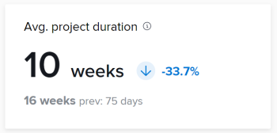

# KPI クエリ

この記事のクエリを使用して、Enhanced Analytics と同様のデータビジュアライゼーションを作成できます。

>[!IMPORTANT]
>
>クエリは、Enhanced Analytics で表示される結果と同様の結果を生成しますが、完全には一致しない場合があります。


## 前提条件

開始する前に、

1. Business Intelligence（BI）ツールとの接続を確立します。
   1. [Snowflakeのリーダーアカウントまたは接続を作成する](/help/quicksilver/reports-and-dashboards/data-lake/create-a-reader-account.md)
   1. [Workfront Data Connect への接続の確立](/help/quicksilver/reports-and-dashboards/data-lake/share-data-externally.md)

接続を確立したら、この記事のクエリを使用してデータを抽出および視覚化できます。

## 完了したプロジェクト

完了したプロジェクト KPI には、フィルター処理された期間内の完了したプロジェクトの数、および前の期間以降に増加または減少した割合が表示されます。

また、前の期間に完了したプロジェクトの数や、前の期間の日数も確認できます。


### クエリ

```
WITH completedProjectsInRange as ( 
    SELECT 
        COUNT(t0.PROJECTID) as PROJECT_COUNT 
    FROM PROJECTS_CURRENT t0 
    WHERE t0.ACTUALCOMPLETIONDATE >= '2025-01-01' 
        AND t0.ACTUALCOMPLETIONDATE <= '2025-01-31' 
), completedProjectsPreviousRange as ( 
    SELECT 
        COUNT(t0.PROJECTID) as PROJECT_COUNT 
    FROM PROJECTS_CURRENT t0 
    WHERE t0.ACTUALCOMPLETIONDATE >= '2024-12-01' 
        AND t0.ACTUALCOMPLETIONDATE <= '2024-12-31' 
), rawChange as ( 
    SELECT 
        (a.PROJECT_COUNT - b.PROJECT_COUNT) as CHANGE_FROM_PREVIOUS_PERIOD 
    FROM completedProjectsInRange a, completedProjectsPreviousRange b 
), percentChange as ( 
    SELECT 
        CASE 
            WHEN a.PROJECT_COUNT = b.PROJECT_COUNT THEN 0.00 
            WHEN b.PROJECT_COUNT > 0 THEN ((a.PROJECT_COUNT - b.PROJECT_COUNT) / b.PROJECT_COUNT * 100) 
        END AS PERCENT_CHANGE_FROM_PREVIOUS_PERIOD 
    FROM completedProjectsInRange a, completedProjectsPreviousRange b 
) 
SELECT 
    a.PROJECT_COUNT, 
    b.PROJECT_COUNT as PREVIOUS_PROJECT_COUNT, 
    c.CHANGE_FROM_PREVIOUS_PERIOD, 
    d.PERCENT_CHANGE_FROM_PREVIOUS_PERIOD 
FROM completedProjectsInRange a, completedProjectsPreviousRange b, rawChange c, 
percentChange d
```

## 時間どおりに完了したプロジェクト

この KPI には、フィルター処理された期間内に時間どおりに完了したプロジェクトの割合、および前の期間以降に増加または減少した割合が表示されます。

また、前の期間に時間通りに完了したプロジェクトの割合や、前の期間の日数も確認できます。


```
WITH completedProjectsInRange as ( 
    SELECT 
        COUNT(t0.PROJECTID) as PROJECT_COUNT 
    FROM PROJECTS_CURRENT t0 
    WHERE t0.ACTUALCOMPLETIONDATE >= '2025-01-01' 
        AND t0.ACTUALCOMPLETIONDATE <= '2025-01-31' 
), completedOntimeProjectsInRange as ( 
    SELECT 
        COUNT(t0.PROJECTID) as PROJECT_COUNT 
    FROM PROJECTS_CURRENT t0 
    WHERE t0.ACTUALCOMPLETIONDATE >= '2025-01-01' 
        AND t0.ACTUALCOMPLETIONDATE <= '2025-01-31' 
        AND t0.PROGRESSSTATUS = 'ON' 
), percentOntimeProjects as ( 
    SELECT 
        CASE 
            WHEN a.PROJECT_COUNT = 0 THEN 0 
            ELSE ROUND(b.PROJECT_COUNT/a.PROJECT_COUNT) * 100 
        END as ONTIMEPROJECTPERCENT 
    FROM completedProjectsInRange a, completedOntimeProjectsInRange b 
), completedProjectsPreviousRange as ( 
    SELECT 
        COUNT(t0.PROJECTID) as PROJECT_COUNT 
    FROM PROJECTS_CURRENT t0 
    WHERE t0.ACTUALCOMPLETIONDATE >= '2024-12-01' 
        AND t0.ACTUALCOMPLETIONDATE <= '2024-12-31' 
), completedOntimeProjectsPreviousRange as ( 
    SELECT 
        COUNT(t0.PROJECTID) as PROJECT_COUNT 
    FROM PROJECTS_CURRENT t0 
    WHERE t0.ACTUALCOMPLETIONDATE >= '2024-12-01' 
        AND t0.ACTUALCOMPLETIONDATE <= '2024-12-31' 
        AND t0.PROGRESSSTATUS = 'ON' 
), percentOntimeProjectsPreviousRange as ( 
    SELECT 
        CASE 
            WHEN a.PROJECT_COUNT = 0 THEN 0 
            ELSE ROUND(b.PROJECT_COUNT/a.PROJECT_COUNT) * 100 
        END as ONTIMEPROJECTPERCENT 
    FROM completedProjectsPreviousRange a, completedOntimeProjectsPreviousRange b 
), rawChange as ( 
    SELECT 
        (a.ONTIMEPROJECTPERCENT - b.ONTIMEPROJECTPERCENT) as CHANGE_FROM_PREVIOUS_PERIOD 
    FROM percentOntimeProjects a, percentOntimeProjectsPreviousRange b 
), percentChange as ( 
    SELECT  
        CASE 
            WHEN a.ONTIMEPROJECTPERCENT = b.ONTIMEPROJECTPERCENT THEN 0 
            WHEN b.ONTIMEPROJECTPERCENT > 0 THEN ((a.ONTIMEPROJECTPERCENT - b.ONTIMEPROJECTPERCENT) / b.ONTIMEPROJECTPERCENT * 100) 
        END AS PERCENT_CHANGE_FROM_PREVIOUS_PERIOD 
    FROM percentOntimeProjects a, percentOntimeProjectsPreviousRange b 
) 

SELECT 
    a.ONTIMEPROJECTPERCENT, 
    b.ONTIMEPROJECTPERCENT as PREVIOUS_ONTIMEPROJECTPERCENT, 
    c.CHANGE_FROM_PREVIOUS_PERIOD, 
    d.PERCENT_CHANGE_FROM_PREVIOUS_PERIOD 
FROM percentOntimeProjects a, percentOntimeProjectsPreviousRange b, rawChange c, 
percentChange d
```

## 平均プロジェクト期間

平均プロジェクト期間 KPI は、フィルタリングされた期間内に実際の終了日があるプロジェクトの平均完了時間（日、週、または年）と、前の期間以降の増減率を示します。

また、前期間の実際の終了日および日数を含む、前期間のプロジェクトの平均完了時間も確認できます。

>[!NOTE]
>
>これは、完了したプロジェクトの期間のみを表します。




```
WITH averageProjectDurationInRange as ( 
    SELECT 
        AVG(t0.ACTUALDURATIONMINUTES) as AVERAGE_PROJECT_DURATION 
    FROM PROJECTS_CURRENT t0 
    WHERE t0.ACTUALCOMPLETIONDATE >= '2025-01-01' 
        AND t0.ACTUALCOMPLETIONDATE <= '2025-01-31' 
), averageProjectPreviousRange as ( 
    SELECT AVG (t0. ACTUALDURATIONMINUTES) as AVERAGE_PROJECT_DURATION FROM PROJECTS_CURRENT t0 
    WHERE t0.ACTUALCOMPLETIONDATE >= '2024-12-01' 
        AND t0.ACTUALCOMPLETIONDATE <= '2024-12-31' 
), rawChange as ( 
    SELECT ((a.AVERAGE_PROJECT_DURATION - b.AVERAGE_PROJECT_DURATION) / 480) as CHANGE_FROM_PREVIOUS_PERIOD FROM averageProjectDurationInRange a, averageProjectPreviousRange b 
), percentChange as ( 
    SELECT  
        CASE 
            WHEN a.AVERAGE_PROJECT_DURATION = b.AVERAGE_PROJECT_DURATION THEN 0 
            WHEN b.AVERAGE_PROJECT_DURATION > 0 THEN ((a.AVERAGE_PROJECT_DURATION - b.AVERAGE_PROJECT_DURATION)  / b.AVERAGE_PROJECT_DURATION) * 100 
        END AS PERCENT_CHANGE_FROM_PREVIOUS_PERIOD 
        FROM averageProjectDurationInRange a, averageProjectPreviousRange b 
) 
 
SELECT 
    a.AVERAGE_PROJECT_DURATION, 
    b.AVERAGE_PROJECT_DURATION as PREVIOUS_AVERAGE_PROJECT_DURATION, 
    c.CHANGE_FROM_PREVIOUS_PERIOD, 
    d.PERCENT_CHANGE_FROM_PREVIOUS_PERIOD 
FROM averageProjectDurationInRange a, averageProjectPreviousRange b, rawChange c, 
percentChange d
```

## プロジェクト当たりの平均タスク数

平均プロジェクト当たりタスク KPI は、フィルター処理された期間内にプロジェクトに割り当てられたタスクの平均数と、前の期間以降に増加または減少した割合を示します。

また、前の期間のプロジェクトに割り当てられたタスクの平均数や、前の期間の日数も確認できます。


```
WITH tasksPerProjectInRange as ( 
    SELECT 
        COUNT(t0.TASKID) as TASK_COUNT 
    FROM TASKS_CURRENT t0 
        LEFT JOIN PROJECTS_CURRENT t1 ON t1.PROJECTID = t0.PROJECTID 
    WHERE 
        ( 
            t1.PLANNEDSTARTDATE >= '2025-01-01' 
            AND t1.PLANNEDSTARTDATE <= '2025-01-31' 
        ) 
        OR ( 
            t1.PLANNEDCOMPLETIONDATE >= '2025-01-01' 
            AND t1. PLANNEDCOMPLETIONDATE <= '2025-01-31' 
        ) 
        OR ( 
            t1.PLANNEDSTARTDATE <= '2025-01-01' 
            AND t1. PLANNEDCOMPLETIONDATE >= '2025-01-31' 
        ) 
    GROUP BY t0.PROJECTID 
), averageTasksPerProjectInRange as ( 
    SELECT AVG(TASK_COUNT) AS AVERAGE_TASK_COUNT FROM tasksPerProjectInRange 
), tasksPerProjectInPreviousRange as ( 
    SELECT 
        COUNT(t0.TASKID) as TASK_COUNT 
    FROM TASKS_CURRENT t0 
        LEFT JOIN PROJECTS_CURRENT t1 ON t1.PROJECTID = t0.PROJECTID 
    WHERE 
        ( 
            t1.PLANNEDSTARTDATE >= '2024-12-01' 
            AND t1.PLANNEDSTARTDATE <= '2024-12-31' 
        ) 
        OR ( 
            t1.PLANNEDCOMPLETIONDATE >= '2024-12-01' 
            AND t1. PLANNEDCOMPLETIONDATE <= '2024-12-31' 
        ) 
        OR ( 
            t1.PLANNEDSTARTDATE <= '2024-12-01' 
            AND t1. PLANNEDCOMPLETIONDATE >= '2024-12-31' 
        ) 
    GROUP BY t0.PROJECTID 
), averageTasksPerProjectInPreviousRange as ( 
    SELECT 
        AVG(TASK_COUNT) AS AVERAGE_TASK_COUNT 
        FROM tasksPerProjectInPreviousRange 
), rawChange as ( 
    SELECT 
        (a.AVERAGE_TASK_COUNT - b.AVERAGE_TASK_COUNT) as CHANGE_FROM_PREVIOUS_PERIOD 
    FROM averageTasksPerProjectInRange a, averageTasksPerProjectInPreviousRange b 
), percentChange as ( 
    SELECT 
        CASE 
            WHEN a.AVERAGE_TASK_COUNT = b.AVERAGE_TASK_COUNT THEN 0 
            WHEN b.AVERAGE_TASK_COUNT > 0 THEN ((a.AVERAGE_TASK_COUNT - b.AVERAGE_TASK_COUNT) / b.AVERAGE_TASK_COUNT) * 100  
        END as PERCENT_CHANGE_FROM_PREVIOUS_PERIOD 
    FROM averageTasksPerProjectInRange a, averageTasksPerProjectInPreviousRange b 
) 
 
SELECT 
    a.AVERAGE_TASK_COUNT, 
    b.AVERAGE_TASK_COUNT as PREVIOUS_AVERAGE_TASK_COUNT, 
    c.CHANGE_FROM_PREVIOUS_PERIOD, 
    d.PERCENT_CHANGE_FROM_PREVIOUS_PERIOD 
FROM averageTasksPerProjectInRange a, averageTasksPerProjectInPreviousRange b, rawChange c, percentChange d
```

## トラブルシューティング

* **結果なし**：クエリで結果が返されない場合は、二重引用と一重引用が正しくコピーされていることを確認します。
