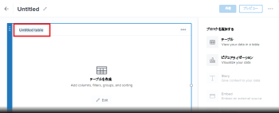

# レポートキャンバスでのテーブルブロックの追加または編集

テーブルには、フィールド情報が列に表示され、フィルター、グループ化、並べ替えが可能です。

## 前提条件

開始する前に、レポートキャンバスベータ版に登録する必要があります。 詳しくは、 [レポートキャンバスベータ版：概要](/help/quicksilver/product-announcements/betas/canvas-dashboards-beta/reporting-canvas-beta-overview.md).

## テーブルブロックを追加または編集する

1. 次をクリック： **メインメニュー** アイコン  Adobe Workfrontの右上隅で、 **レポート**.
1. クリック **新しいレポート**.

   または

   既存のレポートに移動し、 **その他** アイコン  レポートのヘッダーで、 **編集**.

1. 画面の右側の下 **ブロックを追加**、次のいずれか：

   次の項目をドラッグ： **テーブル** アイコン  を目的の場所に直接キャンバス上にドラッグします。

   または

   次をダブルクリックします。 **テーブル** アイコン  をクリックして、キャンバスの上部にテーブルを追加します。

   >[!TIP]
   >
   >ブロックを配置した後に、そのコーナーハンドルをドラッグして、ブロックのサイズを変更できます。

1. クリック **名称未設定のテーブル** テーブルヘッダーにテーブルのタイトルを入力します。

   

1. クリック **編集** テーブルを設定するテーブルブロックの中央。

   >[!NOTE]
   >
   >テーブルが既にキャンバスに含まれていた場合（既存のレポートの編集時など）、 **編集** ボタンがブロックの中央に表示されない。 テーブルを編集するには、 **編集** アイコン  を使用します。
   >

1. Adobe Analytics の **フィールド** 右側のパネルで、列としてテーブルに追加するフィールドを見つけ、テーブルの目的の位置にドラッグするか、ダブルクリックしてテーブルの最後の列に追加します。

   テキストを **検索** ボックスを使用して、特定のフィールドを名前で検索します。 このボックスの下の 2 つのドロップダウンメニューを使用して、表示するフィールドのリストを次のいずれかまたは両方に絞り込むこともできます。

   * 目的のフィールドに関連付けられるオブジェクトの種類（Project や Task など）
   * 使用するフィールドのタイプ（日付、通貨など）

   列として追加する各フィールドに対して、この手順を繰り返します。

   >[!TIP]
   >
   >選択した列を新しい位置にドラッグすると、テーブル内の列の順序を変更できます。

1. 次のいずれかの操作を行って、テーブルをさらに設定します。

   * **数式フィールドを追加する**：クリック **新規+** の最上部に **フィールド** リスト。 数式フィールドの作成方法について詳しくは、 [レポートキャンバスで数式フィールドを作成する](../../../reports-and-dashboards/reporting-canvas/table-blocks/create-formula-field.md).
   * **フィルターの追加**：テーブルをフィルターするフィールドを、 **フィルター** セクションを表の上に置きます。 フィルタールールの設定について詳しくは、 [レポートキャンバスでのテーブルのフィルタリング](../../../reports-and-dashboards/reporting-canvas/table-blocks/configure-filter-rules-for-table.md).
   * **特定の属性別に行をグループ化**：テーブルをグループ化するフィールドを **グループ化** セクションを表の上に置きます。 行グループの作成について詳しくは、 [レポートキャンバスのテーブル行をグループ化します](../../../reports-and-dashboards/reporting-canvas/table-blocks/group-rows-in-table.md).
