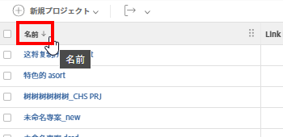

# レポートキャンバスでのテーブル列の設定

テーブルの列は、表示するように設定できます。 列の以下の要素を変更できます。

* 名前
* 並べ替え
* 権限を編集
* ホバーテキスト
* 集計
* 条件付き形式

## 前提条件

開始する前に、レポートキャンバスベータ版に登録する必要があります。 詳しくは、 [レポートキャンバスベータ版：概要](/help/quicksilver/product-announcements/betas/canvas-dashboards-beta/reporting-canvas-beta-overview.md).

## テーブルの列を変更する

1. 既存のレポートに移動し、 **その他のメニュー** アイコン  レポートのヘッダーで、「 **編集**.
1. レポートのテーブルヘッダーで、 **編集** アイコン .

   

   >[!NOTE]
   >
   >テーブルを作成したばかりで、フィールドをまだ追加していない場合は、代わりにテーブルの中央にある「編集」ボタンをクリックします。

1. （オプション）テーブルの列を追加、再配置、または削除します。 テーブルのフィールドの編集について詳しくは、 [レポートキャンバスでのテーブルブロックの追加または編集](../../../reports-and-dashboards/reporting-canvas/table-blocks/add-or-edit-report-table.md)

   | 新しい列を追加 | テーブルに列を追加するには、 **フィールド** ページの右側のパネルを、配置するテーブル上に配置するか、フィールドをダブルクリックして右端の列に追加します。 |
   |---|---|
   | 列の移動 | テーブルの列の順序を並べ替えるには、列名をクリックし、新しい場所にドラッグします。 |
   | 列の削除 | テーブルから列を削除するには、削除する列をクリックし、列名の右側にある x をクリックします。 |

   {style="table-layout:auto"}

1. 列を設定するには、テーブルのヘッダー行で、変更する列の名前をクリックし、右側のパネルで次のいずれかのタブをクリックします。

   <table style="table-layout:auto"> 
    <col> class="TableStyle-TableStyle-List-options-in-steps-Column-Column1" /&gt;
    <tbody>
     <tr data-mc-conditions="">
      <th role="rowheader" colspan="2">「データ」タブ</th>
     </tr>
     <tr data-mc-conditions="">
      <td role="rowheader">集計基準 :</td>
      <td>
 列の情報を集計（ヘッダーで要約）するには、必要な集計のタイプを <strong>次に基づいて集計</strong> ドロップダウンメニュー。 使用できるオプションは、列に含まれるデータのタイプによって異なります。

テーブルでグループを使用している場合、集計値は、列名の横ではなく列名の上のグループ行に表示されます。
</td>
     </tr>
     <tr data-mc-conditions="">
      <td role="rowheader">フィールド形式</td>
      <td>
（列に日付、パーセント、通貨、または時間のデータが含まれている場合にのみ使用でき、テキストは含まれません）。 データの形式を選択します。 <b>フィールドの形式</b> 」ドロップダウンリストから選択できます。 例えば、列の数値の後にパーセント記号を表示したり、日付の表示方法を変更したりできます。
</td>
     </tr>
     <tr data-mc-conditions="">
      <td role="rowheader">フィールドは編集可能です</td>
      <td>を有効にします。 <strong>フィールドは編集可能です</strong> テーブルを表示するユーザーが列の名前を編集できるようにする場合。</td>
     </tr>
     <tr>
      <td role="rowheader"><strong>並べ替え</strong></td>
      <td>
デフォルトでは、テーブルは左端の列のデータに従って昇順で並べ替えられます。 代わりに、選択した列で並べ替えるには、 <strong>並べ替え</strong>をクリックしてから、チェックボックスをクリックします。 <b>この列で並べ替え</b>. 次の項目を選択します。 <strong>並べ替え</strong> 方向（昇順または降順の値）と <strong>並べ替え順</strong> （この列の相対的な並べ替え優先度は、テーブル内の他の並べ替え列と比較しても同じです）。

この手順を繰り返して、テーブルを 5 列まで並べ替えることができます。 各列に正しい値が設定されていることを確認します。 <strong>並べ替え順</strong> 並べ替えに選択した新しい列を基準にします。

注意：テーブルの並べ替え用に選択された列と、並べ替え用に別の列を選択した場合、その列を使用して、テーブルが降順で並べ替えられます。 並べ替え用に他の列が選択されていない場合、テーブルはデフォルトに戻ります（最初の列での並べ替え）。

テーブルを並べ替える列を指定すると、列名の横に、テーブルの並べ替え時に列の相対的な優先度（テーブルが 1、2 などで並べ替えられる）を示す数値と、並べ替え方向が昇順か降順かを示す矢印が表示されます。 

</td>
     </tr>
    </tbody>
   </table>

   <table style="table-layout:auto"> 
    <col> 
    <col> 
    <tbody> 
     <tr> 
      <th role="rowheader" colspan="2">「スタイル」タブ</th> 
     </tr> 
     <tr> 
      <td role="rowheader"><strong>カスタム列のラベル</strong> </td> 
      <td>列の新しい表示名を入力します（100 文字以内）。</td> 
     </tr> 
     <tr> 
      <td role="rowheader">ホバーテキストを表示</td> 
      <td> 
列名の上にマウスポインターを置くと、説明テキストを表示するかどうかを指定します。
 
このオプションはデフォルトでは無効になっています。
 </td> 
     </tr> 
     <tr> 
      <td role="rowheader">ホバーテキスト</td> 
      <td>（次の場合にのみ使用可能） <strong>カーソルを合わせたテキストを表示</strong> が有効になっている場合 )。 列名の上にマウスポインターを置くと表示される説明テキストをカスタマイズします。</td> 
     </tr> 
     <tr> 
      <td role="rowheader"><strong>条件付き形式</strong> </td> 
      <td> 
       <ol data-mc-continue="false"> 
        <li value="1"> 
追加 ，編集 、または削除  値が指定した条件を満たす場合に列のセルに書式を設定するルール。
 
例えば、「プロジェクトステータス」フィールドの値が「Building」と等しい場合に、そのフィールドのフォントを太字の紫に変更するルールを作成できます。
 
または、 <b>アイコンを表示</b> ：ステータスが「現在」の列内のすべての項目に緑のフラグアイコンを追加します。
 
  
 
注意： <strong>アイコンを表示</strong>の場合、その他の書式設定オプションは使用できません。
 
次の項目を選択できます。 <strong>行全体に適用</strong> ルールの条件を満たすセルの行全体に書式を適用する場合。 たとえば、「期限」列の日付セルだけでなく、それらの日付が発生する行全体に黄色の背景色を適用して、特定の日付の後に期限が切れたプロジェクトをハイライトできます。
 
ヒント：ルールに書式設定オプションを追加すると、結果のセルの書式が <strong>プレビュー</strong> をクリックします。
 </li> 
        <li value="2">ルールの追加が終了したら、「 <strong>保存</strong>.</li> 
        <li value="3"> 
（オプション）「 <b>+ルールを追加</b> をクリックして、同じ列にルールを追加します。
 
テーブル内の複数の条件付き書式ルールは、次の順序で適用されます。
 
         <ul> 
          <li> 
行全体に適用されるルールは、各列の左から右、列内の上から下に順に評価されます。
 
注意：行の書式設定は、他の列のルールの条件を満たす場合でも、その行のセルに対する他の条件付き書式よりも優先されます。
 </li> 
          <li> 
その他のルールは、列の右側のパネルに表示されるとおり、上から下に順に評価されます。 ドラッグできます  ルールを保存して順序を変更します。
 
注意：セルは、最初に満たした条件に基づいてフォーマットされ、他の条件を満たした場合でも、それ以上フォーマットされません。
 </li> 
         </ul> </li> 
       </ol> </td> 
     </tr> 
    </tbody> 
   </table>

1. 次をクリック： **戻る** 矢印を使用して、レポートに戻ります。
