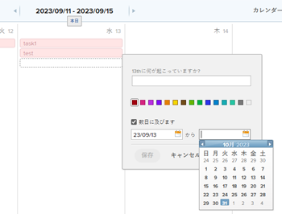

# カレンダーレポートへのアドホックイベントの追加

カレンダーにアドホックイベントを追加できます。アドホックイベントは、カレンダーで単にリマインダーとして機能し、プロジェクト、タスク、イシューには関連付けられません。

## アクセス要件

この記事の手順を実行するには、次のアクセス権が必要です。

<table style="table-layout:auto"> 
 <col> 
 </col> 
 <col> 
 </col> 
 <tbody> 
  <tr> 
   <td role="rowheader"><strong>[!DNL Adobe Workfront plan*]</strong></td> 
   <td> 
任意
 </td> 
  </tr> 
  <tr> 
   <td role="rowheader"><strong>[!DNL Adobe Workfront] ライセンス*</strong></td> 
   <td> 
[!UICONTROL Plan] 
 </td> 
  </tr> 
  <tr> 
   <td role="rowheader"><strong>アクセスレベル設定*</strong></td> 
   <td> 
[!UICONTROL Reports]、[!UICONTROL Dashboards]、[!UICONTROL Calendars] に対する [!UICONTROL Edit] 権限
 
メモ：アクセス権がない場合は、アクセスレベルに追加の制限が設定されているかを [!DNL Workfront] 管理者にお問い合わせください。[!DNL Workfront] 管理者がアクセスレベルを変更する方法について詳しくは、<a href="../../../administration-and-setup/add-users/configure-and-grant-access/create-modify-access-levels.md" class="MCXref xref">カスタムアクセスレベルの作成または変更</a>を参照してください。
 </td> 
  </tr> 
  <tr> 
   <td role="rowheader"><strong>オブジェクト権限</strong></td> 
   <td> 
カレンダーレポートに対する [!UICONTROL Manage] 権限
 
追加のアクセス権のリクエストについて詳しくは、<a href="../../../workfront-basics/grant-and-request-access-to-objects/request-access.md" class="MCXref xref">オブジェクトへのアクセス権のリクエスト</a>を参照してください。
 </td> 
  </tr> 
 </tbody> 
</table>

&#42;ご利用のプラン、ライセンスタイプまたはアクセス権を確認するには、[!DNL Workfront] 管理者にお問い合わせください。

## カレンダーレポートへのアドホックイベントの追加

1. カレンダー内で、アドホックイベントを追加する日付に移動し、イベントの[!UICONTROL 開始]日をクリックします。
1. イベント名を入力し、必要に応じてイベントのカラーを選択します。
1. （条件付き）アドホックイベントが数日間にわたって行われる場合は、「**[!UICONTROL 数日に及びます]**」を選択し、ポップアップカレンダーで終了日を選択します。

   

1. 「**[!UICONTROL 保存]**」をクリックします。
1. （オプション）アドホックイベントを変更するには：

   1. カレンダーのイベントをクリックして、イベントの詳細ページを開きます。
   1. 編集アイコン（鉛筆）をクリックし、イベントを編集して、「**[!UICONTROL 保存]**」をクリックします。

1. （オプション）アドホックイベントを削除するには：

   1. カレンダーのイベントをクリックして、イベントの詳細ページを開きます。
   1. ごみ箱アイコンをクリックし、「**[!UICONTROL はい、削除します]**」をクリックします。
