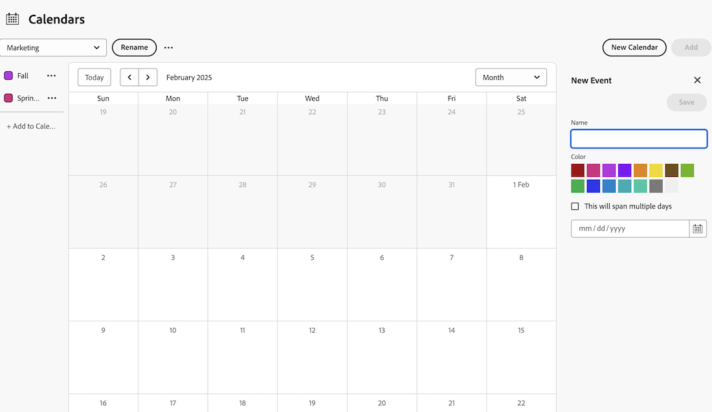

# カレンダーレポートへのアドホックイベントの追加

カレンダーにアドホックイベントを追加できます。アドホックイベントは、カレンダーで単にリマインダーとして機能し、プロジェクト、タスク、イシューには関連付けられません。

## アクセス要件

+++ 展開すると、この記事の機能のアクセス要件が表示されます。

<table style="table-layout:auto"> 
 <col> 
 </col> 
 <col> 
 </col> 
 <tbody> 
  <tr> 
   <td role="rowheader">Adobe Workfront パッケージ</td> 
   <td> 
任意
 </td> 
  </tr> 
  <tr> 
   <td role="rowheader">Adobe Workfront プラン</td> 
   <td>
標準

       
プラン
</td> 
  </tr> 
  <tr> 
   <td role="rowheader">アクセスレベル設定</td> 
   <td> 
 レポート、ダッシュボード、カレンダーへのアクセス権の編集
</td> 
  </tr> 
  <tr> 
   <td role="rowheader">オブジェクト権限</td> 
   <td>カレンダーレポートへのアクセスの管理</td> 
  </tr> 
 </tbody> 
</table>

この表の情報について詳しくは、[Workfront ドキュメントのアクセス要件](/help/quicksilver/administration-and-setup/add-users/access-levels-and-object-permissions/access-level-requirements-in-documentation.md)を参照してください。

+++

## カレンダーレポートへのアドホックイベントの追加

1. アドホックイベントを追加するカレンダーに移動します。
1. カレンダーの上部にある「**追加**」をクリックします。
1. 右側のサイドパネルで、イベントを&#x200B;**名前**&#x200B;付けます。
1. イベントのカラーを選択します。
1. イベントを複数日にまたぐかどうかを選択します。
1. カレンダーアイコンを使用して日付を入力または選択します。
   