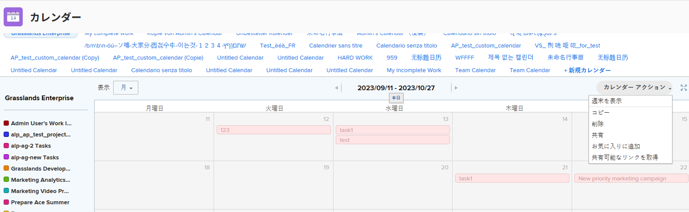

# カレンダーレポートをコピー

カレンダーを作成した場合は、そのカレンダーをコピーして、新しいカレンダーの開始点として使用できます。

さらに、自分が所有者ではないカレンダーに対する[!UICONTROL 管理]アクセス権を持っている場合は、カレンダーをコピーして、コピーしたカレンダーの所有者になることができます。

## アクセス要件

この記事の手順を実行するには、次のアクセス権が必要です。

<table style="table-layout:auto"> 
 <col> 
 </col> 
 <col> 
 </col> 
 <tbody> 
  <tr> 
   <td role="rowheader"><strong>[!DNL Adobe Workfront plan*]</strong></td> 
   <td> 
任意
 </td> 
  </tr> 
  <tr> 
   <td role="rowheader"><strong>[!DNL Adobe Workfront] ライセンス*</strong></td> 
   <td> 
[!UICONTROL Plan] 
 </td> 
  </tr> 
  <tr> 
   <td role="rowheader"><strong>アクセスレベル設定*</strong></td> 
   <td> 
[!UICONTROL Reports]、[!UICONTROL Dashboards]、および[!UICONTROL Calendars]に対する[!UICONTROL Edit]アクセス権
 
メモ：まだアクセス権がない場合は、[!DNL Workfront] 管理者に問い合わせて、アクセスレベルに追加の制限が設定されているかどうかを確認してください。[!DNL Workfront] 管理者がアクセスレベルを変更する方法について詳しくは、<a href="../../../administration-and-setup/add-users/configure-and-grant-access/create-modify-access-levels.md" class="MCXref xref">カスタムアクセスレベルの作成または変更</a>を参照してください。
 </td> 
  </tr> 
  <tr> 
   <td role="rowheader"><strong>オブジェクト権限</strong></td> 
   <td> 
カレンダーレポートに対する [!UICONTROL Manage] 権限
 
追加のアクセス権のリクエストについて詳しくは、<a href="../../../workfront-basics/grant-and-request-access-to-objects/request-access.md" class="MCXref xref">オブジェクトへのアクセス権のリクエスト</a>を参照してください。
 </td> 
  </tr> 
 </tbody> 
</table>

&#42;ご利用のプラン、ライセンスタイプまたはアクセス権を確認するには、[!DNL Workfront] 管理者にお問い合わせください。

## カレンダーレポートをコピー

1. コピーするカレンダーに移動します。
1. **[!UICONTROL カレンダー]**&#x200B;ツールバーで、**[!UICONTROL カレンダーアクション]**&#x200B;をクリックし、「**[!UICONTROL コピー]**」をドロップダウンリストから選択します。\
   カレンダーのコピーが開きます。

   

   元のカレンダー内のすべてのプロジェクトとカレンダーのグループ化は、カレンダーのコピーに表示されます。カレンダーフィルターで配置されたオブジェクトのみが、新しくコピーされたカレンダーに書き出されます。元のカレンダーに手動で追加したイベントは、コピーしたカレンダーに手動で追加する必要があります。

   コピーしたカレンダーに対するアクセス権を持つのは自分だけです。元のカレンダーに対するアクセス権を持つユーザーは、コピーしたカレンダーに対するアクセス権を持ちません。新しく作成したカレンダーを他のユーザーと共有することで、そのカレンダーへのアクセス権を付与できます。カレンダーの共有について詳しくは、[[!UICONTROL カレンダー ] レポートを共有](../../../reports-and-dashboards/reports/calendars/share-a-calendar-report.md)を参照してください。

1. （オプション）カレンダーの名前を変更します。
