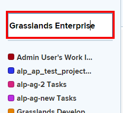
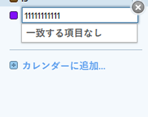
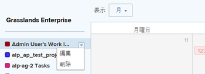

# 既存のカレンダーレポートの編集

既存のカレンダーを変更するには、プロジェクトへのリンクを追加または削除します。 また、カレンダーレポートに関連付けられたカレンダーのグループ化を変更することもできます。

>[!NOTE]
>
>1 つのカレンダーレポートで使用できるグループは 15 個までです。

## アクセス要件

この記事の手順を実行するには、次のアクセス権が必要です。

<table style="table-layout:auto"> 
 <col> 
 </col> 
 <col> 
 </col> 
 <tbody> 
  <tr> 
   <td role="rowheader"><strong>[!DNL Adobe Workfront plan*]</strong></td> 
   <td> 
任意
 </td> 
  </tr> 
  <tr> 
   <td role="rowheader"><strong>[!DNL Adobe Workfront] ライセンス*</strong></td> 
   <td> 
[!UICONTROL プラン ] 
 </td> 
  </tr> 
  <tr> 
   <td role="rowheader"><strong>アクセスレベル設定*</strong></td> 
   <td> 
[!UICONTROL [!UICONTROL レポート ]、[!UICONTROL ダッシュボード ] および [!UICONTROL カレンダー ] への [!UICONTROL 編集 ] アクセス
 
注意：まだアクセス権がない場合は、 [!DNL Workfront] 管理者（アクセスレベルに追加の制限を設定している場合） を参照してください。 [!DNL Workfront] 管理者はアクセスレベルを変更できます。詳しくは、 <a href="../../../administration-and-setup/add-users/configure-and-grant-access/create-modify-access-levels.md" class="MCXref xref">カスタムアクセスレベルの作成または変更</a>.
 </td> 
  </tr> 
  <tr> 
   <td role="rowheader"><strong>オブジェクト権限</strong></td> 
   <td> 
カレンダーレポートへの [!UICONTROL 管理 ] アクセス
 
追加のアクセス権のリクエストについて詳しくは、 <a href="../../../workfront-basics/grant-and-request-access-to-objects/request-access.md" class="MCXref xref">オブジェクトへのアクセスのリクエスト </a>.
 </td> 
  </tr> 
 </tbody> 
</table>

&#42;ご利用のプラン、ライセンスの種類、アクセス権を確認するには、 [!DNL Workfront] 管理者。

## 既存のカレンダーレポートの編集

1. 次をクリック： **[!UICONTROL メインメニュー]** アイコン  右上隅に [!DNL Adobe Workfront]を選択し、「 **[!UICONTROL カレンダー]**.

1. （オプション）カレンダーレポートの名前を変更するには、 [!UICONTROL カレンダー名] 」フィールドに入力し、必要な変更を加えます。\
   \
   カレンダーレポートを他のユーザーやチームと共有している場合は、変更したカレンダー名が自動的にカレンダー表示に更新されます。

1. （オプション）カレンダーレポートにプロジェクトを追加するには：

   1. クリック **[!UICONTROL カレンダーに追加].**
   1. 内 **[!UICONTROL プロジェクト名]** フィールドに、カレンダーイベントを追加するプロジェクトの名前を入力し、ドロップダウンリストに表示されたら名前をクリックします。\

      
プロジェクトの項目とそれに関連するタスクおよびタスクがカレンダーレポートに追加されます。

1. （オプション）カレンダーのグループ化を追加するか、既存のカレンダーのグループ化を変更するには、次の手順に従います。

   1. プロジェクト名の上にマウスポインターを置き、プロジェクト名の横にあるドロップダウン矢印をクリックして、 **[!UICONTROL 編集]**.\

      

   1. 項目のグループ化方法を選択してください：

      * [用途 [!UICONTROL 計画日] カレンダーレポート内](../../../reports-and-dashboards/reports/calendars/use-planned-dates.md)
      * [用途 [!UICONTROL 推定日] カレンダーレポート内](../../../reports-and-dashboards/reports/calendars/use-projected-dates.md)
      * [カレンダーレポートでのカスタム日付フィールドの使用](../../../reports-and-dashboards/reports/calendars/use-custom-dates.md)
