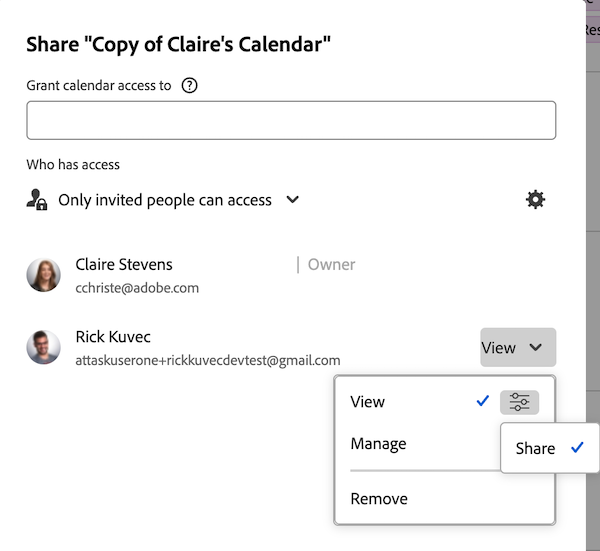

# カレンダーレポートの共有

カレンダーを他のユーザーと共有して公開し、[!DNL Adobe Workfront] ライセンスを持たない人がカレンダーを表示できるようにできます。

## アクセス要件

+++ 展開すると、この記事の機能のアクセス要件が表示されます。

この記事の手順を実行するには、次のアクセス権が必要です。

<table style="table-layout:auto"> 
 <col> 
 </col> 
 <col> 
 </col> 
 <tbody> 
  <tr> 
   <td role="rowheader">[!DNL Adobe Workfront plan]</td> 
   <td> 
任意
 </td> 
  </tr> 
  <tr> 
   <td role="rowheader">[!DNL Adobe Workfront] ライセンス</td> 
   <td>
新規：軽い

       
または

       
現在：レビュー
</td> 
  </tr> 
  <tr> 
   <td role="rowheader">アクセスレベル設定</td> 
   <td> 
[!UICONTROL ビュー ] 以上の [!UICONTROL レポート ]、[!UICONTROL ダッシュボード ]、および [!UICONTROL カレンダー ] へのアクセス
</td> 
  </tr> 
  <tr> 
   <td role="rowheader">オブジェクト権限</td> 
   <td>カレンダーレポートに対する [!UICONTROL View] 以上の権限、および共有するためのアクセス権</td> 
  </tr> 
 </tbody> 
</table>

この表の情報について詳しくは、[Workfront ドキュメントのアクセス要件](/help/quicksilver/administration-and-setup/add-users/access-levels-and-object-permissions/access-level-requirements-in-documentation.md)を参照してください。

+++

## [!DNL Workfront] ユーザーとのカレンダーの共有 {#share-a-calendar-with-workfront-users}

カレンダーの共有は、他のオブジェクトの共有と似ています。[!DNL Adobe Workfront] でのオブジェクトの共有について詳しくは、[オブジェクトに対する共有権限の概要](../../../workfront-basics/grant-and-request-access-to-objects/sharing-permissions-on-objects-overview.md)を参照してください。

共有されているカレンダーの名前の横には、アスタリスク（&#42;）が表示されます。

[!DNL Workfront] 内でカレンダーを共有するには：

1. 共有するカレンダーに移動します。
1. カレンダー名の横にある **詳細** メニューをクリックし、「**共有**」をクリックします。
   
1. **** へのアクセス権限付与の相手フィールドに、カレンダーを共有するユーザー、チーム、役割、グループまたは会社の名前を入力し、ドロップダウンリストに名前が表示されたらクリックします。\
   権限の設定について詳しくは、[オブジェクトに対する共有権限の概要](../../../workfront-basics/grant-and-request-access-to-objects/sharing-permissions-on-objects-overview.md)を参照してください。

1. （オプション）カレンダーへのアクセスを許可するユーザー、チーム、役割またはグループごとに手順 3 を繰り返します。
1. 手順 3 で追加した各ユーザー、チーム、役割、グループまたは会社に対する権限を指定するには、ドロップダウンメニューをクリックし、付与する権限レベルを選択します。

   * **[!UICONTROL 表示]：**&#x200B;ユーザーは、カレンダーを確認し、共有できます。

     

   * **[!UICONTROL 管理]：** ユーザーは、カレンダーへのフルアクセス権を持ち、アクセスレベルで付与される管理権限を除き、すべての表示権限を持ちます。

     

     >[!NOTE]
     >
     >[!DNL Workfront] 管理者とカレンダーの作成者は、これらのエンティティから権限を削除できます。

1. （任意）ユーザーの役割に応じて、**[!UICONTROL 詳細オプション]**] をクリックし、**[!UICONTROL 共有]**&#x200B;をクリックすると、ユーザーは他のユーザーとカレンダーを共有できます。

   権限レベルについて詳しくは、[オブジェクトに対する共有権限の概要](../../../workfront-basics/grant-and-request-access-to-objects/sharing-permissions-on-objects-overview.md)を参照してください。

1. （オプション）カレンダーをすべての [!DNL Workfront] ユーザーが使用できるようにするには 、歯車アイコンをクリックし、ドロップダウンメニューで「**[!UICONTROL システム全体で表示]**」をクリックして、すべての [!DNL Workfront] ユーザーがオブジェクトを利用できるようにします。\
   すべてのユーザーは、設定した権限に基づいてオブジェクトを表示できます。

1. 「**[!UICONTROL 保存]**」をクリックします。

## パブリックリンクとのカレンダーの共有

カレンダーを公開し、[!DNL Workfront] ライセンスを持たないユーザーとリンクを共有できます。

1. 共有するカレンダーに移動します。
1. 「**[!UICONTROL カレンダーのアクション]**」をクリックして、「**[!UICONTROL 共有]**」をクリックします。
1. カレンダー名の横にある **詳細** メニューをクリックします。
   
**公開リンクをコピー** をクリックします。
1. 「**[!UICONTROL 保存]**」をクリックします。

## カレンダーをプライベートリンクと共有する

[!DNL Workfront] ユーザーとプライベートカレンダーリンクを共有できます 。リンクを使用する際にカレンダーを表示するには、ログインする必要があります。

1. 共有するカレンダーに移動します。
1. カレンダー名の横にある **詳細** メニューをクリックし、「**[!UICONTROL 共有可能なリンクを取得]**」をクリックします。
   

   >[!NOTE]
   >
   >[!DNL Workfront] ユーザーがリンクを使用してカレンダーにアクセスするには、カレンダーへのアクセス権を持っている必要があります。アクセス権を付与するには、[ [!DNL Workfront]  ユーザーとのカレンダーの共有](#share-a-calendar-with-workfront-users)を参照してください。\
   >ユーザーがアクセス権を持っていない場合、リンクをブラウザーに貼り付けた後にリクエストできます。
