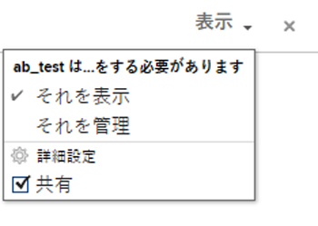
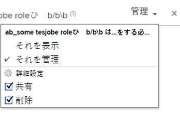

# カレンダーレポートの共有

カレンダーを他のユーザーと共有し、公開して、 [!DNL Adobe Workfront] ライセンスを使用して表示できます。

## アクセス要件

この記事の手順を実行するには、次のアクセス権が必要です。

<table style="table-layout:auto"> 
 <col> 
 </col> 
 <col> 
 </col> 
 <tbody> 
  <tr> 
   <td role="rowheader"><strong>[!DNL Adobe Workfront plan*]</strong></td> 
   <td> 
任意
 </td> 
  </tr> 
  <tr> 
   <td role="rowheader"><strong>[!DNL Adobe Workfront] ライセンス*</strong></td> 
   <td> 
[!UICONTROL Review] 以降
 </td> 
  </tr> 
  <tr> 
   <td role="rowheader"><strong>アクセスレベル設定*</strong></td> 
   <td> 
[!UICONTROL 表示 ] 以上で、[!UICONTROL からレポート ]、[!UICONTROL ダッシュボード ] および [!UICONTROL カレンダー ] にアクセスできる
 
注意：まだアクセス権がない場合は、 [!DNL Workfront] 管理者（アクセスレベルに追加の制限を設定している場合） を参照してください。 [!DNL Workfront] 管理者はアクセスレベルを変更できます。詳しくは、 <a href="../../../administration-and-setup/add-users/configure-and-grant-access/create-modify-access-levels.md" class="MCXref xref">カスタムアクセスレベルの作成または変更</a>.
 </td> 
  </tr> 
  <tr> 
   <td role="rowheader"><strong>オブジェクト権限</strong></td> 
   <td> 
カレンダーレポートに対する [!UICONTROL 表示 ] 以上の権限（共有へのアクセス権を持つ）
 
追加のアクセス権のリクエストについて詳しくは、 <a href="../../../workfront-basics/grant-and-request-access-to-objects/request-access.md" class="MCXref xref">オブジェクトへのアクセスのリクエスト </a>.
 </td> 
  </tr> 
 </tbody> 
</table>

&#42;ご利用のプラン、ライセンスの種類、アクセス権を確認するには、 [!DNL Workfront] 管理者。

## カレンダーの共有先 [!DNL Workfront] ユーザー {#share-a-calendar-with-workfront-users}

カレンダーの共有は、他のオブジェクトの共有と似ています。 でのオブジェクトの共有の詳細 [!DNL Adobe Workfront]を参照してください。 [オブジェクトに対する共有権限の概要](../../../workfront-basics/grant-and-request-access-to-objects/sharing-permissions-on-objects-overview.md).

共有されているカレンダーにはアスタリスク (&#42;) をクリックします。

内でカレンダーを共有するには [!DNL Workfront]:

1. 共有するカレンダーに移動します。
1. クリック **[!UICONTROL カレンダーアクション]**&#x200B;を選択し、「 **[!UICONTROL 共有]**.

1. 内 **[!UICONTROL カレンダーへのアクセス権を付与]** フィールドに、カレンダーを共有するユーザー、チーム、役割、グループまたは会社の名前を入力し、ドロップダウンリストに表示されたら名前をクリックします。\
   権限の設定については、 [オブジェクトに対する共有権限の概要](../../../workfront-basics/grant-and-request-access-to-objects/sharing-permissions-on-objects-overview.md).

1. （オプション）カレンダーへのアクセスを許可するユーザー、チーム、役割またはグループごとに手順 3 を繰り返します。
1. 手順 3 で追加した各ユーザー、チーム、役割、グループまたは会社に対する権限をドロップダウンメニューをクリックして指定し、付与する権限レベルを選択します。

   * **[!UICONTROL 表示]:** ユーザーは、カレンダーを確認して共有できます。

      

   * **[!UICONTROL 管理]:** ユーザーは、カレンダーへのフルアクセス権を持ち、アクセスレベルで付与される管理権限を除き、すべての表示権限を持ちます。

      

      >[!NOTE]
      >
      >この [!DNL Workfront] 管理者とカレンダーの作成者は、これらのエンティティから権限を削除できます。

1. （オプション）ユーザーの役割に応じて、 **[!UICONTROL 詳細オプション]**&#x200B;を選択し、「 **[!UICONTROL 共有]**&#x200B;ユーザがカレン&#x200B;ダーを他のユーザと共有できるようにする。

   権限レベルについて詳しくは、 [オブジェクトに対する共有権限の概要](../../../workfront-basics/grant-and-request-access-to-objects/sharing-permissions-on-objects-overview.md).

1. （オプション）カレンダーをすべてのユーザーが使用できるようにするには [!DNL Workfront] をクリックし、ドロップダウンメニューで「 」をクリックします。 **[!UICONTROL この機能をシステム全体で表示]** オブジェクトをすべてのユーザーが使用できるようにするには [!DNL Workfront] ユーザー。\
   すべてのユーザーは、設定した権限に基づいてオブジェクトを表示できます。

1. 「**[!UICONTROL 保存]**」をクリックします。

## カレンダーを公開リンクと共有する

カレンダーを公開し、 [!DNL Workfront] ライセンス。

1. 共有するカレンダーに移動します。
1. クリック **[!UICONTROL カレンダーアクション]**&#x200B;を選択し、「 **[!UICONTROL 共有]**.

1. 歯車アイコンをクリックし、 **[!UICONTROL これを外部ユーザーに公開する]**.
1. クリック **[!UICONTROL リンクをコピー]**.
1. 「**[!UICONTROL 保存]**」をクリックします。

## カレンダーをプライベートリンクと共有

非公開のカレンダーリンクをと共有できます [!DNL Workfront] ユーザー。 リンクを使用する際にカレンダーを表示するには、ログインする必要があります。

1. 共有するカレンダーに移動します。
1. クリック **[!UICONTROL カレンダーアクション]**&#x200B;を選択し、「 **[!UICONTROL 共有可能なリンクを取得]**.

1. クリック **[!UICONTROL リンクをコピー]**.

   >[!NOTE]
   >
   >[!DNL Workfront] リンクを使用してカレンダーにアクセスするには、ユーザーがカレンダーにアクセスできる必要があります。 アクセス権を付与するには、 [カレンダーの共有先 [!DNL Workfront] ユーザー](#share-a-calendar-with-workfront-users).\
   >ユーザーがアクセス権を持っていない場合、リンクをブラウザーに貼り付けた後にリクエストできます。
