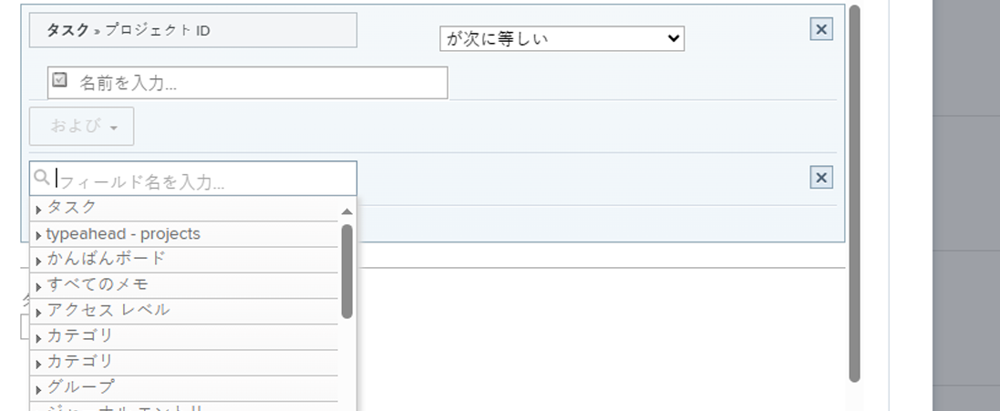
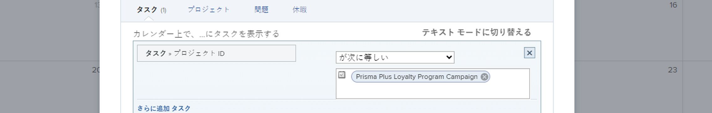

# カレンダーレポートでのカスタム日付フィールドの使用

[!UICONTROL カレンダー]レポートは、作業内容を視覚的に表示する動的なレポートです。次のオブジェクトに対して、カレンダーレポートでカスタム日付フィールドを使用できます。

* タスク
* イシュー
* プロジェクト

## アクセス要件

この記事の手順を実行するには、次のアクセス権が必要です。

<table style="table-layout:auto"> 
 <col> 
 </col> 
 <col> 
 </col> 
 <tbody> 
  <tr> 
   <td role="rowheader"><strong>[!DNL Adobe Workfront plan*]</strong></td> 
   <td> 
任意
 </td> 
  </tr> 
  <tr> 
   <td role="rowheader"><strong>[!DNL Adobe Workfront] ライセンス*</strong></td> 
   <td> 
[!UICONTROL Plan] 
 </td> 
  </tr> 
  <tr> 
   <td role="rowheader"><strong>アクセスレベル設定*</strong></td> 
   <td> 
[!UICONTROL Reports]、[!UICONTROL Dashboards]、および[!UICONTROL Calendars]に対する[!UICONTROL Edit]アクセス権
 
メモ：まだアクセス権がない場合は、[!DNL Workfront] 管理者に問い合わせて、アクセスレベルに追加の制限が設定されているかどうかを確認してください。[!DNL Workfront] 管理者がアクセスレベルを変更する方法について詳しくは、<a href="../../../administration-and-setup/add-users/configure-and-grant-access/create-modify-access-levels.md" class="MCXref xref">カスタムアクセスレベルの作成または変更</a>を参照してください。
 </td> 
  </tr> 
  <tr> 
   <td role="rowheader"><strong>オブジェクト権限</strong></td> 
   <td> 
カレンダーレポートに対する [!UICONTROL Manage] 権限
 
追加のアクセス権のリクエストについて詳しくは、<a href="../../../workfront-basics/grant-and-request-access-to-objects/request-access.md" class="MCXref xref">オブジェクトへのアクセス権のリクエスト</a>を参照してください。
 </td> 
  </tr> 
 </tbody> 
</table>

&#42;ご利用のプラン、ライセンスタイプまたはアクセス権を確認するには、[!DNL Workfront] 管理者にお問い合わせください。

## 前提条件

1. [!DNL Workfront] インスタンスで使用可能なフィールド内に、カスタム日付フィールドと値が設定されている必要があります。カスタム日付が設定されているカスタムフォームがない場合は、[カスタムフォームを作成または編集](../../../administration-and-setup/customize-workfront/create-manage-custom-forms/create-or-edit-a-custom-form.md)の最初の 2 つの節を参照してください。
1. カレンダーに追加する予定のプロジェクト、タスク、またはイシューにカスタムフォームを添付し、日付を指定します。詳しくは、[オブジェクトにカスタムフォームを追加](../../../workfront-basics/work-with-custom-forms/add-a-custom-form-to-an-object.md)を参照してください。

## 項目のグループを設定

カレンダーに表示する項目のグループの表示方法を選択できます。

1. [!DNL Adobe Workfront] の右上隅にある&#x200B;**[!UICONTROL メインメニュー]**&#x200B;アイコン 、「**[!UICONTROL カレンダー]**」の順にクリックします。

1. 新しい項目のグループを追加するカレンダーを選択します。\
   または\
   「**[!UICONTROL + 新規カレンダー]**」をクリックし、カレンダー名を入力します。

   >[!NOTE]
   >
   >カレンダーレポートを作成するには、アクセスレベルで[!UICONTROL レポート]、[!UICONTROL ダッシュボード]、[!UICONTROL カレンダー]への[!UICONTROL 編集]アクセス権が必要です。

1. 左側で「**[!UICONTROL カレンダーに追加]**」、「**[!UICONTROL 詳細項目を追加]**」の順にクリックします。

1. 以下を指定します。

   <table style="table-layout:auto">
    <col>
    <col>
    <tbody>
     <tr>
      <td role="rowheader"><strong>[!UICONTROL Name this group of items]</strong></td>
      <td>項目のグループの名前を入力します。</td>
     </tr>
     <tr>
      <td role="rowheader"><strong>[!UICONTROL Color]</strong></td>
      <td>項目のグループの色を選択します。カレンダーレポートには、すべての項目が選択した色で表示されます。</td>
     </tr>
     <tr>
      <td role="rowheader"><strong>[!UICONTROL Date Field]</strong></td>
      <td><strong>[!UICONTROL Custom dates]</strong> を選択します。 </td>
     </tr>
     <tr>
      <td role="rowheader"><strong>[!UICONTROL On the calendar, show]</strong></td>
      <td>
日付の表示方法を選択します。

       <ul>
        <li><strong>[!UICONTROL Single Date]</strong>：カレンダーには単一の日付のオブジェクトが表示されます。</li>
        <li><strong>[!UICONTROL Duration]（開始～終了）</strong>：カレンダーには、数日間にわたるオブジェクトが表示されます。 
メモ：<strong>[!UICONTROL Duration]</strong> を選択する場合、終了日は開始日より後に指定する必要があります。開始日より前に指定すると、項目がカレンダーに表示されません。
</li>
       </ul></td>
     </tr>
     <tr data-mc-conditions="">
      <td role="rowheader"><strong>[!UICONTROL Custom Dates]</strong></td>
      <td>
追跡するオブジェクトに添付するカスタム日付名を入力します。

<strong>注意：</strong> パフォーマンスの問題を回避するため、カスタム日付名の検索結果は 50 件に制限されています。</td>
     </tr>
    </tbody>
   </table>

1. 次のセクションに進みます。

## 項目のグループにオブジェクトを追加

項目の表示方法を設定した後、カレンダーに表示するオブジェクトをグループに追加する必要があります。

1. 「**[!UICONTROL カレンダーに何を追加しますか？]**」セクションで、次を選択します。

   * **[!UICONTROL タスク]**
   * **[!UICONTROL プロジェクト]**
   * **[!UICONTROL イシュー]**

1. カレンダーに追加するオブジェクトタイプに応じて、「**[!UICONTROL タスクを追加]**」、「**[!UICONTROL プロジェクトを追加]**」または「**[!UICONTROL イシューを追加]**」をクリックします。\
   

1. ドロップダウンメニューで、フィールド名を入力し、カレンダーに表示するオブジェクトのフィールドソース（**[!UICONTROL 遅延タスク]**&#x200B;など）を選択します。
1. カレンダーのグループ化の条件文を設定します。

   

   条件の設定について詳しくは、[フィルターおよび条件修飾子](../../../reports-and-dashboards/reports/reporting-elements/filter-condition-modifiers.md)を参照してください。

1. （オプション）手順 1 ～ 4 を繰り返して、カレンダーのグループ化に使用する追加のオブジェクトを指定します。
1. **[!UICONTROL タスク／プロジェクト／イシューのラベルを次の値に設定…]**&#x200B;フィールドで、このカレンダーグループ内のオブジェクトにカレンダー内でどのようにラベルを付けるかを選択します。

   >[!NOTE]
   >
   >特定のオブジェクトに対してデフォルトのラベルオプションがない場合は、代わりにオブジェクト名が表示されます。例えば、[!UICONTROL 親タスク]ラベルが選択されているのに、オブジェクトに関連付けられている親タスクがない場合、[!DNL Adobe Workfront] にはカレンダーに表示されているオブジェクト名が表示されます。

1. 「**[!UICONTROL 保存]**」をクリックします。
