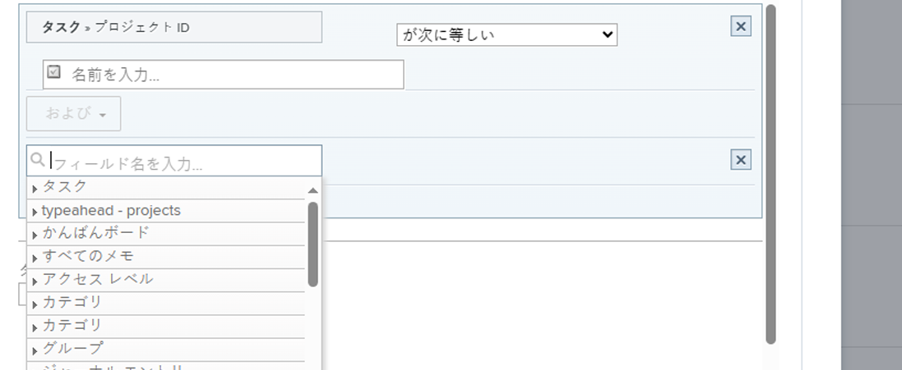
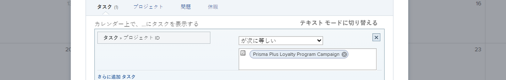

# カレンダーレポートでの[!UICONTROL 予定日]の使用

カレンダーレポートは、作業内容を視覚的に表現する動的なレポートです。カレンダーレポートの[!UICONTROL 予定日]フィールドは、次のオブジェクトに使用できます。

* タスク
* イシュー
* プロジェクト

## アクセス要件

+++ 展開すると、この記事の機能のアクセス要件が表示されます。

この記事の手順を実行するには、次のアクセス権が必要です。

<table style="table-layout:auto"> 
 <col> 
 </col> 
 <col> 
 </col> 
 <tbody> 
  <tr> 
   <td role="rowheader">[!DNL Adobe Workfront plan]</td> 
   <td> 
任意
 </td> 
  </tr> 
  <tr> 
   <td role="rowheader">[!DNL Adobe Workfront] ライセンス</td> 
   <td>
新規：標準

       
または

       
現在：プラン
</td> 
  </tr> 
  <tr> 
   <td role="rowheader">アクセスレベル設定</td> 
   <td> 
[!UICONTROL Reports]、[!UICONTROL Dashboards]、および[!UICONTROL Calendars]に対する[!UICONTROL Edit]アクセス権
</td> 
  </tr> 
  <tr> 
   <td role="rowheader">オブジェクト権限</td> 
   <td>カレンダーレポートに対する [!UICONTROL Manage] 権限</td> 
  </tr> 
 </tbody> 
</table>

この表の情報について詳しくは、[Workfront ドキュメントのアクセス要件](/help/quicksilver/administration-and-setup/add-users/access-levels-and-object-permissions/access-level-requirements-in-documentation.md)を参照してください。

+++

## 項目のグループを設定

カレンダーに表示する項目のグループの表示方法を選択できます。

{{step1-to-calendars}}

1. 新しいアイテム グループを追加するカレンダーを選択します。
または
「**[!UICONTROL +新規カレンダ」をクリックし]** カレンダ名を入力します。

   >[!NOTE]
   >
   >カレンダーレポートを作成するには、アクセスレベルでレポート、ダッシュボード、カレンダーの編集アクセス権が必要です。

1. 左側で、「**[!UICONTROL カレンダーに追加]**」、「**[!UICONTROL 詳細項目を追加]**」の順にクリックします。

1. 以下を指定します。

   <table style="table-layout:auto">
    <col>
    <col>
    <tbody>
     <tr>
      <td role="rowheader"><strong>[!UICONTROL Name this group of items]</strong></td>
      <td>項目のグループの名前を入力します。</td>
     </tr>
     <tr>
      <td role="rowheader"><strong>[!UICONTROL Color]</strong></td>
      <td>項目のグループの色を選択します。カレンダーレポートには、すべての項目が選択した色で表示されます。</td>
     </tr>
     <tr>
      <td role="rowheader"><strong>[!UICONTROL Date Field]</strong></td>
      <td>
<strong>[!UICONTROL Planned dates]</strong> を選択します。予定日について詳しくは、次を参照してください。 

       <ul>
        <li><a href="../../../manage-work/projects/planning-a-project/project-planned-start-date.md" class="MCXref xref">プロジェクトの予定開始日の概要</a></li>
        <li><a href="../../../manage-work/tasks/task-information/task-planned-start-date.md" class="MCXref xref">タスクの予定開始日の概要</a></li>
        <li><a href="../../../manage-work/tasks/task-information/task-planned-completion-date.md" class="MCXref xref">タスクの予定完了日の概要</a></li>
        <li><a href="../../../manage-work/projects/planning-a-project/project-planned-completion-date.md" class="MCXref xref">プロジェクトの予定完了日を設定</a> </li>
       </ul></td>
     </tr>
     <tr>
      <td role="rowheader"><strong>カレンダー</strong></td>
      <td>
日付の表示方法を選択します。

       <ul>
        <li><strong>[!UICONTROL Start Date Only]</strong>：カレンダーには、単一の日付のオブジェクトが表示されます。</li>
        <li><strong>[!UICONTROL End Date Only]</strong>：カレンダーには、単一の日付のオブジェクトが表示されます。</li>
        <li><strong>[!UICONTROL Duration] (Start to End)</strong>：カレンダーには、数日間にわたるオブジェクトが表示されます。</li>
       </ul></td>
     </tr>
     <tr data-mc-conditions="">
      <td role="rowheader"><strong>[!UICONTROL Switch to actual dates when available]</strong></td>
      <td>
カレンダーは、利用可能になると自動的に実際の日付に切り替わります。 <strong>[!UICONTROL Yes]</strong> または <strong>[!UICONTROL No]</strong> を選択して、実際の日付に切り替えます（利用可能な場合）。実際の日付について詳しくは、次を参照してください：

       <ul>
        <li><a href="../../../manage-work/projects/planning-a-project/project-actual-start-date.md" class="MCXref xref">プロジェクトの実際の開始日の概要 </a></li>
        <li><a href="../../../manage-work/projects/planning-a-project/project-actual-completion-date.md" class="MCXref xref">プロジェクトの実際の完了日の概要 </a></li>
       </ul></td>
     </tr>
    </tbody>
   </table>

1. 次のセクションに進みます。

## 項目のグループにオブジェクトを追加

項目の表示方法を設定した後、カレンダーに表示するオブジェクトをグループに追加する必要があります。

1. 「**[!UICONTROL カレンダーに何を追加しますか？]**」セクションで、次を選択します。

   * **[!UICONTROL タスク]**
   * **[!UICONTROL プロジェクト]**
   * **[!UICONTROL イシュー]**

1. カレンダーに追加するオブジェクトタイプに応じて、「**[!UICONTROL タスクを追加]**」、「**[!UICONTROL プロジェクトを追加]**」または「**[!UICONTROL イシューを追加]**」をクリックします。
   

1. ドロップダウンメニューで、フィールド名を入力し、カレンダーに表示するオブジェクトのフィールドソース（**[!UICONTROL 遅延タスク]**&#x200B;など）を選択します。
1. カレンダーのグループ化の条件文を設定します。

   

   条件の設定について詳しくは、[フィルターおよび条件修飾子](../../../reports-and-dashboards/reports/reporting-elements/filter-condition-modifiers.md)を参照してください。

1. （オプション）手順 1 ～ 4 を繰り返して、カレンダーのグループ化に使用する追加のオブジェクトを指定します。
1. **[!UICONTROL タスク／プロジェクト／イシューのラベルを次の値に設定…]**&#x200B;フィールドで、このカレンダーグループ内のオブジェクトにカレンダー内でどのようにラベルを付けるかを選択します。

   >[!NOTE]
   >
   >特定のオブジェクトに対してデフォルトのラベルオプションがない場合は、代わりにオブジェクト名が表示されます。例えば、[!UICONTROL 親タスク]ラベルが選択されているのに、オブジェクトに関連付けられている親タスクがない場合、[!DNL Adobe Workfront] にはカレンダーに表示されているオブジェクト名が表示されます。

1. 「**[!UICONTROL 保存]**」をクリックします。
