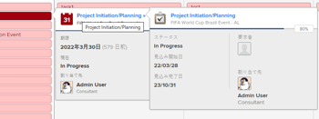

# カレンダーレポートとイベントの詳細を表示

Adobe Workfront で作成または共有したカレンダーレポートおよびイベントの詳細を表示できます。

## アクセス要件

この記事の手順を実行するには、次のアクセス権が必要です。

<table style="table-layout:auto"> 
 <col> 
 </col> 
 <col> 
 </col> 
 <tbody> 
  <tr> 
   <td role="rowheader"><strong>[!DNL Adobe Workfront plan*]</strong></td> 
   <td> 
任意
 </td> 
  </tr> 
  <tr> 
   <td role="rowheader"><strong>[!DNL Adobe Workfront] ライセンス*</strong></td> 
   <td> 
[!UICONTROL Request] 以降
 </td> 
  </tr> 
  <tr> 
   <td role="rowheader"><strong>アクセスレベル設定*</strong></td> 
   <td> 
[!UICONTROL Reports]、[!UICONTROL Dashboards]および[!UICONTROL Calendars]に対する[!UICONTROL View]以上のアクセス権
 
メモ：アクセス権がない場合は、アクセスレベルに追加の制限が設定されているかを [!DNL Workfront] 管理者にお問い合わせください。[!DNL Workfront] 管理者がアクセスレベルを変更する方法について詳しくは、<a href="../../../administration-and-setup/add-users/configure-and-grant-access/create-modify-access-levels.md" class="MCXref xref">カスタムアクセスレベルの作成または変更</a>を参照してください。
 </td> 
  </tr> 
  <tr> 
   <td role="rowheader"><strong>オブジェクト権限</strong></td> 
   <td> 
カレンダーレポートに対する[!UICONTROL View]以上の権限
 
追加のアクセス権のリクエストについて詳しくは、<a href="../../../workfront-basics/grant-and-request-access-to-objects/request-access.md" class="MCXref xref">オブジェクトへのアクセスのリクエスト</a>を参照してください。
 </td> 
  </tr> 
 </tbody> 
</table>

&#42;ご利用のプラン、ライセンスタイプまたはアクセス権を確認するには、[!DNL Workfront] 管理者にお問い合わせください。

## カレンダーレポートの表示

1. [!DNL Adobe Workfront] の右上隅にある&#x200B;**[!UICONTROL メインメニュー]**&#x200B;アイコン 、「**[!UICONTROL カレンダー]**」の順にクリックします。

   アクセスレベルに応じて、次のカレンダーが表示される場合があります。

   * デフォルトの [!DNL Adobe Workfront] カレンダー

     Workfront は、自分に割り当てられているプロジェクト、タスクおよびイシューに基づいて、または自分が割り当てられているチーム、グループまたは役割に基づいて、ユーザー用のカレンダーを作成します。
   * 作成したカレンダー

     カレンダーの作成について詳しくは、[カレンダーレポートの概要](../../../reports-and-dashboards/reports/calendars/calendar-reports-overview.md)を参照してください。

   * 他のユーザーが共有したカレンダー

     カレンダーの共有については、[[!UICONTROL カレンダーの共有]レポート](../../../reports-and-dashboards/reports/calendars/share-a-calendar-report.md)を参照してください。

1. （条件付き）**[!UICONTROL 表示]**&#x200B;ドロップダウンリストをクリックして、表示するカレンダー期間を選択します。\
   \
   次のカレンダーレポートビューから選択できます。

   * **[!UICONTROL 月]**：4 週間のカレンダーを表示します
   * **[!UICONTROL 週]**：1 週間のカレンダーを表示します
   * **[!UICONTROL ガント]**：カレンダーの連続ビューを表示します

     ![[!UICONTROL ガント]カレンダーレポート](assets/gantt-calendar-report.png)
下方向にまたは横方向にスクロールすることで、他のイベントを[!UICONTROL ガント]ビューで表示できます。ビューのデータが入力されると、読み込み記号が表示されます。
   >[!NOTE]
   >
   >[!UICONTROL 月]のビューおよび[!UICONTROL 週]のビューでは、現在または将来のイベント（今日の日付または将来の日付を含められた複数日にわたるイベントを含む）には、プロジェクトまたはカレンダーグループの色に対応する網掛けが適用されます。過去のイベントの淡色の網掛けで表示され、現在のイベントではないことを示しますが、これらのイベントを選択して表示することはできます。

1. （オプション）カレンダーを[!UICONTROL 月]のビューまたは[!UICONTROL 週]のビューで表示する場合、次のオプションを使用してカレンダー表示を変更できます。

   * 週末を含めるか除外するには、次の手順に従います。

      1. **[!UICONTROL カレンダー]**&#x200B;ツールバーで、「**[!UICONTROL カレンダーアクション]**」をクリックし、ドロップダウンリストから「**[!UICONTROL 週末を表示]**」または「**[!UICONTROL 週末を非表示にする]**」を選択します。
   * 表示される日付をすばやく変更するには、次の手順に従います。

      1. **[!UICONTROL カレンダー]**&#x200B;ツールバーで、日付インジケーターの左向き矢印をクリックするとカレンダーが戻り、右向き矢印をクリックすると進みます。

         \
         表示される日付は、現在のカレンダービューに基づく間隔で調整されます。例えば、[!UICONTROL 週]のビューでカレンダーを表示している場合、選択した矢印に応じて、1 週間後に進むかまたは 1 週間前に戻った表示になります。

      1. （オプション）現在の日付に戻るには、「**本日**」をクリックします。

1. （オプション）カレンダーをフルスクリーンで表示するには、**[!UICONTROL カレンダー]**ツールバーの右側にあるフルスクリーン矢印をクリックします。
   \
   Esc を押すと、カレンダーの通常の表示に戻ります。

1. （オプション）カレンダーにリンクされたプロジェクトまたはカレンダーのグループ化のイベントを非表示にするには、プロジェクトリストのプロジェクトまたはカレンダーのグループ化をオフにします。
   \
   イベントを再度表示するには、プロジェクトリストで[!UICONTROL プロジェクト]またはカレンダーのグループ化を選択します。

## カレンダーレポートイベントの詳細を表示

現在のイベントおよび過去のイベントの詳細は、カレンダーに表示されます。

1. 詳細が必要なイベントに移動し、イベントをクリックします。\
   イベントの詳細ページが開きます。\
   

1. （オプション）オブジェクトの追加の詳細を表示するには、次の手順に従います。

   1. プロジェクト名、タスク名またはイシュー名の上にポインタを合わせます。

      オブジェクトの詳細ページが開きます。\
      

   1. （オプション）関連するプロジェクト、タスクまたはイシューを開くには、オブジェクトのタイトルをクリックします。
   1. （オプション）開いているすべての詳細ページを閉じるには、イベントの詳細ページの外側の任意の場所をクリックします。
