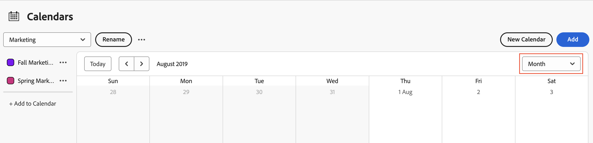

# カレンダーレポートとイベントの詳細を表示

Adobe Workfrontで作成または共有したカレンダーレポートおよびイベントの詳細を表示できます。

## アクセス要件

この記事の手順を実行するには、次のアクセス権が必要です。

<table style="table-layout:auto"> 
 <col> 
 </col> 
 <col> 
 </col> 
 <tbody> 
  <tr> 
   <td role="rowheader"><strong>[!DNL Adobe Workfront plan*]</strong></td> 
   <td> 
任意
 </td> 
  </tr> 
  <tr> 
   <td role="rowheader"><strong>[!DNL Adobe Workfront] ライセンス*</strong></td> 
   <td> 
[!UICONTROL リクエスト ] 以降
 </td> 
  </tr> 
  <tr> 
   <td role="rowheader"><strong>アクセスレベル設定*</strong></td> 
   <td> 
[!UICONTROL レポート ]、[!UICONTROL ダッシュボード ] および [!UICONTROL カレンダー ] への [!UICONTROL 表示 ] 以降のアクセス権
 
注意：まだアクセス権がない場合は、 [!DNL Workfront] 管理者（アクセスレベルに追加の制限を設定している場合） を参照してください。 [!DNL Workfront] 管理者はアクセスレベルを変更できます。詳しくは、 <a href="../../../administration-and-setup/add-users/configure-and-grant-access/create-modify-access-levels.md" class="MCXref xref">カスタムアクセスレベルの作成または変更</a>.
 </td> 
  </tr> 
  <tr> 
   <td role="rowheader"><strong>オブジェクト権限</strong></td> 
   <td> 
カレンダーレポートに対する [!UICONTROL 表示 ] 以上の権限
 
追加のアクセス権のリクエストについて詳しくは、 <a href="../../../workfront-basics/grant-and-request-access-to-objects/request-access.md" class="MCXref xref">オブジェクトへのアクセスのリクエスト</a>.
 </td> 
  </tr> 
 </tbody> 
</table>

&#42;ご利用のプラン、ライセンスの種類、アクセス権を確認するには、 [!DNL Workfront] 管理者。

## カレンダーレポートの表示

1. 次をクリック： **[!UICONTROL メインメニュー]** アイコン  右上隅に [!DNL Adobe Workfront]を選択し、「 **[!UICONTROL カレンダー]**.

   アクセスレベルに応じて、次のカレンダーが表示される場合があります。

   * デフォルト [!DNL Adobe Workfront] カレンダー\

      Workfrontは、自分に割り当てられているプロジェクト、タスク、問題に基づいて、または自分が割り当てられているチーム、グループ、またはロールに割り当てられている問題に基づいて、ユーザー用のカレンダーを作成します。
   * 作成したカレンダー\

      カレンダーの作成については、 [カレンダーレポートの概要](../../../reports-and-dashboards/reports/calendars/calendar-reports-overview.md).

   * 他のユーザーが共有したカレンダー\

      カレンダーの共有については、 [[!UICONTROL カレンダーの共有] レポート](../../../reports-and-dashboards/reports/calendars/share-a-calendar-report.md).

1. （条件付き） **[!UICONTROL 表示]** 」ドロップダウンリストから、表示するカレンダー期間を選択します。\
   \
   次のカレンダーレポート表示から選択できます。

   * **[!UICONTROL 月]**:カレンダーの 4 週間を表示
   * **[!UICONTROL 週]**:1 週間のカレンダーを表示
   * **[!UICONTROL ガント]**:カレンダーの連続表示を表示します\

      ![[!UICONTROL ガント] カレンダーレポート](assets/gantt-calendar-report.png)
他のイベントは [!UICONTROL ガント] 下または横にスクロールして表示します。 ビューのデータが入力されると、読み込み記号が表示されます。
   >[!NOTE]
   >
   >内 [!UICONTROL 月] および [!UICONTROL 週] 現在または将来のビュー、イベント（今日または将来の日を含む複数日にわたるイベントを含む）には、プロジェクトまたはカレンダーグループの色に対応する網掛けが適用されます。 過去のイベントの網掛けは薄くなり、現在のイベントではないことを示しますが、これらのイベントを選択して表示することはできます。

1. （オプション） [!UICONTROL 月] または [!UICONTROL 週] 表示では、次のオプションを使用してカレンダー表示を変更できます。

   * 週末を含めるか除外するには：

      1. の **[!UICONTROL カレンダー]** ツールバー、クリック **[!UICONTROL カレンダーアクション]**&#x200B;を選択し、ドロップダウンリストから次のいずれかを選択します。 **[!UICONTROL 週末を表示]** または **[!UICONTROL 週末を非表示]**.
   * 表示される日付をすばやく変更するには：

      1. の **[!UICONTROL カレンダー]** ツールバーで、日付インジケーターの左向き矢印をクリックしてカレンダーに戻るか、右向き矢印をクリックして前に進みます。\

         \
         表示される日付は、現在のカレンダー表示に基づいて間隔で調整されます。 例えば、 [!UICONTROL 週] カレンダーには、選択した矢印に応じて、1 週間前または 1 週間前のいずれかが表示されます。

      1. （オプション）現在の日付に戻るには、 **Today**.

1. （オプション）カレンダーをフルスクリーンで表示するには、 **[!UICONTROL カレンダー]** ツールバー。
   \
   カレンダーの通常の表示に戻るには、 Esc キーを押します。

1. （オプション）カレンダーにリンクされたプロジェクトまたはカレンダーのグループ化のイベントを非表示にするには、プロジェクト一覧のプロジェクトまたはカレンダーのグループ化をオフにします。
   \
   イベントを再度表示するには、 [!UICONTROL プロジェクト] またはカレンダーのグループ化がプロジェクトリストに含まれています。

## カレンダーレポートイベントの詳細を表示

現在および過去のイベントの詳細は、カレンダーに表示されます。

1. 詳細を知るイベントに移動し、イベントをクリックします。\
   イベントの詳細ページが開きます。\
   

1. （オプション）オブジェクトの追加の詳細を表示するには、次の手順に従います。

   1. プロジェクト名、タスク名またはイシュー名の上にマウスポインターを置きます。

      オブジェクトの詳細ページが開きます。\
      

   1. （オプション）関連するプロジェクト、タスクまたはイシューを開くには、オブジェクトのタイトルをクリックします。
   1. （オプション）開いているすべての詳細ページを閉じるには、イベントの詳細ページの外側の任意の場所をクリックします。
