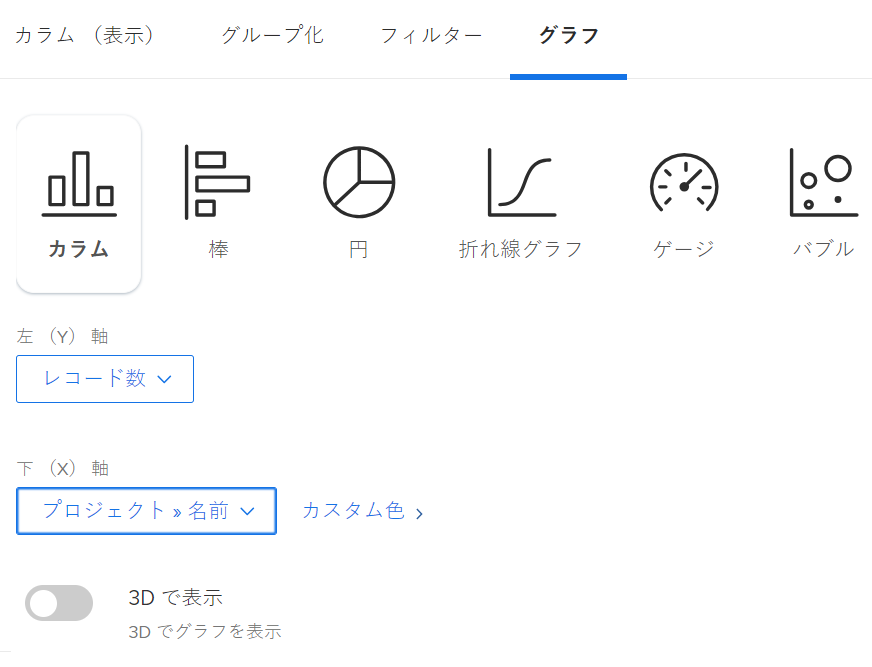
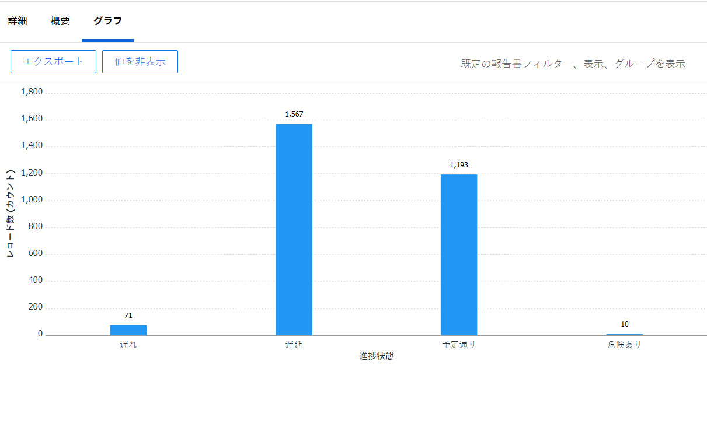
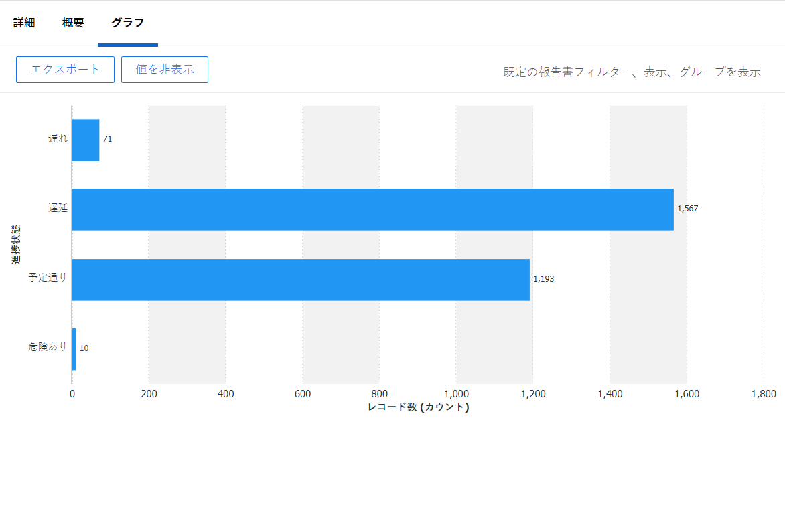
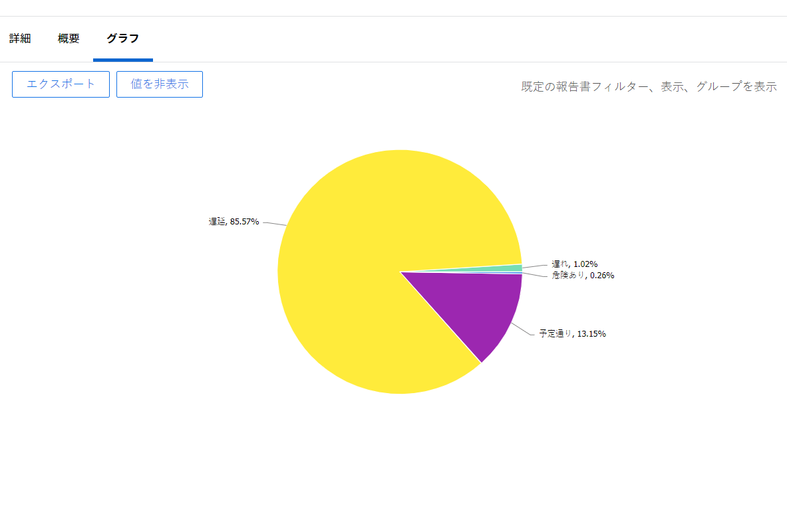
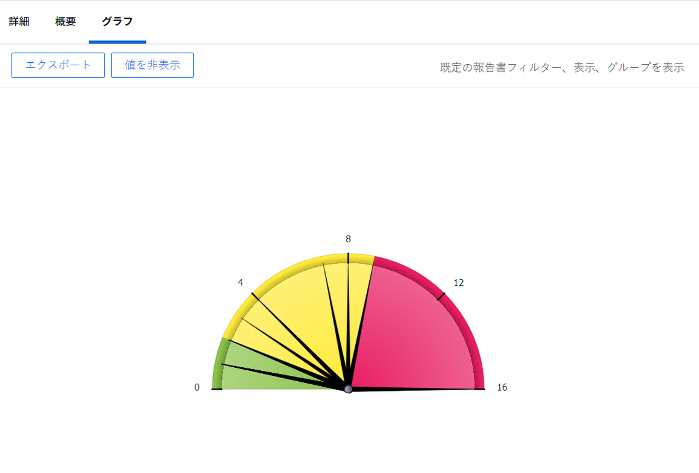
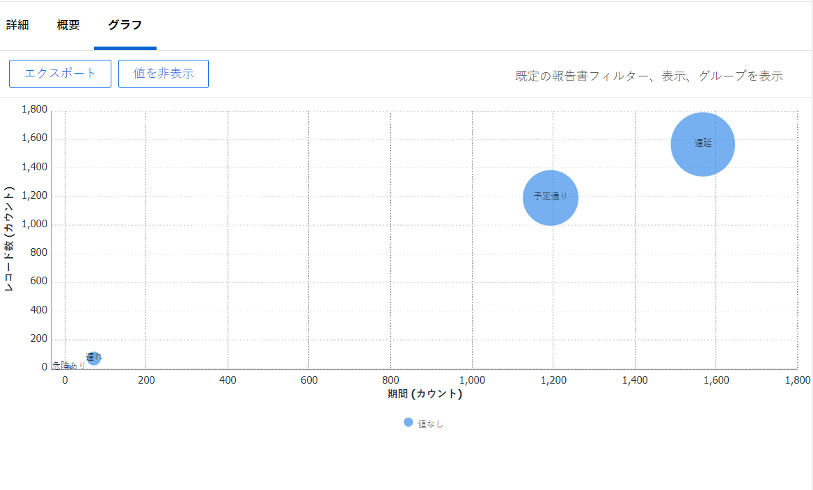
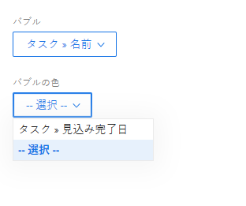
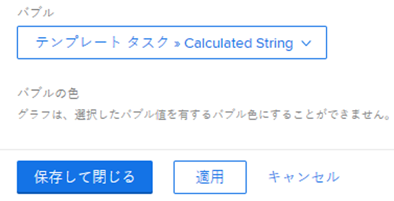
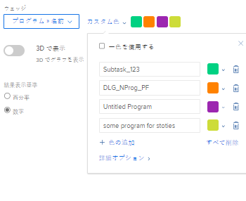

# レポートにグラフを追加する

<!--Audited: 01/2024-->

グラフを追加すると、レポートの内容をより充実させることができます。 既存のレポートまたは作成するレポートにグラフを追加できます。

レポートにグラフを追加する前に、レポートのビューとグループを作成する必要があります。

最初にレポート内の情報をグループ化しない限り、ほとんどのレポートにグラフを追加できません。 グループ化なしで追加できるグラフはゲージグラフのみです。

ビューについて詳しくは、 [Adobe Workfrontの概要を表示](../../../reports-and-dashboards/reports/reporting-elements/views-overview.md).

グループ化について詳しくは、 [Adobe Workfrontでのグループ化の概要](../../../reports-and-dashboards/reports/reporting-elements/groupings-overview.md).

レポートに表示される項目が多すぎる場合、グラフは作成されません。 この場合、レポートにフィルターを追加して、レポートの結果数を減らす必要があります。

フィルターについて詳しくは、 [フィルターの概要](../../../reports-and-dashboards/reports/reporting-elements/filters-overview.md).

## アクセス要件

この記事の手順を実行するには、次のアクセス権が必要です。

<table style="table-layout:auto"> 
 <col> 
 <col> 
 <tbody> 
  <tr> 
   <td role="rowheader">Adobe Workfrontプラン</td> 
   <td> 
任意
 </td> 
  </tr> 
  <tr> 
   <td role="rowheader">Adobe Workfront license*</td> 
   <td> 
現在：プラン 

   または
   
新規：標準
 </td> 
  </tr> 
  <tr> 
   <td role="rowheader">アクセスレベルの設定</td> 
   <td> 
レポート、ダッシュボード、カレンダーへのアクセスを編集
 
フィルター、ビュー、グループへのアクセスを編集
 </td> 
  </tr> 
  <tr> 
   <td role="rowheader">オブジェクトの権限</td> 
   <td> 
レポートに対する権限の管理
  </td> 
  </tr> 
 </tbody> 
</table>

&#42;保有するプラン、ライセンスの種類、アクセス権を確認するには、Workfront管理者に問い合わせてください。 アクセス要件について詳しくは、 [Workfrontドキュメントのアクセス要件](/help/quicksilver/administration-and-setup/add-users/access-levels-and-object-permissions/access-level-requirements-in-documentation.md).

## レポートにグラフを追加する

1. 既存のレポートに移動するか、新しいレポートを作成します。 新しいレポートの作成について詳しくは、 [カスタムレポートの作成](../../../reports-and-dashboards/reports/creating-and-managing-reports/create-custom-report.md).
1. （条件付き）既存のレポートに移動した場合、 **レポートのアクション** > **編集**.

1. 次の点を確認します。 **列（表示）** 」タブが更新され、レポートに表示する情報が変更されました。

   レポートのビューを作成または変更する方法について詳しくは、 [Adobe Workfrontでビューを作成または編集](/help/quicksilver/reports-and-dashboards/reports/reporting-elements/create-edit-views.md).

1. 次をクリック： **グループ化** 」タブをクリックし、グループを追加します。

   >[!TIP]
   >
   >* レポートの結果がグループ化されている場合は、グラフをレポートに追加することのみ可能です。
   >* グラフでは、テキストモードのグループ化はサポートされていません。 テキストモードのグループ化について詳しくは、 [グループ化でのテキストモードの編集](../../../reports-and-dashboards/reports/text-mode/edit-text-mode-in-grouping.md).
   >* 1 つの指標を表す 1 つのグループ化を追加した場合、円グラフを除くすべてのグラフで、グループ化の結果が同じ色で表示されます。

   グループ化の作成について詳しくは、 [Adobe Workfrontでのグループ化の作成](/help/quicksilver/reports-and-dashboards/reports/reporting-elements/create-groupings.md).

1. を選択します。 **グラフ** タブをクリックします。
1. グラフのタイプをクリックして選択します。\
   

1. 次のタイプのグラフから選択します。

   * [縦棒グラフ](#column-chart)
   * [棒グラフ](#bar-chart)
   * [円グラフ](#pie-chart)
   * [折れ線グラフ](#line-chart)
   * [ゲージグラフ](#gauge-chart)
   * [バブルチャート](#bubble-chart)

1. クリック **保存して閉じる** をクリックして、グラフとレポートを保存します。

### 縦棒グラフ {#column-chart}

を追加するには、以下を実行します。 **列** グラフをレポートに追加します。

1. レポートへのグラフの追加を開始します ( [レポートにグラフを追加する](#add-a-chart-to-a-report).
1. Adobe Analytics の **左 (Y) 軸** 「 」フィールドで、グラフの Y 軸に含める値と、情報の要約方法を選択します。
1. Adobe Analytics の **下 (X) 軸** 「 」フィールドで、グラフに含めるグループ化を選択します。
1. （オプション）「 」を選択します。 **カスタムカラー** を使用して、各列に好みの色を割り当てます。\
   グラフの色のカスタマイズの詳細については、「 [グラフの色のカスタマイズ](#customize-chart-colors).

1. （オプション）「 」を選択します。 **3D で表示** をクリックして、グラフを 3 次元ビューで表示します。
1. （オプション） **グループ列**：このオプションを選択し、列のグループ化方法を定義します。\
   次のオプションから選択します。

   * 次のいずれかのオプションをクリックして、グループ化された列の表示方法を選択します。

      * **並べて表示**
      * **積み重ね**
      * **100%に積み重ね**

   * グラフに含めるグループを **データのグループ化基準** ドロップダウンメニュー。
   * （オプション）「 」を選択します。 **カスタムカラー** 列の色をカスタマイズする場合。\
     グラフの色のカスタマイズの詳細については、「 [グラフの色のカスタマイズ](#customize-chart-colors).

1. （オプション）「 」を選択します。 **組み合わせグラフ** を使用して、グラフに追加の値を含め、情報の要約方法を指定します。\
   次のオプションを考慮してください。

   * **セカンダリ軸にプロット**：データをグラフの右側にプロットするには、このオプションを選択します。
   * **グラフのタイプ**：この追加の値を行と 3 列のどちらで表示するかを選択します。\
     

1. クリック **保存して閉じる** をクリックして、グラフとレポートを保存します。

### 棒グラフ {#bar-chart}

を追加するには、以下を実行します。 **棒グラフ** グラフをレポートに追加します。

1. レポートへのグラフの追加を開始します ( [レポートにグラフを追加する](#add-a-chart-to-a-report).
1. Adobe Analytics の **下 (X) 軸** 「 」フィールドで、グラフの X 軸に含める値と、情報の要約方法を選択します。
1. Adobe Analytics の **左 (Y) 軸** 「 」フィールドで、グラフに含めるグループ化を選択します。
1. （オプション）「 」を選択します。 **カスタムカラー** をクリックして、バーの色をカスタマイズします。\
   グラフの色のカスタマイズの詳細については、「 [グラフの色のカスタマイズ](#customize-chart-colors).

1. （オプション）「 」を選択します。 **3D で表示** をクリックして、グラフを 3 次元ビューで表示します。
1. （オプション）「 」を選択します。 **グループバー** を使用して、バーのグループ化方法を定義します。\
   次のオプションから選択します。

   * 次のオプションの 1 つをクリックして、グループ化されたバーの表示方法を選択します。

      * **並べて表示**
      * **積み重ね**
      * **100%に積み重ね**

   * グラフ内の情報をグループ化する方法を、 **データのグループ化基準** ドロップダウンメニュー。
   * （オプション）「 」を選択します。 **カスタムカラー** 列の色をカスタマイズする場合。\
     グラフの色のカスタマイズの詳細については、「 [グラフの色のカスタマイズ](#customize-chart-colors).

1. （オプション）「 」を選択します。 **組み合わせグラフ** を使用して、グラフに追加の値を含め、情報の要約方法を指定します。\
   

1. クリック **保存して閉じる** をクリックして、グラフとレポートを保存します。

### 円グラフ {#pie-chart}

を追加するには、以下を実行します。 **円グラフ** グラフをレポートに追加します。

1. レポートへのグラフの追加を開始します ( [レポートにグラフを追加する](#add-a-chart-to-a-report).
1. Adobe Analytics の **値** 「 」フィールドで、レポートに表示する値と、それらの要約方法を選択します。\
   Adobe Analytics の **ウェッジ** 「 」フィールドで、グラフに含めるグループ化を選択します。 グループ化は、グラフのくさびで表されます。

1. （オプション）「 」を選択します。 **カスタムカラー** グラフ上のくさびの色をカスタマイズするには\
   グラフの色のカスタマイズの詳細については、「 [グラフの色のカスタマイズ](#customize-chart-colors).

1. （オプション）「 」を選択します。 **3D で表示** をクリックして、グラフを 3 次元ビューで表示します。
1. Adobe Analytics の **結果の表示形式** 「 」フィールドで、結果をグラフに表示する方法を選択します。 次のオプションを考慮してください。

   * **割合**：グラフの結果は、割合で表示されます。
   * **数値**：グラフの結果は数値で表示されます。\
     

1. クリック **保存して閉じる** をクリックして、グラフとレポートを保存します。

### 折れ線グラフ {#line-chart}

を追加するには、以下を実行します。 **線** グラフをレポートに追加します。

1. レポートへのグラフの追加を開始します ( [レポートにグラフを追加する](#add-a-chart-to-a-report).
1. Adobe Analytics の **左 (Y) 軸** 「 」フィールドで、グラフの Y 軸に含める値と、情報の要約方法を選択します。
1. Adobe Analytics の **下 (X) 軸** 「 」フィールドで、グラフに含めるグループ化を選択します。
1. （オプション）線の色をカスタマイズする色を選択します。
1. （オプション）「 」を選択します。 **グループライン**&#x200B;をクリックして、グラフの追加のグループを選択します。\
   （オプション）「 」を選択します。 **カスタムカラー** をクリックして、新しいグループの色をカスタマイズします。\
   グラフの色のカスタマイズの詳細については、「 [グラフの色のカスタマイズ](#customize-chart-colors).

1. （オプション）「 」を選択します。 **組み合わせグラフ** を使用して、行を追加の値で組み合わせます。\
   次のオプションを考慮してください。

   * グラフに含める値と、情報の要約方法を選択します。
   * を選択します。 **セカンダリ軸にプロット** フィールドを使用して、データをグラフの右側にプロットします。\
     

1. クリック **保存して閉じる** をクリックして、グラフとレポートを保存します。

### ゲージグラフ {#gauge-chart}

A **ゲージ** グラフには、特定の条件を満たすレコードの数がゲージ形式で表示されます。 ゲージの指標は、レポートの表示とグループ化で選択した条件を満たすレコードの数を指します。 ゲージグラフを設定する場合、レポートのグループ化は必要ありません。

を追加するには、以下を実行します。 **ゲージ** グラフをレポートに追加します。

1. レポートへのグラフの追加を開始します ( [レポートにグラフを追加する](#add-a-chart-to-a-report).
1. Adobe Analytics の **値** 「 」フィールドで、レポートに表示する値と、それらの要約方法を選択します。 次を選択した場合、 **レコード数**&#x200B;の場合、表示される値はレポートのオブジェクトです。

1. Adobe Analytics の **指標** 「 」フィールドで、グラフに含めるグループ化を選択します。 グループ化は、グラフ上の指標の線で表されます。\
   2 つの項目を含むグループ化がある場合、2 つの指標がグラフに表示されます。\
   たとえば、プロジェクトステータスのグループ化があり、2 つのプロジェクトステータス（「現在」と「保留中」）がある場合、ゲージグラフには 2 つのゲージインジケータが含まれます。 このステータスのプロジェクトの数が示されます。\
   （オプション）「 」を選択します。 **合計** （内） **指標** フィールド： **値** フィールドに入力します。

1. Adobe Analytics の **値の範囲** 「 」フィールドで、値の範囲とゲージグラフに表示する値を表す色を指定します。
1. （オプション）「 **別の値範囲を追加** をクリックして、グラフに値範囲を追加します。\
   

1. クリック **保存して閉じる** をクリックして、グラフとレポートを保存します。

### バブルチャート {#bubble-chart}

1 つのオブジェクトの最大 3 つのフィールドを 1 つに表示できます **バブル** グラフ。 つまり、バブルチャートには最大 4 つのデータポイントを表示できます。 3 つのフィールドが関連付けられた各エンティティは、X 軸と Y 軸内の位置にある 2 つのフィールドを表す円として表示されます。 3 番目のフィールドは、円のサイズで表されます。

を追加するには、以下を実行します。 **バブル** グラフをレポートに追加します。

1. レポートへのグラフの追加を開始します ( [レポートにグラフを追加する](#add-a-chart-to-a-report).
1. Adobe Analytics の **左 (Y) 軸** 「 」フィールドで、グラフの Y 軸に含める値を選択します。 値はレポートのビューから取得されます。 情報の要約方法を指定します。
1. Adobe Analytics の **下 (X) 軸フィールド**」で、グラフの X 軸に含める値を選択します。 値はレポートのビューから取得されます。 情報の要約方法を指定します。

   >[!NOTE]
   >
   >このフィールドをアクティブにするために要約された列が少なくとも 1 つあることを確認します。\
   >レポート列の情報の要約について詳しくは、 [カスタムレポートの作成](../../../reports-and-dashboards/reports/creating-and-managing-reports/create-custom-report.md).

1. Adobe Analytics の **バブルサイズ** 「 」フィールドで、グラフ内のバブルのサイズを基準に表す値を選択します。 値はレポートのビューから取得されます。 情報の要約方法を指定します。

   >[!NOTE]
   >
   >このフィールドをアクティブにするために要約された列が少なくとも 1 つあることを確認します。\
   >レポート列の情報の要約について詳しくは、 [カスタムレポートの作成](../../../reports-and-dashboards/reports/creating-and-managing-reports/create-custom-report.md).

1. Adobe Analytics の **バブル** 「 」フィールドで、グラフに含めるグループ化を選択します。 グループ化は、グラフ上のバブルの配置で表されます。
1. Adobe Analytics の **バブルの色** [ 吹き出しの色 ] フィールドで、吹き出しの色で表すフィールドを選択します。

   

   The **バブルの色** は、レポートで定義したグループにすることができますが、 **名前** 列に表示されます。 **バブル** フィールドに入力します。

   例えば、 **タスク名** タスクレポートで、 **タスクステータス** として **バブルの色** フィールドに入力します。

   

   ただし、 **タスクステータス** （の） **バブル** フィールドに値を入力する場合、 **バブルの色** フィールドに入力します。 また、 **プロジェクト名** （の） **バブルの色** フィールド（選択した場合も） **タスク名** （の） **バブル** フィールドに入力します。

   

1. クリック **保存して閉じる** をクリックして、インターフェイスビルダーの変更を保存します。

## グラフのエクスポート

グラフを.pdf ファイルにエクスポートできます。

グラフをエクスポートするには：

1. クリック **書き出し** グラフを.pdf にエクスポートするには\
   .pdf ファイルがコンピューターにダウンロードされます。

1. .pdf ファイルを開きます。\
   書き出されるファイルには、次の情報が含まれます。

   * グラフの画像。
   * レポートの名前であるタイトル。
   * レポートの名前を表す一意のファイル名。
   * レポートがエクスポートされた日時とページ番号を含むフッター。

## グラフの色のカスタマイズ {#customize-chart-colors}

Workfrontでグラフの要素の色を選択したり、レポートにグラフを追加する際にカスタマイズしたりできます。 実際の完了日別にグループ化されたタスク数を示すタスクレポートなど、1 つの指標を表す単一のグループ化がグラフに含まれる場合、グループ化の結果は同じ色で表示されます。

レポートの「表示」に表示されるフィールドの色は 1 つだけ選択できます。 「レポートのグループ化」に表示されるフィールドに対して、各オプションに対して 1 つずつ、複数の色を選択できます。

>[!IMPORTANT]
>
>日付フィールドの場合、グラフ要素に選択できる色は 1 つだけです。

グラフの色をカスタマイズするには：

1. レポートを作成する際に、 **グラフ** 」タブをクリックします。
1. レポートに追加するグラフのタイプを選択します。\
   レポートへのグラフの追加について詳しくは、 [レポートにグラフを追加する](#add-a-chart-to-a-report).

1. クリック **カスタムカラー** このフィールドが使用可能な場合。\
   [ カスタム色 ] ダイアログボックスが表示されます。\
   

   >[!NOTE]
   >
   >カスタムカラーは、グループ化できる任意のフィールドと、ビューに表示できる一部のフィールド（カスタムフィールドを含む）に関連付けることができます。 [ 色のカスタム設定 ] ダイアログボックスで選択したフィールドのカスタムフィールドまたはカスタムオプションは、大文字と小文字が区別されます。

1. 次のいずれかのオプションを選択することを検討してください。

   * **1 色を使用**：グラフのすべての要素が、選択した色で表示されます。

      1. 選択したフィールドのオプションの名前を入力し、色を選択します。 このオプションは、グラフで選択した色で表示されます。
      1. （オプション）使用可能なカラーサンプルから選択する代わりに、カラーの 16 進数カラー値を指定します。\
         または\
         16 進数コードをクリックした後に表示されるカラーピッカーをクリックし、別の色を選択します。

   * **カラーを追加**：選択したフィールドのその他のすべての可能なオプションに対して、引き続きカスタム色を追加します。
   * **すべてを削除**：上で選択したフィールドのすべての色とオプションを削除するには、このオプションを選択します。
   * **詳細オプション**：次の選択肢から選択します。

      * **値なし**：このフィールドと色を選択し、「値なし」の項目をグループ化するグラフの列を表示します。 これらの項目は、グループ化で選択したフィールドのオプションでグループ化できない項目です。
      * **その他のすべての値**：このフィールドとカスタム色を選択し、上でオプションが選択されていないその他すべてのグラフ要素を表示します。

        >[!NOTE]
        >
        >最近使用した色は、[ カスタム色 ] ダイアログボックスの上部に表示されます。 最近使用した色にマウスを移動すると、その色に関連付けられているフィールドの名前が表示されます。

1. [ カスタムカラー ] の右上隅にある「x」をクリックして、[ カスタムカラー ] ダイアログボックスを閉じます。 選択した色が自動的に保存されます。
1. クリック **保存して閉じる** をクリックしてグラフを保存し、レポートを実行します。

## レポートからグラフを削除する

レポートからグラフを削除するには、次の手順に従います。

1. を開きます。 **グラフ** 」タブをクリックします。
1. 選択した種類のグラフのアイコンにマウスを移動すると、アイコンの右上隅に「x」ボタンが表示されます。
1. 「x」をクリックしてグラフを削除します。
1. 「**保存して閉じる**」をクリックします。

## グラフを操作する際の制限事項

グラフを使用する際は、次の制限事項に注意してください。

* The **グラフのプレビュー** セクションには、レポートの実際のデータが含まれていません。 グラフを保存し、 **グラフ** 」タブを使用して、グラフとデータを確認できます。

* 一部のグラフ要素は編集できません：

   * フォントの種類や各要素の値のサイズは変更できません。
   * グラフの軸の名前は変更できません。

* グラフの凡例は編集できません。
* グループ化に計算フィールドを使用する場合、グラフ要素をクリックすることはできません。
* グラフに表示できるデータポイントの数は、バブルチャートで 4 つです。 その他のグラフの種類には、2 つまたは最大 3 つのデータポイントが表示されます。
