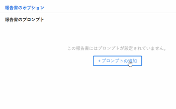
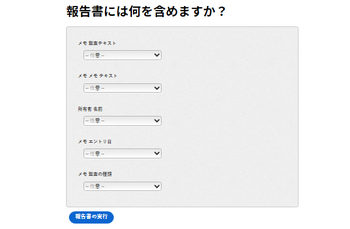

# レポートにプロンプトを追加する

## プロンプトとフィルタの違い

フィルターとプロンプトは、両方ともレポートに表示する情報の量を制限するという意味で似ています。

レポートを実行するたびに、レポートに表示される情報を同じ条件でフィルタリングする場合に、フィルターを作成します。 フィルターは 1 回だけ作成され、レポートにハードコードされます。 フィルターの作成について詳しくは、「 [Adobe Workfrontのフィルターの概要](../../../reports-and-dashboards/reports/reporting-elements/filters-overview.md).

プロンプトは開いたフィルタで、レポートを実行するたびに異なる方法でカスタマイズおよび適用できます。

レポートにプロンプトを追加する場合は、レポートを実行するたびにプロンプト条件を編集することで、フィルタ情報をカスタマイズできます。 レポートは、選択した修飾子に応じて、レポートのフィルターで修飾子を 1 回ハードコーディングするのではなく、毎回異なるフィルターで実行されます。

プロンプトは、レポートを実行する直前に更新できる、レポートに対するカスタマイズ可能なフィルターとして機能します。 汎用レポートを作成し、その日に表示したい情報や、個人が目にする条件のセットに関連する情報に基づいて、結果を絞り込むことができます。 例えば、時間レポートがあり、次の条件に基づいてレポートの情報を変更するとします。

* 時間が記録された日付
* 時間を入力したユーザー
* 入力した時間数

3 つのプロンプトを作成し、条件が必要な基準であり、実行するたびに、プロンプトに対して選択した情報に応じてレポートが異なるように見えます。

フィルターを使用して、Adobe Workfrontに対し、今年の 6 月から 8 月に入力された時間のみを表示するように指示できます。 ただし、プロンプトでは、レポートを実行するたびに異なる時間枠を使用できます（1 月から 2 月、10 月から 12 月など）。

## アクセス要件

この記事の手順を実行するには、次のアクセス権が必要です。

<table style="table-layout:auto"> 
 <col> 
 <col> 
 <tbody> 
  <tr> 
   <td role="rowheader">Adobe Workfront plan*</td> 
   <td> <p>任意</p> </td> 
  </tr> 
  <tr> 
   <td role="rowheader">Adobe Workfront license*</td> 
   <td> <p>計画 </p> </td> 
  </tr> 
  <tr> 
   <td role="rowheader">アクセスレベル設定*</td> 
   <td> <p>レポート、ダッシュボード、カレンダーへのアクセスを編集</p> <p>フィルター、ビュー、グループへのアクセスを編集</p> <p>注意：まだアクセス権がない場合は、Workfront管理者に、アクセスレベルに追加の制限を設定しているかどうかを問い合わせてください。 Workfront管理者がアクセスレベルを変更する方法について詳しくは、 <a href="../../../administration-and-setup/add-users/configure-and-grant-access/create-modify-access-levels.md" class="MCXref xref">カスタムアクセスレベルの作成または変更</a>.</p> </td> 
  </tr> 
  <tr> 
   <td role="rowheader">オブジェクト権限</td> 
   <td> <p>レポートに対する権限の管理</p> <p>追加のアクセス権のリクエストについて詳しくは、 <a href="../../../workfront-basics/grant-and-request-access-to-objects/request-access.md" class="MCXref xref">オブジェクトへのアクセスのリクエスト </a>.</p> </td> 
  </tr> 
 </tbody> 
</table>

&#42;保有しているプラン、ライセンスの種類、アクセス権を確認するには、Workfront管理者に問い合わせてください。

## 前提条件

プロンプトを追加する前に、レポートを作成する必要があります。

レポートの作成手順については、 [レポートの作成](../../../reports-and-dashboards/reports/creating-and-managing-reports/create-report.md)

## プロンプトの作成

1. プロンプトを追加するレポートに移動します。
1. 展開 **レポートのアクション**&#x200B;をクリックし、 **編集**.

1. クリック **レポート設定**.
1. 内 **レポートのプロンプト** 領域、クリック **プロンプトを追加**.\
   

1. （オプション）プロンプトの基にするフィールドを選択します。 フィールドの名前を入力し、リストに表示されたら、クリックして選択します。\
   レポートを実行するユーザーが使用できるオプションは、選択したフィールドによって異なります。\
   たとえば、タスク・レポートで [ 実績完了日 ] などの日付フィールドを選択した場合、プロンプトの名前は「実績完了日」となります。 このレポートの実行中にこのプロンプトを編集する際に、一連の修飾子から選択して、フィルタリング文を作成できます。 この手順は、フィルターを作成する場合と同じです。 モディファイヤの詳細については、 [フィルターおよび条件修飾子](../../../reports-and-dashboards/reports/reporting-elements/filter-condition-modifiers.md).

1. （条件付き）クリック **カスタムプロンプト** をクリックして、カスタムプロンプトを作成します。

   カスタムプロンプトは、レポートを実行する前にフィルタリング条件をハードコード化する、事前定義されたプロンプトです。 この意味で、カスタムプロンプトは、プロンプトよりもフィルタに近いものです。

   ただし、プロンプトは通常のプロンプトと同じくらい柔軟なものです。これは、レポートに 1 つのハードコードされたフィルターを含めるのではなく、事前定義済みの文から選択できるからです。

   カスタムプロンプトに次の情報を指定します。カスタムプロンプトの条件は、テキストモードを使用してのみ編集できます。 これにより、1 つのフィールドに複数の条件を適用できます。

   * **フィールド名：** これは、レポートを実行する前に表示されるプロンプトの名前です。
   * **ラベル：** これは、レポートを実行する前に表示されるプロンプト内のオプションの名前です。
   * **条件：** プロンプトを定義する条件を入力します。

   テキストモードのフィルターを入力する際に使用するのと同じ構文を使用し、「&amp;」で文を結合します。 テキストモードでのフィルターの編集について詳しくは、 [テキストモードを使用したフィルターの編集](../../../reports-and-dashboards/reports/text-mode/edit-text-mode-in-filter.md).

   例えば、 **条件** 次のシナリオのカスタムプロンプトのフィールドは、次のようになります。

   * プロジェクトのステータスが「アイデア」、「リクエスト済み」、「計画済み」、「現在」の将来のプロジェクトに関するすべてのタスク

      ```
      project:plannedStartDate=$$TODAY&project:plannedStartDate_Mod=gte&project:status=IDA,REQ,PLN,CUR&project:status_Mod=in
      ```

   * プロジェクトのステータスが「完了済み」または「無効」の、完了済み（過去）プロジェクトのすべてのタスク：

      ```
      project:actualCompletionDate=$$TODAY&project:actualCompletionDate_Mod=lte&project:status=CPL,DED&project:status_Mod=in
      ```
   テキストモード修飾子の詳細については、 [フィルターおよび条件修飾子](../../../reports-and-dashboards/reports/reporting-elements/filter-condition-modifiers.md).

   >[!NOTE]
   >
   >標準プロンプトと同様に、レポートの実行時にカスタムプロンプトの条件を変更することはできません。 カスタムプロンプトに対して、必要な数だけ定義済みの条件を設定できます。

1. （オプション）必要な数のプロンプトを作成するには、手順 4 または手順 5 を繰り返します。
1. クリック **完了**&#x200B;を選択し、「 **保存して閉じる** をクリックしてレポートを保存します。

## レポートにプロンプトを適用する

レポートにプロンプトを追加した場合、レポートのデフォルトのタブは常に [ プロンプト ] タブになります。

プロンプトを使用してレポートを実行するには、次の手順に従います。

1. プロンプトでレポートに移動します。

   

1. 次に示す 1 つまたはすべてのプロンプトの条件を選択 **プロンプト** タブをクリックします。\
   （オプション）プロンプトを空白のままにし、プロンプトの条件でレポートをフィルタリングしないことができます。

1. 「**レポートを実行**」をクリックします。\
   （条件付き）プロンプトを入力すると、プロンプトに対して選択した条件でレポートがフィルタされます。\
   （条件付き）プロンプトを空白のままにした場合、レポートはプロンプトの条件によってフィルタされません。 レポートは、フィルターされていないかのように表示されます。

   >[!NOTE]
   >
   >プロンプトに加えてフィルタが含まれるレポートでは、フィルタで定義された基準とプロンプトの組み合わせの両方に基づいて結果がフィルタリングされます。

## プロンプトレポートの共有に関する制限

>[!CAUTION]
>
>Workfront以外でプロンプト表示のレポートを共有する場合、プロンプトを使用してレポートを実行するには、そのレポートを表示しているユーザーがWorkfrontにログインする必要があります。 レポートを表示しているユーザーがログインしていない場合は、プロンプトを表示せずに、レポートの結果がすべて表示されます。

Workfrontからのプロンプトレポートの共有に関する制限を次に示します。

* レポートを共有している場合、Workfrontの資格情報を持ち、最初にログインしてWorkfrontでレポートを表示しない限り、プロンプトを適用してレポートを実行することはできません。

   レポートの共有の詳細については、「 [Adobe Workfrontでのレポートの共有](../../../reports-and-dashboards/reports/creating-and-managing-reports/share-report.md).
* 配信を促すレポートをスケジュールすると、電子メールの添付ファイルにレポートが含まれ、要求されたレポートのデータが含まれます。 ユーザーが電子メール内のリンクをクリックしてレポートにアクセスすると、最初にログインしてレポートを表示し、プロンプトを自ら実行する必要があります。

   配信されるレポートのスケジュール設定については、 [自動レポート配信のスケジュール設定](../../../reports-and-dashboards/reports/creating-and-managing-reports/set-up-automatic-report-delivery.md).
