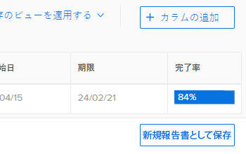

# レポートのコピーを作成

アクセス権のある任意のレポートのコピーを作成できます。カスタムレポートの正確なコピーを作成するか、デフォルトレポートの新しいバージョンを保存することができます。レポートをコピーすると、コピーしたレポートの所有者になり、マイレポートセクションに表示されます。

## アクセス要件

この記事の手順を実行するには、次のアクセス権が必要です。

<table style="table-layout:auto"> 
 <col> 
 <col> 
 <tbody> 
  <tr> 
   <td role="rowheader">Adobe Workfront プラン*</td> 
   <td> 
任意
 </td> 
  </tr> 
  <tr> 
   <td role="rowheader">Adobe Workfront ライセンス*</td> 
   <td> 
プラン 
 </td> 
  </tr> 
  <tr> 
   <td role="rowheader">アクセスレベル設定*</td> 
   <td> 
レポート、ダッシュボード、カレンダーへのアクセスの編集
 
フィルター、ビュー、グループ化へのアクセスの編集
 
メモ：まだアクセス権がない場合は、アクセスレベルに追加の制限が設定されていないかどうか Workfront 管理者にお問い合わせください。Workfront 管理者がアクセスレベルを変更する方法について詳しくは、<a href="../../../administration-and-setup/add-users/configure-and-grant-access/create-modify-access-levels.md" class="MCXref xref">カスタムアクセスレベルの作成または変更</a>を参照してください。
 </td> 
  </tr> 
  <tr> 
   <td role="rowheader">オブジェクト権限</td> 
   <td> 
レポートに対する権限を表示
 
追加のアクセス権のリクエストについて詳しくは、<a href="../../../workfront-basics/grant-and-request-access-to-objects/request-access.md" class="MCXref xref">オブジェクトへのアクセス権のリクエスト</a>を参照してください。
 </td> 
  </tr> 
 </tbody> 
</table>

&#42;保有するプラン、ライセンスタイプ、アクセス権を確認するには、Workfront 管理者に問い合わせてください。

## レポートの正確なコピーを作成

自分が所有者であるレポートのコピーを作成する場合は、以下のように行います。

1. Adobe Workfront の右上隅にある&#x200B;**メインメニュー**&#x200B;アイコン  をクリックします。

1. 「**レポート**」、「**すべてのレポート**」の順にクリックします。
1. レポートを開きます。
1. 「**レポートのアクション**」、「**コピー**」の順にクリックします。

   >[!TIP]
   >
   >レポートがデフォルトのレポートの場合、コピーオプションはレポートのアクションメニューに表示されません。\
   >デフォルトのレポートのコピーを作成する方法について詳しくは、[レポートの新しいバージョンを作成](#create-a-new-version-of-a-report)を参照してください。

   

   「*[元のレポートの名前]*&#x200B;のコピー」というデフォルトの名前で、元のレポートのコピーが作成されます。例えば、「Q4 完了タスク」というレポートの名前には、「Q4 完了タスクのコピー」という名前が付きます。

1. （オプション）レポートの名前を変更するには、新しい名前を入力します。

   >[!TIP]
   >
   >新しい名前を入力する前にタイトルの選択を解除した場合は、レポートタイトルを選択し、名前を削除してから、新しい名前を入力します。

1. （オプション）新しいバージョンのレポートを他のユーザーと共有するには、「**レポートのアクション**」をクリックして、次に「**共有**」をクリックします。

   >[!NOTE]
   >
   >共有情報は、元のバージョンからコピーしたレポートには転送されません。\
   >以前のレポートの共有先の確認方法について詳しくは、[レポートアクティビティに関するレポートを作成](../../../reports-and-dashboards/reports/report-usage/create-report-reporting-activities.md#identify)を参照してください。

1. （オプション）元のレポートに対する管理権限を持っていて、元のレポートが不要になった場合は、元のレポートを削除して、Workfront 内の不要な重複レポートを削除できます。

   元のレポートを削除するには、以下のように行います。

   1. レポートに移動します。
   1. 「**レポートのアクション**」、「**削除**」の順にクリックします。

   1. 「**はい、削除します**」をクリックして、レポートの削除を確定します。

## レポートの新しいバージョンを作成 {#create-a-new-version-of-a-report}

デフォルトのレポートのコピーを作成する場合は、以下のように行います。

1. Adobe Workfront の右上隅にある&#x200B;**メインメニュー**&#x200B;アイコン  をクリックします。

1. 「**レポート**」、「**すべてのレポート**」の順にクリックします。
1. デフォルトのレポート名をクリックして開きます。
1. 「**レポートのアクション**」、「**編集**」の順にクリックします。

   

1. レポートの以下のタブで、必要に応じて変更を加えます。

   * **列（表示）**：表示のカスタマイズに関して詳しくは、[Adobe Workfront の表示の概要](../../../reports-and-dashboards/reports/reporting-elements/views-overview.md)を参照してください。
   * **グループ化**：グループ化のカスタマイズに関して詳しくは、[Adobe Workfront でのグループ化の概要](../../../reports-and-dashboards/reports/reporting-elements/groupings-overview.md)を参照してください。
   * **フィルター**：フィルターのカスタマイズについて詳しくは、 [フィルターの概要](../../../reports-and-dashboards/reports/reporting-elements/filters-overview.md).
   * **チャート**：レポートチャートのカスタマイズについて詳しくは、[レポートにチャートを追加](../../../reports-and-dashboards/reports/creating-and-managing-reports/add-chart-report.md)を参照してください。

1. 右上隅の「**レポート設定**」をクリックします。
1. 「**レポートタイトル**」フィールドで、レポートに新しい名前を付けます。
1. 「**完了**」をクリックします。
1. 「**新規レポートとして保存**」をクリックします。

   

1. （オプション）新しいバージョンのレポートを他のユーザーと共有するには、「**レポートアクション**」、「**共有**」の順にクリックします。
