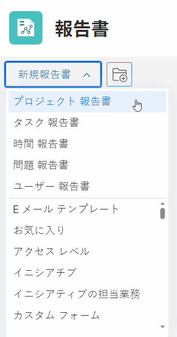
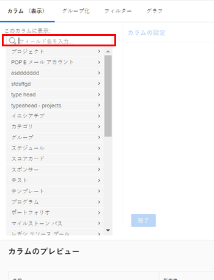
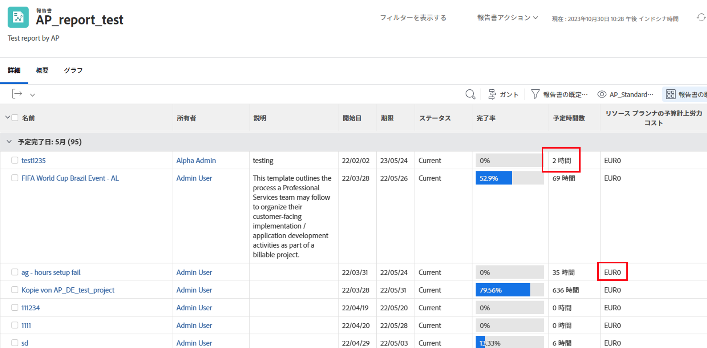
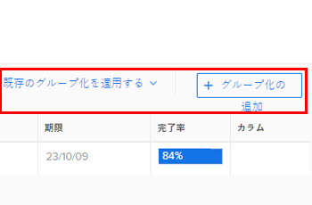
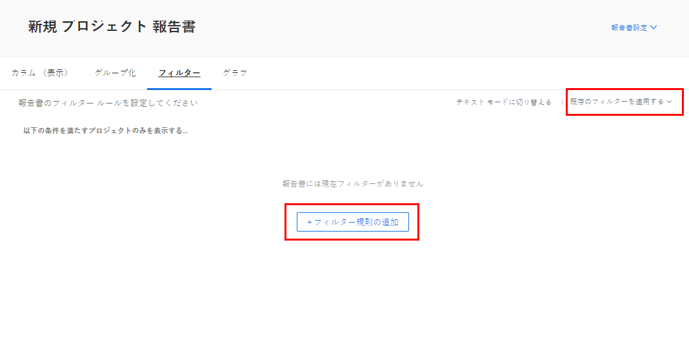
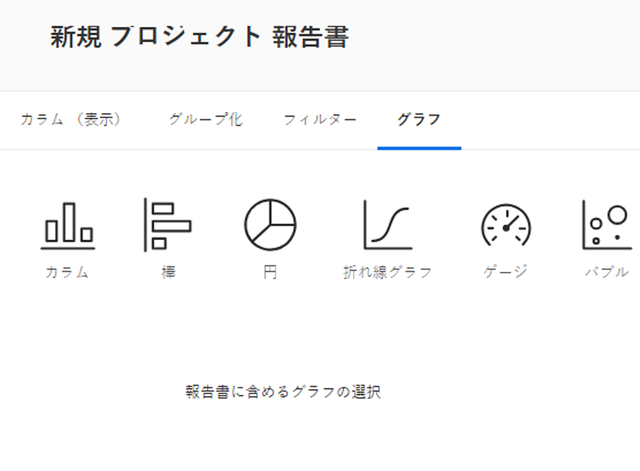

# カスタムレポートの作成

<!--Audited: 12/2023-->

レポートを作成して、組織がAdobe Workfrontで必要とする情報へのアクセス権を付与できます。 Workfrontで利用可能な組み込みレポートを使用することも、カスタムレポートを一から作成することもできます。

ビルトインレポートについて詳しくは、[Adobe Workfront ビルトインレポートの使用](../../../reports-and-dashboards/reports/using-built-in-reports/use-workfront-built-in-reports.md)を参照してください。

レポートをコピーして作成する方法について詳しくは、 [レポートのコピーの作成](../../../reports-and-dashboards/reports/creating-and-managing-reports/create-copy-report.md).

クラス、ビデオ、チュートリアルなどのレポートの作成と管理の詳細については、Adobe Experience Leagueサイトの「学習」セクションを参照してください。

## アクセス要件

この記事の手順を実行するには、次のアクセス権が必要です。

<table style="table-layout:auto"> 
 <col> 
 <col> 
 <tbody> 
  <tr> 
   <td role="rowheader">Adobe Workfront プラン*</td> 
   <td> 
任意
 </td> 
  </tr> 
  <tr> 
   <td role="rowheader">Adobe Workfront ライセンス*</td> 
   <td> 
新規：標準 

   または
   
現在：プラン 
 </td> 
  </tr> 
  <tr> 
   <td role="rowheader">アクセスレベル設定*</td> 
   <td> 
レポート、ダッシュボード、カレンダーへのアクセス権を編集
 
フィルター、ビュー、グループへのアクセスを編集
 
<b>メモ</b>

   
 まだアクセス権がない場合は、Workfront 管理者に問い合わせて、アクセスレベルに追加の制限が設定されているかどうかを確認してください。Workfront 管理者がアクセスレベルを変更する方法について詳しくは、<a href="../../../administration-and-setup/add-users/configure-and-grant-access/create-modify-access-levels.md" class="MCXref xref">カスタムアクセスレベルの作成または変更</a>を参照してください。
 </td> 
  </tr> 
  <tr> 
   <td role="rowheader">オブジェクト権限</td> 
   <td> 
作成したレポートに対する管理権限を取得します。
 
追加のアクセス権のリクエストについて詳しくは、<a href="../../../workfront-basics/grant-and-request-access-to-objects/request-access.md" class="MCXref xref">オブジェクトへのアクセス権のリクエスト</a>を参照してください。
 </td> 
  </tr> 
 </tbody> 
</table>

&#42;保有するプラン、ライセンスタイプ、アクセス権を確認するには、Workfront 管理者に問い合わせてください。

## レポートの作成 {#create-a-report}

{{step1-to-reports}}

1. 「**新規レポート**」をクリックし、レポートに表示するオブジェクトタイプを選択します。

   Report Builder が読み込まれます。

   使用可能なオブジェクトレポートについて詳しくは、[Adobe Workfront のオブジェクトについて](../../../workfront-basics/navigate-workfront/workfront-navigation/understand-objects.md)の記事で[オブジェクトに関するレポート](../../../workfront-basics/navigate-workfront/workfront-navigation/understand-objects.md#reporting-on-objects)の節を参照してください。

   

   >[!TIP]
   >
   >また、既存のレポートのコピーを作成して、レポートを作成することもできます。詳しくは、[レポートのコピーの作成](../../../reports-and-dashboards/reports/creating-and-managing-reports/create-copy-report.md)を参照してください。

1. Report Builder で、次の内容をレポートに追加します。

   <table style="table-layout:auto"> 
    <col> 
    <col> 
    <thead> 
     <tr> 
      <th>機能</th> 
      <th>説明</th> 
     </tr> 
    </thead> 
    <tbody> 
     <tr> 
      <td>カラム（表示）</td> 
      <td> 
レポートに列を追加することで、レポートに含まれる情報が決まります。
 
列の追加方法について詳しくは、<a href="#add-columns-view-to-a-report" class="MCXref xref">レポートへの列（表示）の追加</a>を参照してください。 
 </td> 
     </tr> 
     <tr> 
      <td>グループ化</td> 
      <td> 
レポートにグループを追加することで、レポートの編成方法が決まります。
 
グループ化を追加する方法について詳しくは、<a href="#add-groupings-to-a-report" class="MCXref xref">レポートへのグループ化の追加</a>を参照してください。
 </td> 
     </tr> 
     <tr> 
      <td>フィルター</td> 
      <td> 
レポートにフィルタールールを追加すると、レポートに表示される情報が決まります。
 
フィルターの追加方法について詳しくは、<a href="#add-filters-to-a-report" class="MCXref xref">レポートへのフィルターの追加</a>を参照してください。
 </td> 
     </tr> 
     <tr> 
      <td>グラフ</td> 
      <td> 
レポートにグラフを追加することで、レポートの情報を視覚的に表示する方法が決まります。
 
グラフを追加する方法について詳しくは、<a href="#add-a-chart-to-a-report" class="MCXref xref">レポートへのグラフの追加</a>を参照してください。
 </td> 
     </tr> 
    </tbody> 
   </table>

1. レポート作成プロセスの任意の時点で、「**適用**」をクリックして変更を保存します。
1. 完了したら、「**保存して閉じる**」をクリックします。

### レポートへの列（表示）の追加 {#add-columns-view-to-a-report}

1. この記事の[レポートの作成](#create-a-report)の節の説明に従って、レポートの作成を開始します。
1. Report Builder で、「**カラム（表示）**」タブを使用して、レポートに表示する列を指定します。
1. （オプション）「 **既存のビューの適用** をクリックし、ドロップダウンメニューでビューの名前をクリックして、既存のビューを使用します。

   ビューの作成について詳しくは、 [Adobe Workfrontの概要を表示](../../../reports-and-dashboards/reports/reporting-elements/views-overview.md).

1. （オプション）既存の列を削除するには、削除する列をクリックし、 **x** 列ヘッダーの現在の名前の横に表示されます。

1. 新しい列を追加するには、「**列を追加**」をクリックします。

   または

   既存の列を変更するには、列をクリックし、 **削除** アイコン  を **この列フィールドに表示** 」ボックスをクリックし、新しいフィールドを入力して、リストに表示されたらクリックします。

   列に表示されるフィールドについて詳しくは、[Adobe Workfront の用語集](../../../workfront-basics/navigate-workfront/workfront-navigation/workfront-terminology-glossary.md)を参照してください。

   

1. （オプション）**カラム設定**&#x200B;エリアで、「**このカラムを基準にして並べ替え**」を選択して、列の値を降順のアルファベット順で昇順に並べ替えるには、リストでこの列を最初の並べ替え基準として使用するかどうかを指定します。

   1 つ目の列で値を基準として並べ替え、2 つ目の列を次に並べ替える場合など、レポートビューで複数のレベルの並べ替えを行うことができます。

   1 番目の並べ替え条件に従って複数の結果が同一の場合は、2 番目の並べ替え条件に従って並べ替えられます。1 番目と 2 番目の並べ替え条件に従って複数の結果が同一の場合、3 番目の並べ替えに従って並べ替えられます。

   >[!NOTE]
   >
   >レポート対象のオブジェクトから遠すぎるオブジェクトを参照するフィールドを追加すると、このフィールドで並べ替えできない場合があります。\
   >例えば、イシューレポートは、プロジェクト、所有者、名前の 3 つの追加オブジェクトを参照しているので、このレポートを「プロジェクト所有者」フィールドで並べ替えることはできません。ただし、このフィールドをイシューレポートに追加して、その情報を表示することはできます。

   <!--outdated: To learn more about cross-object references in reports, see the section "Advanced Reporting Part 1 of 3" in the [Reports and Dashboards Learning Path](https://one.workfront.com/s/learningpath2/workfront-reporting-MC7MZT2BOL2ZC2LMJ4MA3EMHOCNY?tabset-dc70e=2).-->

1. （オプション）グループ化を使用している場合に、列の情報を要約（集計）するには、**カラムの設定**&#x200B;エリアで&#x200B;**このカラムの集計方法**&#x200B;ドロップダウンリストをクリックして、列の情報の集計に使用するオプションを選択します。

   集計された情報は、グループ化行の列に表示されます。

   

   列内のデータの要約について詳しくは、[Adobe Workfront のビューの概要](../../../reports-and-dashboards/reports/reporting-elements/views-overview.md)を参照してください。

   >[!NOTE]
   >
   >グループ化における次のフィールドの値を集計する場合、親オブジェクト（親タスクなど）には次の例外が適用されます。
   >
   >* 「実績時間」以外のすべての数値および通貨フィールド（「計画または実績労務費」、「計画費」または「実績費用」、「計画原価」または「実績原価」、「計画時間」など）は、子タスクとスタンドアロンタスクの値のみを集計します。 親タスクまたは親の親の値は集計されません。
   >* 実際の時間数は、メインの親タスクとスタンドアロンタスクの値を集計します。親タスクの親や子タスクの数値は集計されません。
   >* 数値および通貨の値のカスタムデータフィールドは、すべてのタスク（親、子、親の親、スタンドアロンタスク）を集計します。

   レポートでのグループ化の使用について詳しくは、[Adobe Workfront でのグループ化の概要](../../../reports-and-dashboards/reports/reporting-elements/groupings-overview.md)を参照してください。

1. （オプション）「**詳細オプション**」をクリックして、列の次の情報を指定します。

   <table style="table-layout:auto"> 
    <col> 
    <col> 
    <tbody> 
     <tr> 
      <td role="rowheader">カスタム列ラベル</td> 
      <td> 
列のカスタムラベルを指定します。このラベルは、デフォルトのラベルに取って代わります。
 </td> 
     </tr> 
     <tr> 
      <td role="rowheader">フィールド形式</td> 
      <td> 
列のフィールドに値を表示する形式を選択します。
 </td> 
     </tr> 
     <tr> 
      <td role="rowheader">ダッシュボードにこのカラムを表示</td> 
      <td> 
このオプションを選択すると、レポートが別のレポートと並べて表示される際に、この列がダッシュボードに表示されます。このオプションを選択しない場合、レポートが並べて表示されるダッシュボードでレポートを表示する際に、この列は表示されません。
 </td> 
     </tr> 
     <tr> 
      <td role="rowheader">カラムのルール</td> 
      <td> 
「<strong>このカラムにルールを追加</strong>」をクリックすると、列に条件付き形式が追加されます。ルールを追加した後、そのルールに一致するフィールドの表示方法について、フィールドとテキストのスタイルを定義できます。ルールの定義が完了したら、「<strong>規則の追加</strong>」をクリックします。ビューの条件付き形式について詳しくは、<a href="../../../reports-and-dashboards/reports/reporting-elements/use-conditional-formatting-views.md" class="MCXref xref">ビューでの条件付き形式の使用</a>を参照してください。
 </td> 
     </tr> 
    </tbody> 
   </table>

1. 「**適用**」をクリックして、それまでの変更内容を適用し、次のオプションを使用してレポートの編集を続行します。

   レポートの列の編集を終えて、レポートを保存する場合は、「**保存して閉じる**」をクリックします。

### レポートにグループ化を追加 {#add-groupings-to-a-report}

1. この記事の[レポートを作成](#create-a-report)の節の説明に従って、レポートの作成を開始します。
1. Report Builder で、「**グループ化**」タブを使用して、レポート内の項目をグループ化する方法を指定します。
1. 「**グループ化を追加**」をクリックし、新しいグループ化を追加します。

   または

   選択 **既存のグループの適用** をクリックして、既存のグループを選択します（リストに表示される場合）。

   

1. グループ化として追加するフィールドの入力を開始します。フィールドが使用可能な場合は、関連付けることが可能な各オブジェクトに対してが設定されます。フィールドの名前をクリックして、そのグループに追加します。
1. （オプション）テキストモードでグループ化を作成する場合は、「**テキストモードに切り替え**」をクリックします。テキストモードの使用について詳しくは、[テキストモードの概要](../../../reports-and-dashboards/reports/text-mode/understand-text-mode.md)を参照してください。

   新しいグループ化の作成について詳しくは、[Adobe Workfront でのグループ化の概要](../../../reports-and-dashboards/reports/reporting-elements/groupings-overview.md)を参照してください。

1. （オプション）このグループ内の結果を展開するよりも折りたたんだ状態で表示させたい場合は、「**デフォルトでこのグループ化を折りたたむ**」を選択します。

   この設定はデフォルトでは無効になっており、グループ化の結果は常に展開されたリストで表示されます。

   >[!TIP]
   >
   >* リストを表示しているときにグループ化を手動で調整すると、ログアウトするまで Workfront に手動の設定が記憶されます。再度ログインすると、この設定に従ってリストが表示されます。
   >* グループ化の結果は、グラフ要素からアクセスした後で常に展開表示されます。

1. （オプション）「 **マトリックスグループ化に切り替え**&#x200B;をクリックし、マトリックスのグループ化を作成して、結果をグリッド形式で表示します。

   マトリックスレポートの作成について詳しくは、[マトリックスレポートを作成](../../../reports-and-dashboards/reports/creating-and-managing-reports/create-matrix-report.md)を参照してください。

1. 「**適用**」をクリックして変更を適用し、以下のオプションを使用してレポートの編集を続行します。

   レポート内の列の編集を終えて、レポートを保存する場合は、「**保存して閉じる**」をクリックします。

### レポートにフィルターを追加 {#add-filters-to-a-report}

1. この記事にある[レポートの作成](#create-a-report)の節の説明に従って、レポートの作成を開始します。
1. Report Builder で、「**フィルター**」タブを使用して、レポートに含める情報の量を指定します。
1. 「**フィルタールールを追加**」をクリックし、カスタムフィルターを追加します。\
   または\
   「**既存のフィルターを適用**」を選択し、既存のフィルターを使用します。

   

1. 「**フィルタールールを追加**」をクリックした場合は、フィルターとして追加するフィールドの入力を開始します。フィールドが使用可能な場合は、関連付けることが可能な各オブジェクトに対してが設定されます。フィールドの名前をクリックして、そのフィルターに追加します。\
   フィルター修飾子を使用して、フィルターを作成します。フィルター修飾子について詳しくは、[フィルターおよび条件修飾子](../../../reports-and-dashboards/reports/reporting-elements/filter-condition-modifiers.md)を参照してください。

   新しいフィルターの作成について詳しくは、 [フィルターの概要](../../../reports-and-dashboards/reports/reporting-elements/filters-overview.md).

1. （オプション）テキストモードでフィルターを作成するには、「**テキストモードに切り替え**」をクリックします。

   テキストモードの使用について詳しくは、[テキストモードの概要](../../../reports-and-dashboards/reports/text-mode/understand-text-mode.md)を参照してください。

1. レポート内のフィルターの編集を終えたら「**適用**」をクリックして変更を適用し、以下のオプションを使用してレポートの編集を続行します。

   「**保存して閉じる**」をクリックして、レポートを保存します。

### レポートにグラフを追加 {#add-a-chart-to-a-report}

1. この記事の[レポートの作成](#create-a-report)セクションの説明に従って、レポートの作成を開始します。
1. Report Builder で、「**グラフ**」タブを選択し、追加するグラフのタイプを選択します。

   

   レポートでのグラフの作成について詳しくは、[レポートにグラフを追加する](../../../reports-and-dashboards/reports/creating-and-managing-reports/add-chart-report.md)を参照してください。

1. 「**適用**」をクリックして変更を適用し、以下のオプションを使用してレポートの編集を続行します

   「**保存して閉じる**」をクリックして、レポートの編集を終了し、レポートを保存します。
