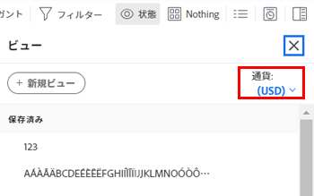
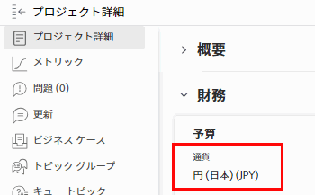
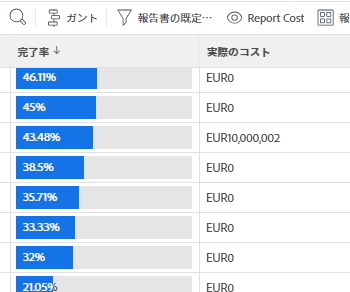
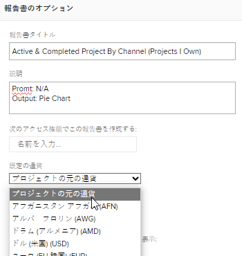

# 一意の為替レートを使用した財務データレポートの作成

Adobe Workfrontで複数の為替レートが設定されている場合は、レポートやリストで財務値を設定して、デフォルト通貨以外の通貨で表示できます。

>[!IMPORTANT]
>
>ビューでデフォルトの通貨以外の通貨を選択すると、リンクが表示されなくなります **タスクをさらに追加** および **問題をさらに追加** をクリックします。

特定のプロジェクトのデフォルト通貨を変更する方法について詳しくは、 [プロジェクトの通貨を変更](../../../manage-work/projects/project-finances/change-project-currency.md).

レポートに単一通貨のプロジェクトがある場合、グループ化の合計もシステムのデフォルト通貨で表示されます。

## アクセス要件

この記事の手順を実行するには、次のアクセス権が必要です。

<table style="table-layout:auto"> 
 <col> 
 <col> 
 <tbody> 
  <tr> 
   <td role="rowheader">Adobe Workfront plan*</td> 
   <td> 
任意
 </td> 
  </tr> 
  <tr> 
   <td role="rowheader">Adobe Workfront license*</td> 
   <td> 
計画 
 </td> 
  </tr> 
  <tr> 
   <td role="rowheader">アクセスレベル設定*</td> 
   <td> 
レポート、ダッシュボード、カレンダーへのアクセスを編集
 
フィルター、ビュー、グループへのアクセスを編集
 
注意：まだアクセス権がない場合は、Workfront管理者に、アクセスレベルに追加の制限が設定されているかどうかを問い合わせてください。 Workfront管理者がアクセスレベルを変更する方法について詳しくは、 <a href="../../../administration-and-setup/add-users/configure-and-grant-access/create-modify-access-levels.md" class="MCXref xref">カスタムアクセスレベルの作成または変更</a>.
 </td> 
  </tr> 
  <tr> 
   <td role="rowheader">オブジェクトの権限</td> 
   <td> 
レポートに対する権限の管理
 
追加のアクセス権のリクエストについて詳しくは、 <a href="../../../workfront-basics/grant-and-request-access-to-objects/request-access.md" class="MCXref xref">オブジェクトへのアクセスのリクエスト </a>.
 </td> 
  </tr> 
 </tbody> 
</table>

&#42;保有するプラン、ライセンスの種類、アクセス権を確認するには、Workfront管理者に問い合わせてください。

## 前提条件

この節で説明するように、代替通貨を表示する前に、Workfront管理者がWorkfrontの「設定」領域で複数の通貨を有効にして設定する必要があります。 詳しくは、 [為替レートの設定](../../../administration-and-setup/manage-workfront/exchange-rates/set-up-exchange-rates.md).

## レポートへの財務値の適用 {#apply-financial-values-to-a-report}

レポートを使用する際に財務値を通貨間で換算する手順は、次のとおりです。

1. 財務値を別の通貨に換算するレポートに移動します。
1. 次をクリック： **表示** ドロップダウンリストから、 **通貨の変更**&#x200B;次に、財務値を表示する次の通貨の 1 つを選択します。

   * プロジェクトの元の通貨
   * その他の通貨

     >[!TIP]
     >
     >「設定」で以前に選択した通貨のみを選択できます。

   このオプションを使用すると、レポート内の財務値をレート値にすばやく変換できます。

   

   <!--
   
(NOTE: drafted this tip because I think this is confusing; this is in the step above.)

   -->

   <!--
   <note type="tip">
   You can also select the Change Currency option to convert financial values in other lists.
    
   
    
    
   </note>
   -->

## 異なる通貨を持つ複数のプロジェクトでデフォルト通貨を表示

プロジェクト・レベルで通貨をカスタマイズし、同じレポート内のすべてのプロジェクトの情報を表示する場合、次のシナリオが存在します。

* 通貨が異なる複数のプロジェクトから財務情報を取り込むレポートを作成する場合、デフォルトでは、Workfront管理者が選択したシステムのデフォルト通貨がグループ化サマリに反映されます。
* 同じ通貨を持つ複数のプロジェクトで、システムのデフォルト通貨とは異なるレポートを作成した場合、グループの合計はシステムのデフォルト通貨を使用して表示されます。
* 通貨上書きに関連する職務ロール割当を持つ 2 つ以上のプロジェクトのレポートを作成すると、Workfrontは、職務ロールの上書き通貨レートから財務情報をプロジェクトの通貨（ビューで「プロジェクトの元通貨」を選択した場合）に変換します。 ジョブロールの通貨の上書きについては、 [ジョブの役割の作成と管理](../../../administration-and-setup/set-up-workfront/organizational-setup/create-manage-job-roles.md).

カスタム通貨を含む 2 つのプロジェクトをレポートに表示するには、次の手順に従います。

1. 異なる通貨が適用された 2 つのプロジェクトを作成します。

   

1. 両方のプロジェクトに時間を記録します。

   ログ時間について詳しくは、 [ログ時間](../../../timesheets/create-and-manage-timesheets/log-time.md).

1. 次をクリック： **メインメニュー** アイコン を選択し、次に **レポート**.
1. クリック **新しいレポート**&#x200B;を、 **プロジェクトレポート**.
1. Adobe Analytics の **列（表示）** タブ、追加 **実際のコスト** 列と要約方法 **合計**.

   列の作成方法について詳しくは、 [Adobe Workfrontの概要を表示](../../../reports-and-dashboards/reports/reporting-elements/views-overview.md).

1. Adobe Analytics の **グループ化** タブ、適用 **計画完了日** グループ化。

   グループ化の作成方法について詳しくは、 [Adobe Workfrontでのグループ化の概要](../../../reports-and-dashboards/reports/reporting-elements/groupings-overview.md).

1. Adobe Analytics の **フィルター** タブにフィルターを追加する **プロジェクト名** 異なる通貨の 2 つのプロジェクトを選択します。

   フィルターの作成方法について詳しくは、 [フィルターの概要](../../../reports-and-dashboards/reports/reporting-elements/filters-overview.md).

1. 「**保存して閉じる**」をクリックします。

   合計 **実際のコスト** は、レポート内のプロジェクトの通貨に関係なく、システムのデフォルト通貨を使用したグループ化に表示されます。

   

   2 つのプロジェクトの通貨が異なる場合は、システムのデフォルト通貨もレポートのグループ化に表示されます。

## プロジェクトレベルでのレポートでのプロジェクト通貨の表示

プロジェクト内のタスクまたは時間リストにグループ化が適用されている場合、グループ化の合計はプロジェクトの通貨で表示されます。

1. システムのデフォルト通貨とは異なるカスタム通貨でプロジェクトを作成します。
1. プロジェクトに移動し、タスクにログに記録された時間が含まれていることを確認します。

   ログ時間について詳しくは、 [ログ時間](../../../timesheets/create-and-manage-timesheets/log-time.md).

   >[!NOTE]
   >
   >タスクは、時間単価の原価率を持つユーザーまたはジョブの役割に割り当てる必要があります。

1. クリック **タスク**.
1. を展開します。 **表示** ドロップダウンメニューで「 」を選択します。 **新しいビュー**.
1. 追加 **実際のコスト** を新しい列として表示し、次のように要約します。 **合計**.
1. クリック **完了**&#x200B;を選択し、次に **ビューを保存**.
1. を展開します。 **グループ化** ドロップダウンメニューで「 」を選択します。 **新しいグループ化**.
1. 追加 **実際の完了日** 新しいグループ化で新しいフィールドとして選択し、「 **グループ化を保存**.

   The **実際のコスト** 列には、新しいグループ化の概要が表示され、プロジェクトの通貨での合計が表示されます。

## ユニーク通貨でレポートを編集

レポート内の財務フィールドは、プロジェクトの元の通貨を表示するようにレポート設定を変更するまで編集できません。

レポート内の財務フィールドをインライン編集するには、次の手順に従います。

1. レポートに移動します。

   >[!NOTE]
   >
   >他の領域のリストにデフォルトの通貨が表示されない場合は、ビューを編集してデフォルトの通貨を表示できます。\
   >ビューでの通貨の変更方法については、この記事の「 」の節を参照してください。 [レポートへの財務値の適用](#apply-financial-values-to-a-report).

1. クリック **レポートのアクション**&#x200B;を選択し、「 **編集**.
1. クリック **レポート設定**.
1. 次をクリック： **デフォルトの通貨** ドロップダウンから、 **プロジェクトの元の通貨**.

   

1. クリック **完了**.
