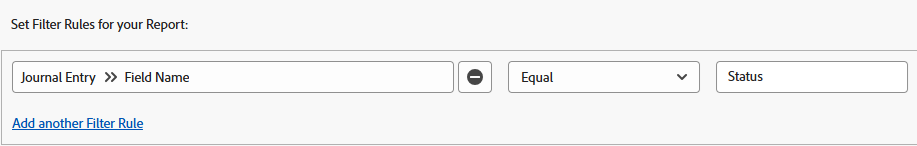

# 仕訳入力レポートを使用した更新領域のレポート

<!-- Audited: 11/2024 -->

ジャーナルエントリレポートには、これまで Adobe Workfront API を介してのみ利用可能であった、プロジェクト、タスク、イシューなどのオブジェクトの更新エリアからのシステム更新が表示されます。これは特定のユースケースを対象とした高度なレポートですが、よりわかりやすい形式により、Workfront 内のプロジェクトアクティビティやシステム更新に関するレポートを簡単に作成できるようになります。

>[!TIP]
>
>ジャーナルエントリレポートには、オブジェクトの更新エリアからのシステム更新のみが含まれます。更新エリアに残されたコメントに関するレポートを作成するには、「メモ」レポートを使用する必要があります。\
>メモレポートについて詳しくは、[メモレポートでのすべての更新の表示](../../../workfront-basics/updating-work-items-and-viewing-updates/view-all-updates-in-a-report.md)を参照してください。

ジャーナルエントリレポートには、次の情報が表示されます。

* ステータスの変更が発生した回数
* タスクまたはイシューがいつ削除されたか
* 重要なカスタムフィールドの値が、プロジェクトのライフサイクルの過程でどのように変化したか
* プロジェクトのライフサイクルの過程で変更された重要な日付
* プロジェクトの所有者が変更されたかどうか

## アクセス要件

+++ 展開すると、この記事の機能のアクセス要件が表示されます。

この記事の手順を実行するには、次のアクセス権が必要です。

<table style="table-layout:auto"> 
 <col> 
 <col> 
 <tbody> 
  <tr> 
   <td role="rowheader">Adobe Workfront プラン</td> 
   <td> 
任意
 </td> 
  </tr> 
  <tr> 
   <td role="rowheader">Adobe Workfront プラン</td> 
      <td> 
      
新規：

         <ul>
         <li>
標準
</li>
         </ul>
      
現在：

         <ul>
         <li>
プラン
</li>
         </ul>
   </td> 
  </tr> 
  <tr> 
   <td role="rowheader">アクセスレベル設定</td> 
   <td> 
レポート、ダッシュボード、カレンダーへのアクセスの編集
 
フィルター、ビュー、グループ化へのアクセスの編集
 </td> 
  </tr> 
  <tr> 
   <td role="rowheader">オブジェクト権限</td> 
   <td> 
レポートに表示するジャーナルエントリを含んだオブジェクトの表示権限
 
レポートの管理権限は、レポートの作成後に取得されます
 </td> 
  </tr> 
 </tbody> 
</table>

*詳しくは、[Workfront ドキュメントのアクセス要件 &#x200B;](/help/quicksilver/administration-and-setup/add-users/access-levels-and-object-permissions/access-level-requirements-in-documentation.md) を参照してください。

+++

## 前提条件

この記事で説明している操作を実行する前に、次の点を確認する必要があります。

* レポート対象のすべてのフィールド（カスタムフィールドを含む）は、Workfrontで追跡されます。 追跡されている更新エリアのデータのみをレポートできます。

  Workfront で追跡するフィールドの追加方法については、[システム更新の設定](../../../administration-and-setup/set-up-workfront/system-tracked-update-feeds/configure-system-updates.md)を参照してください。

## ジャーナルエントリレポートの概要

ジャーナルエントリレポートは、システム更新をクエリするので、かなりの数の結果を返す可能性があります。そのため、レポートを作成する際は、プロジェクト、プログラム、ポートフォリオ、グループなどの特定のオブジェクトに絞り込むことをお勧めします。

Workfront の様々なオブジェクトタイプについて詳しくは、[Adobe Workfront のオブジェクトについて](../../../workfront-basics/navigate-workfront/workfront-navigation/understand-objects.md)を参照してください。

>[!NOTE]
>
>ジャーナルエントリレポートは非常にたくさんのデータを返すので、書き出しとスケジュール済みレポートの配信はサポートされていません。

このレポートのデフォルトビューには、次の列が含まれています。

<table style="table-layout:auto"> 
 <col> 
 <col> 
 <thead> 
  <tr> 
   <th>フィールド</th> 
   <th>説明</th> 
  </tr> 
 </thead> 
 <tbody> 
  <tr> 
   <td><strong>フィールド名</strong> </td> 
   <td> 
影響を受けるフィールドの名前。レポートの設定方法に応じて、「ステータス」、「所有者 ID」、「タスク名」、「予定完了日」などのフィールドがこの列に含まれます。 
 
<strong>DE</strong>: がこの列に表示される場合は、一覧表示されているフィールドがカスタムフィールドであることを示します。
 </td> 
  </tr> 
  <tr> 
   <td><strong>変更の種類</strong> </td> 
   <td> 
影響を受けるフィールドに加えられた変更のタイプ。設定したフィルタールールと、ユーザーが実行したアクションに応じて、このフィールドに次のように表示されます。
 
    <ul> 
     <li> 
追加
 </li> 
     <li> 
監査
 </li> 
     <li> 
削除
 </li> 
     <li> 
ダイジェスト
 </li> 
     <li> 
編集
 </li> 
     <li> 
復元
 </li> 
    </ul> </td> 
  </tr> 
  <tr> 
   <td><strong>トップ ObjCode</strong> </td> 
   <td> 
階層内の最上位の親オブジェクト。
 </td> 
  </tr> 
  <tr> 
   <td><strong>範囲</strong> </td> 
   <td> 
変更されたオブジェクトのタイプ。
 </td> 
  </tr> 
  <tr> 
   <td><strong>エントリ日</strong> </td> 
   <td> 
フィールドが変更された日付。
 </td> 
  </tr> 
  <tr> 
   <td><strong>編集者名</strong> </td> 
   <td> 
フィールドを変更したユーザー。
 </td> 
  </tr> 
 </tbody> 
</table>

このレポートの情報を整理するには、ビルトインのグループ化である「プロジェクト」を使用できます。プロジェクトのグループ化では、プロジェクト名がプライマリ、エントリ日がセカンダリにグループ化されます。この既存のグループ化は、レポートの作成時に適用することも、レポートの表示時に適用することもできます。

レポートの表示、フィルター、グループを設定する方法については、次の関連する節を参照してください。

<!--

(NOTE: from&nbsp;Luke: Take this for what it's worth, but part of me wonders if all of these subsections should be separate articles.

The biggest reason for breaking these up would be searchability, in my mind. For example, as a user, I might want to know how to see if the owner of a project changed. If I search the help site for that, I would be a lot more likely to find a separate article called "See if the owner of a project changed" vs an article titled "Create a Journal Entry report" because "Journal Entry" might mean nothing to me.) 

-->

* [ステータスの変更の発生状況を確認する](#see-what-status-changes-occurred)
* [タスクまたはイシューが削除された日時を確認する](#see-when-a-task-or-issue-was-deleted)
* [プロジェクトのライフサイクルの過程でカスタムフィールドがどのように変化したかを確認する](#see-how-custom-fields-changed-over-the-course-of-a-project-s-life-cycle)
* [予定完了日がプロジェクトのライフサイクルの過程でどのように変更されたかを確認する](#see-how-the-planned-completion-date-changed-over-the-course-of-a-project-s-life-cycle)
* [プロジェクトの所有者が変更されたかどうかを確認する](#see-if-the-owner-of-a-project-changed)

## ステータスの変更の発生状況を確認する {#see-what-status-changes-occurred}

次の項目を表示するジャーナルエントリレポートを設定できます。

* プロジェクト、タスク、またはイシューに対して行われたステータスの変更の数

* 変更前のステータス
* ステータスを変更したユーザー
* ステータスの変更が発生した日時

プロジェクトの正常性を確認する場合は、プロジェクトの「**条件**」フィールドを使用して、これと同じ情報を表示するようにレポートを設定することもできます。

この情報は、監査に役立ち、お客様とお客様の組織がどの程度計画を立てているかを説明するために使用できます。

1. Adobe Workfront の右上隅にある&#x200B;**[!UICONTROL メインメニュー]**&#x200B;アイコン  をクリックするか、利用可能であれば左上隅のにある&#x200B;**[!UICONTROL メインメニュー]**&#x200B;アイコン  をクリックして&#x200B;**レポート**&#x200B;をクリックします。
1. 「**新規レポート**」をクリックしてから、「**ジャーナルエントリ**」を選択します。

   

   Report Builder が読み込まれます。

1. 「**列（表示）**」タブで、以下の列を追加します。

   <table style="table-layout:auto"> 
    <col> 
    <col> 
    <thead> 
     <tr> 
      <th>列</th> 
      <th>説明</th> 
     </tr> 
    </thead> 
    <tbody> 
     <tr> 
      <td> 
フィールド名
 </td> 
      <td> 
影響を受けるフィールドの名前。この場合、<strong>ステータス</strong>がこの列に表示される必要があります。
 </td> 
     </tr> 
     <tr> 
      <td> 
変更タイプ
 </td> 
      <td> 
影響を受けるフィールドに加えられた変更のタイプ（例：<strong>追加</strong>、<strong>削除</strong>、<strong>編集</strong>）。
 </td> 
     </tr> 
     <tr> 
      <td> 
編集者名
 </td> 
      <td> 
ステータスを更新したユーザーの名前。
 </td> 
     </tr> 
     <tr> 
      <td> 
エントリ日
 </td> 
      <td> 
ステータスが変更された日付。
 </td> 
     </tr> 
     <tr> 
      <td> 
古いテキスト値
 </td> 
      <td> 
前のステータスのキー。デフォルトのプロジェクトステータスのステータスキーは次のとおりです。
 
       <ul> 
        <li> 
 <strong>CUR</strong>：現在
 </li> 
        <li> 
<strong>DED</strong>：無効
 </li> 
        <li> 
<strong>ONH</strong>：保留中
 </li> 
        <li> 
<strong>PLN</strong>：計画
 </li> 
        <li> 
<strong>CPL</strong>：完了
 </li> 
        <li> 
<strong>REQ</strong>：リクエスト済み
 </li> 
        <li> 
<strong>APR</strong>：承認済み
 </li> 
        <li> 
<strong>REJ</strong>：却下
 </li> 
        <li> 
<strong>IDA</strong>：アイデア
 </li> 
       </ul> 
組織がカスタムステータスを設定している場合、この列に他のステータスキーが表示されることがあります。ステータスキーに関連するカスタムステータスについては、Workfront の管理者またはグループ管理者に問い合わせてください。
 </td> 
     </tr> 
     <tr> 
      <td> 
新規テキスト値
 </td> 
      <td> 
更新されたステータスのキー。
 </td> 
     </tr> 
     <tr> 
      <td> 
上位 ObjCode
 </td> 
      <td> 
ステータスが変更されたフィールドの最上位の親オブジェクト。
 </td> 
     </tr> 
     <tr> 
      <td> 
範囲
 </td> 
      <td> 
ステータスが変更されたオブジェクトのタイプ。
 </td> 
     </tr> 
     <tr> 
      <td> 
イシュー名 （オプション）
 </td> 
      <td> 
ステータスが変更されたイシューの名前。
 </td> 
     </tr> 
     <tr> 
      <td> 
タスク名 （オプション）
 </td> 
      <td> 
ステータスが変更されたタスクの名前。
 </td> 
     </tr> 
    </tbody> 
   </table>

   列の追加について詳しくは、[Adobe Workfront の概要を表示](../../../reports-and-dashboards/reports/reporting-elements/views-overview.md)を参照してください。

1. 「**フィルター**」タブで「**フィルタールールを追加**」をクリックし、フィルタールール **フィールド名**/**次と等しい**/**ステータス** を追加します。

   

   >[!TIP]
   >
   >条件の変更に関するレポートを作成する場合は、代わりにフィルタールール「**フィールド名**／**次と等しい**／**条件**」を追加できます。

   フィルターの追加について詳しくは、[フィルターの概要](../../../reports-and-dashboards/reports/reporting-elements/filters-overview.md)を参照してください。

1. （オプション）レポートの焦点を絞り、読み込み時間を短縮するには、プロンプトを追加します。

   または

   特定のプロジェクト、タスクまたはイシューを含めるための追加のフィルタールールを作成します。

   >[!IMPORTANT]
   >
   >修飾子&#x200B;**次を含む**&#x200B;を使用するフィルタールールを作成すると、実際に読み込み時間が増加することがあります。そのため、特定のプロジェクトまたは上位のオブジェクト ID を対象にフィルタリングできる場合、**が次に等しい**&#x200B;などの異なる修飾子を使用することをお勧めします。

   プロンプトを追加する方法については、[レポートへのプロンプトの追加](../../../reports-and-dashboards/reports/creating-and-managing-reports/add-prompt-report.md)を参照してください。

1. 「**グループ化**」タブで、「**既存のグループ化を適用**」をクリックし、「**プロジェクト**」を選択します。

   グループ化の追加について詳しくは、[Adobe Workfront でのグループ化の概要](../../../reports-and-dashboards/reports/reporting-elements/groupings-overview.md)を参照してください。

1. 「**保存して閉じる**」をクリックします。

   新しいレポートが読み込まれます。

## タスクやイシューが削除された日時を表示 {#see-when-a-task-or-issue-was-deleted}

次の項目を表示するジャーナルエントリレポートを設定できます。

* 削除されたタスクまやイシュー
* タスクやイシューを削除したユーザー

タスクやイシューがいつ削除されたかを確認するには、以下のように行います。

1. Adobe Workfront の右上隅にある&#x200B;**[!UICONTROL メインメニュー]**&#x200B;アイコン  をクリックするか、利用可能であれば左上隅にある&#x200B;**[!UICONTROL メインメニュー]**&#x200B;アイコン  をクリックして&#x200B;**レポート**&#x200B;をクリックします。
1. 「**新規レポート**」をクリックしてから、「**ジャーナルエントリ**」を選択します。

   

   Report Builder が読み込まれます。

1. 「**列（表示）**」タブで、以下の列を追加します。

   <table style="table-layout:auto"> 
    <col> 
    <col> 
    <thead> 
     <tr> 
      <th>列</th> 
      <th>説明</th> 
     </tr> 
    </thead> 
    <tbody> 
     <tr> 
      <td> 
範囲
 </td> 
      <td> 
削除されたオブジェクトのタイプ。
 </td> 
     </tr> 
     <tr> 
      <td> 
変更タイプ
 </td> 
      <td> 
発生した変更のタイプ。<strong>削除</strong>変更がこの列に表示されます。
 </td> 
     </tr> 
     <tr> 
      <td> 
エントリ日
 </td> 
      <td> 
タスクやイシューが削除された日付。
 </td> 
     </tr> 
     <tr> 
      <td> 
編集者名
 </td> 
      <td> 
タスクやイシューを削除したユーザーの名前。
 </td> 
     </tr> 
     <tr> 
      <td> 
プロジェクト名
 </td> 
      <td> 
タスクやイシューが削除されたプロジェクトの名前。
 </td> 
     </tr> 
    </tbody> 
   </table>

   列の追加について詳しくは、[Adobe Workfront のビューの概要](../../../reports-and-dashboards/reports/reporting-elements/views-overview.md)を参照してください。

1. 「**フィルター**」タブで、「**フィルタールールを追加**」をクリックし、以下を追加します。

   * **変更の種類**／**が次に等しい**／**削除**
   * **プロジェクト ID** > **次と等しい** > **&lt; プロジェクト名 >**

     <!--WRITER check link; this png file has spaces
     -->

   フィルターの追加について詳しくは、[フィルターの概要](../../../reports-and-dashboards/reports/reporting-elements/filters-overview.md)を参照してください。

1. （オプション）レポートの焦点を絞り、読み込み時間を短縮するには、プロンプトを追加します。

   または

   特定のプロジェクト、タスクまたはイシューを含めるための追加のフィルタールールを作成します。

   >[!IMPORTANT]
   >
   >修飾子&#x200B;**次を含む**&#x200B;を使用するフィルタールールを作成すると、実際に読み込み時間が増加することがあります。そのため、特定のプロジェクトまたは上位のオブジェクト ID を対象にフィルタリングできる場合、**が次に等しい**&#x200B;などの異なる修飾子を使用することをお勧めします。

   プロンプトを追加する方法については、[レポートへのプロンプトの追加](../../../reports-and-dashboards/reports/creating-and-managing-reports/add-prompt-report.md)を参照してください。

1. （オプション）「**グループ化**」タブで、「**既存のグループ化を適用する**」をクリックしたあと、「**プロジェクト**」を選択します。

   グループ化の追加について詳しくは、[Adobe Workfront でのグループ化の概要](../../../reports-and-dashboards/reports/reporting-elements/groupings-overview.md)を参照してください。

1. 「**保存して閉じる**」をクリックします。

   新しいレポートが読み込まれます。

## プロジェクトのライフサイクルの過程でカスタムフィールドがどのように変化したかを確認 {#see-how-custom-fields-changed-over-the-course-of-a-project-s-life-cycle}

プロジェクトの過程での重要なフィールドの変更を追跡できます。それには、追跡するジャーナルエントリを次のように設定します。

* 特定のカスタムフィールドが追加、更新または編集されたかどうか
* これらの変更がいつ発生したか
* 誰が変更を加えたか

プロジェクトのライフサイクルの過程でカスタムフィールドがどのように変化したかを確認するには、次の手順に従います。

1. Adobe Workfront の右上隅にある&#x200B;**[!UICONTROL メインメニュー]**&#x200B;アイコン  をクリックするか、利用可能であれば左上隅にある&#x200B;**[!UICONTROL メインメニュー]**&#x200B;アイコン  をクリックして&#x200B;**レポート**&#x200B;をクリックします。
1. 「**新規レポート**」をクリックしてから、「**ジャーナルエントリ**」を選択します。

   

   Report Builder が読み込まれます。

1. 「**列（表示）**」タブで、次の列が存在することを確認するか、「**列を追加**」をクリックして追加します。

   <table style="table-layout:auto"> 
    <col> 
    <col> 
    <thead> 
     <tr> 
      <th>列</th> 
      <th>説明</th> 
     </tr> 
    </thead> 
    <tbody> 
     <tr> 
      <td> 
フィールド名
 </td> 
      <td> 
影響を受けるカスタムフィールドの名前。
 
<strong>DE</strong>: がこの列に表示される場合は、一覧表示されているフィールドがカスタムフィールドであることを示します。
 </td> 
     </tr> 
     <tr> 
      <td> 
変更タイプ
 </td> 
      <td> 
影響を受けるフィールドに加えられた変更のタイプ（例：<strong>追加</strong>、<strong>削除</strong>、<strong>編集</strong>）。
 </td> 
     </tr> 
     <tr> 
      <td> 
編集者名
 </td> 
      <td> 
カスタムフィールドを更新したユーザーの名前。
 </td> 
     </tr> 
     <tr> 
      <td> 
エントリ日
 </td> 
      <td> 
カスタムフィールドの値が変更された日付。
 
このフィールドは降順で並べ替える必要があります。
 </td> 
     </tr> 
     <tr> 
      <td> 
古い数値
 </td> 
      <td> 
カスタムフィールドの前の数値。
 </td> 
     </tr> 
     <tr> 
      <td> 
新規数値
 </td> 
      <td> 
カスタムフィールドの現在の数値。
 </td> 
     </tr> 
     <tr> 
      <td> 
古い日付値
 </td> 
      <td> 
カスタムフィールドの前の日付値。
 </td> 
     </tr> 
     <tr> 
      <td> 
新規日付値
 </td> 
      <td> 
カスタムフィールドの現在の日付値。
 </td> 
     </tr> 
     <tr> 
      <td> 
古いテキスト値
 </td> 
      <td> 
カスタムフィールドの前のテキスト値。
 </td> 
     </tr> 
     <tr> 
      <td> 
新規テキスト値
 </td> 
      <td> 
カスタムフィールド内の現在のテキスト値。
 
カスタムフィールドが typeahead フィールドの場合、「<strong>新しいテキスト値</strong>」列にはオブジェクト ID が表示されます。
 </td> 
     </tr> 
    </tbody> 
   </table>

   列の追加について詳しくは、[Adobe Workfront の概要を表示](../../../reports-and-dashboards/reports/reporting-elements/views-overview.md)を参照してください。

1. 「**フィルター**」タブで「**フィルタールールを追加**」をクリックし、次のフィルターを追加します。

   * **ジャーナルエントリフィールド名**／**次を含む**／**DE**

     >[!TIP]
     >
     >このレポートを特定のカスタムフィールドに制限するには、フィルタールール **ジャーナルエントリフィールド名** > **次と等しい** > **&lt; カスタムフィールド名 >** を追加します。

   * **プロジェクト ID** > **次と等しい** > **&lt; プロジェクト >**。

   

   フィルターの追加について詳しくは、[フィルターの概要](../../../reports-and-dashboards/reports/reporting-elements/filters-overview.md)を参照してください。

1. （オプション）レポートの焦点を絞り、読み込み時間を短縮するには、プロンプトを追加します。

   または

   特定のプロジェクト、タスクまたはイシューを含めるための追加のフィルタールールを作成します。

   >[!IMPORTANT]
   >
   >修飾子&#x200B;**次を含む**&#x200B;を使用するフィルタールールを作成すると、実際に読み込み時間が増加することがあります。そのため、特定のプロジェクトまたは上位のオブジェクト ID を対象にフィルタリングできる場合、**が次に等しい**&#x200B;などの異なる修飾子を使用することをお勧めします。

   プロンプトを追加する方法については、[レポートへのプロンプトの追加](../../../reports-and-dashboards/reports/creating-and-managing-reports/add-prompt-report.md)を参照してください。

1. 「**グループ化**」タブで、「**既存のグループ化を適用**」をクリックし、「**プロジェクト**」を選択します。

   グループ化の追加について詳しくは、[Adobe Workfront でのグループ化の概要](../../../reports-and-dashboards/reports/reporting-elements/groupings-overview.md)を参照してください。

1. 「**保存して閉じる**」をクリックします。

   新しいレポートが読み込まれます。

## 予定完了日がプロジェクトのライフサイクルの過程でどのように変更されたかを確認する {#see-how-the-planned-completion-date-changed-over-the-course-of-a-project-s-life-cycle}

ジャーナルエントリレポートを設定して、プロジェクトの存続エントリ予定完了日が変更される頻度を表示できます。

1. Adobe Workfront の右上隅にある&#x200B;**[!UICONTROL メインメニュー]**&#x200B;アイコン  をクリックするか、利用可能であれば左上隅にある&#x200B;**[!UICONTROL メインメニュー]**&#x200B;アイコン  をクリックして&#x200B;**レポート**&#x200B;をクリックします。
1. 「**新規レポート**」をクリックしてから、「**ジャーナルエントリ**」を選択します。

   

   Report Builder が読み込まれます。

1. 「**列（表示）**」タブで、以下の列を追加します。

   <table style="table-layout:auto"> 
    <col> 
    <col> 
    <thead> 
     <tr> 
      <th>列</th> 
      <th>説明</th> 
     </tr> 
    </thead> 
    <tbody> 
     <tr> 
      <td> 
フィールド名
 </td> 
      <td> 
影響を受けるフィールドの名前。
 
この列に「 <strong>DE</strong>:」と表示されている場合は、リストに表示されているフィールドがカスタムフィールドであることを示します。
 </td> 
     </tr> 
     <tr> 
      <td> 
変更タイプ
 </td> 
      <td>影響を受けるフィールドに加えられた変更のタイプ（例：<strong>追加</strong>、<strong>削除</strong>、<strong>編集</strong>）。</td> 
     </tr> 
     <tr> 
      <td> 
編集者名
 </td> 
      <td> 
プロジェクトの計画完了日を更新したユーザーの名前。
 </td> 
     </tr> 
     <tr> 
      <td> 
エントリ日
 </td> 
      <td> 
プロジェクトの予定完了日が変更された日付。
 
このフィールドは降順で並べ替える必要があります。
 </td> 
     </tr> 
     <tr> 
      <td> 
上位 ObjCode
 </td> 
      <td> 
「予定完了日」が変更されたフィールドの最も高い親オブジェクト。
 </td> 
     </tr> 
     <tr> 
      <td> 
範囲
 </td> 
      <td> 
予定完了日が変更されたオブジェクト。
 </td> 
     </tr> 
     <tr> 
      <td> 
古い日付値
 </td> 
      <td> 
予定完了日の前の値。
 </td> 
     </tr> 
     <tr> 
      <td> 
新規日付値
 </td> 
      <td> 
予定完了日の現在の値。
 </td> 
     </tr> 
     <tr> 
      <td> 
プロジェクト名
 
（オプション）
 </td> 
      <td> 
予定完了日が変更されたプロジェクトの名前。
 </td> 
     </tr> 
     <tr> 
      <td> 
タスク名
 
（オプション）
 </td> 
      <td> 
予定完了日が変更されたプロジェクト内のタスクの名前。
 </td> 
     </tr> 
     <tr> 
      <td> 
イシュー名
 
（オプション）
 </td> 
      <td>予定完了日が変更されたプロジェクト内のイシューの名前。</td> 
     </tr> 
    </tbody> 
   </table>

   列の追加の詳細情報については、「[Adobe Workfront のビューの概要](../../../reports-and-dashboards/reports/reporting-elements/views-overview.md)」を参照してください。

1. 「**フィルター**」タブで **フィルタールールを追加** をクリックし、次の情報を追加します。

   * **フィールド名**／**次と等しい**／**日付**
   * **プロジェクト ID** > **次と等しい** > **&lt; プロジェクト名 >**.

   

   フィルターの追加について詳しくは、[フィルターの概要](../../../reports-and-dashboards/reports/reporting-elements/filters-overview.md)を参照してください。

1. （オプション）レポートの焦点を絞り、読み込み時間を短縮するには、プロンプトを追加します。

   または

   特定のプロジェクト、タスクまたはイシューを含めるための追加のフィルタールールを作成します。

   >[!IMPORTANT]
   >
   >修飾子&#x200B;**次を含む**&#x200B;を使用するフィルタールールを作成すると、実際に読み込み時間が増加することがあります。そのため、特定のプロジェクトまたは上位のオブジェクト ID を対象にフィルタリングできる場合、**が次に等しい**&#x200B;などの異なる修飾子を使用することをお勧めします。

   プロンプトを追加する方法については、[レポートへのプロンプトの追加](../../../reports-and-dashboards/reports/creating-and-managing-reports/add-prompt-report.md)を参照してください。

1. 「**グループ化**」タブで、「**既存のグループ化を適用**」をクリックし、「**プロジェクト**」を選択します。

   グループ化の追加について詳しくは、[Adobe Workfront でのグループ化の概要](../../../reports-and-dashboards/reports/reporting-elements/groupings-overview.md)を参照してください。

1. 「**保存して閉じる**」をクリックします。

   新しいレポートが読み込まれます。

## プロジェクトの所有者が変更されたかどうかを確認する {#see-if-the-owner-of-a-project-changed}

ジャーナルエントリレポートを設定して、プロジェクトの存続期間中にプロジェクト所有者（またはプロジェクトマネージャー）が何回変更されたかを表示できます。

1. Adobe Workfront の右上隅にある&#x200B;**[!UICONTROL メインメニュー]**&#x200B;アイコン  をクリックするか、利用可能であれば左上隅にある&#x200B;**[!UICONTROL メインメニュー]**&#x200B;アイコン  をクリックして&#x200B;**レポート**&#x200B;をクリックします。
1. 「**新規レポート**」をクリックしてから、「**ジャーナルエントリ**」を選択します。

   

   Report Builder が読み込まれます。

1. 「**列（表示）**」タブで、以下の列を追加します。

   <table style="table-layout:auto"> 
    <col> 
    <col> 
    <thead> 
     <tr> 
      <th>列</th> 
      <th>説明</th> 
     </tr> 
    </thead> 
    <tbody> 
     <tr> 
      <td> 
フィールド名
 </td> 
      <td>影響を受けるフィールドの名前。<strong>ownerID</strong> がこの列に表示されます。</td> 
     </tr> 
     <tr> 
      <td> 
変更タイプ
 </td> 
      <td> 
影響を受けるフィールドに加えられた変更のタイプ（例：<strong>追加</strong>、<strong>削除</strong>、<strong>編集</strong>）。
 </td> 
     </tr> 
     <tr> 
      <td> 
上位 ObjCode
 </td> 
      <td> 
プロジェクト所有者が更新したプロジェクトの最上位の親オブジェクト。
 </td> 
     </tr> 
     <tr> 
      <td> 
エントリ日
 </td> 
      <td>プロジェクト所有者が変更された日付。 このフィールドは降順で並べ替える必要があります。</td> 
     </tr> 
     <tr> 
      <td> 
編集者名
 </td> 
      <td> 
プロジェクト所有者を更新したユーザーの名前。
 </td> 
     </tr> 
     <tr> 
      <td> 
追加情報 1
 </td> 
      <td> 
プロジェクトの現在のプロジェクト所有者。
 </td> 
     </tr> 
     <tr> 
      <td> 
追加情報 2
 </td> 
      <td> 
プロジェクトの前のプロジェクト所有者。
 </td> 
     </tr> 
     <tr> 
      <td> 
プロジェクト名
 </td> 
      <td> 
「プロジェクト所有者」フィールドが更新されたプロジェクト。
 </td> 
     </tr> 
    </tbody> 
   </table>

   列の追加について詳しくは、[Adobe Workfront のビューの概要](../../../reports-and-dashboards/reports/reporting-elements/views-overview.md)を参照してください。

1. 「**フィルター**」タブで、「**フィルタールールを追加**」をクリックし、以下を追加します。

   * **フィールド名**／**次と等しい**／**ownerID**
   * **プロジェクト ID** > **次と等しい** > **&lt; プロジェクト名 >**.

   

   フィルターの追加について詳しくは、[フィルターの概要](../../../reports-and-dashboards/reports/reporting-elements/filters-overview.md)を参照してください。

1. （オプション）レポートの焦点を絞り、読み込み時間を短縮するには、プロンプトを追加します。

   または

   特定のプロジェクト、タスクまたはイシューを含めるための追加のフィルタールールを作成します。

   >[!IMPORTANT]
   >
   >修飾子&#x200B;**次を含む**&#x200B;を使用するフィルタールールを作成すると、実際に読み込み時間が増加することがあります。そのため、特定のプロジェクトまたは上位のオブジェクト ID を対象にフィルタリングできる場合、**が次に等しい**&#x200B;などの異なる修飾子を使用することをお勧めします。

   プロンプトを追加する方法については、[レポートへのプロンプトの追加](../../../reports-and-dashboards/reports/creating-and-managing-reports/add-prompt-report.md)を参照してください。

1. （オプション）「**グループ化**」タブで、「**既存のグループ化を適用する**」をクリックしたあと、「**プロジェクト**」を選択します。

   グループ化の追加について詳しくは、[Adobe Workfront でのグループ化の概要](../../../reports-and-dashboards/reports/reporting-elements/groupings-overview.md)を参照してください。

1. 「**保存して閉じる**」をクリックします。

   新規仕訳レポートが表示されます。
