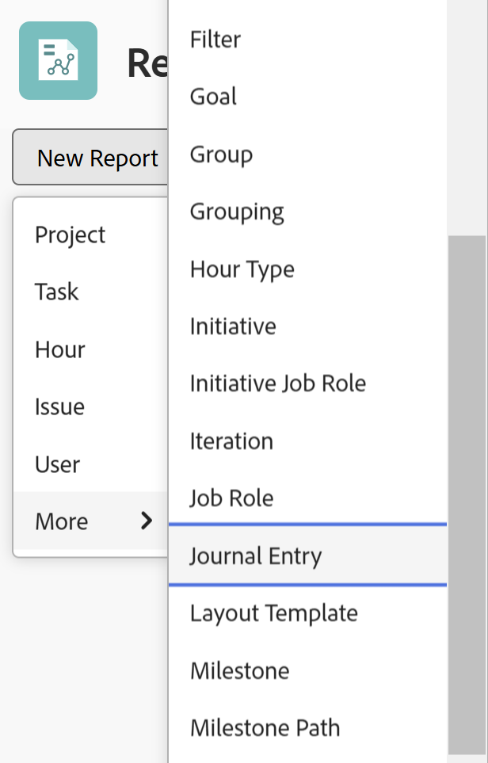
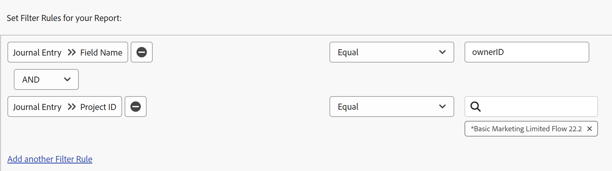

# 更新領域に関するレポート

ジャーナルエントリレポートは、以前はAdobe Workfront API からのみ使用できたプロジェクト、タスク、イシューおよびその他のオブジェクトの更新領域からのシステム更新を示します。 これは特定の使用例を対象とした高度なレポートですが、わかりやすい形式を使用すると、Workfront内でのプロジェクトのアクティビティやシステム更新に関するレポートが容易になります。

>[!TIP]
>
>仕訳レポートには、オブジェクトの「更新」領域からのシステム更新のみが含まれます。 「更新」領域に残されたコメントに関するレポートを作成するには、「メモ」レポートを使用する必要があります。\
>メモレポートについて詳しくは、 [メモレポートですべての更新を表示する](../../../workfront-basics/updating-work-items-and-viewing-updates/view-all-updates-in-a-report.md)を参照してください。

ジャーナルエントリレポートには、次の情報が表示されます。

* ステータスの変更が発生した回数
* タスクまたはイシューが削除されたとき
* 重要なカスタムフィールドの値が、プロジェクトのライフサイクルの過程でどのように変化したか
* プロジェクトのライフサイクルの過程で変化した重要な日付
* プロジェクトの所有者が変更された場合

## アクセス要件

この記事の手順を実行するには、次のアクセス権が必要です。

<table style="table-layout:auto"> 
 <col> 
 <col> 
 <tbody> 
  <tr> 
   <td role="rowheader">Adobe Workfront plan*</td> 
   <td> 
任意
 </td> 
  </tr> 
  <tr> 
   <td role="rowheader">Adobe Workfront license*</td> 
   <td> 
計画 
 </td> 
  </tr> 
  <tr> 
   <td role="rowheader">アクセスレベル設定*</td> 
   <td> 
レポート、ダッシュボード、カレンダーへのアクセスを編集
 
フィルター、ビュー、グループへのアクセスを編集
 
注意：まだアクセス権がない場合は、Workfront管理者に、アクセスレベルに追加の制限を設定しているかどうかを問い合わせてください。 Workfront管理者がアクセスレベルを変更する方法について詳しくは、 <a href="../../../administration-and-setup/add-users/configure-and-grant-access/create-modify-access-levels.md" class="MCXref xref">カスタムアクセスレベルの作成または変更</a>.
 </td> 
  </tr> 
  <tr> 
   <td role="rowheader">オブジェクト権限</td> 
   <td> 
レポートに表示するジャーナルエントリを含むオブジェクトに対する権限を表示します
 
レポートの作成後、レポートに対する管理権限が取得されます
 
追加のアクセス権のリクエストについて詳しくは、 <a href="../../../workfront-basics/grant-and-request-access-to-objects/request-access.md" class="MCXref xref">オブジェクトへのアクセスのリクエスト </a>.
 </td> 
  </tr> 
 </tbody> 
</table>

&#42;保有しているプラン、ライセンスの種類、アクセス権を確認するには、Workfront管理者に問い合わせてください。

## 前提条件

この記事で説明する操作を実行する前に、次の点を確認する必要があります。

* レポートするフィールドは、Workfrontで追跡されます。 追跡される「更新」領域のデータのみをレポートできます。

   Workfrontで追跡するフィールドの追加方法については、 [システム更新の構成](../../../administration-and-setup/set-up-workfront/system-tracked-update-feeds/configure-system-updates.md).

* レポートするすべてのカスタムフィールドには、 **更新フィードでのフィールド変更の表示** 有効。

   カスタムフィールドに対してこの設定を有効にする方法については、「 [カスタムフォームの作成または編集](../../../administration-and-setup/customize-workfront/create-manage-custom-forms/create-or-edit-a-custom-form.md#create) 記事内 [カスタムフォームの作成または編集](../../../administration-and-setup/customize-workfront/create-manage-custom-forms/create-or-edit-a-custom-form.md).

## ジャーナルエントリレポートの概要

仕訳レポートは、システムを更新するので、多数の結果を返す場合があります。 このため、レポートを作成する際は、プロジェクト、プログラム、ポートフォリオ、グループなどの特定のオブジェクトに対してフィルターを適用することをお勧めします。

Workfrontの様々なオブジェクトタイプについて詳しくは、 [Adobe Workfrontのオブジェクトについて](../../../workfront-basics/navigate-workfront/workfront-navigation/understand-objects.md).

>[!NOTE]
>
>ジャーナルエントリレポートが返すデータ量が多いので、レポートのエクスポートと配信の予定はサポートされていません。

このレポートのデフォルトの表示には、次の列が含まれます。

<table style="table-layout:auto"> 
 <col> 
 <col> 
 <thead> 
  <tr> 
   <th>フィールド</th> 
   <th>説明</th> 
  </tr> 
 </thead> 
 <tbody> 
  <tr> 
   <td><strong>フィールド名</strong> </td> 
   <td> 
影響を受けるフィールドの名前。 レポートの設定方法に応じて、この列には、「ステータス」、「所有者 ID」、「タスク名」、「計画完了日」などのフィールドが含まれます。 
 
条件 <strong>DE</strong>: がこの列に表示される場合は、一覧に表示されているフィールドがカスタムフィールドであることを示します。
 </td> 
  </tr> 
  <tr> 
   <td><strong>変更の種類</strong> </td> 
   <td> 
影響を受けるフィールドに加えられた変更のタイプ。 設定したフィルタールールと、ユーザーが実行したアクションに応じて、このフィールドに次のように表示されます。
 
    <ul> 
     <li> 
追加
 </li> 
     <li> 
監査
 </li> 
     <li> 
削除
 </li> 
     <li> 
ダイジェスト
 </li> 
     <li> 
編集
 </li> 
     <li> 
復元
 </li> 
    </ul> </td> 
  </tr> 
  <tr> 
   <td><strong>トップ ObjCode</strong> </td> 
   <td> 
階層内の最上位の親オブジェクト。
 </td> 
  </tr> 
  <tr> 
   <td><strong>範囲</strong> </td> 
   <td> 
変更されたオブジェクトのタイプ。
 </td> 
  </tr> 
  <tr> 
   <td><strong>エントリ日</strong> </td> 
   <td> 
フィールドが変更された日付。
 </td> 
  </tr> 
  <tr> 
   <td><strong>編集者名</strong> </td> 
   <td> 
フィールドを変更したユーザー。
 </td> 
  </tr> 
 </tbody> 
</table>

このレポートの情報を整理するには、組み込みのグループ化プロジェクトを使用できます。 プロジェクトのグループ化により、プロジェクト名を主にグループ化し、入口日を 2 つ目にグループ化できます。 この既存のグループ化は、レポートの作成時に適用することも、レポートの表示時に適用することもできます。

レポートの表示、フィルター、グループを設定する方法については、次の関連する節を参照してください。

<!--

(NOTE: from&nbsp;Luke: Take this for what it's worth, but part of me wonders if all of these subsections should be separate articles.

The biggest reason for breaking these up would be searchability, in my mind. For example, as a user, I might want to know how to see if the owner of a project changed. If I search the help site for that, I would be a lot more likely to find a separate article called "See if the owner of a project changed" vs an article titled "Create a Journal Entry report" because "Journal Entry" might mean nothing to me.) 

-->

* [ステータスの変更の発生状況の確認](#see-what-status-changes-occurred)
* [タスクまたはイシューが削除された日時を確認する](#see-when-a-task-or-issue-was-deleted)
* [プロジェクトのライフサイクルの過程でカスタムフィールドがどのように変化したかを確認する](#see-how-custom-fields-changed-over-the-course-of-a-project-s-life-cycle)
* [計画完了日がプロジェクトのライフサイクルの過程でどのように変更されたかを確認する](#see-how-the-planned-completion-date-changed-over-the-course-of-a-project-s-life-cycle)
* [プロジェクトの所有者が変更されたかどうかを確認](#see-if-the-owner-of-a-project-changed)

## ステータスの変更の発生状況の確認 {#see-what-status-changes-occurred}

次の項目を表示するジャーナルエントリレポートを設定できます。

* プロジェクト、タスク、またはイシューに対して行われたステータスの変更の数

* 変更前のステータス
* ステータスを変更したユーザー
* ステータスの変更が発生した日時

プロジェクトの正常性を確認する場合は、プロジェクトを使用してこの情報を表示するレポートを設定することもできます **条件** フィールドに入力します。

この情報は、監査に役立ち、お客様とお客様の組織がどの程度計画を立てているかを説明するために使用できます。

<!--

(NOTE:&nbsp;for tip below: When analytics adds the status option, update this note to say "these entries (status or condition changes)")

-->

>[!TIP]
>
>条件の変更間の日数の差を比較する場合は、Enhanced Analytics を使用できます。\
>Enhanced Analytics について詳しくは、 [分析の強化の概要](../../../enhanced-analytics/enhanced-analytics-overview.md).

1. 次をクリック： **メインメニュー** アイコン  Adobe Workfrontの右上隅で、 **レポート**.
1. クリック **新しいレポート**&#x200B;を選択し、「 **ジャーナルエントリ**.

   

   Report Builder が読み込まれます。

1. 内 **列（表示）** 「 」タブで、次の列を追加します。

   <table style="table-layout:auto"> 
    <col> 
    <col> 
    <thead> 
     <tr> 
      <th>列</th> 
      <th>説明</th> 
     </tr> 
    </thead> 
    <tbody> 
     <tr> 
      <td> 
フィールド名
 </td> 
      <td> 
影響を受けるフィールドの名前。 この場合、 <strong>ステータス</strong> がこの列に表示される必要があります。
 </td> 
     </tr> 
     <tr> 
      <td> 
変更の種類
 </td> 
      <td> 
影響を受けるフィールドに加えられた変更のタイプ（例： ） <strong>追加</strong>, <strong>削除</strong>または <strong>編集</strong>.
 </td> 
     </tr> 
     <tr> 
      <td> 
編集者名
 </td> 
      <td> 
ステータスを更新したユーザーの名前。
 </td> 
     </tr> 
     <tr> 
      <td> 
エントリ日
 </td> 
      <td> 
ステータスが変更された日付。
 </td> 
     </tr> 
     <tr> 
      <td> 
古いテキスト値
 </td> 
      <td> 
前のステータスのキー。 デフォルトのプロジェクトステータスのステータスキーは次のとおりです。
 
       <ul> 
        <li> 
 <strong>CUR</strong>:現在
 </li> 
        <li> 
<strong>DED</strong>:Dead
 </li> 
        <li> 
<strong>ONH</strong>:保留中
 </li> 
        <li> 
<strong>PLN</strong>:計画
 </li> 
        <li> 
<strong>CPL</strong>:完了
 </li> 
        <li> 
<strong>REQ</strong>:リクエスト
 </li> 
        <li> 
<strong>4 月</strong>:承認済み
 </li> 
        <li> 
<strong>REJ</strong>:却下
 </li> 
        <li> 
<strong>IDA</strong>:アイデア
 </li> 
       </ul> 
組織がカスタムステータスを設定している場合、この列に他のステータスキーが表示されることがあります。 ステータスキーに関連するカスタムステータスについては、Workfrontの管理者またはグループ管理者に問い合わせてください。
 </td> 
     </tr> 
     <tr> 
      <td> 
新規テキスト値
 </td> 
      <td> 
更新されたステータスのキー。
 </td> 
     </tr> 
     <tr> 
      <td> 
トップ ObjCode
 </td> 
      <td> 
ステータスが変更されたフィールドの最上位の親オブジェクト。
 </td> 
     </tr> 
     <tr> 
      <td> 
範囲
 </td> 
      <td> 
ステータスが変更されたオブジェクトのタイプ。
 </td> 
     </tr> 
     <tr> 
      <td> 
問題名 （オプション）
 </td> 
      <td> 
ステータスが変更された問題の名前。
 </td> 
     </tr> 
     <tr> 
      <td> 
タスク名 （オプション）
 </td> 
      <td> 
ステータスが変更されたタスクの名前。
 </td> 
     </tr> 
    </tbody> 
   </table>

   列の追加について詳しくは、 [Adobe Workfrontの概要を表示](../../../reports-and-dashboards/reports/reporting-elements/views-overview.md).

1. 内 **フィルター** タブ、クリック **フィルタールールを追加**&#x200B;をクリックし、フィルタールールを追加します。 **フィールド名** > **次と等しい** > **ステータス**.

   

   >[!TIP]
   >
   >条件の変更に関するレポートを作成する場合は、代わりにフィルタールールを追加できます **フィールド名** > **次と等しい** > **条件**.

   フィルターの追加について詳しくは、 [Adobe Workfrontのフィルターの概要](../../../reports-and-dashboards/reports/reporting-elements/filters-overview.md).

1. （オプション）レポートの焦点を絞り、読み込み時間を短縮するには、プロンプトを追加します。

   または

   特定のプロジェクト、タスクまたはタスクを含めるための追加のフィルタールールを作成します。

   >[!IMPORTANT]
   >
   >修飾子を使用するフィルタールールの作成 **次を含む** は、実際に読み込み時間を増やすことができます。 そのため、 **次と等しい** 特定のプロジェクトまたは上位のオブジェクト ID に対してフィルタリングできる場合。

   プロンプトを追加する方法については、 [レポートにプロンプトを追加する](../../../reports-and-dashboards/reports/creating-and-managing-reports/add-prompt-report.md).

1. 内 **グループ化** タブ、クリック **既存のグループの適用**&#x200B;を選択し、「 **プロジェクト**.

   グループ化の追加について詳しくは、 [Adobe Workfrontでのグループ化の概要](../../../reports-and-dashboards/reports/reporting-elements/groupings-overview.md).

1. クリック **保存して閉じる**.

   新しいレポートが読み込まれます。

## タスクまたはイシューが削除された日時を確認する {#see-when-a-task-or-issue-was-deleted}

次の項目を表示するジャーナルエントリレポートを設定できます。

* 削除されたタスクまたは問題
* タスクまたはイシューを削除したユーザー

タスクまたはイシューがいつ削除されたかを確認するには：

1. 次をクリック： **メインメニュー** アイコン  Adobe Workfrontの右上隅で、 **レポート**.
1. クリック **新しいレポート**&#x200B;を選択し、「 **ジャーナルエントリ**.

   

   Report Builder が読み込まれます。

1. 内 **列（表示）** 「 」タブで、次の列を追加します。

   <table style="table-layout:auto"> 
    <col> 
    <col> 
    <thead> 
     <tr> 
      <th>列</th> 
      <th>説明</th> 
     </tr> 
    </thead> 
    <tbody> 
     <tr> 
      <td> 
範囲
 </td> 
      <td> 
削除されたオブジェクトのタイプ。
 </td> 
     </tr> 
     <tr> 
      <td> 
変更の種類
 </td> 
      <td> 
発生した変更のタイプ。 この <strong>削除</strong> 変更がこの列に表示されます。
 </td> 
     </tr> 
     <tr> 
      <td> 
エントリ日
 </td> 
      <td> 
タスクまたはタスクが削除された日付です。
 </td> 
     </tr> 
     <tr> 
      <td> 
編集者名
 </td> 
      <td> 
タスクまたはイシューを削除したユーザーの名前です。
 </td> 
     </tr> 
     <tr> 
      <td> 
プロジェクト名
 </td> 
      <td> 
タスクまたはタスクが削除されたプロジェクトの名前です。
 </td> 
     </tr> 
    </tbody> 
   </table>

   列の追加について詳しくは、 [Adobe Workfrontの概要を表示](../../../reports-and-dashboards/reports/reporting-elements/views-overview.md).

1. 内 **フィルター** タブ、クリック **フィルタールールを追加**&#x200B;次のコードを追加します。

   * **タイプを変更** > **次と等しい** > **削除**
   * **プロジェクト ID** > **次と等しい** > **`<project>`**

      <!--WRITER check link; this png file has spaces
     -->
   フィルターの追加について詳しくは、 [Adobe Workfrontのフィルターの概要](../../../reports-and-dashboards/reports/reporting-elements/filters-overview.md).

1. （オプション）レポートの焦点を絞り、読み込み時間を短縮するには、プロンプトを追加します。

   または

   特定のプロジェクト、タスクまたはタスクを含めるための追加のフィルタールールを作成します。

   >[!IMPORTANT]
   >
   >修飾子を使用するフィルタールールの作成 **次を含む** は、実際に読み込み時間を増やすことができます。 そのため、 **次と等しい** 特定のプロジェクトまたは上位のオブジェクト ID に対してフィルタリングできる場合。

   プロンプトを追加する方法については、 [レポートにプロンプトを追加する](../../../reports-and-dashboards/reports/creating-and-managing-reports/add-prompt-report.md).

1. （オプション） **グループ化** タブ、クリック **既存のグループの適用**&#x200B;を選択し、「 **プロジェクト**.

   グループ化の追加について詳しくは、 [Adobe Workfrontでのグループ化の概要](../../../reports-and-dashboards/reports/reporting-elements/groupings-overview.md).

1. クリック **保存して閉じる**.

   新しいレポートが読み込まれます。

## プロジェクトのライフサイクルの過程でカスタムフィールドがどのように変化したかを確認する {#see-how-custom-fields-changed-over-the-course-of-a-project-s-life-cycle}

プロジェクトの進行中に重要なフィールドの変更を追跡できます。 これを行うには、次のようにジャーナルエントリを設定します。

* 特定のカスタムフィールドが追加、更新または編集された場合
* これらの変更が発生した時
* 誰が変更を加えたか

プロジェクトのライフサイクルの過程でカスタムフィールドがどのように変化したかを確認するには、次の手順を実行します。

1. 次をクリック： **メインメニュー** アイコン  Adobe Workfrontの右上隅で、 **レポート**.
1. クリック **新しいレポート**&#x200B;を選択し、「 **ジャーナルエントリ**.

   

   Report Builder が読み込まれます。

1. 内 **列（表示）** 「 」タブで、次の列を追加します。

   <table style="table-layout:auto"> 
    <col> 
    <col> 
    <thead> 
     <tr> 
      <th>列</th> 
      <th>説明</th> 
     </tr> 
    </thead> 
    <tbody> 
     <tr> 
      <td> 
フィールド名
 </td> 
      <td> 
影響を受けたカスタムフィールドの名前。
 
条件 <strong>DE</strong>: がこの列に表示される場合は、一覧に表示されているフィールドがカスタムフィールドであることを示します。
 </td> 
     </tr> 
     <tr> 
      <td> 
変更の種類
 </td> 
      <td> 
影響を受けるフィールドに加えられた変更のタイプ（例： ） <strong>追加</strong>, <strong>削除</strong>または <strong>編集</strong>.
 </td> 
     </tr> 
     <tr> 
      <td> 
編集者名
 </td> 
      <td> 
カスタムフィールドを更新したユーザーの名前。
 </td> 
     </tr> 
     <tr> 
      <td> 
エントリ日
 </td> 
      <td> 
カスタムフィールドの値が変更された日付。
 
このフィールドは降順で並べ替える必要があります。
 </td> 
     </tr> 
     <tr> 
      <td> 
古い数値
 </td> 
      <td> 
カスタムフィールドの前の数値。
 </td> 
     </tr> 
     <tr> 
      <td> 
新規数値
 </td> 
      <td> 
カスタムフィールドの現在の数値。
 </td> 
     </tr> 
     <tr> 
      <td> 
古い日付値
 </td> 
      <td> 
カスタムフィールドの前の日付値。
 </td> 
     </tr> 
     <tr> 
      <td> 
新規日付値
 </td> 
      <td> 
カスタムフィールドの現在の日付値。
 </td> 
     </tr> 
     <tr> 
      <td> 
古いテキスト値
 </td> 
      <td> 
カスタムフィールドの前のテキスト値。
 </td> 
     </tr> 
     <tr> 
      <td> 
新規テキスト値
 </td> 
      <td> 
カスタムフィールドの現在のテキスト値。
 
カスタムフィールドが typeahead フィールドの場合、 <strong>新しいテキスト値</strong> 列にはオブジェクト ID が表示されます。
 </td> 
     </tr> 
    </tbody> 
   </table>

   列の追加について詳しくは、 [Adobe Workfrontの概要を表示](../../../reports-and-dashboards/reports/reporting-elements/views-overview.md).

1. 内 **フィルター** タブ、クリック **フィルタールールを追加**&#x200B;次のコードを追加します。

   * **ジャーナルエントリフィールド名** > **次を含む** > **DE**

      >[!TIP]
      >
      >このレポートを特定のカスタムフィールドに限定するには、フィルタールールを追加します **ジャーナルエントリフィールド名** > **次と等しい** > **`<custom field>`**.

   * **プロジェクト ID** > **次と等しい** > **`<project>`**

      
   フィルターの追加について詳しくは、 [Adobe Workfrontのフィルターの概要](../../../reports-and-dashboards/reports/reporting-elements/filters-overview.md).

1. （オプション）レポートの焦点を絞り、読み込み時間を短縮するには、プロンプトを追加します。

   または

   特定のプロジェクト、タスクまたはタスクを含めるための追加のフィルタールールを作成します。

   >[!IMPORTANT]
   >
   >修飾子を使用するフィルタールールの作成 **次を含む** は、実際に読み込み時間を増やすことができます。 そのため、 **次と等しい** 特定のプロジェクトまたは上位のオブジェクト ID に対してフィルタリングできる場合。

   プロンプトを追加する方法については、 [レポートにプロンプトを追加する](../../../reports-and-dashboards/reports/creating-and-managing-reports/add-prompt-report.md).

1. 内 **グループ化** タブ、クリック **既存のグループの適用**&#x200B;を選択し、「 **プロジェクト**.

   グループ化の追加について詳しくは、 [Adobe Workfrontでのグループ化の概要](../../../reports-and-dashboards/reports/reporting-elements/groupings-overview.md).

1. クリック **保存して閉じる**.

   新しいレポートが読み込まれます。

## 計画完了日がプロジェクトのライフサイクルの過程でどのように変更されたかを確認する {#see-how-the-planned-completion-date-changed-over-the-course-of-a-project-s-life-cycle}

仕訳レポートを設定して、プロジェクトの全期間に予定完了日が変更される頻度を示すことができます。

1. 次をクリック： **メインメニュー** アイコン  Adobe Workfrontの右上隅で、 **レポート**.
1. クリック **新しいレポート**&#x200B;を選択し、「 **ジャーナルエントリ**.

   

   Report Builder が読み込まれます。

1. 内 **列（表示）** 「 」タブで、次の列を追加します。

   <table style="table-layout:auto"> 
    <col> 
    <col> 
    <thead> 
     <tr> 
      <th>列</th> 
      <th>説明</th> 
     </tr> 
    </thead> 
    <tbody> 
     <tr> 
      <td> 
フィールド名
 </td> 
      <td> 
影響を受けるフィールドの名前。
 
条件 <strong>DE</strong>: がこの列に表示される場合は、一覧に表示されているフィールドがカスタムフィールドであることを示します。
 </td> 
     </tr> 
     <tr> 
      <td> 
変更の種類
 </td> 
      <td>発生した変更のタイプ。例： <strong>追加</strong>, <strong>削除</strong>または <strong>編集</strong>.</td> 
     </tr> 
     <tr> 
      <td> 
編集者名
 </td> 
      <td> 
プロジェクトの計画完了日を更新したユーザーの名前。
 </td> 
     </tr> 
     <tr> 
      <td> 
エントリ日
 </td> 
      <td> 
プロジェクトの計画完了日が変更された日付。
 
このフィールドは降順で並べ替える必要があります。
 </td> 
     </tr> 
     <tr> 
      <td> 
トップ ObjCode
 </td> 
      <td> 
計画完了日が変更されたフィールドの最も高い親オブジェクト。
 </td> 
     </tr> 
     <tr> 
      <td> 
範囲
 </td> 
      <td> 
計画完了日が変更されたオブジェクト。
 </td> 
     </tr> 
     <tr> 
      <td> 
古い日付値
 </td> 
      <td> 
計画完了日の前の値。
 </td> 
     </tr> 
     <tr> 
      <td> 
新規日付値
 </td> 
      <td> 
計画完了日の現在の値。
 </td> 
     </tr> 
     <tr> 
      <td> 
プロジェクト名
 
(オプション)
 </td> 
      <td> 
計画完了日が変更されたプロジェクトの名前。
 </td> 
     </tr> 
     <tr> 
      <td> 
タスク名
 
(オプション)
 </td> 
      <td> 
計画完了日が変更されたプロジェクト内のタスクの名前。
 </td> 
     </tr> 
     <tr> 
      <td> 
問題名
 
(オプション)
 </td> 
      <td>「計画完了日」が変更されたプロジェクト内の問題の名前。</td> 
     </tr> 
    </tbody> 
   </table>

   列の追加について詳しくは、 [Adobe Workfrontの概要を表示](../../../reports-and-dashboards/reports/reporting-elements/views-overview.md).

1. 内 **フィルター** タブ、クリック **フィルタールールを追加**&#x200B;次のコードを追加します。

   * **フィールド名** > **次と等しい** > **日付**
   * **プロジェクト ID** > **次と等しい** > **`<project>`**

   

   フィルターの追加について詳しくは、 [Adobe Workfrontのフィルターの概要](../../../reports-and-dashboards/reports/reporting-elements/filters-overview.md).

1. （オプション）レポートの焦点を絞り、読み込み時間を短縮するには、プロンプトを追加します。

   または

   特定のプロジェクト、タスクまたはタスクを含めるための追加のフィルタールールを作成します。

   >[!IMPORTANT]
   >
   >修飾子を使用するフィルタールールの作成 **次を含む** は、実際に読み込み時間を増やすことができます。 そのため、 **次と等しい** 特定のプロジェクトまたは上位のオブジェクト ID に対してフィルタリングできる場合。

   プロンプトを追加する方法については、 [レポートにプロンプトを追加する](../../../reports-and-dashboards/reports/creating-and-managing-reports/add-prompt-report.md).

1. 内 **グループ化** タブ、クリック **既存のグループの適用**&#x200B;を選択し、「 **プロジェクト**.

   グループ化の追加について詳しくは、 [Adobe Workfrontでのグループ化の概要](../../../reports-and-dashboards/reports/reporting-elements/groupings-overview.md).

1. クリック **保存して閉じる**.

   新しいレポートが読み込まれます。

## プロジェクトの所有者が変更されたかどうかを確認 {#see-if-the-owner-of-a-project-changed}

仕訳レポートを設定して、プロジェクトの全期間にプロジェクト所有者（プロジェクトマネージャ）が何回変更したかを表示できます。

1. 次をクリック： **メインメニュー** アイコン  Adobe Workfrontの右上隅で、 **レポート**.
1. クリック **新しいレポート**&#x200B;を選択し、「 **ジャーナルエントリ**.

   

   Report Builder が読み込まれます。

1. 内 **列（表示）** 「 」タブで、次の列を追加します。

   <table style="table-layout:auto"> 
    <col> 
    <col> 
    <thead> 
     <tr> 
      <th>列</th> 
      <th>説明</th> 
     </tr> 
    </thead> 
    <tbody> 
     <tr> 
      <td> 
フィールド名
 </td> 
      <td>影響を受けるフィールドの名前。 この <strong>ownerID</strong> がこの列に表示されます。</td> 
     </tr> 
     <tr> 
      <td> 
変更の種類
 </td> 
      <td> 
発生した変更のタイプ。例： <strong>追加</strong>, <strong>削除</strong>または <strong>編集</strong>.
 </td> 
     </tr> 
     <tr> 
      <td> 
トップ ObjCode
 </td> 
      <td> 
プロジェクト所有者が更新したプロジェクトの最上位の親オブジェクト。
 </td> 
     </tr> 
     <tr> 
      <td> 
エントリ日
 </td> 
      <td>プロジェクト所有者が変更された日付。 このフィールドは降順で並べ替える必要があります。</td> 
     </tr> 
     <tr> 
      <td> 
編集者名
 </td> 
      <td> 
プロジェクト所有者を更新したユーザーの名前。
 </td> 
     </tr> 
     <tr> 
      <td> 
追加情報 1
 </td> 
      <td> 
プロジェクトの現在のプロジェクト所有者。
 </td> 
     </tr> 
     <tr> 
      <td> 
追加情報 2
 </td> 
      <td> 
プロジェクトの前のプロジェクト所有者。
 </td> 
     </tr> 
     <tr> 
      <td> 
プロジェクト名
 </td> 
      <td> 
「プロジェクト所有者」フィールドが更新されたプロジェクト。
 </td> 
     </tr> 
    </tbody> 
   </table>

   列の追加について詳しくは、 [Adobe Workfrontの概要を表示](../../../reports-and-dashboards/reports/reporting-elements/views-overview.md).

1. 内 **フィルター** タブ、クリック **フィルタールールを追加**&#x200B;次のコードを追加します。

   * **フィールド名** > **次と等しい** > **ownerID**
   * **プロジェクト ID** > **次と等しい** > **`<project name>`**

      
   フィルターの追加について詳しくは、 [Adobe Workfrontのフィルターの概要](../../../reports-and-dashboards/reports/reporting-elements/filters-overview.md).

1. （オプション）レポートの焦点を絞り、読み込み時間を短縮するには、プロンプトを追加します。

   または

   特定のプロジェクト、タスクまたはタスクを含めるための追加のフィルタールールを作成します。

   >[!IMPORTANT]
   >
   >修飾子を使用するフィルタールールの作成 **次を含む** は、実際に読み込み時間を増やすことができます。 そのため、 **次と等しい** 特定のプロジェクトまたは上位のオブジェクト ID に対してフィルタリングできる場合。

   プロンプトを追加する方法については、 [レポートにプロンプトを追加する](../../../reports-and-dashboards/reports/creating-and-managing-reports/add-prompt-report.md).

1. （オプション） **グループ化** タブ、クリック **既存のグループの適用**&#x200B;を選択し、「 **プロジェクト**.

   グループ化の追加について詳しくは、 [Adobe Workfrontでのグループ化の概要](../../../reports-and-dashboards/reports/reporting-elements/groupings-overview.md).

1. クリック **保存して閉じる**.

   新しいレポートが読み込まれます。
