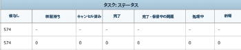
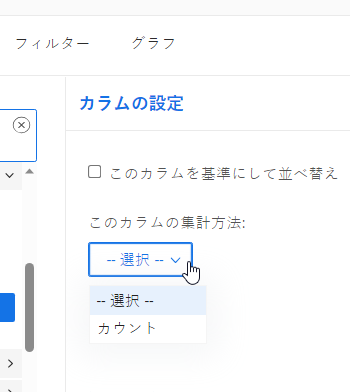
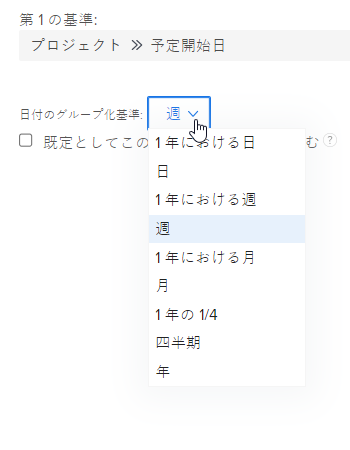
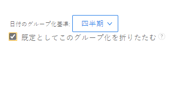

# マトリックスレポートの作成

マトリックスレポートは、概要情報を集計表形式で表示するので、従来のレポートと同様にリストに表示されるよりも見やすくなります。

## マトリックスレポートを使用するタイミング

マトリックスレポートは、2 つ以上のグループを含む任意のレポートに対して作成できます。 従来のレポートには最大 3 つのグループを含めることができ、マトリックスレポートには最大 4 つのグループを含めることができます。

例えば、3 ヶ月の期間に記録された時間を表示する時間レポートを作成し、その時間に入ったユーザーや月、週ごとにレポートを整理するとします。

## マトリックスレポートでのデータの表示方法

マトリックスレポートの情報は、常に数値として表示されます。 ほとんどの場合、数値を含む列は、マトリックスレポートに表示するのに最適です（ログに記録された時間数や実際のコストなど）。

ただし、他の列（ステータスなど）は、次の図に示すように、マトリックスレポートに表示できます。\

## アクセス要件

この記事の手順を実行するには、次のアクセス権が必要です。

<table style="table-layout:auto"> 
 <col> 
 <col> 
 <tbody> 
  <tr> 
   <td role="rowheader">Adobe Workfront plan*</td> 
   <td> 
任意
 </td> 
  </tr> 
  <tr> 
   <td role="rowheader">Adobe Workfront license*</td> 
   <td> 
計画 
 </td> 
  </tr> 
  <tr> 
   <td role="rowheader">アクセスレベル設定*</td> 
   <td> 
レポート、ダッシュボード、カレンダーへのアクセスを編集
 
フィルター、ビュー、グループへのアクセスを編集
 
注意：まだアクセス権がない場合は、Workfront管理者に、アクセスレベルに追加の制限を設定しているかどうかを問い合わせてください。 Workfront管理者がアクセスレベルを変更する方法について詳しくは、 <a href="../../../administration-and-setup/add-users/configure-and-grant-access/create-modify-access-levels.md" class="MCXref xref">カスタムアクセスレベルの作成または変更</a>.
 </td> 
  </tr> 
  <tr> 
   <td role="rowheader">オブジェクト権限</td> 
   <td> 
レポートに対する権限の管理
 
追加のアクセス権のリクエストについて詳しくは、 <a href="../../../workfront-basics/grant-and-request-access-to-objects/request-access.md" class="MCXref xref">オブジェクトへのアクセスのリクエスト </a>.
 </td> 
  </tr> 
 </tbody> 
</table>

&#42;保有しているプラン、ライセンスの種類、アクセス権を確認するには、Workfront管理者に問い合わせてください。

## マトリックスレポートの設定

1. レポート出力に数値データを含む従来のレポートを作成します。\
   レポートの作成方法について詳しくは、 [カスタムレポートの作成](../../../reports-and-dashboards/reports/creating-and-managing-reports/create-custom-report.md).

1. 手順 1 で作成したレポートに移動し、「 **レポートのアクション**&#x200B;を選択し、「 **編集**.

1. （条件付き）既にビューを作成していて、このレポートに適用する場合は、 **既存のビューの適用**&#x200B;を選択し、ドロップダウンリストから「表示」を選択します。
1. （条件付き）レポートの新しいビューを作成する場合は、次の手順を実行します。

   1. 次をクリック： **列（表示）** 」タブをクリックし、マトリックスレポートに要約する列を選択します。
   1. 内 **列設定** 」領域で、 **この列の要約基準** 」ドロップダウンリストから、情報を要約するための使用可能なオプションの 1 つを選択します。

      >[!IMPORTANT]
      >
      >このオプションが選択されていない場合、列の情報はマトリックスレポートに正しく表示されません。

      

   1. 「列（表示） 」タブの各列に対してこの手順を繰り返し、 **完了**.

1. 次をクリック： **グループ化** タブをクリックします。
1. （条件付き）既にグループ化を作成していて、このレポートに適用する場合は、 **既存のグループの適用**&#x200B;を選択し、ドロップダウンリストから「グループ化」を選択します。
1. （条件付き）レポートの新しいマトリックスのグループ化を作成する場合は、次の手順を実行します。

   1. 選択 **マトリックスグループ化に切り替え** をクリックします。
   1. 内 **行のグループ化** 「 」セクションで、行のグループ化を指定します。このグループ化によって、テーブルの水平グループが設定されます。
   1. （オプション）行のグループ化を追加するには、 **セカンダリ行のグループ化を追加**.
   1. 内 **列のグループ化** 「 」セクションで、列のグループを指定します。列のグループは、テーブルの垂直グループを確立します。
   1. （オプション）列のグループ化を追加するには、 **セカンダリ列のグループ化を追加**.
   1. （条件付き）日付別のグループ化を追加する場合、日、週、月、四半期、年別に結果をグループ化するかどうかを指定します。\
      

   1. （条件付き）日付別にグループ化し、結果を四半期別に表示する場合、例えば、データのない四半期を表示するかどうかを、 **結果のない四半期を表示** チェックボックス。\
      

      >[!NOTE]
      >
      >この **結果のない四半期を表示** フィールドは、マトリックスのグループ化に対してのみ使用でき、標準のグループ化には使用できません。\
      >有効なデータを持つ 2 四半期の間にデータを持たない四半期のみが、「行列」タブのデータ値に対してゼロを表示します。 フィルターによって選択された期間の最初と最後にデータがない四半期は、マトリックスのグループには表示されません。 結果のない四半期は、レポートの「詳細」タブのグループに表示されません。

1. （オプションおよび条件付き）「 **マトリックス設定**&#x200B;次のオプションから選択します。\
   **レコード数を表示：** 特定のフィールドのエントリの合計数を含む行を表示するには、このオプションを選択します。\
   **値の列を表示：** 以下の情報をマトリックスに表示するには、このオプションを選択します。

   * レコード数
   * 「値」列

      >[!NOTE]
      >
      >この列には、各行のデータが何を表すかを説明する情報が含まれます。\
      >次の例外は、グループ化で次のフィールドの値を集計する場合に親オブジェクト（親タスクなど）に適用されます。
      >
      >   
      >   
      >   * 「実績時間」（「計画/実績労務費」、「計画/実費原価」、「計画/実費」、「計画/実費」、「計画時間」など）を除くすべての数値および通貨フィールドは、子タスクとスタンドアロンタスクの値のみを集計します。 親タスクや親の値は集計されません。
      >   * 実際の時間は、メインの親タスクとスタンドアロンタスクの値を集計します。親タスクの親や子タスクの数を集計しません。
      >   * 数値および通貨値のカスタムデータフィールドは、すべてのタスクを集計します。親、子、親の親、スタンドアロンタスク。 マトリックス・レポートを作成して、「計画時間」または「実績時間」を **値** 」列には、親オブジェクト（親タスクなど）の時間またはコストの情報はマトリックスレポートに表示されないことに注意してください。 親オブジェクトの時間を表示するには、 **詳細** タブをクリックします。

   **条件付きルール：** 集計される値の書式設定ルールを設定します。\
   ルールを追加した後、そのルールに一致するフィールドの表示方法に対して、フィールドおよびテキストスタイルを定義できます。 クリック **ルールを追加** ルールの定義が完了したら、 **完了** 」と入力してルールを保存します。

1. 次をクリック： **フィルター** 」タブを使用して、レポートに表示する情報を定義します。
1. （条件付き）既にフィルターを作成していて、このレポートに適用する場合は、 **既存のフィルターの適用**&#x200B;をクリックし、ドロップダウンリストから「フィルター」を選択します。
1. （条件付き）このレポートに新しいフィルターを作成する場合は、 [フィルターおよび条件修飾子](../../../reports-and-dashboards/reports/reporting-elements/filter-condition-modifiers.md)

   <!--
   <MadCap:conditionalText data-mc-conditions="QuicksilverOrClassic.Draft mode">
   and
   <a href="../../../reports-and-dashboards/reports/reporting-elements/advanced-filter-condition-qualifiers.md" class="MCXref xref">Advanced Filter and condition qualifiers </a>
   </MadCap:conditionalText>
   -->

   を参照してください。

1. クリック **保存して閉じる** をクリックして、マトリックスレポートを保存および表示します。
