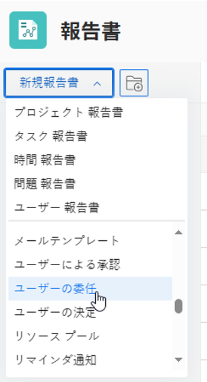

# ユーザー委任レポートの作成

<!--

(NOTE: consider moving this to the Custom&nbsp;View, Filter, Grouping Samples section as an example of a report)

-->

Adobe Workfrontでは、ユーザーがプロジェクト、タスクおよび問題の承認を他のユーザーに委任して、不在時に承認が管理されるようにすることができます。 プランライセンスを持つユーザは、次の項目を確認するためのユーザ委任レポートを作成できます。

* タスク、問題およびプロジェクトの承認を別のユーザーに委任したユーザー
* タスク、問題、およびプロジェクト承認を委任したユーザーに割り当てるユーザー

* 委任が開始および終了する日付

承認の委任について詳しくは、 [承認リクエストを委任](../../../review-and-approve-work/manage-approvals/delegate-approval-requests.md).

<!--

DRAFTED: To learn more about delegating work, see <a href="../../../workfront-basics/manage-your-account-and-profile/manage-time-off/personal-time-off.md" class="MCXref xref">Log personal time off and delegate your work</a>.

-->

<!--

DRAFTED: To learn how to manage delegated work in Home, see [future link here].

-->

## アクセス要件

この記事の手順を実行するには、次のアクセス権が必要です。

<table style="table-layout:auto"> 
 <col> 
 <col> 
 <tbody> 
  <tr> 
   <td role="rowheader">Adobe Workfront plan*</td> 
   <td> 
任意
 </td> 
  </tr> 
  <tr> 
   <td role="rowheader">Adobe Workfront license*</td> 
   <td> 
計画 
 </td> 
  </tr> 
  <tr> 
   <td role="rowheader">アクセスレベル設定*</td> 
   <td> 
レポート、ダッシュボード、カレンダーへのアクセスを編集
 
フィルター、ビュー、グループへのアクセスを編集
 
注意：まだアクセス権がない場合は、Workfront管理者に、アクセスレベルに追加の制限を設定しているかどうかを問い合わせてください。 Workfront管理者がアクセスレベルを変更する方法について詳しくは、 <a href="../../../administration-and-setup/add-users/configure-and-grant-access/create-modify-access-levels.md" class="MCXref xref">カスタムアクセスレベルの作成または変更</a>.
 </td> 
  </tr> 
  <tr> 
   <td role="rowheader">オブジェクト権限</td> 
   <td> 
承認が委任された項目と委任に関係するユーザーに対する権限を表示します
 
追加のアクセス権のリクエストについて詳しくは、 <a href="../../../workfront-basics/grant-and-request-access-to-objects/request-access.md" class="MCXref xref">オブジェクトへのアクセスのリクエスト </a>.
 </td> 
  </tr> 
 </tbody> 
</table>

&#42;保有しているプラン、ライセンスの種類、アクセス権を確認するには、Workfront管理者に問い合わせてください。

## ユーザー委任レポートの作成

1. 次をクリック： **メインメニュー** アイコン  Adobe Workfrontの右上隅で、 **レポート**.

1. クリック **新しいレポート**&#x200B;を選択し、「 **ユーザーの委任**.\
   

   次のフィールドは、デフォルトでこのレポートに表示されます。

   | フィールド | 説明 |
   |---|---|
   | **委任元ユーザー** | これは、タスク、問題およびプロジェクトの承認を別のユーザーに委任するユーザーです。 |
   | **委任先ユーザー** | タスク、問題、およびプロジェクト承認が委任されたユーザーです。 |
   | **開始** | これは、委任をおこなったユーザーの不在時間の開始時です。 |
   | **終了** | これで、委任をおこなったユーザーの不在時間が終了します。 |

   {style=&quot;table-layout:auto&quot;}

1. （オプション）Report Builder で、次の変更をおこないます。

   * 列
   * グループ化
   * フィルター
   * グラフ

   これらの機能について詳しくは、 [カスタムレポートの作成](../../../reports-and-dashboards/reports/creating-and-managing-reports/create-custom-report.md).

1. レポートの作成が完了したら、「 **保存して閉じる**.

1. 新しい名前を **レポート名** 「 」フィールドで、「 **レポートを保存**.

   レポートが表示されます。
