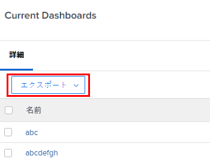
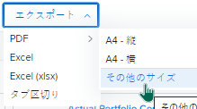
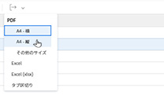

# データを書き出し

<!-- Audited: 12/2023 -->

様々なリスト、レポート、ダッシュボード、検索からAdobe Workfrontのデータを書き出すことができます。

データをエクスポートする理由の一部を次に示します。

* Workfront以外のユーザーにデータのハードコピーを提供する場合。
* レポートの結果を添付ファイルとして外部ユーザーに送信する場合。
* Workfrontデータの外部バックアップを作成する場合。
* Workfront Web アプリケーション内の 1 つのページに 2,000 件の結果のみを表示する制限があります。 レポートの生成量が 2,000 を超える場合は、使用可能な任意の形式にレポートをエクスポートし、レポートのすべての結果を 1 つのリストに表示できます。

Workfrontインターフェイスから手動でレポートをエクスポートすることも、レポートの配信をスケジュールして後でレポートを送信することもできます。 配信されるレポートのスケジュールについて詳しくは、 [レポート配信の概要](../../../reports-and-dashboards/reports/creating-and-managing-reports/set-up-report-deliveries.md).

この記事の情報は、次のエクスポートには適用されません。

* グラフレポートから情報をエクスポートする。

  グラフレポートのエクスポートについて詳しくは、 [レポートにグラフを追加する](../../../reports-and-dashboards/reports/creating-and-managing-reports/add-chart-report.md).

* ガントチャートから情報をエクスポートします。

  ガントチャートのエクスポートの詳細については、 [ガントチャートをPDFにエクスポート](../../../manage-work/gantt-chart/use-the-gantt-chart/export-gantt-chart-to-pdf.md).

* リソース・プランナからの情報のエクスポート。

  リソース・プランナからの情報のエクスポートの詳細は、「エクスポート・オプション」( [リソースプランナーのナビゲーションの概要](../../../resource-mgmt/resource-planning/resource-planner-navigation.md).

## アクセス要件

この記事の手順を実行するには、次のアクセス権が必要です。

<table style="table-layout:auto"> 
 <col> 
 </col> 
 <col> 
 </col> 
 <tbody> 
  <tr> 
   <td role="rowheader">Adobe Workfront plan*</td> 
   <td> 
任意
 </td> 
  </tr> 
  <tr> 
   <td role="rowheader">Adobe Workfront license*</td> 
   <td>
    
新規：明るいかそれ以上

    
または

    
現在：レビュー以上
 </td> 
  </tr> 
  <tr> 
   <td role="rowheader">アクセスレベル設定*</td> 
   <td> 
レポート、ダッシュボード、およびレポートを書き出すためのカレンダーへのアクセス権を表示または高くします
 
リスト内の表示するオブジェクトに対する表示またはアクセス権を高くして、リストを書き出す
 
注意：まだアクセス権がない場合は、Workfront管理者に、アクセスレベルに追加の制限が設定されているかどうかを問い合わせてください。 Workfront管理者がアクセスレベルを変更する方法について詳しくは、 <a href="../../../administration-and-setup/add-users/configure-and-grant-access/create-modify-access-levels.md" class="MCXref xref">カスタムアクセスレベルの作成または変更</a>.
 </td> 
  </tr> 
  <tr> 
   <td role="rowheader">オブジェクトの権限</td> 
   <td> 
レポートまたはダッシュボードに対する、レポートまたはダッシュボードをエクスポートするための権限を表示または高くする。
 
リストで表示するオブジェクトに対する表示権限またはそれ以上の権限で、リストをエクスポートします
 
追加のアクセス権のリクエストについて詳しくは、 <a href="../../../workfront-basics/grant-and-request-access-to-objects/request-access.md" class="MCXref xref">オブジェクトへのアクセスのリクエスト</a>.
 </td> 
  </tr> 
 </tbody> 
</table>

&#42;保有するプラン、ライセンスの種類、アクセス権を確認するには、Workfront管理者に問い合わせてください。

## 前提条件

レポートのデータをエクスポートする前に、レポートを作成する必要があります。

レポートの作成について詳しくは、 [カスタムレポートの作成](/help/quicksilver/reports-and-dashboards/reports/creating-and-managing-reports/create-custom-report.md) または [レポートのコピーの作成](/help/quicksilver/reports-and-dashboards/reports/creating-and-managing-reports/create-copy-report.md).

## 書き出し形式と制限

### 書き出し形式 {#export-formats}

情報は、次の形式で書き出すことができます。

* PDF（レター横置きまたは縦置き、法務、元帳および A4）
* Excel(.xls)
* Excel(.xlsx)
* タブ区切り

>[!NOTE]
>
>ダッシュボードの印刷または書き出しは.pdf ファイルにのみ行うことができます。

### 書き出し制限 {#export-limits}

<!--
NOTE: Alina: [! This information is shared between "Exporting Data" and "Setting Up Report Deliveries."]
-->

Workfrontでのレポートの表示方法や、手動での書き出し、配信されたレポート、API での書き出し方法には、いくつかの制限があります。

* **50,000 セル：** Excel ファイルのレポートエクスポートで許可されるセルの最大数。
* **50,000 行：** .pdf ファイルおよびタブ区切りファイルのレポート書き出しで許可されるデータの行数。

   * Excelの.xls ファイルの場合、この制限は次のとおりです。 **65,000 行**.
   * Excelの.xlsx ファイルの場合、この制限はです。 **100,000 行**.
   * これらの制限により、列見出しと、レポート内のグループ化の行が除外されます。 例えば、1 つのレポートに 6 つのグループが含まれ、50,000 行のデータが含まれる場合、エクスポートされるファイルの行数は 50,000 行になります。

  >[!IMPORTANT]
  >
  >コレクション参照を含むレポートを列にエクスポートすると、レポートがそれ以外の場合にリストに表示されるエクスポート制限内にあるとしても、エラーが発生する場合があります。 参照されるコレクションが大きすぎる場合、書き出しプロセスはタイムアウトし、その後エラーが発生します。
  >
  >このエラーを回避するには、大きなコレクションを参照する列を除外するか、書き出す前に参照されるコレクションのサイズを小さくします。
  >

  レポートにこれらの制限を超える項目がある場合は、エクスポートが成功しなかったというエラーが表示されます。 結果を書き出すには、画面に表示される項目の数を、この制限値以下の数に減らします。

  レポートの行数が 50,000/65,000/100,000 を超える場合、すべてのデータをエクスポートするには、フィルターまたはプロンプトを使用してデータの負荷を減らし、複数のエクスポートを実行します。

  フィルターの使用について詳しくは、 [フィルターの概要](../../../reports-and-dashboards/reports/reporting-elements/filters-overview.md).

  プロンプトの使用に関する詳細は、「 [レポートにプロンプトを追加する](../../../reports-and-dashboards/reports/creating-and-managing-reports/add-prompt-report.md).

* 以下の制限が適用されます。

   * レポートの手動エクスポート。
   * 予定レポート。
   * API 統合を通じたエクスポート。
   * キックスタートを通じてエクスポートされたデータ。

     キックスタートを使用したデータのエクスポートについて詳しくは、 [「キックスタート」を使用してAdobe Workfrontからデータを書き出す](../../../administration-and-setup/manage-workfront/using-kick-starts/export-data-from-wf-via-kick-starts.md).

     >[!NOTE]
     >
     >50,000 行をキックスタートファイルにエクスポートできますが、データを Excel 形式のファイルにのみエクスポートできます。

   * プロジェクトの使用状況情報をエクスポートします。

     プロジェクトの使用率情報を書き出す方法の詳細については、 [リソース使用率レポートの概要](../../../reports-and-dashboards/reports/using-built-in-reports/resource-utilization-report.md#exporting-utilization-information-for-a-project).

* **10 MB のファイルサイズ：** 配信が予定されている書き出しレポートのファイルサイズ制限。 E メールに添付されたエクスポート済みファイルが 5 MB を超える場合、添付されたエクスポート済みレポートの代わりに、ファイルをダウンロードできるリンクが電子メールで送信されます。
* **65,530 ハイパーリンク：** これは、65,530 個を超えるハイパーリンクを含むドキュメントに対して Excel が課す制限です。 これらのドキュメントは、手動でエクスポートしたり、配信されたレポートに送信したりする際には開けません。 Excel ドキュメントのデータは 200 行に過ぎませんが、ドキュメント内に 65,530 個を超えるリンクがある場合、ドキュメントは開きません。 この制限は、Excel ファイルにのみ存在し、他のサポートされている形式には存在しません。 
* **256 列**:256 列を超えるドキュメントに対して Excel が課す制限です。 これらのドキュメントは、手動でエクスポートしたり、配信されたレポートに送信したりすることはできません。 この制限は、Excel ファイルにのみ存在し、他のサポートされている形式には存在しません。

制限を超えてデータをエクスポートしようとすると、エクスポートで予期されたデータの一部が受け取らない場合があります。 代わりに、制限内に変更されたレポートが作成されます。

さらに、の実行に 60 分以上かかるレポートは停止します。

制限に関するご不明な点や問題がある場合は、Workfrontテクニカルサポートにお問い合わせください。

## データを書き出し

### レポートまたはリストからのデータのエクスポート {#export-data-from-a-report-or-list}

1. エクスポートするレポートまたはリストに移動します。
1. 書き出す項目を選択します。 （個々の項目を選択すると、選択した項目のみが書き出されます）。

   例えば、プロジェクトで、エクスポートするタスクを選択します。

   または

   リスト全体を書き出すには、すべての項目を選択解除します。

1. クリック **書き出し**&#x200B;をクリックし、形式を選択します。

   <!--
   This note doesn't seem to be true (I tested with e reviewer and they could export the dashboard and its reports), and there's another article all about exporting dashboards. Lisa 12/23
   >[!NOTE]
   >
   >To export a Dashboard report, you must have a Plan license.  
   >
   -->

   または

   次をクリック： **書き出し** アイコン をクリックし、形式を選択します。

   PDFの書き出しに使用できるオプションは、Workfrontユーザー設定のロケール設定によって異なります。

   * 北米 — レター（デフォルト）、法務、元帳、A4

     <!--   
        
     -->

   * 北米以外のすべての場所 — A3、A4（デフォルト）、レター、法務、元帳

     <!--   
        
     -->

1. （条件付き）使用しているオペレーティングシステムによっては、ファイルを開くか保存するかの選択肢がある場合があります。 関連するアプリケーションでファイルを開くか、ハードドライブに保存します。
1. 次で続行 [書き出したドキュメントを使用](#use-the-exported-document).

### ダッシュボードからのデータのエクスポート {#export-data-from-a-dashboard}

情報は、ダッシュボードから印刷したり、.pdf ファイルとして書き出したりできます。

ダッシュボードからのデータのエクスポートについて詳しくは、 [ダッシュボードのエクスポート](../../../reports-and-dashboards/dashboards/creating-and-managing-dashboards/export-dashboard.md).

## 書き出したドキュメントを使用 {#use-the-exported-document}

* [ファイル名](#file-names)
* [タイトル](#titles)
* [タイムスタンプ](#timestamps)
* [書式設定](#formatting)
* [リンク](#links)
* [ブランディング](#branding)

### ファイル名 {#file-names}

オブジェクトのリストやレポートをエクスポートする場合、エクスポートするファイルにはファイル名とタイトルが付きます。 ファイル名を参照すると、書き出されたファイルをコンピュータ上で見つけることができます。 レポートのタイトルは、ユーザーがエクスポートしたファイルを共有したときに、そのファイルが何を表しているかを示します。

#### 書き出すリストのファイル名 {#file-names-for-exported-lists}

オブジェクトのリストを書き出すと、書き出されたファイルのファイル名とリストのタイトルに、オブジェクトのタイプが表示されます。

タスクまたはタスクのリストを書き出す場合、 **ファイル名** は、次のいずれかになります。

* プロジェクト内のタスクリストとタスクリストをエクスポートする場合：

   * *The_project_name_Exported_Tasks*(*PDF、Excel、Excel(.xlsx) またはタブ区切り形式*
   * *The_project_name_Exported_Issues*(*PDF、Excel、Excel(.xlsx) またはタブ区切り形式*

* タスク（サブタスク）内のタスクとタスクリストをエクスポートする場合：

   * **The_project_name_the_task_name_Exported_Tasks**(*PDF、Excel、Excel(.xlsx) またはタブ区切り形式*
   * **The_project_name_the_task_name_Exported_Issues**(*PDF、Excel、Excel(.xlsx) またはタブ区切り形式*

他のオブジェクトのリストをプロジェクトからPDFファイルに書き出すと、書き出されたドキュメントのファイル名に、書き出したオブジェクトの種類が示されます。\
例えば、次のようなファイル名を指定できます。

* *Exported_Users*（プロジェクトの「人」タブを書き出す場合）*PDF、Excel、Excel(.xlsx) またはタブ区切り形式*
* *Exported_Lisks*&#x200B;プロジェクト上のリスクのリストを書き出す場合 (*PDF、Excel、Excel(.xlsx) またはタブ区切り形式*

#### 書き出したレポートのファイル名 {#file-names-for-exported-reports}

レポートをエクスポートする場合、エクスポートするレポートのファイル名は次のようになります。

*The_report_name*(*PDF、Excel、Excel(.xlsx) またはタブ区切り形式*

### タイトル {#titles}

オブジェクトのリストを書き出す場合、タイトルを持つのはPDF形式のファイルだけです。 リストまたはレポートを Excel、Excel(.xlsx) またはタブ区切り形式で書き出す場合、ファイルにはタイトルが含まれません。

#### 書き出したリストのタイトル {#titles-for-exported-lists}

プロジェクト内のタスクとタスクリストをPDFファイルに書き出す場合、書き出されるドキュメントのタイトルは次のいずれかになります。

* *プロジェクト名 — 書き出したタスク*
* *プロジェクト名 — 書き出された問題*

タスク内のタスクとタスクリストをPDFファイルにエクスポートする場合、エクスポートされるドキュメントのタイルは次のいずれかになります。

* *プロジェクト名 — タスク名 — 書き出したタスク*
* *プロジェクト名 — タスク名 — 書き出されたタスク*

他のオブジェクトのリストをプロジェクトからPDFファイルに書き出すと、書き出されたドキュメントのタイトルに、書き出したオブジェクトの種類が示されます。\
例えば、タイトルは次のようになります。

* *エクスポートされたユーザー*（プロジェクトの「人」タブを書き出す場合）
* *輸出されたリスク*（プロジェクト上のリスクのリストを書き出す場合）

#### 書き出されたレポートのタイトル {#titles-for-exported-reports}

PDFファイルにエクスポートされるレポートには、タイトルが付きます。

レポートを Excel、Excel(.xlsx)、タブ区切り形式のいずれかにエクスポートした場合、エクスポートしたレポートにはタイトルが付きません。 書き出されたファイルのタイトルは、Workfront Web アプリケーションに表示されるレポートの名前です。

レポートに説明が含まれる場合は、エクスポートされたファイルに含まれます。

### タイムスタンプ {#timestamps}

タイムスタンプは、アイテムを書き出したユーザーのコンテキストから書き出されたドキュメントに表示されます。

タイムスタンプには以下が含まれます。

* 日付
* 時間
* 項目が書き出されたタイムゾーン

書き出すドキュメントの種類に応じて、タイムスタンプは様々な場所に表示されます。

* **PDF:** タイムスタンプは、各ページのフッターとファイル名に表示されます。
* **Excel:** タイムスタンプはファイル名で表示されます。

### 書式設定 {#formatting}

プロジェクトを.pdf に書き出すと、サブタスクは親タスクに対してインデントされて表示されます。 書き出されたリストは、親タスクを折りたたみません。

レポートに特別な表示がない限り、レポートの送信または配信スケジュールを行うときは、レポートのデフォルトタブを常に受け取ります。

Web アプリケーションでレポートに特別な書式が設定されている場合、.pdf および Excel ファイルの場合のみ、「詳細」タブと「マトリックス」タブが配信されるときに、レポートが特別な書式で配信される必要があります。

>[!NOTE]
>
>エクスポートするデータに共有列が含まれ、Excel またはタブ区切り形式でエクスポートする場合、これらの列はエクスポートファイル内で分割されます。

レポートの書式設定をカスタマイズする方法について詳しくは、 [ビューでの条件付き書式の使用](../../../reports-and-dashboards/reports/reporting-elements/use-conditional-formatting-views.md).

### リンク {#links}

リンクは、Workfront内のリンクをサポートする任意のオブジェクトを指すことができます。 Workfrontでリストを.pdf に書き出すと、元のドキュメントに存在する、サポートされているリンクは、書き出されたドキュメント内に残ります。

>[!TIP]
>
>行が `valueformat=HTML` はカスタムフィールド列のテキストモードで表示され、リンク値は書き出された.pdf ファイルには表示されません。追加のコード行をテキストモードで列に入力する必要があります。
>
>例えば、「Open Q1 Projects」という名前のカスタムフィールドにリンクが含まれている場合、次のコードを追加します。
>
>`link.url=customDataLabelsAsString(Open Q1 Projects)`
>`linkedname=direct`

Excel 形式にエクスポートする場合、エクスポートされるファイルにはWorkfront内のオブジェクトへのリンクのみが含まれ、レポート配信など、エクスポートされる Excel ドキュメント内のリンクを許可する場所でのみサポートされます。

## ブランディング {#branding}

>[!IMPORTANT]
>
>ブランディングは、まだAdobe Experience Cloudにオンボーディングされていない組織にのみ適用されます。
>
>組織がAdobe Experience Cloudにオンボーディングされている場合、ブランディングは使用できません。

Workfront管理者がグローバルナビゲーションバー用にWorkfrontインスタンスにカスタマイズしたブランディングを追加した場合は、書き出された.pdf ファイルにも、パーソナライズしたロゴが含まれます。

その他の形式で書き出されたデータは、ロゴでパーソナライズできません。

Workfrontインスタンスとグローバルナビゲーションバーのブランディングについて詳しくは、 [Adobe Workfrontインスタンスのブランディング](../../../administration-and-setup/customize-workfront/brand-workfront/brand-your-workfront-instance.md).
